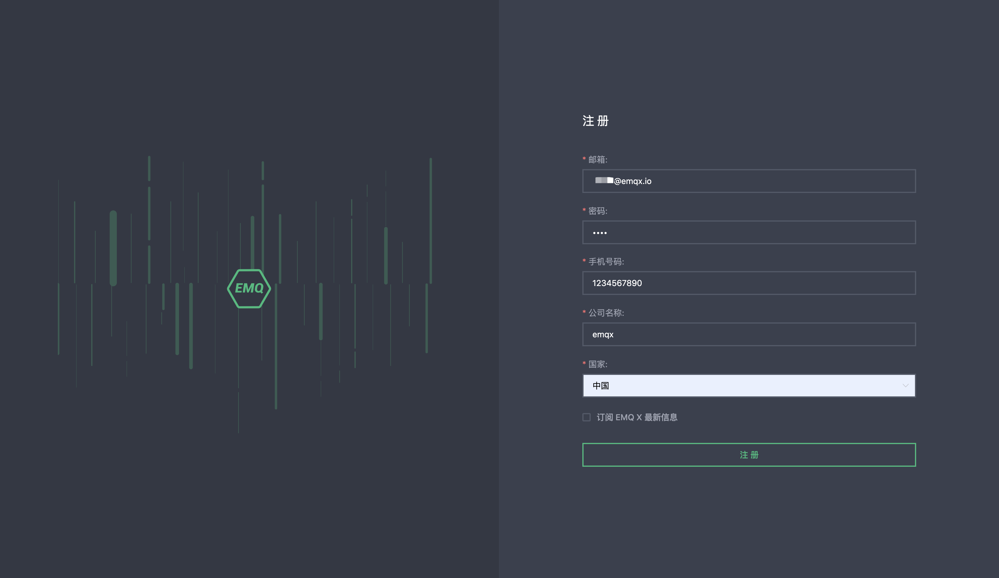
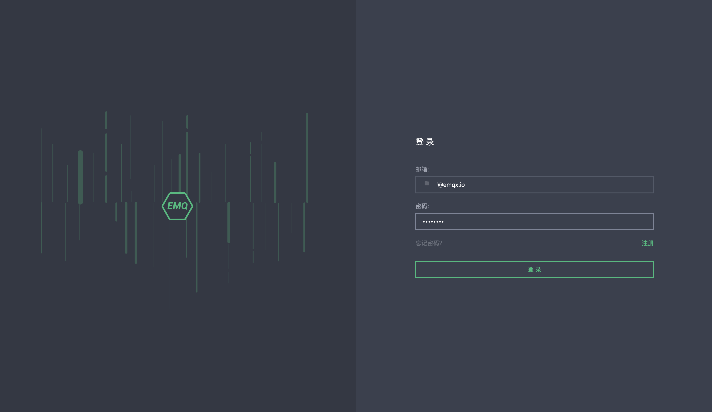
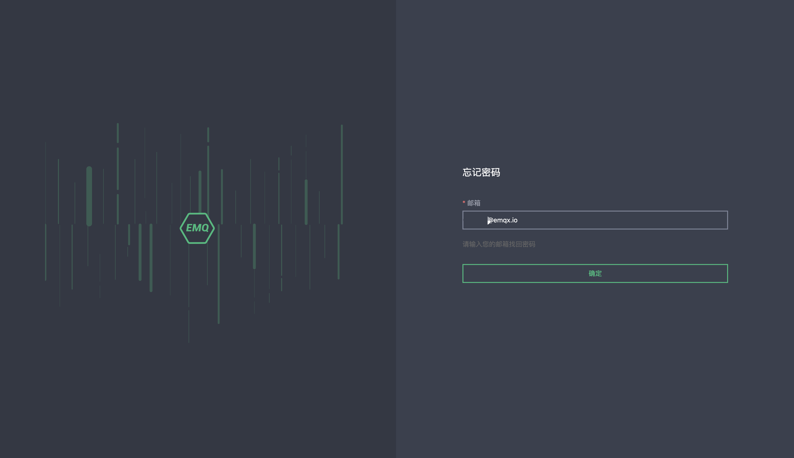

### 注册和登录

要开始使用 EMQ X Cloud， 请导航至 [EMQ X Cloud 官网](https://cloud.emqx.io/cn)

## 注册

1. 点击右上角注册按钮
2. 输入您的个人信息：邮箱，密码，手机号码，公司名称，国家
3. 点击注册，EMQ X Cloud 会自动将确认邮件发送到您提供的邮箱地址
4. 要验证您的新账户，请在点击确认邮件中的链接,该链接将会验证您的账户，并返回登录页面
5. 登录 EMQ X Cloud

## 登录

1. 点击右上角登录按钮
2. 输入您的邮箱和密码，然后选择登录将跳转到 EMQ X Cloud Console 页面

## 找回密码

如果您忘记密码，请在登录页面右下角点击忘记密码，我们将会向您的邮箱发送验证邮件。您可以在验证邮件中点击找回密码，创建新的密码。您将返回登录页面，输入新的密码，然后选择登录

