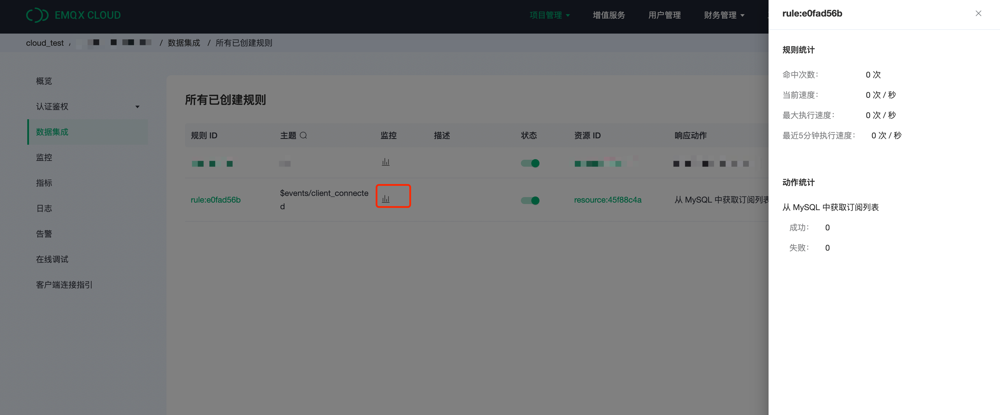

# 使用 EMQ X Cloud 规则引擎从 MySQL 中获取订阅关系

在本文中我们将使用 EMQ X Cloud 规则引擎从 MySQL 中获取订阅关系

在开始之前，您需要完成以下操作：
* 已经在 EMQ X Cloud 上创建部署(EMQ X 集群)。
* 对于独享部署用户：请先完成 [对等连接的创建](../deployments/vpc_peering.md)，下文提到的 IP 均指资源的内网 IP。
* 对于免费试用及共享部署用户：无需完成对等连接，下文提到的 IP 均指资源的公网 IP。

## MySQL 配置

1. MySQL 安装

   ```bash
   docker run -d --restart=always \
     --name mysql \
     -p 3306:3306 \
     -e MYSQL_ROOT_PASSWORD=public \
     -d mysql/mysql-server:5.7
   ```

2. 数据库创建

   ```sql
   CREATE DATABASE emqx;
   ```


3. 订阅关系表创建

   使用以下 SQL 语句将创建 `mqtt_sub` 表，该表将用于存放设备订阅关系数据。

   ```sql
   DROP TABLE IF EXISTS `mqtt_sub`;
   CREATE TABLE `mqtt_sub` (
       `id` int(11) unsigned NOT NULL AUTO_INCREMENT,
       `clientid` varchar(64) DEFAULT NULL,
       `topic` varchar(180) DEFAULT NULL,
       `qos` tinyint(1) DEFAULT NULL,
       PRIMARY KEY (`id`),
       KEY `mqtt_sub_idx` (`clientid`,`topic`,`qos`),
       UNIQUE KEY `mqtt_sub_key` (`clientid`,`topic`),
       INDEX topic_index(`id`, `topic`)
   ) ENGINE=InnoDB DEFAULT CHARSET=utf8MB4;
   ```
   
   ::: danger
   订阅关系表结构不能修改，请使用上面SQL语句创建
   :::

4. 设置允许 EMQ X 集群 IP 段访问数据库(可选)
   对于独享部署，获取部署网段可以前往部署详情 → 查看对等连接信息，复制部署 VPC 网段。
   
   ```sql
   # 独享部署
   GRANT ALL PRIVILEGES ON *.* TO root@'10.11.30.%' IDENTIFIED BY 'public' WITH GRANT OPTION;
   
   # 免费试用或共享部署
   GRANT ALL PRIVILEGES ON *.* TO root@'%' IDENTIFIED BY 'public' WITH GRANT OPTION;
   ```

5. 插入测试数据，并查看数据
   
   ```sql
   INSERT INTO mqtt_sub(clientid, topic, qos) values("test", "t1", 1);

   select * from mqtt_sub;
   ```

## EMQ X Cloud 规则引擎配置

1. 资源创建

   点击左侧菜单栏`规则引擎`，找到资源面板，点击新建资源，下拉选择 MySQL 资源类型。填入刚才创建好的 mysql 数据库信息，并点击测试如果出现错误应及时检查数据库配置是否正确。
   
   
2. 规则填写

   点击左侧左侧菜单栏`规则引擎`，找到规则面板，点击创建，然后输入如下规则匹配 SQL 语句
   
   ```sql
   SELECT * FROM "$events/client_connected"
   ```
   
3. 添加响应动作

   点击左下角添加动作，下拉选择 → 代理订阅 → 从 MySQL 中获取订阅列表 选择第一步创建好的资源

   

4. 点击创建规则，并返回规则列表
   


5. 查看规则监控
   

## 测试

1. 在 MySQL 中插入订阅数据
   插入客户端 ID 为 client1，订阅主题 topic1，QoS 为 1 的订阅数据。 
   ```sql
   INSERT INTO mqtt_sub(clientid, topic, qos) values("client1", "topic1", 1);
   select * from mqtt_sub;
   ```
   

2. 使用 [MQTT X](https://mqttx.app/) 连接部署

   需要将 broker.emqx.io 替换成已创建的部署[连接地址](../deployments/view_deployment.md)，并在 EMQ X Dashboard 中添加[客户端认证信息](../deployments/dashboard/users_and_acl.md)。
   其中，设定 clientID 为 client1
   

3. 在 Dashboard 中查看订阅关系
   进入部署详情点击 EMQ X Dashbaord 将进入 Dashbaord。在 `订阅` 中查看客户端订阅关系 
   
