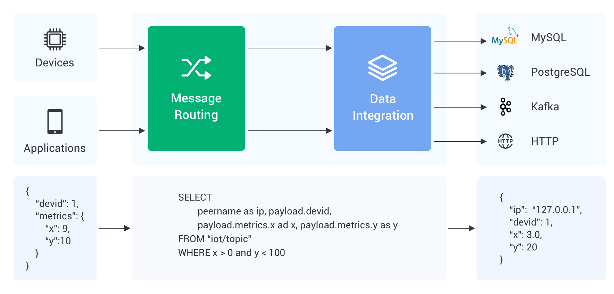

# 数据集成简介

::: tip
数据集成为专有版部署（基础版、专业版）功能，Serverless 版部署暂不支持。
:::

EMQX Cloud 数据集成用于配置处理和响应消息流和设备事件的规则。数据集成不仅提供了一个清晰灵活的"可配置"架构解决方案，而且还简化了开发过程，提高了用户的可用性，降低了业务系统和 EMQX Cloud 之间的耦合程度，也为 EMQX Cloud 的私有功能定制提供了一个更优秀的基础架构。

在 EMQX Cloud 中，使用数据集成会有如下要求和限制：

- 基础版部署
  - 资源仅支持公网访问，因此在创建资源前您需要确保资源具有公网访问能力，同时开放安全组。
  - 资源类型仅开放 Webhook 和 MQTT 桥接。
- 专业版部署
  - 资源原则上仅支持内网访问，因此在创建资源前您需要先配置 [VPC 对等连接](../deployments/vpc_peering.md)，同时开放安全组。
  - 如果是专业版，同时也需要公共访问资源，[NAT网关](../vas/nat-gateway.md)可以提供相关能力。
  

## 流程

数据整合的主要维度是资源。资源是由云服务商提供的服务。它应该已经被设置在系统架构中。然后从浏览页面中选择特定的资源。

资源解决后，你需要创建一个规则来处理从设备上收集的数据。该规则可以通过使用 SQL 语句，以你想要的方式收集和处理数据。

当一个规则被测试和创建后，需要将动作附加到规则上。同时发送数据到目标资源。

## [资源管理](./resources.md)

资源是你从云平台购买的云服务产品，可以是 Kafka 这样的消息队列服务，也可以是 RDS 存储服务。

## [规则](./rules.md)

规则描述了「数据从哪里来」和「如何筛选并处理数据」。规则使用类 SQL 语句来自定义编写数据，并且可以使用 SQL 测试来模拟导出的数据。

## [动作](https://docs.emqx.com/zh/cloud/latest/rule_engine/rules.html#%E5%88%9B%E5%BB%BA%E5%8A%A8%E4%BD%9C)

动作解决了「处理后的数据到哪里去」，一个规则可以对应一个或者多个动作，动作中需要设置定义好的资源，也就是将数据发送到哪个服务。

## [规则 SQL 编写](https://docs.emqx.com/zh/enterprise/v4.2/rule/rule-engine.html#sql-%E8%AF%AD%E5%8F%A5)

学习和了解规则 SQL 编写
