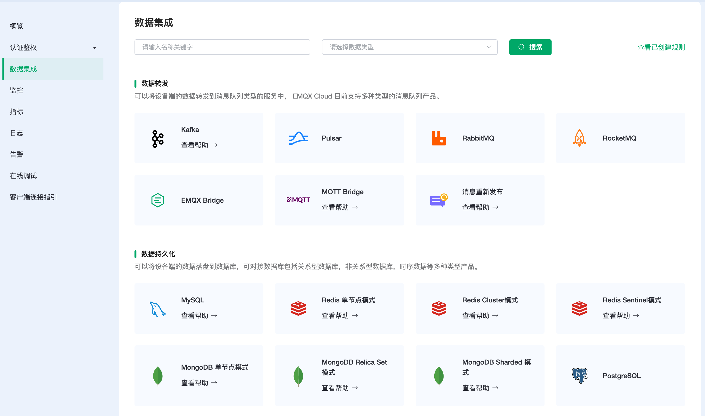
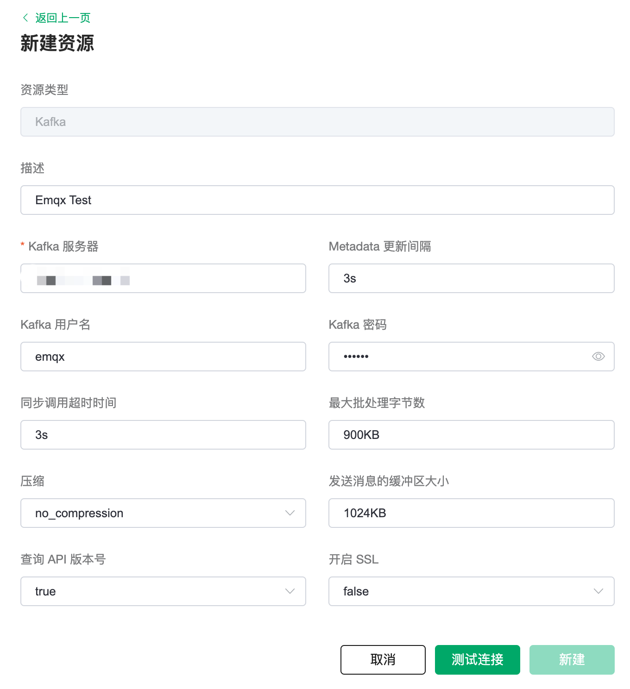
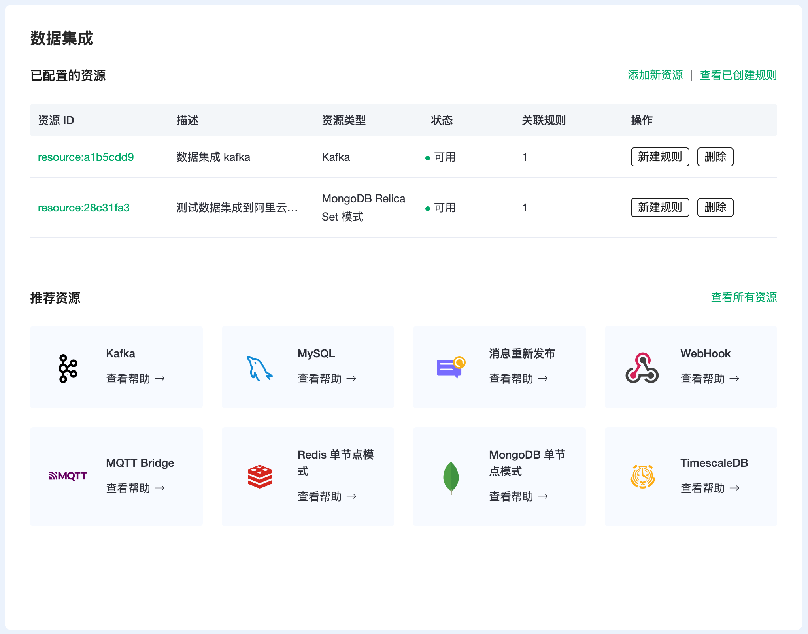
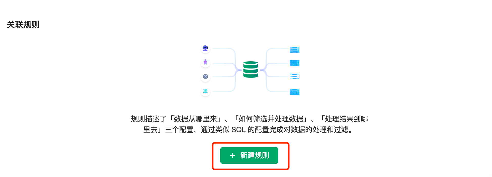
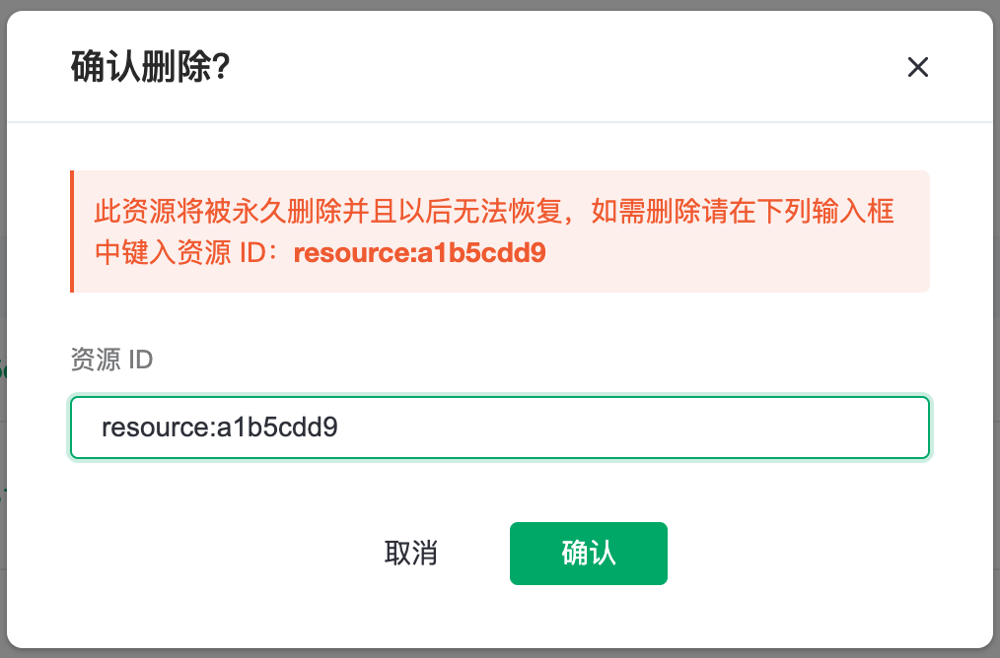

# 资源

EMQX Cloud 资源是数据集成的关键概念。大多数的资源是由云服务商提供的服务。在开始之前，你需要确保当前部署正在运行。

在专业版中，我们支持所有的资源。然而在标准版中，只有` MQTT 桥接`、`消息重新发布`、`Webhook`、`调试`模式是可用的。因为其他资源需要配置VPC 对等连接，只能通过内网连接。

::: tip Tip
在添加一个资源之前, 你需要确保已经配置了 [VPC 对等连接](../deployments/vpc_peering.md). 或者可以开通 [NAT 网关](../vas/nat-gateway.md) 从公网来连接你的其他云服务.
:::

## 资源概览

EMQX Cloud 列出的所有资源的概览页面。最常用的类型是数据转发和数据持久化。比如将数据转发到 Kafka 集群或将数据保存到 MongoDB。从可用资源的列表中选择项目之后进行配置。

 

## 创建资源

我们设置了一个 Kafka 资源作为例子。选择 Kafka 选项，填写相应的资源配置并点击"测试"按钮。如果连接成功，将显示成功提示，并点击可查看资源。如果失败请检查资源配置。

如果你创建了一个资源，它将被列在概览页上。你也可以添加另一个资源。你创建的所有资源将被列在概览页上。你可以通过 "添加新资源"或"查看所有资源"的链接浏览所有资源。

## 规则详情

1. 点击资源 ID 链接，查看资源详情。基础信息和配置信息显示默认的配置和你在设置时填写的内容。

2. 关联规则显示附属于该资源的所有规则。一个资源可以对应一个以上的规则。可以从这里创建基于该资源的规则。[了解规则](./rules.md)。

   

## 删除资源

1. 在 "已配置的资源"列表中，点击"删除"按钮来删除一个资源。 

2. 必须输入资源的 ID 来确认删除。

   

3. 确保在删除资源之前，清空该资源下的所有规则。
