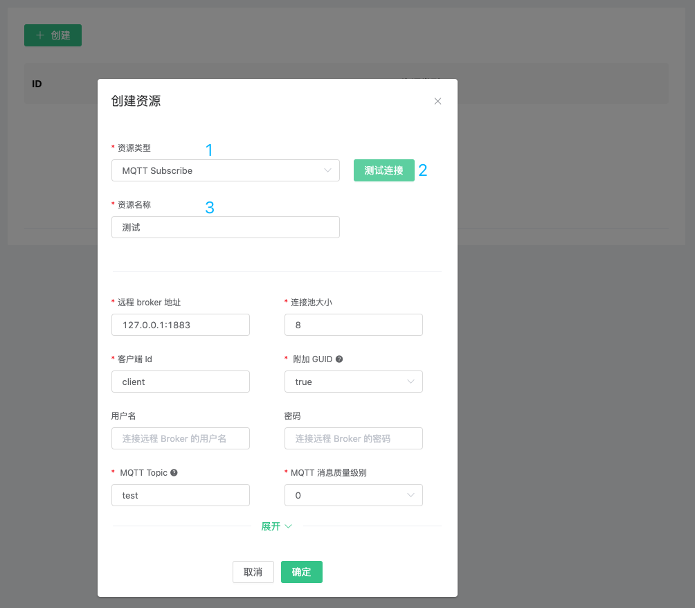

# 资源

EMQX Cloud 资源用于规则引擎响应动作， 在此之前您需要确保部署状态为**运行中**。您可以参阅 [EMQX 规则引擎](https://docs.emqx.cn/cn/broker/latest/rule/rule-engine.html) 了解更多资源创建。

## 简单示例

如下图所示资源，是 WebHook 资源，请求 URL 为某个 IP 的 9910 端口，请求方法为 POST，请求头为空

## 创建资源

1. 登录 [EMQX Cloud 控制台](https://cloud.emqx.com/console/)

2. 点击所需连接的部署，您将进入部署详情页面

3. 点击左侧菜单`规则引擎`，在资源面板点击`新建`按钮

   

5. 选择相应资源类型，并填写相应资源配置信息

   

6. 点击测试，如果没有报错则点击确认，否则请仔细检查资源配置信息

## 查看资源状态

1. 登录 [EMQX Cloud 控制台](https://cloud.emqx.com/console/)

2. 点击所需连接的部署，您将进入部署详情页面

3. 点击左侧菜单`规则引擎`，在资源面板可以查看到资源状态

   

## 删除资源

1. 登录 [EMQX Cloud 控制台](https://cloud.emqx.com/console/)

2. 点击所需连接的部署，您将进入部署详情页面

3. 点击左侧菜单`规则引擎`，在资源面板点击`删除`按钮

   
