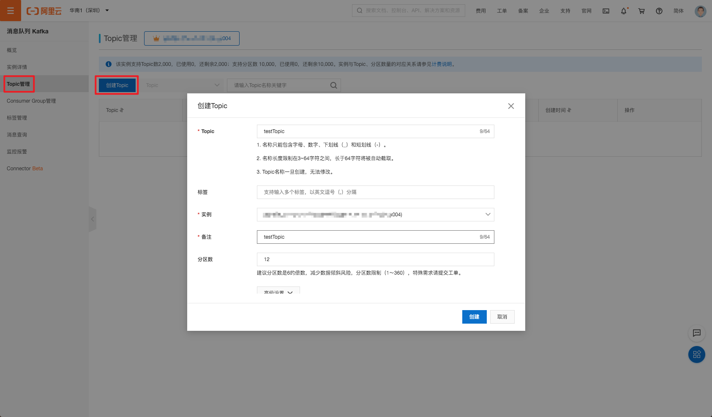
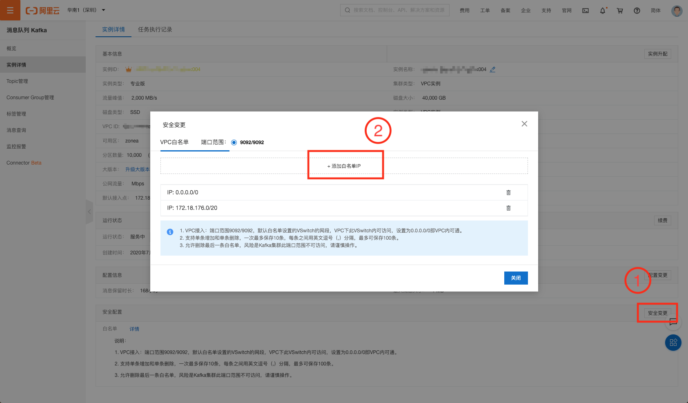
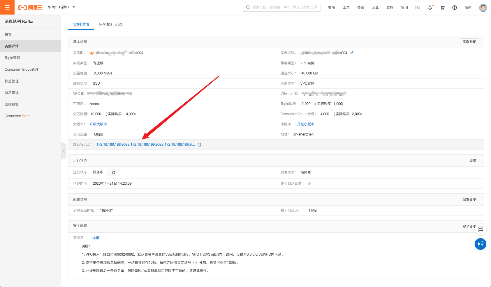

# 集成阿里云 Kafka

:::warning
该功能在基础版中不可用
:::

Kafka 是由 Apache 基金会开发的流处理平台，专为分布式、高吞吐量系统而设计。由于其优良的分布式微服务发布订阅模式设计，Kafka 被大量组织用于构建消息中心及实时流式处理。

而在物联网生态中，Kafka 已经是物联网中不可或缺的重要枢纽之一。设备产生的海量数据被传入 Kafka 中，方便后续进行存储、转换、处理、查询和分析。

[阿里云 Kafka](http://www.aliyun.com/product/kafka) 是阿里云基于 Apache Kafka
构建的高吞吐量、高可扩展性的分布式消息队列服务，广泛用于日志收集、监控数据聚合、流式数据处理、在线和离线分析等，是大数据生态中不可或缺的产品之一，阿里云提供全托管服务，用户无需部署运维，更专业、更可靠、更安全。

[EMQX Cloud](https://www.emqx.com/zh/cloud) 是由 EMQX 建立的云上 MQTT 服务。EMQX 团队在物联网领域耕织多年，EMQX MQTT
服务器在过去几年中被全球数千家企业用户使用。每一台部署都拥有独立的 VPS、负载均衡、DNS，保证系统安全与稳定。

本篇指南将会连通阿里云 Kafka 和 EMQX Cloud，并通过 EMQX Cloud 数据集成将 MQTT 消息转发到 Kafka 主题。

在开始之前，您需要完成以下操作：

* 已经在 EMQX Cloud 上创建部署(EMQX 集群)。
* 已经在阿里云上创建 kafka 资源。
* 对于专业版部署用户：请先完成 [对等连接的创建](../deployments/vpc_peering.md)，下文提到的 IP 均指资源的内网 IP。(专业版部署若开通 [NAT 网关](../vas/nat-gateway.md)也可使用公网 IP 进行连接）


## 阿里云 Kafka 配置

1. 在阿里云 Kafka 控制台中，点击 Topic 管理 -> 创建 Topic，创建一个名为 testTopic 的主题。

   

2. 在 Kafka 实例详情中，白名单 IP 加入: 0.0.0.0/0

   > 注意：实际生产环境只需要添加 Cloud VPC (10.0.0.0/8)网段即可

   

3. 记录下 Kafka 实例的连接地址。

   


## 部署数据集成配置

1. 创建 Kafka 资源并测试连接

   在数据集成页面点击 kafka 数据转发资源，填入 kafka 连接信息并点击测试，如测试失败请及时检查 kafka 连接信息是否正确。

   

2. 测试通过后点击新建按钮，将看到创建资源成功提示按钮
   

3. 新建规则

   将下面规则 SQL 填入到 SQL 输入框中，在下面规则中我们从 `temp_hum/emqx` 主题读取消息上报时间 `up_timestamp`、客户端 ID、消息体(Payload)
   ，并从消息体中分别读取温度和湿度。

   ```sql
   SELECT 
   
   timestamp as up_timestamp,
   clientid as client_id, 
   payload.temp as temp, 
   payload.hum as hum
   
   FROM
   
   "temp_hum/emqx"
   ```
   

4. 为规则关联动作

   规则 SQL 测试通过后，点击下一步为规则关联转发动作，本次我们将演示转发到 kafka 资源。在动作中填写 如下 Kafka 主题以及 kafka 消息模板

   ```
   # kafka 主题
   emqx
   
   # kafka 消息模板
   {"up_timestamp": ${up_timestamp}, "client_id": ${client_id}, "temp": ${temp}, "hum": ${hum}}
   ```
   

5. 成功为规则绑定动作后，继续点击查看详情可以看到创建的规则 SQL 语句以及关联的响应动作。

   

6. 点击数据集成/查看已创建规则，可以看到创建的规则。点击监控按钮可以看到规则详细的匹配数据。

   


## 测试

1. 使用 [MQTT X](https://mqttx.app/) 模拟温湿度数据上报

   需要将 broker.emqx.io 替换成已创建的部署连接地址，并添加客户端认证信息。

   

2. 查看数据转存结果

    ```bash
    # 进入 Kafka 实例，并查看 emqx 主题
    $ docker exec -it mykafka /opt/kafka/bin/kafka-console-consumer.sh --bootstrap-server <broker IP>:9092  --topic emqx --from-beginning
    ```
   

