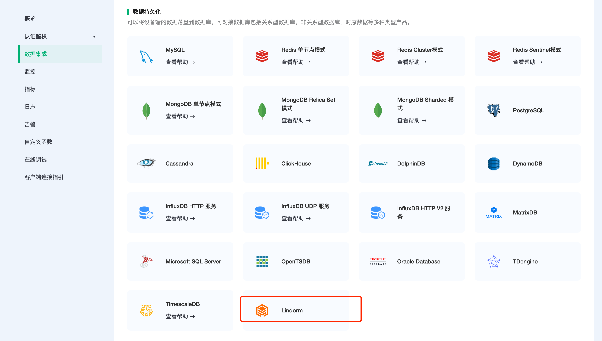

# 集成阿里云 Lindorm

::: warning
该功能在基础版中不可用
:::

[云原生多模数据库 Lindorm](https://help.aliyun.com/document_detail/174640.html) 是面向物联网、互联网、车联网等设计和优化的云原生多模超融合数据库，支持宽表、时序、文本、对象、流、空间等多种数据的统一访问和融合处理，并兼容SQL、HBase/Cassandra/S3、TSDB、HDFS、Solr、Kafka等多种标准接口和无缝集成三方生态工具，适用于日志、监控、账单、广告、社交、出行、风控等场景。

[EMQX Cloud](https://www.emqx.com/zh/cloud)是由 EMQX 建立的云上 MQTT 服务。EMQX 团队在物联网领域耕织多年，EMQX MQTT 服务器在过去几年中被全球数千家企业用户使用。每一台部署都拥有独立的 VPS、负载均衡、DNS，保证系统安全与稳定。

在本文中我们将模拟温湿度数据并通过 MQTT 协议上报到 EMQX Cloud，然后使用 EMQX Cloud 数据集成将数据转存到阿里云 Lindorm。

在开始之前，您需要完成以下操作：

* 已经在 EMQX Cloud 上创建部署(EMQX 集群)。
* 已经在阿里云上创建 Lindorm 资源。
* 对于专业版部署用户：请先完成 [对等连接的创建](../deployments/vpc_peering.md)，下文提到的 IP 均指资源的内网 IP。（专业版部署若开通 [NAT 网关](../vas/nat-gateway.md) 也可使用公网 IP 连接资源）
* 对于 BYOC 部署用户：请先对 BYOC 部署所在 VPC 与资源所在 VPC 建立对等连接，下文提到的 IP 均指资源的内网 IP。如需通过公网访问资源，请在您的公有云控制台中为 BYOC 部署所在 VPC 配置 NAT 网关，使用资源的公网 IP 进行连接。

## 购买阿里云 Lindorm

1. 创建 Lindorm 实例
  
    如果您是初次接触阿里云数据库 Lindorm，建议您跟随[快速入门](https://help.aliyun.com/document_detail/188311.html)进行创建。

    为了方便测试，这里我们选择的配置如下：

    * 商品类型：Lindorm 单节点（按量付费）
    * 地域和可用区：华南1（深圳）
    * 网络类型：专有网络
    * 实例规格：2 核 8G
    * 存储空间：20 GB

    > 注意：网络类型一定要选专有网络，并选择与 EMQX Cloud 建立了对等连接的 VPC

2. 添加白名单

   在 Lindorm 实例列表，点击管理，找到访问控制-白名单，修改分组白名单，加入: 0.0.0.0/0

    > 注意：实际生产环境只需要添加 Cloud VPC (10.x.x.x/24) 网段即可，该网段可在部署的概览-VPC 对等连接查看。

3. 连接到 Lindorm 实例

   在 Lindorm 实例列表，点击管理，找到数据库连接-`时序引擎`，复制私网地址，使用客户端工具[Lindorm-cli](https://help.aliyun.com/document_detail/216787.htm?spm=a2c4g.11186623.0.0.11992441ztFfnk#task-2079049) 连接访问 Lindorm 时序引擎，默认用户名、密码均为 root。

   ```bash
   ./lindorm-cli -url http://<host:port> -username <用户名> -password <密码> 
   ```

4. 数据库创建

   ```bash
   CREATE DATABASE emqx;

   use emqx;
   ```

5. 温湿度表创建

   使用以下 SQL 语句将创建 `temp_hum` 表，该表将用于存放设备上报的温度和湿度数据。

   ```sql
   CREATE TABLE temp_hum (
      clientid VARCHAR TAG,
      time TIMESTAMP,
      temp DOUBLE,
      hum DOUBLE,
      PRIMARY KEY(clientid));
   
   describe table temp_hum;
   ```

## EMQX Cloud 数据集成配置

1. 资源创建

   点击左侧菜单栏`数据集成`，找到数据持久化--Lindorm

   

   点击新建资源，默认资源类型为 Lindorm。填入刚才创建好的 Lindorm 数据库信息，并点击测试，如果出现错误应及时检查数据库配置是否正确、网段白名单是否添加。

   

2. 规则测试

   点击左侧左侧菜单栏`数据集成`，找到规则面板，点击创建，然后输入如下规则匹配 SQL 语句。在下面规则中我们从 `temp_hum/emqx` 主题读取消息上报时间 timestamp、客户端 ID、消息体(payload)，并从消息体中分别读取温度和湿度，点击 SQL 测试可以查看输出结果是否满足预期。

   ```sql
   SELECT 
   
   timestamp as timestamp, 
   clientid as clientid, 
   payload.temp as temp, 
   payload.hum as hum
   
   FROM
   
   "temp_hum/emqx"
   ```

   
   

3. 添加响应动作

   点击左下角添加动作，默认动作类型为数据持久化 → 保存数据到 Lindorm，选择第一步创建好的资源，其他字段可以参照如下示例。

   * 表名：temp_hum
   * Tags：clientid
   * Field Keys：temp ${temp} 和 hum ${hum}

   

4. 查看规则详情

   创建好响应动作之后，在规则详情界面可以查看规则 SQL 和响应动作

   

5. 查看资源详情

   返回数据集成，点击资源 ID，可查看到资源关联规则的监控信息。

   

## 测试

1. 使用 [MQTT X](https://mqttx.app/) 模拟温湿度数据上报

   需要将 broker.emqx.io 替换成已创建的部署连接地址，并添加客户端认证信息。

   

2. 查看规则监控

   查看所有已创建规则，找到 lindorm 关联的动作，点击监控，可以看到成功次数加一。

   

3. 查看数据转存结果

   ```sql
   select * from temp_hum;
   ```

   
