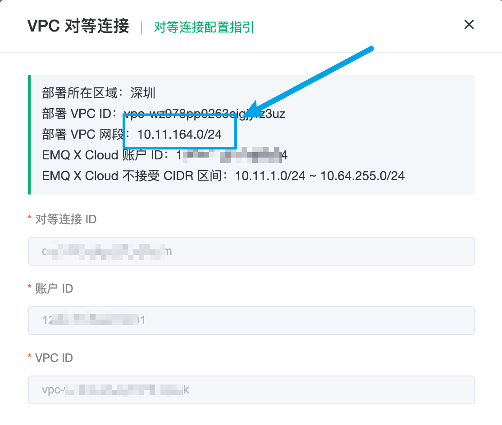
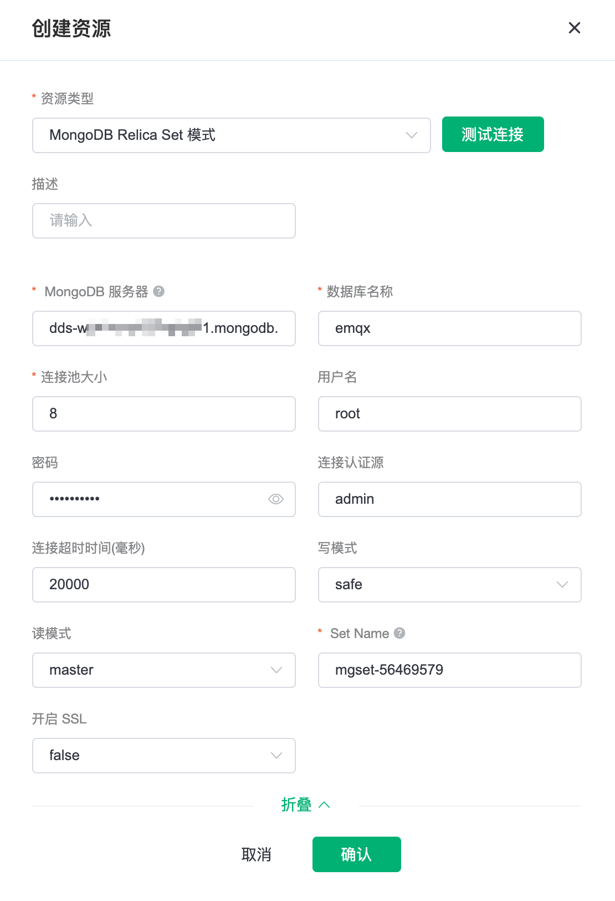
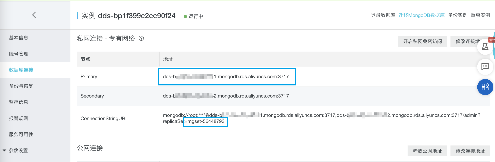
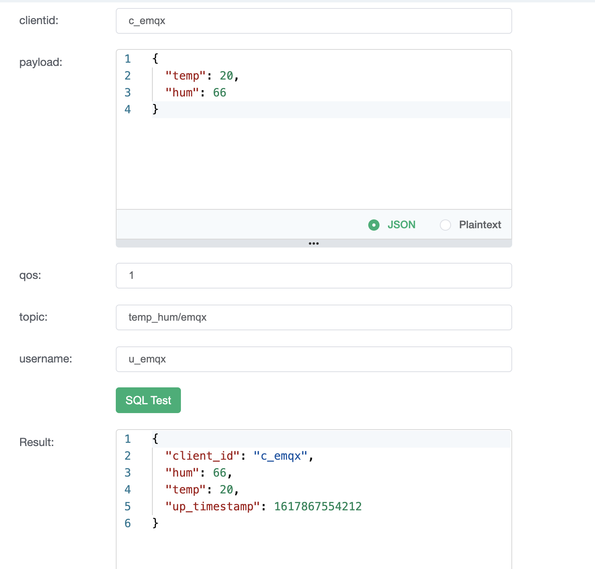
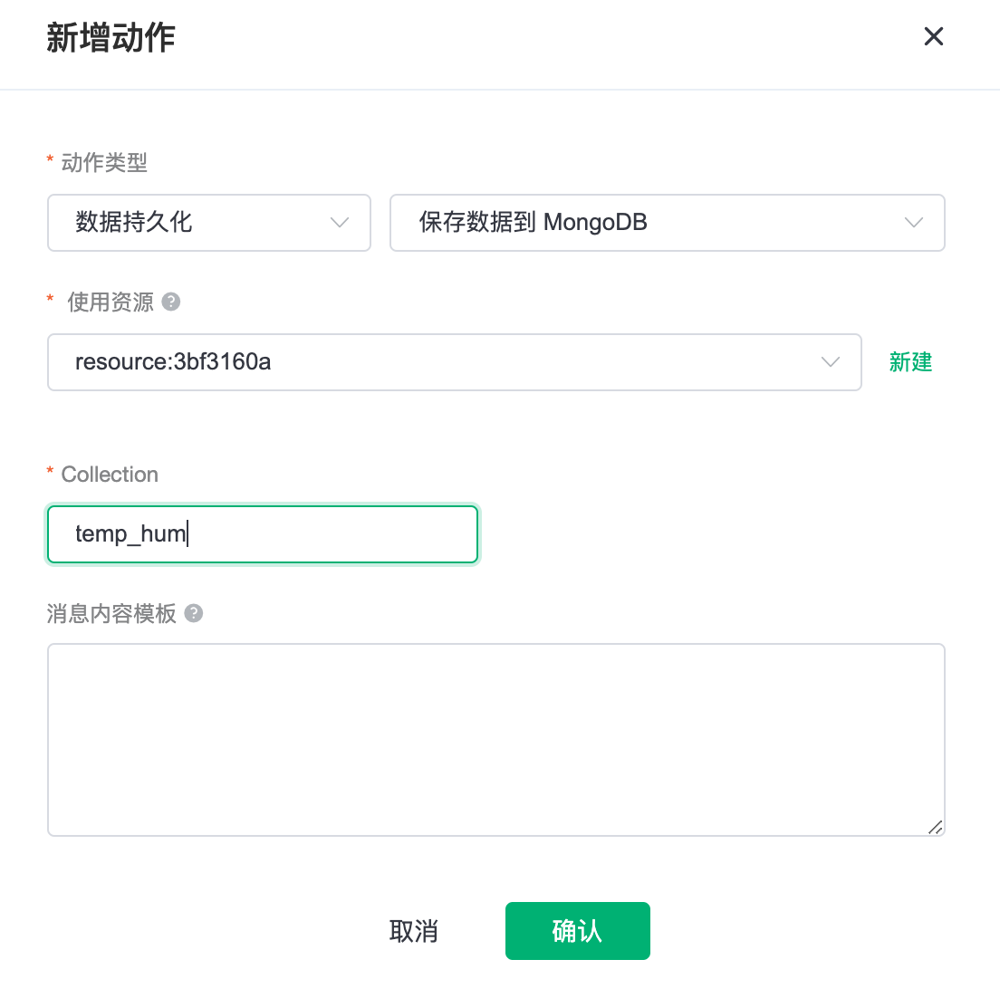
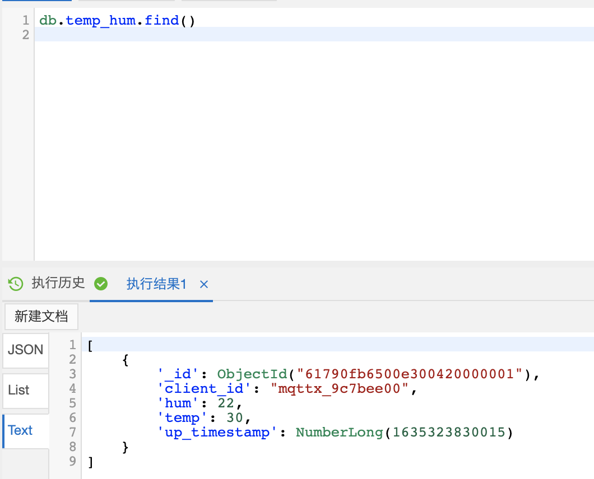

# 桥接数据到 阿里云 MongoDB
::: danger
该功能在基础版中不可用
:::

在本文中我们将模拟温湿度数据并通过 MQTT 协议上报到 EMQ X Cloud，然后使用 EMQ X Cloud 规则引擎将数据转存到阿里云 MongoDB。

在开始之前，您需要完成以下操作：
* 已经在 EMQ X Cloud 上创建部署(EMQ X 集群)。
* 对于专业版部署用户：请先完成 [对等连接的创建](../deployments/vpc_peering.md)，下文提到的 IP 均指资源的内网 IP。

## 购买阿里云 MongoDB

### 1. 创建阿里云 MongoDB

如果您是初次接触阿里云 MongoDB，建议您跟随阿里云 MongoDB [快速入门](https://help.aliyun.com/document_detail/26572.html)进行创建。

为了方便测试，这里我们选择的配置如下：

- 商品类型：副本集（按量付费）
- 数据库版本：MongoDB 4.2
- 存储引擎：WiredTiger
- 主备节点数：三节点
- 只读节点数：无只读节点
- 网络类型：专有网络
- 规格：1核2G

> 需要特别注意的是：网络类型一定要选专有网络，并选择与 EMQ X Cloud 建立了对等连接的 VPC

### 2. 将 EMQ X Cloud VPC 所在网段加入白名单

在 mongodb 实例页面中，找到 `数据安全性` -> `白名单设置`

将 EMQ X Cloud 的 VPC 网段加入 mongodb 的白名单中



## 配置规则引擎
### 1. 创建 MongoDB 资源

进入 EMQ X Cloud 控制台，并点击进入要桥接 MongoDB 的部署

在部署页面，选择 `规则引擎`，在资源栏点击 `+新建` 创建资源

资源类型选择 `MongoDB Relica Set 模式`

以下为必填参数
- MongoDB 服务器
- 数据库
- 连接池大小
- 用戶名
- 密码
- 连接认证源
- Set Name



其中, `服务器地圵`和 `Set Name` 可以在下图的位置找到



### 2. 创建规则引擎规则
#### 2.1 创建 SQL

在部署页面，选择 `规则引擎`，在规则栏点击 `+新建` 创建规则

将下面的 SQL 复制到 `SQL 输入` 中，这条 SQL 告知 EMQ X Cloud 会提取发到 `temp_hum/emqx` 中的 timestamp, client ID 以及 payload

```sql
SELECT
   
timestamp as up_timestamp,
clientid as client_id,
payload.temp as temp,
payload.hum as hum 
   
FROM
   
"temp_hum/emqx"
```

你可以测试 SQL 是否正常，以确保接下来步骤能够顺序进行



#### 2.2 添加响应动作
在测试 SQL 之后，点击 `+ 添加动作`

动作类型：`数据持久化` `保存到 MongoDB`
使用资源：选择刚刚创建的 MongoDB 资源
Collection: 输入您想要转存的 Collection



#### 2.3 完成创建

点击 `创建`, 完成创建并返回规则列表

## 测试
### 1. 模拟数据上报

使用 [MQTT X](https://mqttx.app/) 连接部署, 并发送下面的消息到主题 `temp_hum/emqx`

```json
{
  "temp": 30, 
  "hum": 22
}
```

> 使用 MQTT X 时, 需要将 broker.emqx.io 替换成已创建的部署[连接地址](../deployments/view_deployment.md)，并添加[客户端认证信息](../deployments/auth_and_acl.md)。

### 2. 查看数据转存结果


