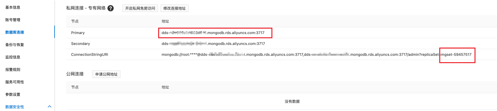

# 使用 EMQX Cloud 数据集成保存数据到阿里云 MongoDB
::: warning
该功能在基础版中不可用
:::

在本文中我们将模拟温湿度数据并通过 MQTT 协议上报到 EMQX Cloud，然后使用 EMQX Cloud 数据集成将数据转存到阿里云 MongoDB。

在开始之前，您需要完成以下操作：

* 已经在 EMQX Cloud 上创建部署(EMQX 集群)
* 已经在阿里云上创建 云数据库MongoDB 资源
* 对于专业版部署用户：请先完成 [对等连接的创建](../deployments/vpc_peering.md)，下文提到的 IP 均指资源的内网 IP。(专业版部署若开通 [NAT 网关](../vas/nat-gateway.md)也可使用公网 IP 进行连接）
  
## 购买阿里云 MongoDB

1. 创建阿里云云数据库 MongoDB
  
    如果您是初次接触阿里云云数据库 MongoDB，建议您跟随[快速入门](https://help.aliyun.com/document_detail/26572.html)进行创建。

    为了方便测试，这里我们选择的配置如下：

    - 商品类型：副本集（按量付费）
    - 数据库版本：MongoDB 4.2（EMQX 目前支持到 MongoDB 5.x 的驱动，暂不支持 6.x）
    - 存储引擎：WiredTiger
    - 主备节点数：三节点
    - 只读节点数：无只读节点
    - 网络类型：专有网络
    - 规格：1核2G

    > 需要特别注意的是：网络类型一定要选专有网络，并选择与 EMQX Cloud 建立了对等连接的 VPC

2. 在 MongoDB 实例详情中，白名单 IP 加入: 0.0.0.0/0

    > 注意：实际生产环境只需要添加 Cloud VPC (10.0.0.0/8)网段即可

## EMQX Cloud 数据集成配置
1. 创建资源

    点击左侧菜单栏`数据集成`，在数据持久化下找到 `MongoDB Relica Set 模式`，点击新建资源。

    

    请根据阿里云控制台提供的信息，填写以下参数
    - MongoDB 服务器
    - 数据库名称
    - 连接池大小
    - 用戶名
    - 密码
    - 连接认证源
    - 数据集名称

    其中, `服务器地圵`和 `副本集名称` 可以在阿里云控制台，下图的位置找到

    

2. 规则测试

   资源创建后点击新建规则，然后输入如下规则匹配 SQL 语句。在下面规则中我们从 `temp_hum/emqx` 主题读取消息上报时间 `up_timestamp`、客户端 ID、消息体(Payload)，并从消息体中分别读取温度和湿度。

    ```sql
    SELECT
      
    timestamp as up_timestamp, clientid as client_id, payload.temp as temp, payload.hum as hum 
      
    FROM
      
    "temp_hum/emqx"
    ```
   

3. 添加响应动作
  
    点击下一步来到动作界面，选择第一步创建好的资源，动作类型选择`数据持久化 - 保存数据到 MongoDB`，并填写 `Collection`，点击确认。

    

4. 查看资源详情

   动作创建完以后，返回列表点击资源可以查看详情

   
5. 查看规则详情

   资源详情界面点击规则可以查看规则监控信息和规则详情

   

## 测试

1. 使用 [MQTT X](https://mqttx.app/) 模拟温湿度数据上报

   需要将 broker.emqx.io 替换成已创建的部署连接地址，并添加客户端认证信息。

    - topic: `temp_hum/emqx`
    - payload:

      ```json
      {
        "temp": "27.5",
        "hum": "41.8"
      }
      ```

2. 查看数据转存结果

    
