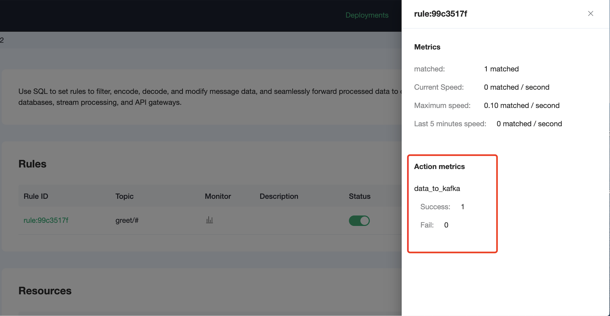

# 集成 Azure 事件中心

::: warning
该功能在基础版中不可用
:::

[Azure 事件中心](https://docs.microsoft.com/azure/event-hubs) 是大数据流式处理平台和事件引入服务， 它可以每秒接收和处理数百万个事件，可以使用任何实时分析提供程序或批处理/存储适配器转换和存储发送到事件中心的数据。

[EMQX Cloud](https://www.emqx.com/zh/cloud) 是由 EMQX 建立的云上 MQTT 服务。EMQX 团队在物联网领域耕织多年，EMQX MQTT 服务器在过去几年中被全球数千家企业用户使用。每一台部署都拥有独立的 VPS、负载均衡、DNS，保证系统安全与稳定。

本篇指南将会连通 Azure 事件中心 和 EMQX Cloud，并通过 EMQX Cloud 数据集成将 MQTT 消息转发到 Azure 事件中心。

为了实现该功能，我们将会完成以下几个任务：

1. 购买云资源
2. 创建资源，建立 Azure 事件中心命名空间 与 EMQX Cloud 部署之间的 kafka 连接
3. 创建 Azure 事件中心
4. 创建规则
5. 完成数据集成创建，并进行测试

Kafka 和事件中心概念映射

| Kafka 概念 | Azure 事件中心概念 |
| --------- | ---------------- |
| 群集       | 命名空间          |
| 主题       | 事件中心          |
| 分区       | 分区             |
| 使用者组    | 使用者组         |
| Offset    | Offset           |

## 操作步骤

### 1.购买云资源

1.1 购买创建 Azure 事件中心命名空间

前往 Azure 官网填写相关信息购买 Azure 事件中心命名空间，其中定价层需要标准及以上，基础层不支持 kafka 协议


1.2 创建 EMQX Cloud 部署

如果您是初次接触 EMQX Cloud，建议您跟随 EMQX Cloud [快速入门](../quick_start/introduction.md)的提示进行创建。

### 2.创建资源，建立 Azure 事件中心命名空间 与 EMQX Cloud 部署之间的 kafka 连接

进入 EMQX Cloud 控制台，并点击进入要使用的部署，在部署页面，选择数据集成，点击创建资源。

资源类型选择 kafka，Kafka 服务器地址为 `命名空间名称(namespace).servicebus.windows.net:9093`，
例如 `emqx-cloud.servicebus.windows.net:9093`。

用户名为 `$ConnectionString`，密码为命名空间的连接字符串，可在 事件中心命名空间 -> 设置 -> 共享服务策略 -> 点击策略 中找到


将开启 SSl 设置为 true，点击测试资源可用，便可创建资源，资源整体配置如下


### 3.创建 Azure 事件中心

Azure 事件中心对应 kafka 中主题的概念，在命名空间下选择 实体 -> 事件中心 -> 创建事件中心


填写应用中心名称创建应用中心


### 4.创建规则

进入 EMQX Cloud 控制台，在部署页面，选择数据集成，点击创建。

我们的目标是：当主题 greet 收到 msg 为 hello 字符时，就会触发引擎。这里需要对 SQL 进行一定的处理：
- 针对 greet 主题，即 'greet/#'
- 对 payload 中的 msg 进行匹配，当它为 'hello' 字符串再执行数据集成

根据上面的原则，我们最后得到的 SQL 应该如下：

```sql
SELECT
  payload.msg as msg
FROM
  "greet/#"
WHERE
  msg = 'hello'
```

可以点击 SQL 输入框下的 SQL 测试 ，填写数据：

- topic: greet
- payload:

  ```json
  {
    "msg":"hello"
  }
  ```

点击测试，查看得到的数据结果，如果设置无误，测试输出框应该得到完整的 JSON 数据，如下：

```json
{
  "msg":"hello"
}
```


> 注意：如果无法通过测试，请检查 SQL 是否合规，测试中的 topic 是否与 SQL 填写的一致。

点击下方创建动作，选择相应 kafka 资源，kafka 主题为应用中心名称，消息内容模板里需要将需要保存的信息放在 `eventDate` 字段下，例如 `{"eventDate":"${msg} from emqx cloud"}`


### 5.完成数据集成创建，并进行测试

> 如果您是第一次使用 EMQX Cloud 可以前往[部署连接指南](../connect_to_deployments/overview.md)，查看 MQTT 客户端连接和测试指南

我们尝试向 greet/a 主题发送下面的数据

```json
{
  "msg":"hello"
}
```

在数据集成页中，点击监控可以看到动作指标数的成功数变为 1。



在事件中心中，进入 功能 -> 处理数据，就可以看到 EMQX Cloud 转发过来的消息。


