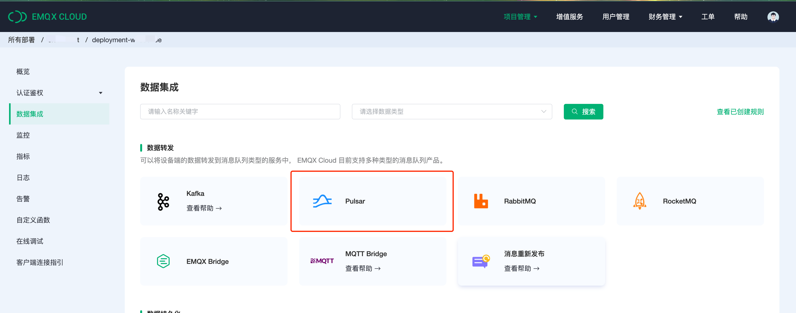
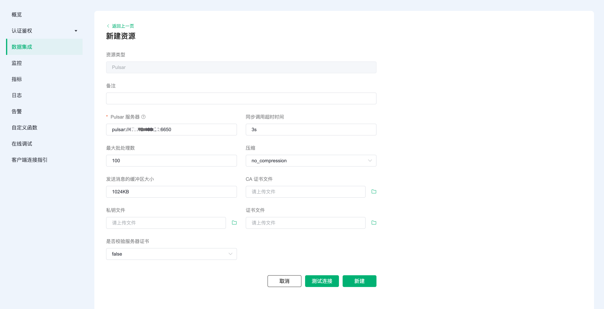
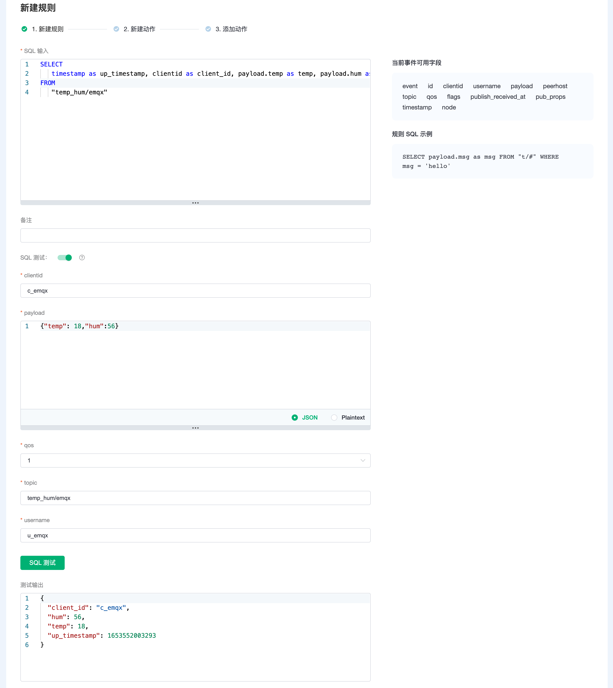
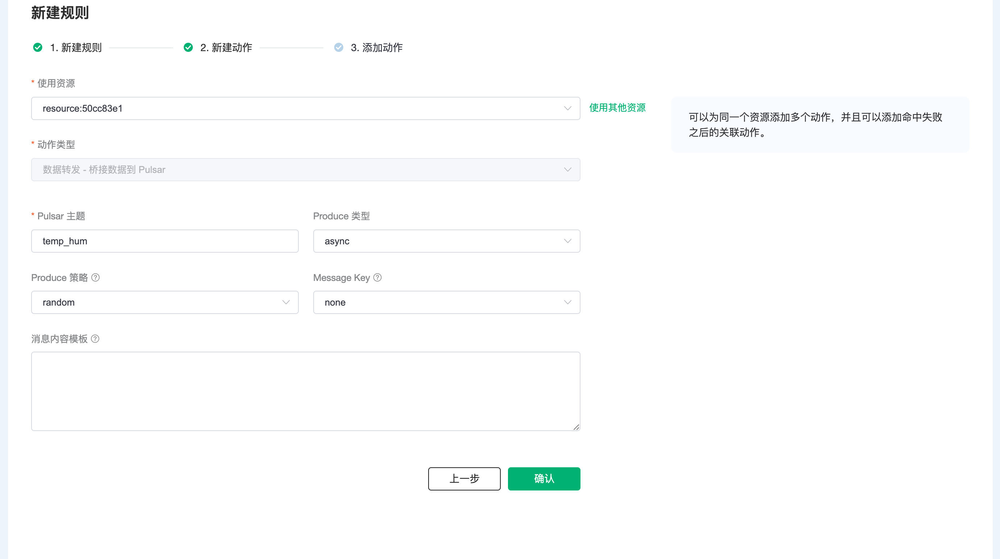
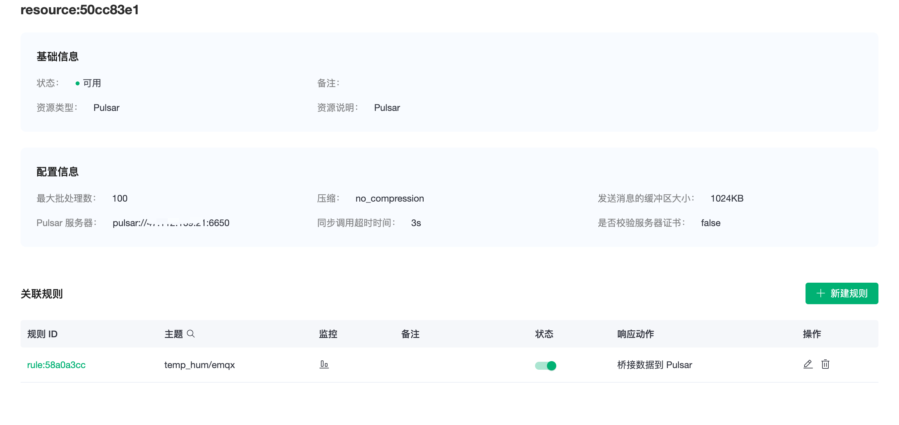
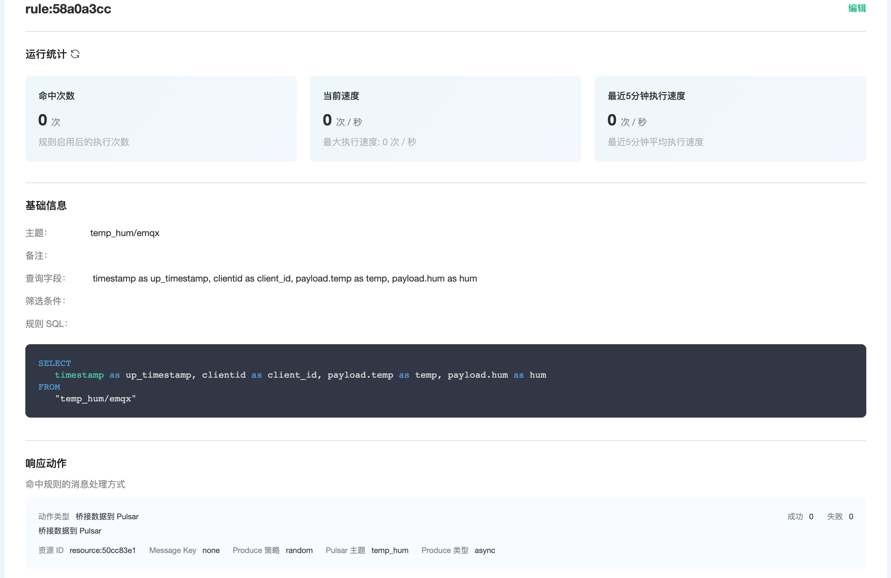
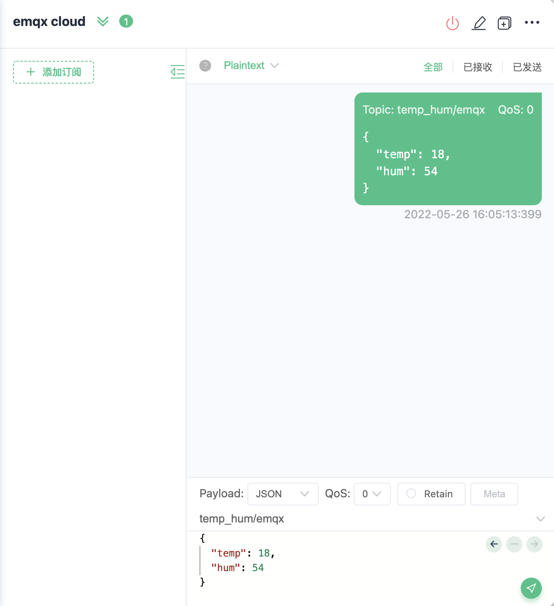
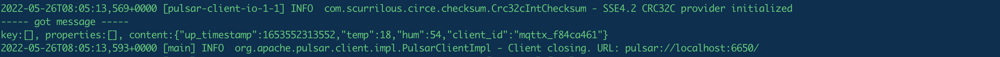

# EMQX Cloud 数据集成桥接数据到 Pulsar

::: warning
该功能在基础版中不可用
:::

在本文中我们将模拟温湿度数据并通过 MQTT 协议上报到 EMQX Cloud，然后使用 EMQX Cloud 数据集成将数据桥接到 Pulsar。

在开始之前，您需要完成以下操作：

* 已经在 EMQX Cloud 上创建部署(EMQX 集群)。
* 对于专业版部署用户：请先完成 [对等连接的创建](../deployments/vpc_peering.md)，下文提到的 IP 均指资源的内网 IP。(专业版部署若开通 [NAT 网关](../vas/nat-gateway.md)也可使用公网 IP 进行连接）

## Pulsar 配置

1. Pulsar 安装

   ```shell
   docker run -d \
     --name pulsar \
     -p 6650:6650 \
     -p 8080:8080 \
     -v $PWD/data:/pulsar/data \
     apachepulsar/pulsar:latest \
     bin/pulsar standalone
   ```
2. 启动消费者
   
   ```shell
   docker exec -it pulsar bash bin/pulsar-client consume temp_hum -s sub
   ```

## EMQX Cloud 数据集成配置

1. 创建资源

   点击左侧菜单栏`数据集成`，在数据转发下找到 Pulsar，点击新建资源。

   

   填入刚才创建好的 Pulsar 连接信息，并点击测试，如果出现错误应及时配置是否正确。

   

2. 创建规则

   资源创建后点击新建规则，然后输入如下规则匹配 SQL 语句。在下面规则中我们从 `temp_hum/emqx` 主题读取消息上报时间 `up_timestamp`、客户端 ID、消息体(Payload)，并从消息体中分别读取温度和湿度。

   ```sql
   SELECT
   timestamp as up_timestamp, clientid as client_id, payload.temp as temp, payload.hum as hum
   FROM
   "temp_hum/emqx"
   ```
   我们可以使用 `SQL 测试` 来测试查看结果

   

3. 添加响应动作

   点击下一步来到动作界面，选择第一步创建好的资源，动作类型选择`数据转发 - 桥接数据到 Pulsar`，Pulsar 主题输入 `temp_hum`，点击确认。

   

4. 查看资源详情

   动作创建完以后，返回列表点击资源可以查看详情

   


5. 查看规则详情

   资源详情界面点击规则可以查看规则监控信息和规则详情

   

## 测试

1. 使用 [MQTT X](https://mqttx.app/) 模拟温湿度数据上报

   需要将 broker.emqx.io 替换成已创建的部署[连接地址](../deployments/view_deployment.md)，并添加[客户端认证信息](../deployments/auth.md)。
    - topic: `temp_hum/emqx`
    - payload:
      ```json
      {
        "temp": 18,
        "hum": 54
      }
      ```

   

2. 查看数据桥接结果
   
   可以看到消费者已经收到消息

   