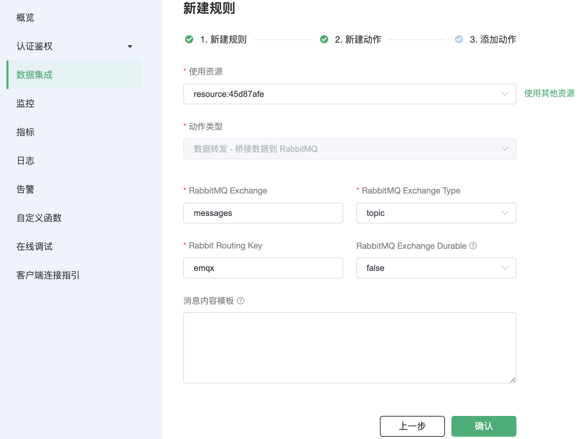

# 集成 RabbitMQ

::: warning
该功能在基础版中不可用
:::

在本文中我们将模拟温湿度数据并通过 MQTT 协议上报到 EMQX Cloud，然后使用 EMQX Cloud 数据集成将数据桥接到 RabbitMQ。

在开始之前，您需要完成以下操作：

* 已经在 EMQX Cloud 上创建部署(EMQX 集群)。
* 对于专业版部署用户：请先完成 [对等连接的创建](../deployments/vpc_peering.md)，下文提到的 IP 均指资源的内网 IP。(专业版部署若开通 [NAT 网关](../vas/nat-gateway.md)也可使用公网 IP 进行连接）

## RabbitMQ 配置
1. RabbitMQ 安装

   ```bash
   docker run -d \
     --hostname my-rabbit \
     --name some-rabbit \
     -p 5672:5672 \
     rabbitmq:3
   ```

## EMQX Cloud 数据集成配置
1. 创建资源
   点击左侧菜单栏`数据集成`，在数据转发下找到 RabbitMQ，点击新建资源。

   

   填入刚才创建好的 RabbitMQ 连接信息，并点击测试，如果出现错误应及时配置是否正确。

   

2. 创建规则

   资源创建后点击新建规则，然后输入如下规则匹配 SQL 语句。在下面规则中我们从 `temp_hum/emqx` 主题读取消息上报时间 `up_timestamp`、客户端 ID、消息体(Payload)，并从消息体中分别读取温度和湿度。

   ```sql
   SELECT
   timestamp as up_timestamp, clientid as client_id, payload.temp as temp, payload.hum as hum
   FROM
   "temp_hum/emqx"
   ```
   我们可以使用 `SQL 测试` 来测试查看结果

   

3. 添加响应动作

   点击下一步来到动作界面，选择第一步创建好的资源，动作类型选择`数据转发 - 桥接数据到 RabbitMQ`，填写以下参数
   - RabbitMQ Exchange: `messages`
   - RabbitMQ Exchange Type: `topic`
   - RabbitMQ Routing Key: `emqx`

   

4. 查看资源详情

   动作创建完以后，返回列表点击资源可以查看详情

   

5. 查看规则详情

   资源详情界面点击规则可以查看规则监控信息和规则详情

   

## 测试

1. 使用 [MQTT X](https://mqttx.app/) 模拟温湿度数据上报

   需要将 broker.emqx.io 替换成已创建的部署连接地址，并添加客户端认证信息。
    - topic: `temp_hum/emqx`
    - payload:
      ```json
      {
        "temp": 18,
        "hum": 54
      }
      ```

   
2. 查看数据桥接结果

   使用 Python 客户端来消费消息

   ```python
   # 导入 pika 库
   import pika
   
   # 创建连接
   connection = pika.BlockingConnection(
       pika.ConnectionParameters(host='RabbitMQ 服务器公网 ip')
   )
   channel = connection.channel()
   
   # 创建一个 exchange 取名为 messages
   channel.exchange_declare(exchange='messages', exchange_type='topic')
   
   # 绑定 exchange 和 queue，并指定 routing_key
   result = channel.queue_declare(queue='test_queue', exclusive=True)
   queue_name = result.method.queue
   channel.queue_bind(exchange='messages', queue=queue_name, routing_key='emqx')
   
   # 定义一个回调函数来处理接收到的消息
   def callback(ch, method, properties, body):
       print("[x] %r" % body)
   
   # 定义一个 consumer，接收来自 queue 的消息
   channel.basic_consume(
       queue=queue_name, on_message_callback=callback, auto_ack=True
   )
   
   print('[*] Waiting for messages. To exit press CTRL+C')
   channel.start_consuming()
   ```

   

