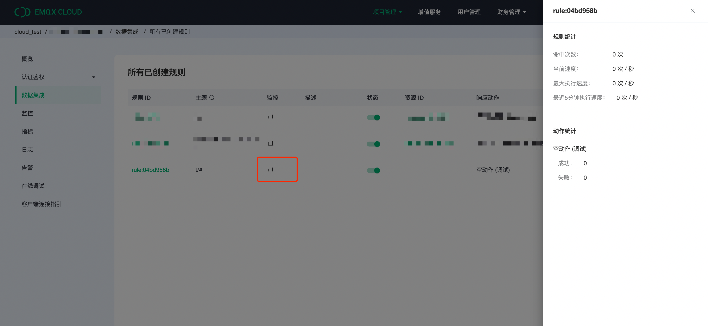

# 空动作（调试）

:::提示

EMQX Cloud 中仅适用以下操作：
检查 (调试)

:::

在本文中我们将使用 EMQX Cloud 数据集成完成空动作（调试）

## EMQX Cloud 数据集成配置

1. 规则测试

   点击左侧左侧菜单栏`数据集成`，找到空动作（调试），点击进入，然后输入如下规则匹配 SQL 语句。

   ```sql
    SELECT
        payload.msg as msg
    FROM
        "t/#"
    WHERE
        msg = 'hello'
   ```

   
   可以点击 SQL 输入框下的 SQL 测试 ，填写数据：

   - topic: t/a
   - payload:

   ```json
   {
     "msg": "hello"
   }
   ```

   点击测试，查看得到的数据结果，如果设置无误，测试输出框应该得到完整的 JSON 数据，如下：

   ```json
   {
     "msg": "hello"
   }
   ```

   测试输出与预期相符，我们可以进行后续步骤。

   > 注意：如果无法通过测试，请检查 SQL 是否合规

   

2. 点击创建规则，并返回规则列表

   

3. 查看规则监控

   

## 测试

1. 使用 [MQTTX](https://mqttx.app/) 测试

   需要将 broker.emqx.io 替换成已创建的部署连接地址，并添加客户端认证信息。

   

2. 查看监控结果
   
   
