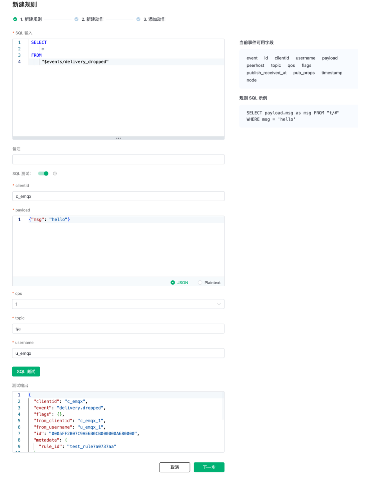

# 事件订阅

EMQX Cloud 数据集成 提供了以下七个可用的事件订阅主题。

| 事件主题名                   | 释义                     |
| ---------------------------- | ------------------------ |
| $events/client_connected     | 设备上线                 |
| $events/client_disconnected  | 设备下线                 |
| $events/message_delivered    | 消息投递                 |
| $events/message_acked        | 消息确认                 |
| $events/message_dropped      | 消息在转发的过程中被丢弃 |
| $events/delivery_dropped     | 消息在投递的过程中被丢弃 |
| $events/session_subscribed   | 设备订阅                 |
| $events/session_unsubscribed | 设备取消订阅             |

本文将从设备上下线、消息通知和主题订阅通知，三个方面分别介绍事件订阅主题使用和各个字段的含义。

## 设备上下线通知

### 设备上线

设备上线的消息主题为 `$events/client_connected`，在规则面板中点击创建规则，然后输入如下规则匹配 SQL 语句便可完成设备上线规则的创建，当新设备上线并连接到 EMQX Cloud 便会触发该规则。

   ```sql
    SELECT
        *
    FROM
        "$events/client_connected"
   ```

使用 SQL 测试，查看触发该规则后返回字段，也可在 SQL 语句中使用 SELECT 和 WHERE 子句进行筛选与过滤。


各字段释义如下。

| 字段            | 释义                                |
| --------------- | ----------------------------------- |
| clean_start     | MQTT clean_start                    |
| clientid        | 客户端 ID                           |
| connected_at    | 终端连接完成时间 (s)                |
| event           | 事件类型，固定为 "client.connected" |
| expiry_interval | MQTT Session 过期时间               |
| is_bridge       | 是否为 MQTT bridge 连接             |
| keepalive       | MQTT 保活间隔                       |
| mountpoint      | 主题挂载点(主题前缀)                |
| node            | 事件触发所在节点                    |
| peername        | 终端的 IPAddress 和 Port            |
| proto_name      | 协议名字                            |
| proto_ver       | 协议版本                            |
| sockname        | emqx 监听的 IPAddress 和 Port       |
| timestamp       | 事件触发时间 (ms)                   |
| username        | 用户名                              |

### 设备下线

设备下线的消息主题为 `$events/client_disconnected`，在规则面板中点击创建规则，然后输入如下规则匹配 SQL 语句便可完成设备下线规则的创建，当在线设备下线断开连接时便会触发该规则。

   ```sql
    SELECT
        *
    FROM
        "$events/client_disconnected"
   ```

使用 SQL 测试，查看触发该规则后返回字段，也可在 SQL 语句中使用 SELECT 和 WHERE 子句进行筛选与过滤。


各字段释义如下。

| 字段            | 释义                                   |
| --------------- | -------------------------------------- |
| clientid        | 客户端 ID                              |
| disconnected_at | 终端连接断开时间 (s)                   |
| event           | 事件类型，固定为 "client.disconnected" |
| node            | 事件触发所在节点                       |
| expiry_interval | MQTT Session 过期时间                  |
| sockname        | emqx 监听的 IPAddress 和 Port          |
| timestamp       | 事件触发时间 (ms)                      |
| username        | 用户名                                 |
| peername        | 终端的 IPAddress 和 Port               |
| reason          | 客户端连接断开原因                     |

常见**客户端离线原因**如下。

| Reason 类型              | 原因                                                                                                                         |
| ------------------------ | ---------------------------------------------------------------------------------------------------------------------------- |
| normal                   | MQTT 客户端正常断开                                                                                                          |
| discarded            | 因为相同 ClientID 的客户端上线且设置 clean_start = true                                                              |
| takeovered            | 因为相同 ClientID 的客户端上线且设置 clean_start = false                                                              |
| normal                   | MQTT 客户端正常断开                                                                                                          |
| kicked                   | 服务端踢出，通过 REST API                                                                                                    |
| keepalive_timeout        | MQTT keepalive 超时                                                                                                          |
| not_authorized           | 认证失败，或者 acl_nomatch = disconnect 时没有权限的 Pub/Sub 会主动断开客户端                                                |
| tcp_closed               | 客户端主动关闭 TCP 连接                                                                                                      |
| receive_maximum_exceeded | 客户端发 qos2 消息，由于没有及时回复 PUBREL，导致 Broker 端堆积大量 PUBREC 报文，当堆积报文数达到上限，EMQX 将会主动断开连接 |
| internal_error           | 畸形报文解析出错                                                                                                             |
| einval                   | EMQX 想向客户端发送一条消息，但是 Socket 已经断开                                                                            |
| function_clause          | MQTT 报文格式错误                                                                                                            |
| etimedout                | TCP 发送超时（没有收到 TCP ACK 回应）                                                                                        |
| proto_unexpected_c       | 在已经有一条 MQTT 连接的情况下重复收到了 MQTT 连接请求                                                                       |
| idle_timeout             | TCP 连接建立 15s 之后，还没收到 connect 报文                                                                                 |
| 其他                     | 可参考 [MQTT 原因码与 ACK](https://www.emqx.com/zh/blog/mqtt5-new-features-reason-code-and-ack)                              |

## 设备消息通知

### 消息投递

消息投递的消息主题为 `$events/message_delivered`，在规则面板中点击创建规则，然后输入如下规则匹配 SQL 语句便可完成消息投递规则的创建，当有新消息被投递便会触发该规则。

   ```sql
    SELECT
        *
    FROM
        "$events/message_delivered"
   ```

使用 SQL 测试，查看触发该规则后返回字段，也可在 SQL 语句中使用 SELECT 和 WHERE 子句进行筛选与过滤。


各字段释义如下。

| 字段                | 释义                                 |
| ------------------- | ------------------------------------ |
| clientid            | 客户端 ID                            |
| event               | 事件类型，固定为 "message.delivered" |
| flags               | MQTT 消息的 Flags                    |
| from_clientid       | 消息来源客户端 ID                    |
| from_username       | 消息来源用户名                       |
| id                  | MQTT 消息 ID                         |
| node                | 事件触发所在节点                     |
| payload             | MQTT 消息体                          |
| peerhost            | 客户端的 IPAddress                   |
| publish_received_at | PUBLISH 消息到达 Broker 的时间 (ms)  |
| qos                 | MQTT 消息的 QoS                      |
| timestamp           | 事件触发时间 (ms)                    |
| topic               | MQTT 主题                            |
| username            | 用户名                               |

### 消息确认

消息确认的消息主题为 `$events/message_acked`，在规则面板中点击创建规则，然后输入如下规则匹配 SQL 语句便可完成消息确认规则的创建，当有新消息被确认便会触发该规则。

   ```sql
    SELECT
        *
    FROM
        "$events/message_acked"
   ```

使用 SQL 测试，查看触发该规则后返回字段，也可在 SQL 语句中使用 SELECT 和 WHERE 子句进行筛选与过滤。


各字段释义如下。

| 字段                | 释义                                |
| ------------------- | ----------------------------------- |
| clientid            | 客户端 ID                           |
| event               | 事件类型，固定为 "message.acked"    |
| flags               | MQTT 消息的 Flags                   |
| from_clientid       | 消息来源客户端 ID                   |
| from_username       | 消息来源用户名                      |
| id                  | MQTT 消息 ID                        |
| node                | 事件触发所在节点                    |
| payload             | MQTT 消息体                         |
| peerhost            | 客户端的 IPAddress                  |
| publish_received_at | PUBLISH 消息到达 Broker 的时间 (ms) |
| qos                 | MQTT 消息的 QoS                     |
| timestamp           | 事件触发时间 (ms)                   |
| topic               | MQTT 主题                           |
| username            | 用户名                              |

### 消息在转发的过程中被丢弃

消息丢弃的消息主题为 `$events/message_dropped`，在规则面板中点击创建规则，然后输入如下规则匹配 SQL 语句便可完成消息丢弃规则的创建，当有消息被丢弃便会触发该规则。

   ```sql
    SELECT
        *
    FROM
        "$events/message_dropped"
   ```

使用 SQL 测试，查看触发该规则后返回字段，也可在 SQL 语句中使用 SELECT 和 WHERE 子句进行筛选与过滤。


各字段释义如下。

| 字段                | 释义                                                                                                                                                     |
| ------------------- | -------------------------------------------------------------------------------------------------------------------------------------------------------- |
| clientid            | 客户端 ID                                                                                                                                                |
| reason              | 消息丢弃原因，可能的原因：<br>no_subscribers: 没有订阅者<br>receive_maximum_exceeded: awaiting_rel 队列已满<br>packet_identifier_inuse: 消息 ID 已被使用 |
| clientid            | 消息来源 Client ID                                                                                                                                       |
| username            | 消息来源用户名                                                                                                                                           |
| payload             | MQTT 消息体                                                                                                                                              |
| peerhost            | 客户端的 IPAddress                                                                                                                                       |
| topic               | MQTT 主题                                                                                                                                                |
| qos                 | MQTT 消息的 QoS                                                                                                                                          |
| flags               | MQTT 消息的 Flags                                                                                                                                        |
| pub_props           | PUBLISH Properties (仅适用于 MQTT 5.0)                                                                                                                   |
| timestamp           | 事件触发时间 (ms)                                                                                                                                        |
| publish_received_at | PUBLISH 消息到达 Broker 的时间 (ms)                                                                                                                      |
| node                | 事件触发所在节点                                                                                                                                         |

### 消息在投递的过程中被丢弃

消息丢弃的消息主题为 `$events/delivery_dropped`，在规则面板中点击创建规则，然后输入如下规则匹配 SQL 语句便可完成消息丢弃规则的创建，当订阅者的消息队列满导致消息被丢弃便会触发该规则。

   ```sql
    SELECT
        *
    FROM
        "$events/delivery_dropped"
   ```

使用 SQL 测试，查看触发该规则后返回字段，也可在 SQL 语句中使用 SELECT 和 WHERE 子句进行筛选与过滤。


各字段释义如下。

| 字段                | 解释                                                                                                                                                                                  |
| ------------------- | ------------------------------------------------------------------------------------------------------------------------------------------------------------------------------------- |
| id                  | MQTT 消息 ID                                                                                                                                                                          |
| reason              | 消息丢弃原因，可能的原因：<br>queue_full: 消息队列已满(QoS>0)<br>no_local: 不允许客户端接收自己发布的消息<br>expired: 消息或者会话过期<br>qos0_msg: QoS0 的消息因为消息队列已满被丢弃 |
| from_clientid       | 消息来源 Client ID                                                                                                                                                                    |
| from_username       | 消息来源用户名                                                                                                                                                                        |
| clientid            | 消息目的 Client ID                                                                                                                                                                    |
| username            | 消息目的用户名                                                                                                                                                                        |
| payload             | MQTT 消息体                                                                                                                                                                           |
| peerhost            | 客户端的 IPAddress                                                                                                                                                                    |
| topic               | MQTT 主题                                                                                                                                                                             |
| qos                 | MQTT 消息的 QoS                                                                                                                                                                       |
| flags               | MQTT 消息的 Flags                                                                                                                                                                     |
| pub_props           | PUBLISH Properties (仅适用于 MQTT 5.0)                                                                                                                                                |
| timestamp           | 事件触发时间 (ms)                                                                                                                                                                     |
| publish_received_at | PUBLISH 消息到达 Broker 的时间 (ms)                                                                                                                                                   |
| node                | 事件触发所在节点                                                                                                                                                                      |

## 设备主题订阅通知

### 设备订阅

设备订阅消息的主题为 `$events/session_subscribed`，在规则面板中点击创建规则，然后输入如下规则匹配 SQL 语句便可完成设备订阅规则的创建，当设备订阅主题便会触发该规则。

   ```sql
    SELECT
        *
    FROM
        "$events/session_subscribed"
   ```

使用 SQL 测试，查看触发该规则后返回字段，也可在 SQL 语句中使用 SELECT 和 WHERE 子句进行筛选与过滤。


各字段释义如下。

| 字段      | 释义                                  |
| --------- | ------------------------------------- |
| clientid  | 客户端 ID                             |
| event     | 事件类型，固定为 "session.subscribed" |
| node      | 事件触发所在节点                      |
| peerhost  | 客户端的 IPAddress                    |
| qos       | MQTT 消息的 QoS                       |
| timestamp | 事件触发时间 (ms)                     |
| topic     | MQTT 主题                             |
| username  | 用户名                                |

### 设备取消订阅

设备取消订阅消息的主题为 `$events/session_unsubscribed`，在规则面板中点击创建规则，然后输入如下规则匹配 SQL 语句便可完成设备取消订阅规则的创建，当设备取消订阅主题便会触发该规则。

   ```sql
    SELECT
        *
    FROM
        "$events/session_unsubscribed"
   ```

使用 SQL 测试，查看触发该规则后返回字段，也可在 SQL 语句中使用 SELECT 和 WHERE 子句进行筛选与过滤。


各字段释义如下。

| 字段      | 释义                                    |
| --------- | --------------------------------------- |
| clientid  | 客户端 ID                               |
| event     | 事件类型，固定为 "session.unsubscribed" |
| node      | 事件触发所在节点                        |
| peerhost  | 客户端的 IPAddress                      |
| qos       | MQTT 消息的 QoS                         |
| timestamp | 事件触发时间 (ms)                       |
| topic     | MQTT 主题                               |
| username  | 用户名                                  |
