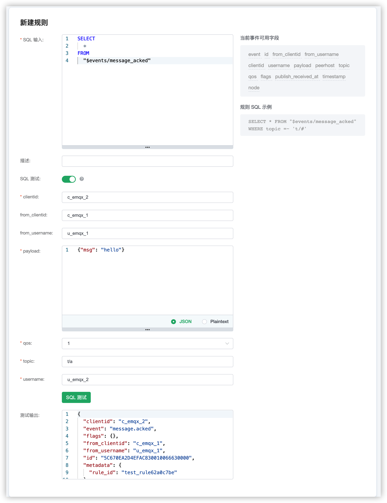

# 事件订阅

EMQX Cloud 数据集成 提供了以下七个可用的事件订阅主题。

| 事件主题名 | 释义 |
| ---- | ---- |
| $events/client_connected | 设备上线 |
| $events/client_disconnected | 设备下线 |
| $events/message_delivered | 消息投递 |
| $events/message_acked | 消息确认 |
| $events/message_dropped | 消息丢弃 |
| $events/session_subscribed | 设备订阅 |
| $events/session_unsubscribed | 设备取消订阅 |

本文将从设备上下线、消息通知和主题订阅通知，三个方面分别介绍事件订阅主题使用和各个字段的含义。


## 设备上下线通知

### 设备上线

设备上线的消息主题为 `$events/client_connected`，在规则面板中点击创建规则，然后输入如下规则匹配 SQL 语句便可完成设备上线规则的创建，当新设备上线并连接到 EMQX Cloud 便会触发该规则。
   ```sql
    SELECT
        *
    FROM
        "$events/client_connected"
   ```

使用 SQL 测试，查看触发该规则后返回字段，也可在 SQL 语句中使用 SELECT 和 WHERE 子句进行筛选与过滤。


各字段释义如下。

| 字段 | 释义 |
| ---- | ---- |
| clean_start | MQTT clean_start |
| clientid | 客户端 ID |
| connected_at | 终端连接完成时间 (s) |
| event | 事件类型，固定为 "client.connected" |
| expiry_interval | MQTT Session 过期时间 |
| is_bridge | 是否为 MQTT bridge 连接 |
| keepalive | MQTT 保活间隔 |
| mountpoint | 主题挂载点(主题前缀) |
| node | 事件触发所在节点 |
| peername | 终端的 IPAddress 和 Port |
| proto_name | 协议名字 |
| proto_ver | 协议版本 |
| sockname | emqx 监听的 IPAddress 和 Port |
| timestamp | 事件触发时间 (ms) |
| username | 用户名 |


### 设备下线

设备下线的消息主题为 `$events/client_disconnected`，在规则面板中点击创建规则，然后输入如下规则匹配 SQL 语句便可完成设备下线规则的创建，当在线设备下线断开连接时便会触发该规则。
   ```sql
    SELECT
        *
    FROM
        "$events/client_disconnected"
   ```

使用 SQL 测试，查看触发该规则后返回字段，也可在 SQL 语句中使用 SELECT 和 WHERE 子句进行筛选与过滤。


各字段释义如下。

| 字段 | 释义 |
| ---- | ---- |
| clientid | 客户端 ID |
| disconnected_at | 终端连接断开时间 (s) |
| event | 事件类型，固定为 "client.disconnected" |
| node | 事件触发所在节点 |
| peername | MQTT Session 过期时间 |
| reason | 终端连接断开原因：<br>normal：客户端主动断开 <br>kicked：服务端踢出，通过 REST API <br>keepalive_timeout: keepalive 超时 <br>not_authorized: 认证失败，或者 acl_nomatch = disconnect 时没有权限的 <br>Pub/Sub 会主动断开客户端 <br>tcp_closed: 协议错误 <br>internal_error: 畸形报文解析出错 |
| sockname | emqx 监听的 IPAddress 和 Port |
| timestamp | 事件触发时间 (ms) |
| username | 用户名 |
| peername | 终端的 IPAddress 和 Port |


## 设备消息通知

### 消息投递

消息投递的消息主题为 `$events/message_delivered`，在规则面板中点击创建规则，然后输入如下规则匹配 SQL 语句便可完成消息投递规则的创建，当有新消息被投递便会触发该规则。
   ```sql
    SELECT
        *
    FROM
        "$events/message_delivered"
   ```

使用 SQL 测试，查看触发该规则后返回字段，也可在 SQL 语句中使用 SELECT 和 WHERE 子句进行筛选与过滤。


各字段释义如下。

| 字段 | 释义 |
| ---- | ---- |
| clientid | 客户端 ID |
| event | 事件类型，固定为 "message.delivered" |
| flags | MQTT 消息的 Flags |
| from_clientid | 消息来源客户端 ID |
| from_username | 消息来源用户名 |
| id | MQTT 消息 ID |
| node | 事件触发所在节点 |
| payload | MQTT 消息体 |
| peerhost | 客户端的 IPAddress |
| publish_received_at | PUBLISH 消息到达 Broker 的时间 (ms) |
| qos | MQTT 消息的 QoS |
| timestamp | 事件触发时间 (ms) |
| topic | MQTT 主题 |
| username | 用户名 |

### 消息确认

消息确认的消息主题为 `$events/message_acked`，在规则面板中点击创建规则，然后输入如下规则匹配 SQL 语句便可完成消息确认规则的创建，当有新消息被确认便会触发该规则。
   ```sql
    SELECT
        *
    FROM
        "$events/message_acked"
   ```

使用 SQL 测试，查看触发该规则后返回字段，也可在 SQL 语句中使用 SELECT 和 WHERE 子句进行筛选与过滤。


各字段释义如下。

| 字段 | 释义 |
| ---- | ---- |
| clientid | 客户端 ID |
| event | 事件类型，固定为 "message.acked" |
| flags | MQTT 消息的 Flags |
| from_clientid | 消息来源客户端 ID |
| from_username | 消息来源用户名 |
| id | MQTT 消息 ID |
| node | 事件触发所在节点 |
| payload | MQTT 消息体 |
| peerhost | 客户端的 IPAddress |
| publish_received_at | PUBLISH 消息到达 Broker 的时间 (ms) |
| qos | MQTT 消息的 QoS |
| timestamp | 事件触发时间 (ms) |
| topic | MQTT 主题 |
| username | 用户名 |


### 消息丢弃

消息丢弃的消息主题为 `$events/message_dropped`，在规则面板中点击创建规则，然后输入如下规则匹配 SQL 语句便可完成消息丢弃规则的创建，当有消息被丢弃便会触发该规则。
   ```sql
    SELECT
        *
    FROM
        "$events/message_dropped"
   ```

使用 SQL 测试，查看触发该规则后返回字段，也可在 SQL 语句中使用 SELECT 和 WHERE 子句进行筛选与过滤。


各字段释义如下。

| 字段 | 释义 |
| ---- | ---- |
| clientid | 客户端 ID |
| event | 事件类型，固定为 "message.dropped" |
| flags | MQTT 消息的 Flags |
| id | MQTT 消息 ID |
| node | 事件触发所在节点 |
| payload | MQTT 消息体 |
| peerhost | 客户端的 IPAddress |
| publish_received_at | PUBLISH 消息到达 Broker 的时间 (ms) |
| qos | MQTT 消息的 QoS |
| reason | 消息丢弃原因 |
| timestamp | 事件触发时间 (ms) |
| topic | MQTT 主题 |
| username | 用户名 |


## 设备主题订阅通知

### 设备订阅

设备订阅消息的主题为 `$events/session_subscribed`，在规则面板中点击创建规则，然后输入如下规则匹配 SQL 语句便可完成设备订阅规则的创建，当设备订阅主题便会触发该规则。
   ```sql
    SELECT
        *
    FROM
        "$events/session_subscribed"
   ```

使用 SQL 测试，查看触发该规则后返回字段，也可在 SQL 语句中使用 SELECT 和 WHERE 子句进行筛选与过滤。


各字段释义如下。

| 字段 | 释义 |
| ---- | ---- |
| clientid | 客户端 ID |
| event | 事件类型，固定为 "session.subscribed" |
| node | 事件触发所在节点 |
| peerhost | 客户端的 IPAddress |
| qos | MQTT 消息的 QoS |
| timestamp | 事件触发时间 (ms) |
| topic | MQTT 主题 |
| username | 用户名 |


### 设备取消订阅

设备取消订阅消息的主题为 `$events/session_unsubscribed`，在规则面板中点击创建规则，然后输入如下规则匹配 SQL 语句便可完成设备取消订阅规则的创建，当设备取消订阅主题便会触发该规则。
   ```sql
    SELECT
        *
    FROM
        "$events/session_unsubscribed"
   ```

使用 SQL 测试，查看触发该规则后返回字段，也可在 SQL 语句中使用 SELECT 和 WHERE 子句进行筛选与过滤。


各字段释义如下。

| 字段 | 释义 |
| ---- | ---- |
| clientid | 客户端 ID |
| event | 事件类型，固定为 "session.unsubscribed" |
| node | 事件触发所在节点 |
| peerhost | 客户端的 IPAddress |
| qos | MQTT 消息的 QoS |
| timestamp | 事件触发时间 (ms) |
| topic | MQTT 主题 |
| username | 用户名 |