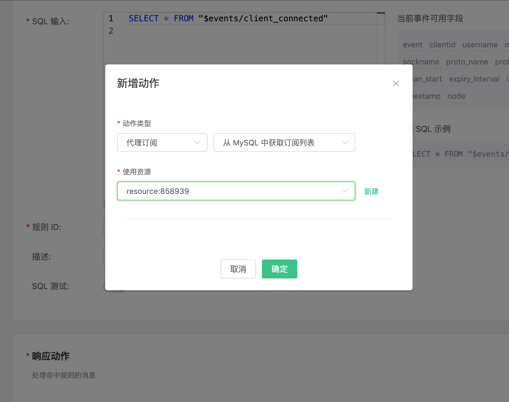
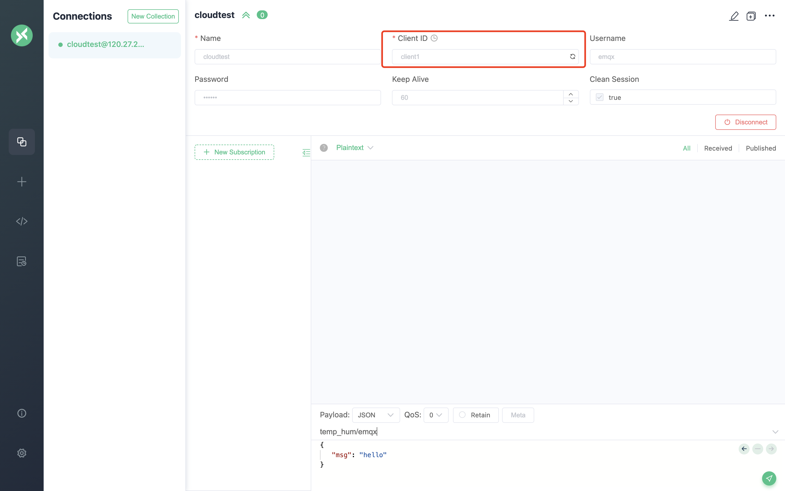
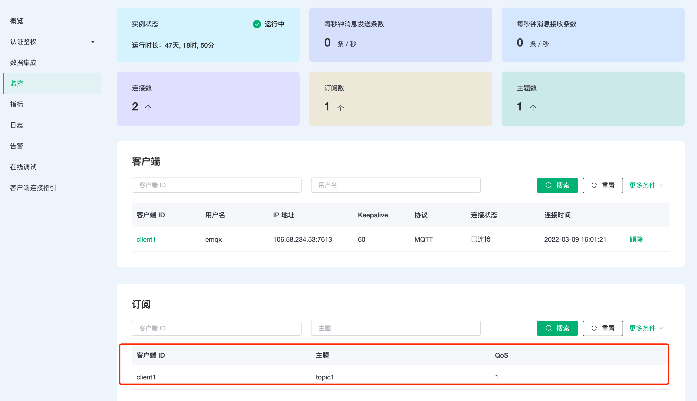

# 使用 EMQX Cloud 数据集成获取订阅关系

::: warning
该功能在基础版中不可用
:::

我们将使用 EMQX Cloud 数据集成从云服务资源（第三方数据库或消息队列）中获取订阅关系，并代理设备订阅。本文以 MySQL 为例实现该功能。

在开始之前，您需要完成以下操作：

- 已经在 EMQX Cloud 上创建部署(EMQX 集群)。
- 对于专业版部署用户：请先完成 [对等连接的创建](../deployments/vpc_peering.md)，下文提到的 IP 均指资源的内网 IP。（专业版部署若开通 [NAT 网关](../vas/nat-gateway.md) 也可使用公网 IP 连接资源）

## MySQL 配置

1. MySQL 安装

   ```bash
   docker run -d --restart=always \
     --name mysql \
     -p 3306:3306 \
     -e MYSQL_ROOT_PASSWORD=public \
     mysql/mysql-server:5.7
   ```

2. 数据库创建

   ```bash
   docker exec -it mysql mysql -uroot -ppublic
   CREATE DATABASE emqx;
   USE emqx;
   ```

3. 订阅关系表创建

   ::: warning
   订阅关系表结构不能修改，请使用下面 SQL 语句创建
   :::

   使用以下 SQL 语句将创建 `mqtt_sub` 表，该表将用于存放设备订阅关系数据。

   ```sql
   DROP TABLE IF EXISTS `mqtt_sub`;
   CREATE TABLE `mqtt_sub` (
       `id` int(11) unsigned NOT NULL AUTO_INCREMENT,
       `clientid` varchar(64) DEFAULT NULL,
       `topic` varchar(180) DEFAULT NULL,
       `qos` tinyint(1) DEFAULT NULL,
       PRIMARY KEY (`id`),
       KEY `mqtt_sub_idx` (`clientid`,`topic`,`qos`),
       UNIQUE KEY `mqtt_sub_key` (`clientid`,`topic`),
       INDEX topic_index(`id`, `topic`)
   ) ENGINE=InnoDB DEFAULT CHARSET=utf8MB4;
   ```

4. 设置允许 EMQX 集群 IP 段访问数据库(可选)

   对于专业版部署，获取部署网段可以前往部署详情 → 查看对等连接信息，复制部署 VPC 网段。

   ```sql
   # 专业版
   GRANT ALL PRIVILEGES ON *.* TO root@'10.11.30.%' IDENTIFIED BY 'public' WITH GRANT OPTION;

   # 基础版
   GRANT ALL PRIVILEGES ON *.* TO root@'%' IDENTIFIED BY 'public' WITH GRANT OPTION;
   ```

5. 插入测试数据，并查看数据

   ```sql
   INSERT INTO mqtt_sub(clientid, topic, qos) values("test", "t1", 1);

   select * from mqtt_sub;
   ```

## EMQX Cloud 数据集成配置

1. 资源创建

   点击左侧菜单栏`数据集成`，找到 MySQL 资源，点击进入资源页面，填入刚才创建好的 MySQL 数据库信息，并点击测试连接，如果出现错误应及时检查数据库配置是否正确、或者检查 VPC 对等连接状态。
   

   

2. 规则填写

   点击左侧左侧菜单栏`数据集成`，找到已配置的资源，点击新建规则，然后输入如下规则匹配 SQL 语句

   ```sql
   SELECT * FROM "$events/client_connected"
   ```

   

3. 添加响应动作

   点击下一步，下拉选择动作类型 → 代理订阅 → 从 MySQL 中获取订阅列表，选择第一步创建好的资源

   

4. 返回规则列表

   

5. 查看规则监控

   

## 测试

1. 在 MySQL 中插入订阅数据

   插入客户端 ID 为 client1，订阅主题 topic1，QoS 为 1 的订阅数据。

   ```sql
   INSERT INTO mqtt_sub(clientid, topic, qos) values("client1", "topic1", 1);
   select * from mqtt_sub;
   ```

   

2. 使用 [MQTT X](https://mqttx.app/) 连接部署

   需要将 broker.emqx.io 替换成已创建的部署[连接地址](../deployments/view_deployment.md)，并添加[客户端认证信息](../deployments/auth.md)。

   其中，设定 clientID 为 client1

   

3. 在部署详情中查看订阅关系

   进入部署详情在 `监控` 中可查看到客户端订阅关系

   
