# 集成 InfluxDB 2.0

::: warning
该功能在基础版中不可用
:::

[InfluxDB 2.0](https://www.influxdata.com/) 是一个用于存储和分析时间序列数据的开源数据库，内置 HTTP API，类 SQL 语句的支持和无结构的特性对使用者而言都非常友好。它强大的数据吞吐能力以及稳定的性能表现使其非常适合 IoT 领域。

通过 EMQX Cloud 数据集成，我们可以自定义 Template 文件，然后将 JSON 格式的 MQTT 消息转换为 Measurement 写入 InfluxDB 2.0。


这篇指南会完成一个 InfluxDB 2.0 数据集成的创建，实现下面的功能：

* 记录每个房间的温度和湿度情况。当有温度和湿度的监控消息，发送到 emqx/test 主题时，会触发数据集成，将这条数据记录在 InfluxDB 2.0 中。


为了实现这个功能，我们会完成以下 4 个任务：

1. 安装并初始化 InfluxDB 2.0
2. 设置数据集成的筛选条件
3. 创建一个资源和一个动作
4. 完成数据集成创建，并进行测试

>注意:
>
>在使用数据集成前，请先创建部署。
>
> 对于专业版部署用户：请先完成 [对等连接的创建](../deployments/vpc_peering.md)，下文提到的 IP 均指资源的内网 IP。(专业版部署若开通 [NAT 网关](../vas/nat-gateway.md)也可使用公网 IP 进行连接）

## 1. 安装并初始化 InfluxDB 2.0

首先，我们在自己的服务器上创建一个 InfluxDB 2.0，这里我们使用 docker 进行快速安装，并开放 **8086** 端口。

```shell
$ docker run -d  -p 8086:8086  influxdb
```

### 登录 InfluxDB 2.0 账号

访问服务器的 8086 端口即可进入控制台，填入用户名、密码

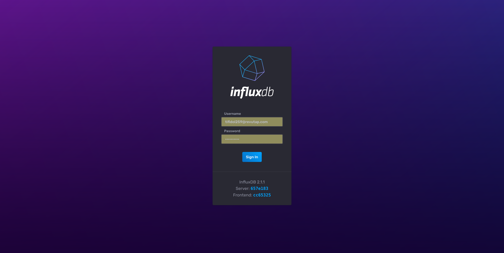


### 创建 Bucket

登录到 InfluxDB 2.0 的控制台后，进入 "Load Data" 页面并创建一个名为 emqx 的 bucket。

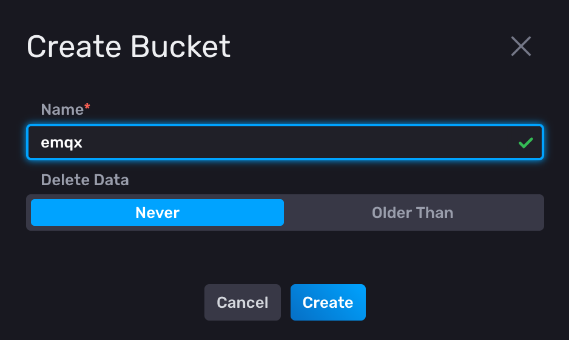

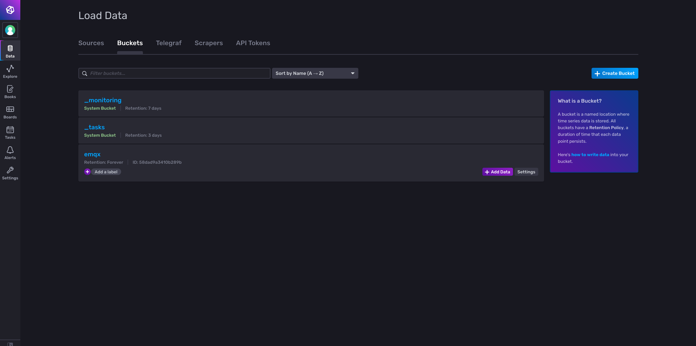


### 生成令牌

回到 "Load Data" 页面，生成一个新的令牌。此时我们将生成一个具有全部权限的令牌。一旦令牌被创建，你可以选择激活/停用令牌。

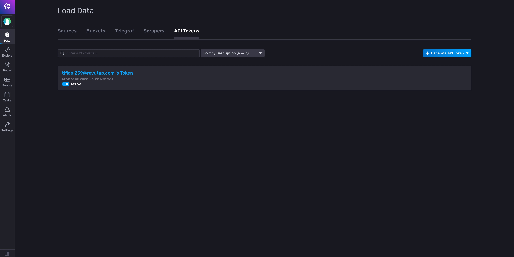


## 2. 创建资源

进入 [EMQX Cloud 控制台](https://cloud-intl.emqx.com/console/) ，打开数据集成页面

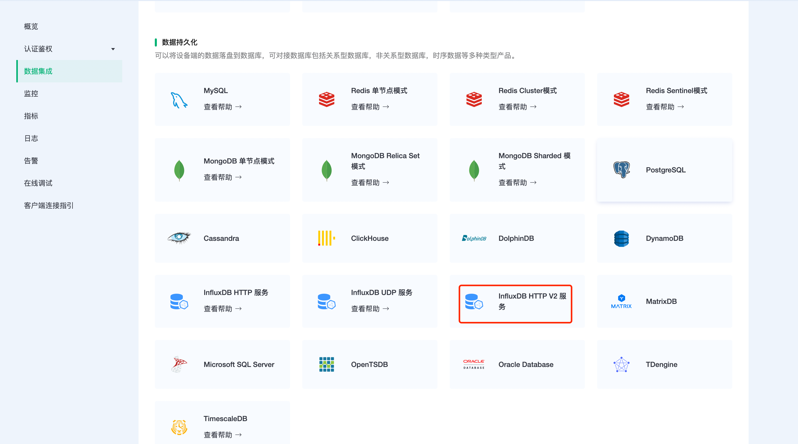

选择 InfluxDB HTTP V2 服务，进入新建资源页面，依次填写配置项

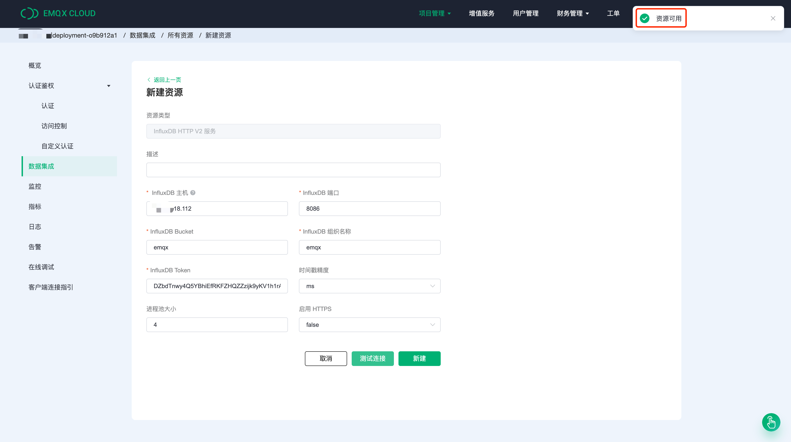

配置完成后点击测试连接，然后点击新建，在资源可用的情况下创建一个资源。

## 3. 创建规则

资源创建成功后，回到数据集成页面，找到新创建的资源，并点击创建规则。

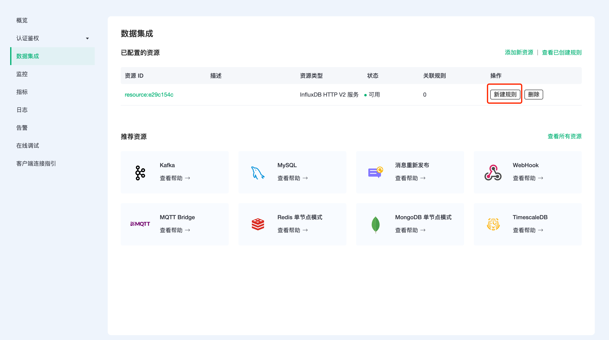

我们的目标是：只要 emqx/test 主题有监控信息时，就会触发引擎。这里需要对 SQL 进行一定的处理：

* 仅针对主题 "emqx/test"
* 获取我们需要的三个数据 location、temperature、humidity

根据上面的原则，我们最后得到的 SQL 应该如下：

```
SELECT
    payload.location as location, 
    payload.temp as temp, 
    payload.hum as hum
FROM "emqx/test"
```

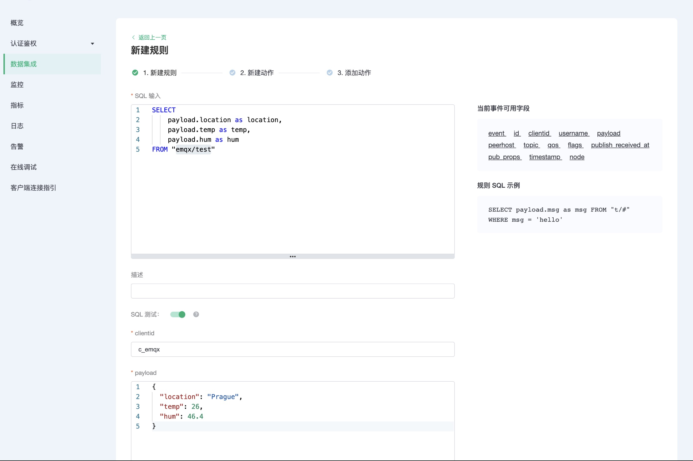

这个 SQL 可以解读为：当 "emqx/test" 主题收到消息时，选取信息里的 location、data.temperature、data.humidity 三个字段。

可以点击 SQL 输入框下的 **SQL 测试** ，填写数据：

* topic: emqx/test
* payload:
```json
{
  "location": "Prague",
  "temp": 26,
  "hum": 46.4
}
```

点击测试，查看得到的数据结果，如果设置无误，测试输出框应该得到完整的 JSON 数据，如下：

```json
{
  "hum": 46.4,
  "location": "Prague",
  "temp": 26
}
```

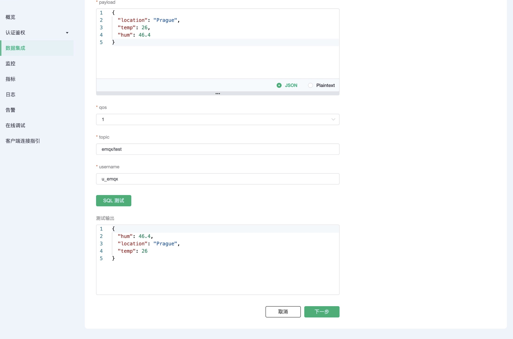

>注意：如果无法通过测试，请检查 SQL 是否合规，测试中的 topic 是否与 SQL 填写的一致。

## 4. 创建动作

点击下一步，在新建动作页中，默认动作类型为**保存数据到 InfluxDB**，选择刚才创建的资源。其他字段可以参照下表。

| 参数          | 必填 | 类型 | 意义                                            |
| :------------ | :--- | :--- | :---------------------------------------------- |
| Measurement   | 是   | str  | 指定写入到 InfluxDB 的  measurement             |
| Fields        | 是   | str  | 指定写入到 InfluxDB 的 fields 的值从哪里获取    |
| Tags          | 否   | str  | 指定写入到 InfluxDB 的 tags 的值从哪里获取      |
| Timestamp Key | 否   | str  | 指定写入到 InfluxDB 的 timestamp 的值从哪里获取 |

针对我们的情况，这部分可以这样填写

* Measurement 可以随意设置，我们这里填写 "temp_hum"
* Field Keys 填写我们需要记录的两个数据：temp 和 hum
* Tag Keys 这里我们设置成 location
* Timestamp Key 默认为空

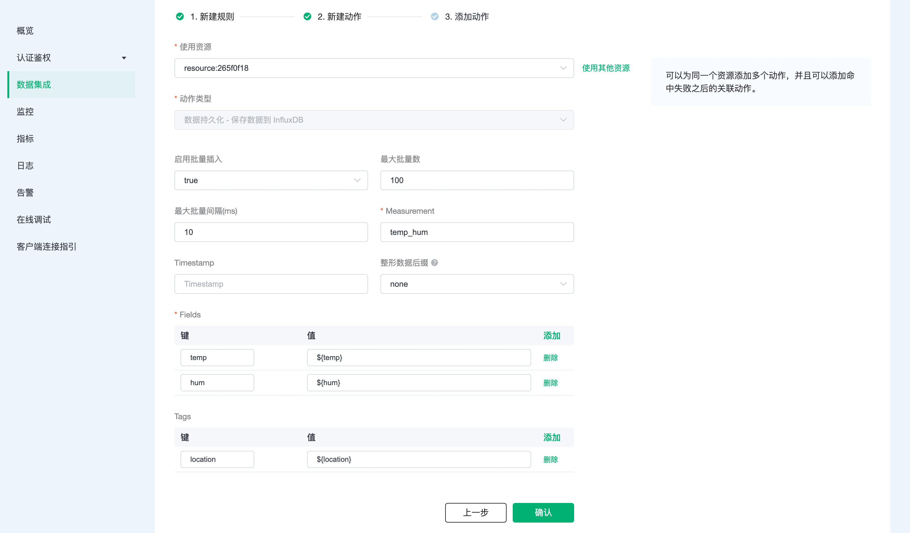

确认信息无误后，点击右下角的确认，完成数据集成的配置。

## 5. 测试

我们推荐你使用 MQTT X，一个优雅的跨平台 MQTT 5.0 桌面客户端来订阅/发布消息。

>如果您是第一次使用 EMQX Cloud 可以前往[部署连接指南](../connect_to_deployments/overview.md)，查看 MQTT 客户端连接和测试指南

在 MQTT X 控制台，点击 "添加 "按钮，填写部署信息以连接到部署，然后输入 topic 和 payload 以发布消息。

我们尝试向 emqx/test 主题发送下面的数据

```json
{
  "hum": 41.3,
  "location": "Prague", 
  "temp": 39.5
}
```

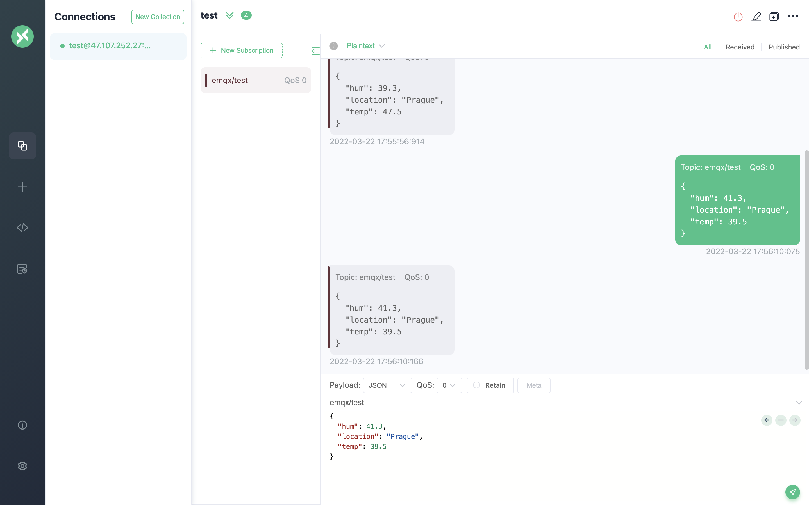

在数据集成页中，点击监控可以看到动作指标数的成功数变为 1。

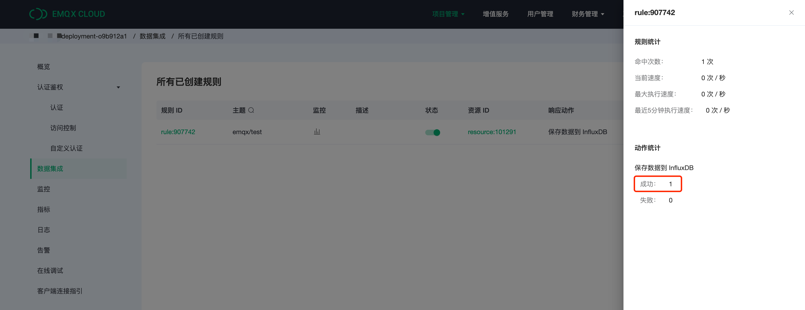

## 6. 在 influxDB 2.0 控制台查看结果

回到 InfluxDB 2.0 控制台，进入 "Data Explorer "页面。

选择 bucket 并过滤测量值和字段，然后 InfluxDB 2.0 将生成图表。

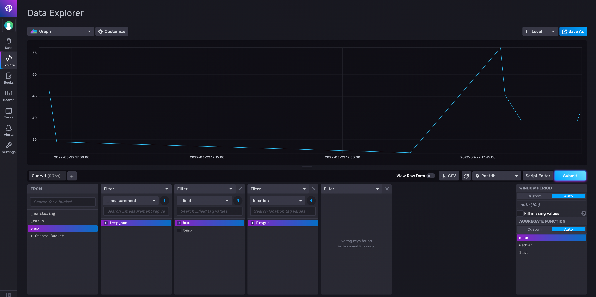

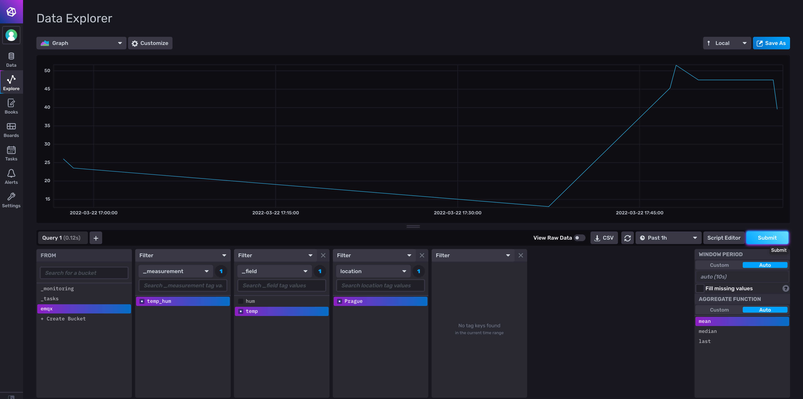

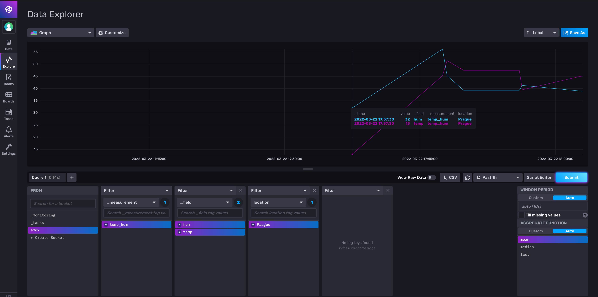
