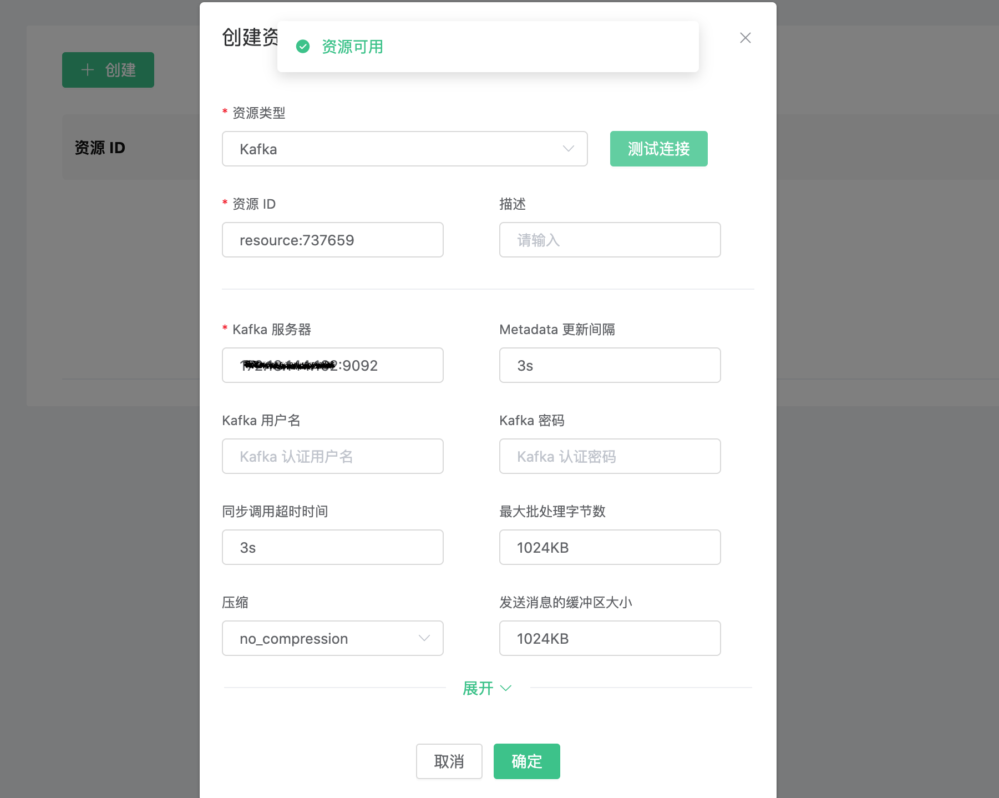
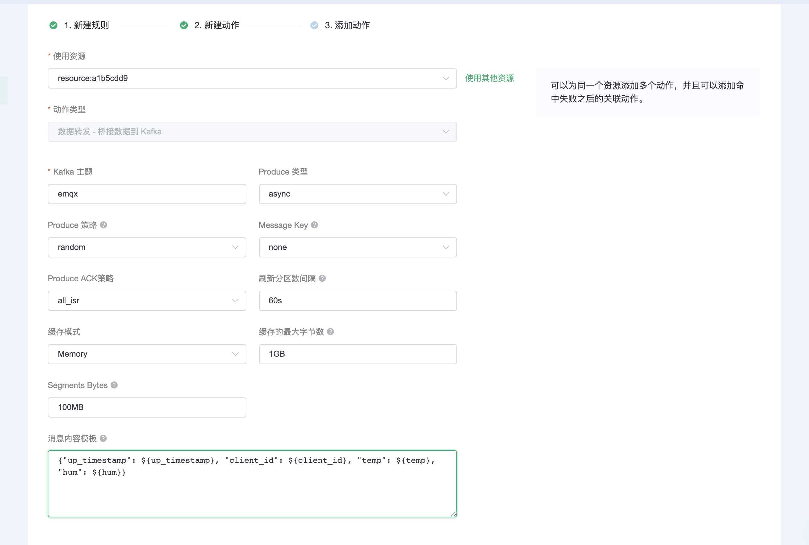
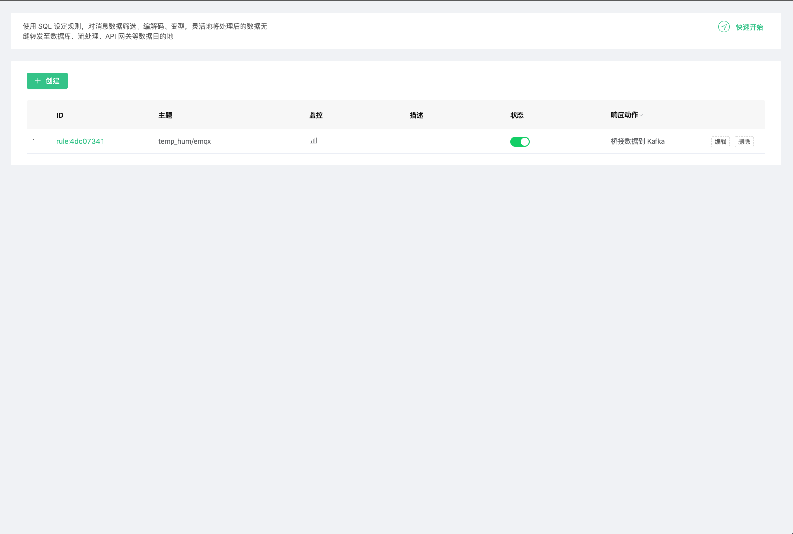
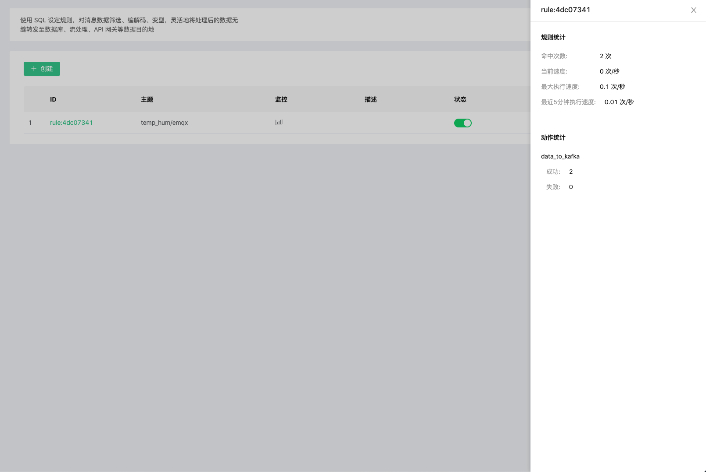
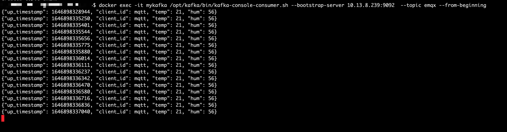

# 使用 EMQ X Cloud 规则引擎桥接数据到 Kafka

::: danger
该功能在基础版中不可用
:::

在本文中我们将模拟温湿度数据并通过 MQTT 协议上报到 EMQ X Cloud，然后使用 EMQ X Cloud 规则引擎将数据转存到 Kafka。

在开始之前，您需要完成以下操作：
* 已经在 EMQ X Cloud 上创建部署(EMQ X 集群)。
* 对于独享部署用户：请先完成 [对等连接的创建](../deployments/vpc_peering.md)，下文提到的 IP 均指资源的内网 IP。

## Kafka 配置

1. 安装 Kafka

    ```bash
    # 安装 zookeeper
    docker run -d --restart=always \
        --name zookeeper -p 2181:2181 zookeeper

    # 安装 Kafka，开放 9092 端口
    docker run -d  --restart=always --name mykafka \
        -p 9092:9092 \
        -e HOST_IP=localhost \
        -e KAFKA_ADVERTISED_PORT=9092 \
        -e KAFKA_ADVERTISED_HOST_NAME=<服务器 IP> \
        -e KAFKA_BROKER_ID=1 \
        -e KAFKA_LOG_RETENTION_HOURS=12 \
        -e KAFKA_LOG_FLUSH_INTERVAL_MESSAGES=100000 \
        -e KAFKA_ZOOKEEPER_CONNECT=<服务器 IP>:2181 \
        -e ZK=<服务器 IP> \
        wurstmeister/kafka
    ```

2. 创建主题

    ```bash
    # 进入 Kafka 实例，并创建 emqx 主题
    $ docker exec -it mykafka /bin/bash
    $ kafka-topics.sh --zookeeper <服务器 IP>:2181 --replication-factor 1 --partitions 1 --topic emqx --create
    ```
    返回 `Created topic emqx.` 表示创建成功

## EMQ X Cloud 规则引擎配置

1. 资源创建

   点击左侧菜单栏`规则引擎`，找到资源面板，点击新建资源，下拉选择 Kafka 资源类型。填入刚才创建好的 Kafka 信息，并点击测试如果出现错误应及时检查数据库配置是否正确。

   

2. 规则测试

   点击左侧左侧菜单栏`规则引擎`，找到规则面板，点击创建，然后输入如下规则匹配 SQL 语句。在下面规则中我们从 `temp_hum/emqx` 主题读取消息上报时间 `up_timestamp`、客户端 ID、消息体(Payload)，并从消息体中分别读取温度和湿度。
   
   ```sql
   SELECT 
   
   timestamp as up_timestamp, clientid as client_id, payload.temp as temp, payload.hum as hum
   
   FROM
   
   "temp_hum/emqx"
   ```
   

3. 添加响应动作

   点击左下角添加动作，下拉选择 → 数据转发 → 桥接数据到 Kafka，选择第一步创建好的资源，并填写以下数据：
   
   Kafka 主题：emqx
   
   消息内容模板: 
   ```
   {"up_timestamp": ${up_timestamp}, "client_id": ${client_id}, "temp": ${temp}, "hum": ${hum}}
   ```
   

4. 点击创建规则，并返回规则列表

   

5. 查看规则监控

   

## 测试

1. 使用 [MQTT X](https://mqttx.app/) 模拟温湿度数据上报

   需要将 broker.emqx.io 替换成已创建的部署[连接地址](../deployments/view_deployment.md)，并添加[客户端认证信息](../deployments/auth_and_acl.md)。

   
   
2. 查看数据转存结果

    ```bash
    # 进入 Kafka 实例，并查看 emqx 主题
    $ docker exec -it mykafka /bin/bash
    $ kafka-console-consumer.sh --bootstrap-server 127.0.0.1:9092  --topic emqx --from-beginning
    ```
   
