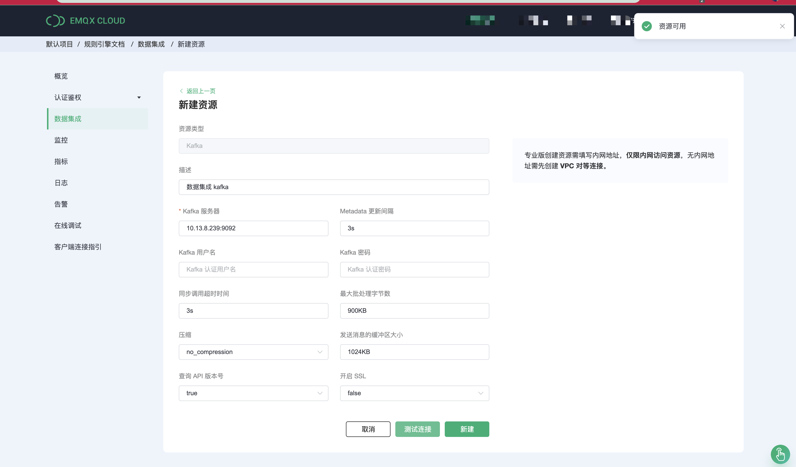
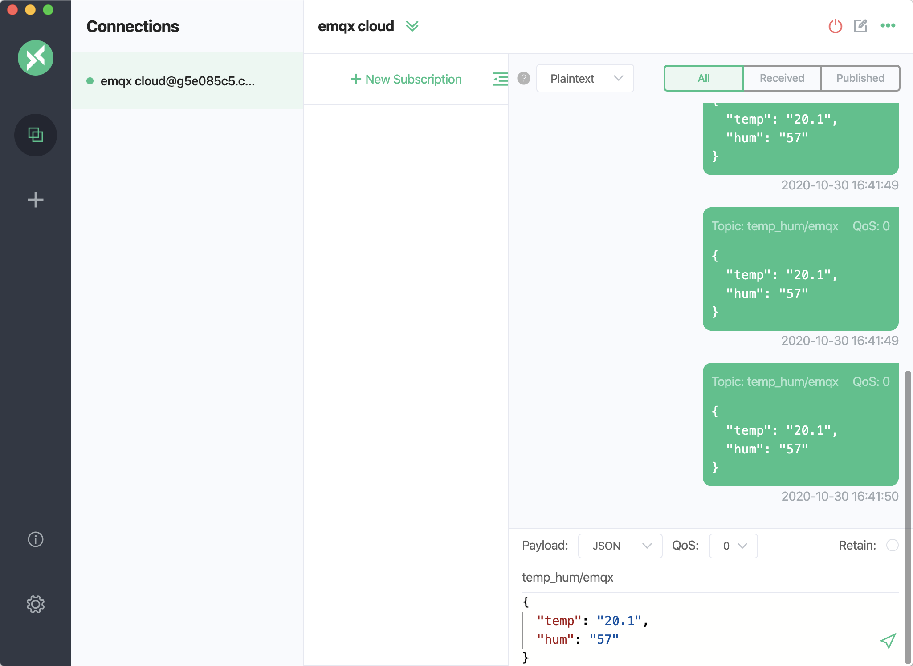

# 使用 EMQX Cloud 数据集成桥接数据到 Kafka

:::danger 
该功能在基础版中不可用
:::

在本文中我们将模拟温湿度数据并通过 MQTT 协议上报到 EMQX Cloud，然后使用 EMQX Cloud 规则引擎将数据转存到 Kafka。

在开始之前，您需要完成以下操作：

* 已经在 EMQX Cloud 上创建部署(EMQX 集群)。
* 对于专业版部署用户：请先完成 [对等连接的创建](../deployments/vpc_peering.md)，下文提到的 IP 均指资源的内网 IP。


## Kafka 配置

1. 安装 Kafka

    ```bash
    # 安装 zookeeper
    docker run -d --restart=always \
        --name zookeeper \
        -p 2181:2181 \
        zookeeper

    # 安装 Kafka，开放 9092 端口
    docker run -d  --restart=always --name mykafka \
        -p 9092:9092 \
        -e HOST_IP=localhost \
        -e KAFKA_ADVERTISED_PORT=9092 \
        -e KAFKA_ADVERTISED_HOST_NAME=<服务器 IP> \
        -e KAFKA_BROKER_ID=1 \
        -e KAFKA_LOG_RETENTION_HOURS=12 \
        -e KAFKA_LOG_FLUSH_INTERVAL_MESSAGES=100000 \
        -e KAFKA_ZOOKEEPER_CONNECT=<服务器 IP>:2181 \
        -e ZK=<服务器 IP> \
        wurstmeister/kafka
    ```

2. 创建主题

    ```bash
    # 进入 Kafka 实例，并创建 emqx 主题
    $ docker exec -it mykafka /opt/kafka/bin/kafka-topics.sh --zookeeper <broker IP>:2181 --replication-factor 1 --partitions 1 --topic emqx --create
    ```
   返回 `Created topic emqx.` 表示创建成功


## 部署数据集成配置

1. 创建 Kafka 资源并测试连接

   在数据集成页面点击 kafka 数据转发资源，填入 kafka 连接信息并点击测试，如测试失败请及时检查 kafka 连接信息是否正确。

   

2. 测试通过后点击新建按钮，将看到创建资源成功提示按钮
   

3. 新建规则

   将下面规则 SQL 填入到 SQL 输入框中，在下面规则中我们从 `temp_hum/emqx` 主题读取消息上报时间 `up_timestamp`、客户端 ID、消息体(Payload)
   ，并从消息体中分别读取温度和湿度。

   ```sql
   SELECT 
   
   timestamp as up_timestamp,
   clientid as client_id, 
   payload.temp as temp, 
   payload.hum as hum
   
   FROM
   
   "temp_hum/emqx"
   ```
   

3. 规则 SQL 测试

   点击 SQL 测试，填写测试 payload、topic、客户端信息用于测试规则 SQL 是否满足我们需求。

   


5. 为规则关联动作

   规则 SQL 测试通过后，点击下一步为规则关联转发动作，本次我们将演示转发到 kafka 资源。在动作中填写 如下 Kafka 主题以及 kafka 消息模板

   ```
   # kafka 主题
   emqx
   
   # kafka 消息模板
   {"up_timestamp": ${up_timestamp}, "client_id": ${client_id}, "temp": ${temp}, "hum": ${hum}}
   ```
   

4. 成功为规则绑定动作后，继续点击查看详情可以看到创建的规则 SQL 语句以及关联的响应动作。

   

5. 点击数据集成/查看已创建规则，可以看到创建的规则。点击监控按钮可以看到规则详细的匹配数据。

   


## 测试

1. 使用 [MQTT X](https://mqttx.app/) 模拟温湿度数据上报

   需要将 broker.emqx.io 替换成已创建的部署[连接地址](../deployments/view_deployment.md)
   ，并添加[客户端认证信息](../deployments/auth.md)。

   

2. 查看数据转存结果

    ```bash
    # 进入 Kafka 实例，并查看 emqx 主题
    $ docker exec -it mykafka /opt/kafka/bin/kafka-console-consumer.sh --bootstrap-server <broker IP>:9092  --topic emqx --from-beginning
    ```
   
