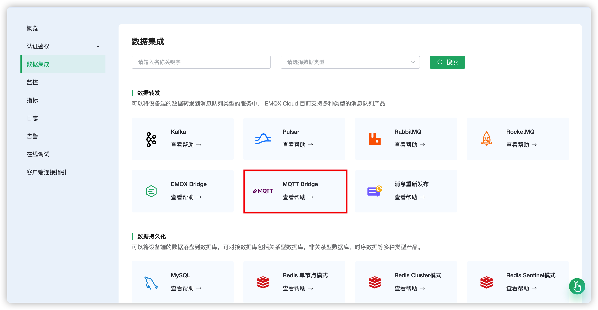
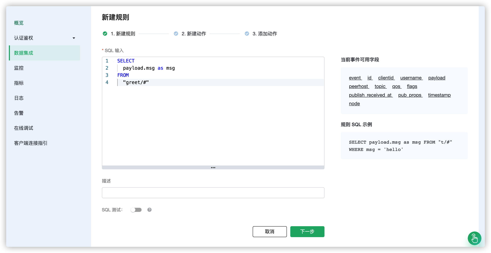

# 使用 EMQX Cloud 规则引擎桥接数据到 MQTT Broker

为了方便多个 MQTT Broker 进行消息桥接，你可以使用规则引擎进行操作。

这篇指南会创建一个 MQTT Broker 桥接的规则引擎，实现下面的功能：

- 将所有发送到 greet 主题的消息，转发到另一个 MQTT Broker 上


为了实现这个功能，我们会完成以下 4 个任务：

1. 开启 Mosquitto 服务
2. 设置规则引擎的筛选条件
3. 创建一个资源和一个动作
4. 完成规则引擎创建，并进行测试

>注意:
>
>在使用规则引擎前，请先创建部署。
>
>对于专业版部署用户：请先完成[对等连接](../deployments/vpc_peering.md)，并确保以下涉及到的资源都建立在对等连接下的 VPC 中，下文提到的 IP 均指资源的内网 IP（专业版部署若开通 NAT 网关也可使用公网 IP 进行连接）
>
>对于基础版用户：无需完成对等连接，下文提到的 IP 均指资源的公网 IP


## 1. 创建 Mosquitto 服务

在你的云服务器中，创建一个 Mosquitto 服务。为了方便演示，这里使用 Docker 快速搭建。(请勿在生产环境中使用)

```shell
docker run -it -p 1883:1883 --name mosquitto eclipse-mosquitto:1.6
```

之后，开放服务器的 1883 端口

## 2. 创建 MQTT Bridge 资源

进入 [EMQX Cloud 控制台](https://cloud.emqx.com/console/)，并点击进入要使用 MQTT Bridge 的部署。

在部署页面，选择数据集成，点击数据转发下的 MQTT Bridge 资源进行创建。



在创建资源页面里，按照如下设置：
- 远程 broker 地址：填写服务器的 IP 地址以及端口
- 桥接挂载点：`emqx/`


完成配置后点击测试连接，提示资源可用后便可点击新建来创建资源。

## 3. 创建规则

成功创建资源后可直接点击对话框中的创建规则或者回到数据集成界面，找到刚创建的资源点击操作下的新建规则。


我们的目标是：当有消息发送到 greet 主题时，就会触发规则。这里需要对 SQL 进行一定的处理：
* 仅针对 'greet/#'

根据上面的原则，我们最后得到的 SQL 应该如下：

```sql
SELECT
   payload.msg as msg
FROM
    "greet/#"
```



## 4. 新建动作

完成规则配置后点击下一步，便可配置和新建动作。使用资源会默认选择到该资源，填写一个需要转发消息到主题，在消息内容模版里填写 "${msg} FROM EMQX CLOUD"，点击确定。


完成动作创建后可继续添加一个动作或者完成创建回到数据集成界面。

## 5. 测试

>如果您是第一次使用 EMQX Cloud 可以前往[部署连接指南](../connect_to_deployments/overview.md)，查看 MQTT 客户端连接和测试指南

在第三步配置动作时，我们将挂载点设为 `emqx/`，所以这里用客户端订阅 Mosquitto 的 `emqx/#` 主题。

同时我们发送 "hello" 到 EMQX Cloud 的 greet 主题，规则引擎就会触发。可以看到 Mosquitto 已经收到消息 "hello FROM EMQX CLOUD"


