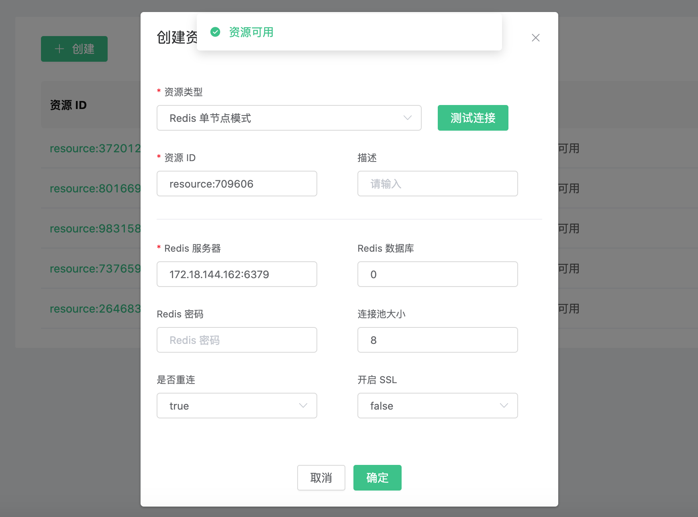
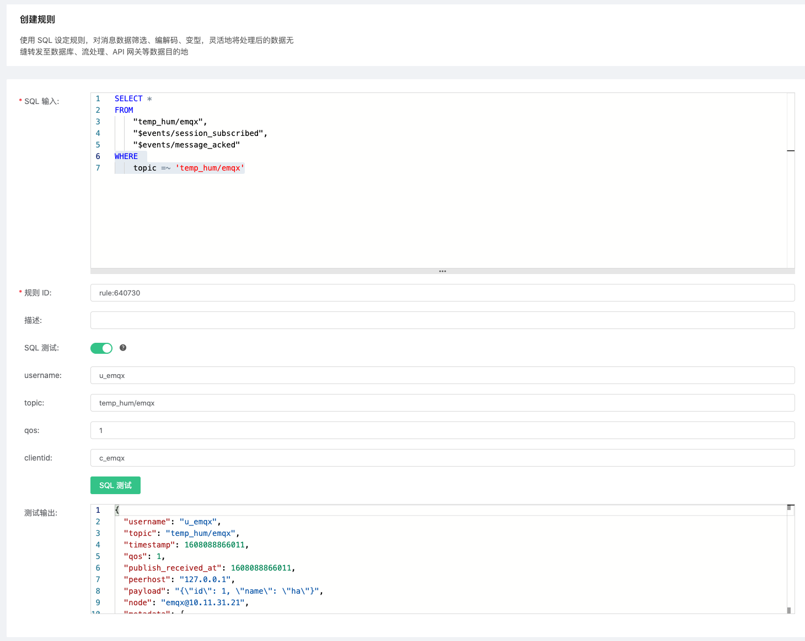
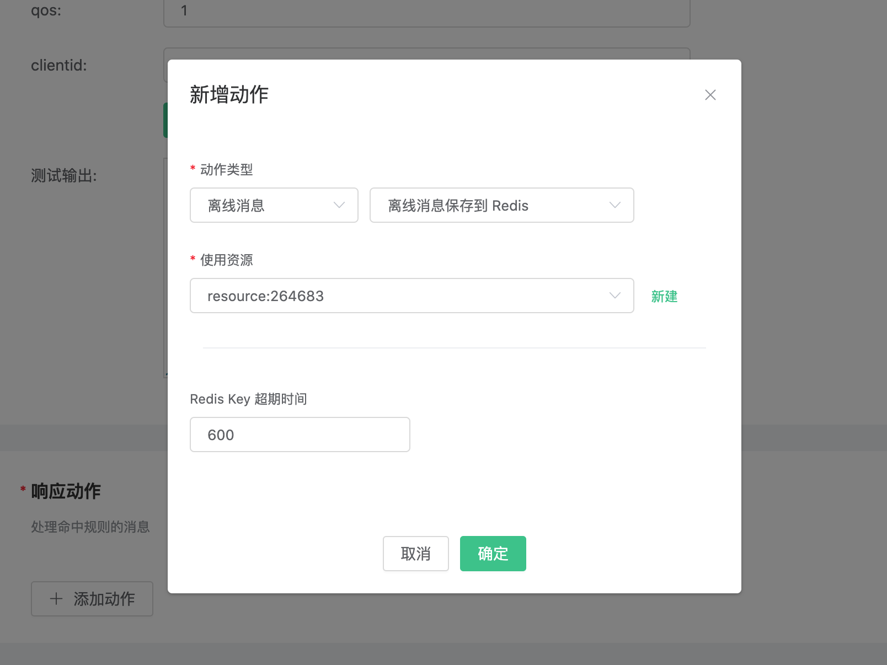
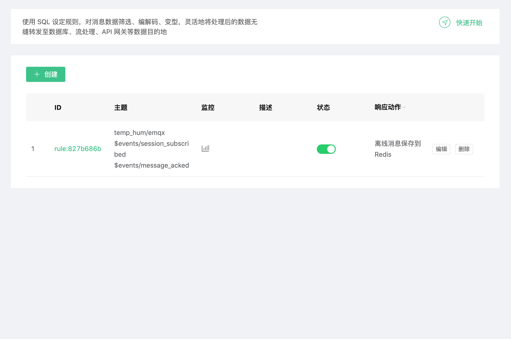
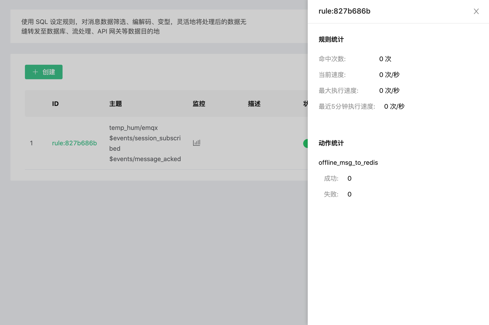
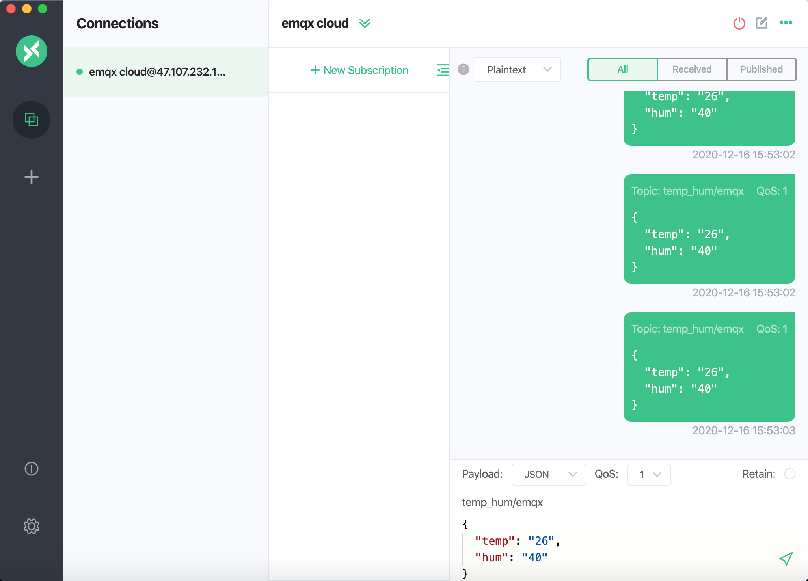
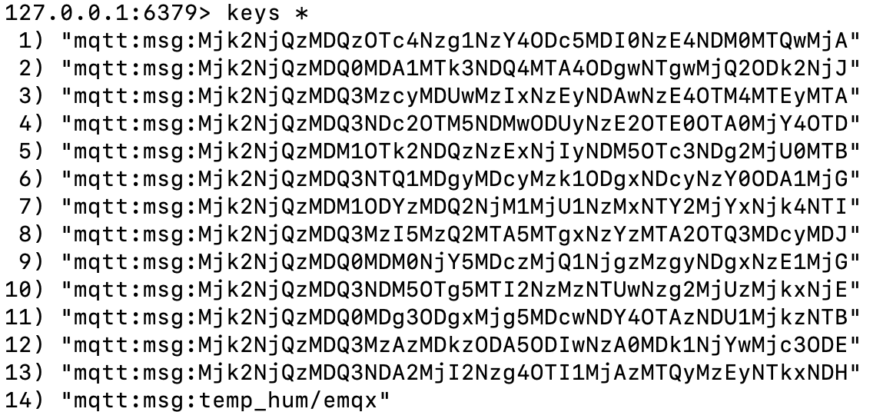
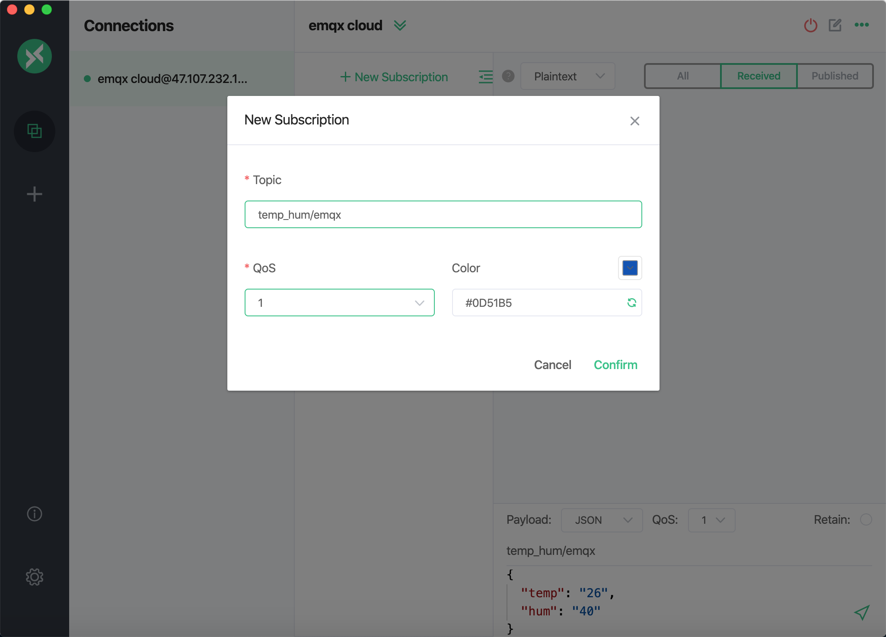
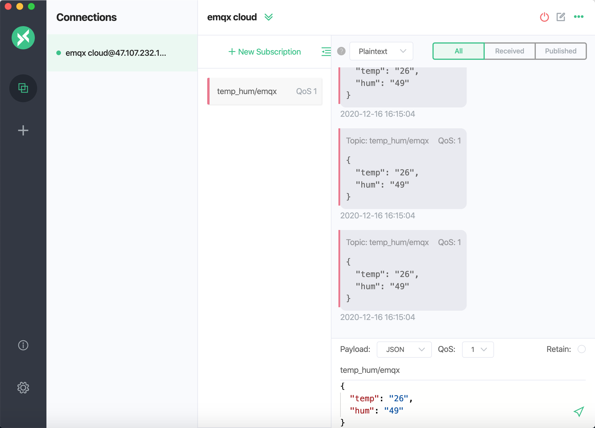
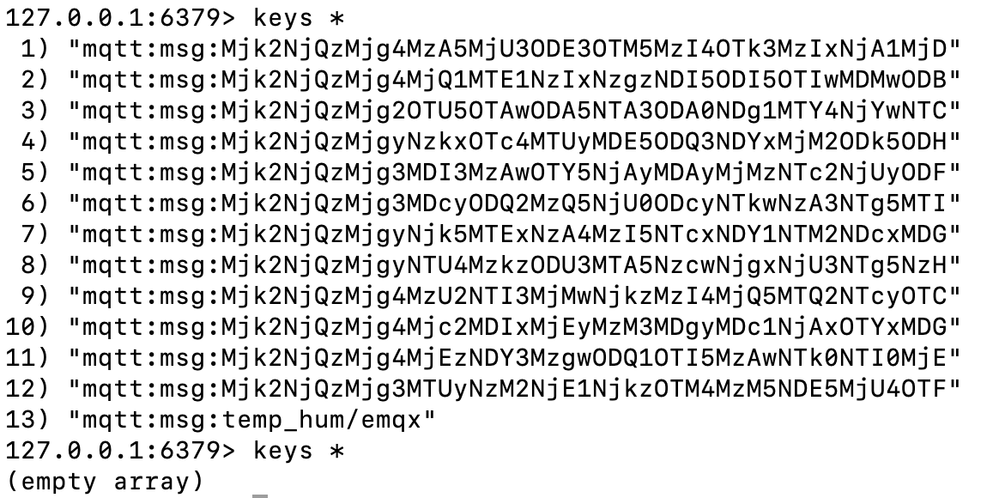

# 使用 EMQX Cloud 数据集成保存离线消息

::: warning
该功能在基础版中不可用
:::

我们将模拟温湿度数据并通过 MQTT 协议上报到 EMQX Cloud，然后使用 EMQX Cloud 数据集成保存离线消息至云服务资源（第三方数据库或消息队列），本文以 Redis 为例实现该功能。

::: warning
保存离线消息需要 QoS > 0
:::

在开始之前，您需要完成以下操作：

* 已经在 EMQX Cloud 上创建部署(EMQX 集群)。
* 对于专业版部署用户：请先完成 [对等连接的创建](../deployments/vpc_peering.md)，下文提到的 IP 均指资源的内网 IP。（专业版部署若开通 [NAT 网关](../vas/nat-gateway.md) 也可使用公网 IP 连接资源）
* 对于 BYOC 部署用户：请先对 BYOC 部署所在 VPC 与资源所在 VPC 建立对等连接，下文提到的 IP 均指资源的内网 IP。如需通过公网访问资源，请在您的公有云控制台中为 BYOC 部署所在 VPC 配置 NAT 网关，使用资源的公网 IP 进行连接。

## Redis 配置

1. 安装 Redis

   ```bash
   docker run -d --name redis -p 6379:6379 redis
   ```

## EMQX Cloud 数据集成配置

1. 资源创建

   点击左侧菜单栏 `数据集成`，找到资源面板，点击新建资源，下拉选择 `Redis 单节点模式` 资源类型。填入刚才创建好的 Redis 信息，并点击测试，如果出现错误应及时检查数据库配置是否正确。

   

2. 规则测试

   点击左侧左侧菜单栏`数据集成`，找到规则面板，点击创建，然后输入如下规则匹配 SQL 语句。我们将主题为 `temp_hum/emqx` 的消息信息读取出来。

   规则 SQL 的 FROM 语句说明：

   temp_hum/emqx: 发布者发布消息到 "temp_hum/emqx" 触发保存离线消息到 Redis

   $events/session_subscribed: 订阅者订阅主题 "temp_hum/emqx" 触发获取离线消息

   $events/message_acked: 订阅者回复消息 ACK 后触发删除已经被接收的离线消息

   ```sql
   SELECT
       *
   FROM
       "temp_hum/emqx",
       "$events/session_subscribed",
       "$events/message_acked"
   WHERE
       topic =~ 'temp_hum/emqx'
   ```

   

3. 添加响应动作

   点击左下角添加动作，下拉选择 → 离线消息 → 离线消息保存到 Redis，选择第一步创建好的资源

   ::: tip Tip
   这里需要规划好 Redis Key 超期时间，离线保存消息建议不超过 100 条
   :::

   

4. 点击创建规则，并返回规则列表

   

5. 查看规则监控

   

## 测试

1. 使用 [MQTT X](https://mqttx.app/) 模拟温湿度数据上报

   需要将 broker.emqx.io 替换成已创建的部署连接地址，并添加客户端认证信息。

   ::: tip Tip
   发送消息需要 QoS > 0
   :::

   

2. 查看数据转存结果

    ```bash
    $ docker exec -it redis bash
    $ redis-cli
    $ keys *
    ```

    

3. 使用 [MQTT X](https://mqttx.app/) 消费离线数据

   在 MQTT X 中，订阅主题 `temp_hum/emqx`，获取离线数据。

   ::: tip Tip
   订阅主题的 QoS 必须大于 0，否则消息会被重复接收
   :::

   
   

4. 查看 redis 被消费的数据

   ```bash
   $ docker exec -it redis bash
   $ redis-cli
   $ keys *
   ```

   
