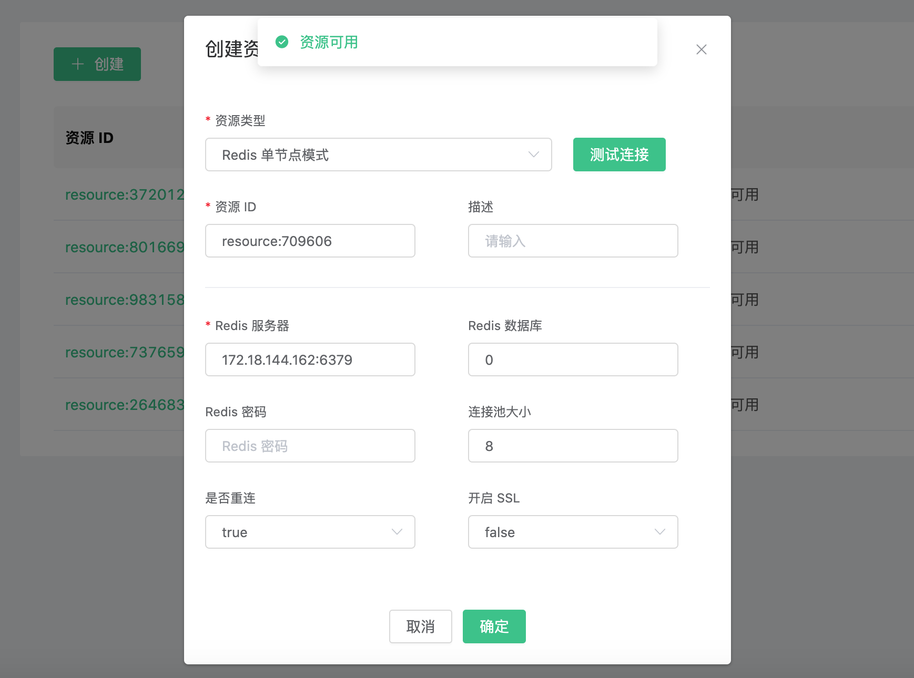
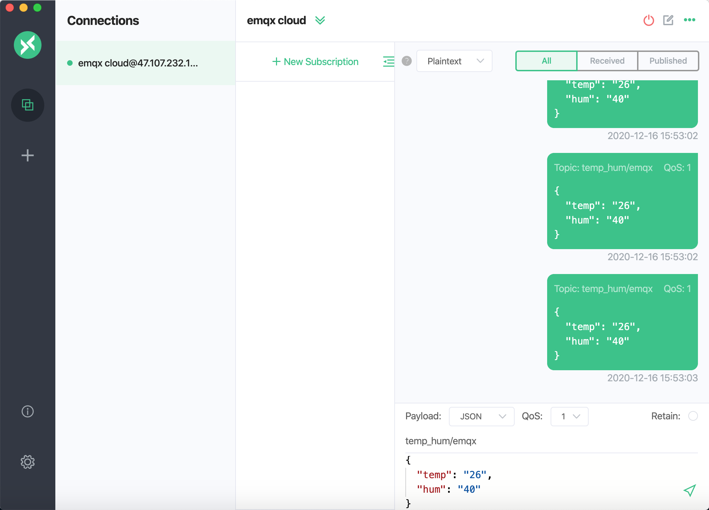
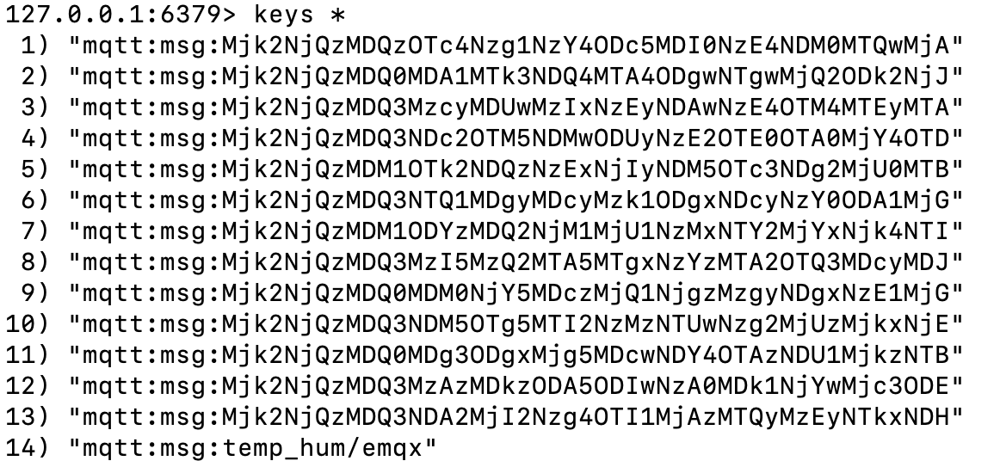

# 使用 EMQ X Cloud 规则引擎保存离线消息到 Redis

在本文中我们将模拟温湿度数据并通过 MQTT 协议上报到 EMQ X Cloud，然后使用 EMQ X Cloud 规则引擎将离线消息转存到 Redis。

::: danger
保存离线消息需要 QoS > 0
:::

在开始之前，您需要完成以下操作：
* 已经在 EMQ X Cloud 上创建部署(EMQ X 集群)。
* 对于独享部署用户：请先完成 [对等连接的创建](../deployments/vpc_peering.md)，下文提到的 IP 均指资源的内网 IP。
* 对于免费试用及共享部署用户：无需完成对等连接，下文提到的 IP 均指资源的公网 IP。

### Redis 配置

### EMQ X Cloud 规则引擎配置

进入部署详情点击 EMQ X Dashbaord 将进入 Dashbaord

1. 资源创建

   点击左侧菜单栏规则 → 资源，点击新建资源，下拉选择 Redis 单节点模式 资源类型。填入刚才创建好的 Redis 信息，并点击测试如果出现错误应及时检查数据库配置是否正确。
   

2. 规则测试
   点击左侧菜单栏规则 → 规则，点击创建，然后输入如下规则匹配 SQL 语句。我们将主题为 `temp_hum/emqx` 的消息信息读取出来。

   ```sql
   SELECT
       *
   FROM
       "temp_hum/emqx",
       "$events/session_subscribed",
       "$events/message_acked"
   WHERE
       topic =~ 'temp_hum/emqx'
   ```
   

3. 添加响应动作
   点击左下角添加动作，下拉选择 → 离线消息 → 离线消息保存到 Redis，选择第一步创建好的资源

   ::: tip Tip
   这里需要规划好 Redis Key 超期时间，离线保存消息建议不超过 100 条
   :::

   

4. 点击创建规则，并返回规则列表
   

5. 查看规则监控
   
### 测试

1. 使用 [MQTT X](https://mqttx.app/) 模拟温湿度数据上报

   需要将 broker.emqx.io 替换成已创建的部署[连接地址](../deployments/view_deployment.md)，并在 EMQ X Dashboard 中添加[客户端认证信息](../deployments/dashboard/users_and_acl.md)。

   ::: tip Tip
   发送消息需要 QoS > 0
   :::

   

2. 查看数据转存结果

    ```bash
    # 进入 Kafka 实例，并查看 emqx 主题
    $ docker exec -it myredis bash
    $ redis-cli
    $ keys *
    ```
   

3. 使用 [MQTT X](https://mqttx.app/) 消费离线数据
   在 MQTT X 中，订阅主题 temp_hum/emqx，获取离线数据

   
   

4. 查看 redis 被消费的数据

   ```bash
   $ docker exec -it myredis bash
   $ redis-cli
   $ keys *
   ```

   
