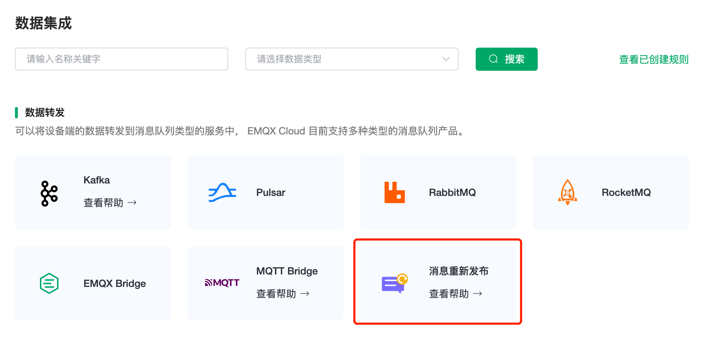
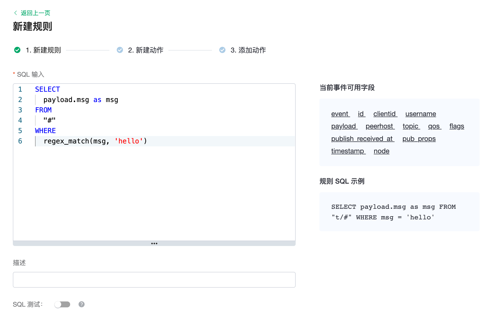
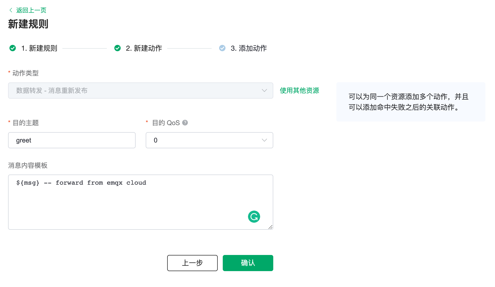
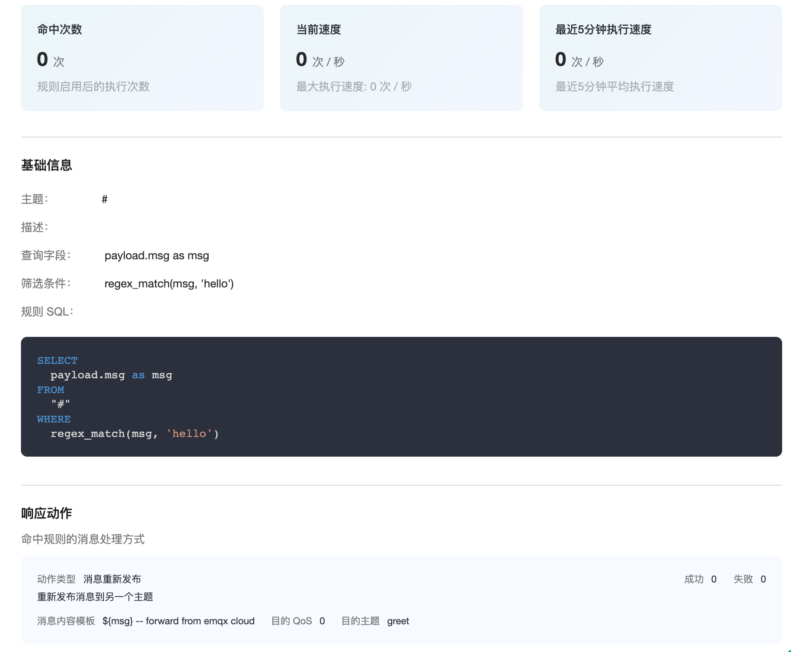
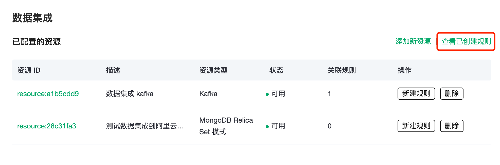
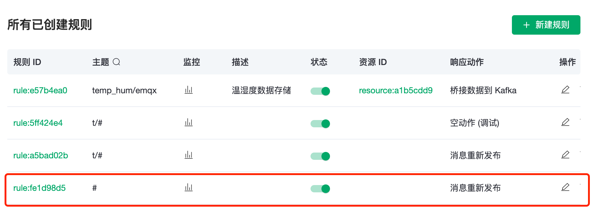
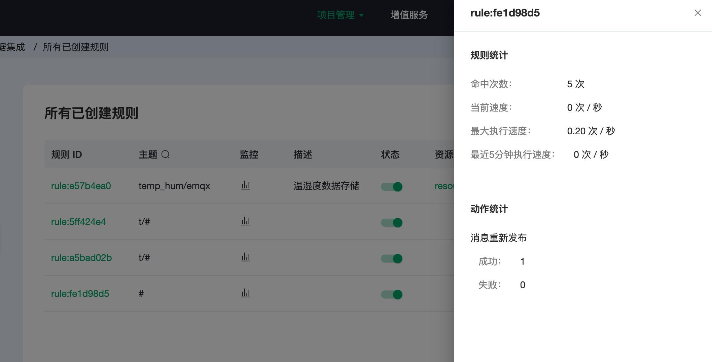
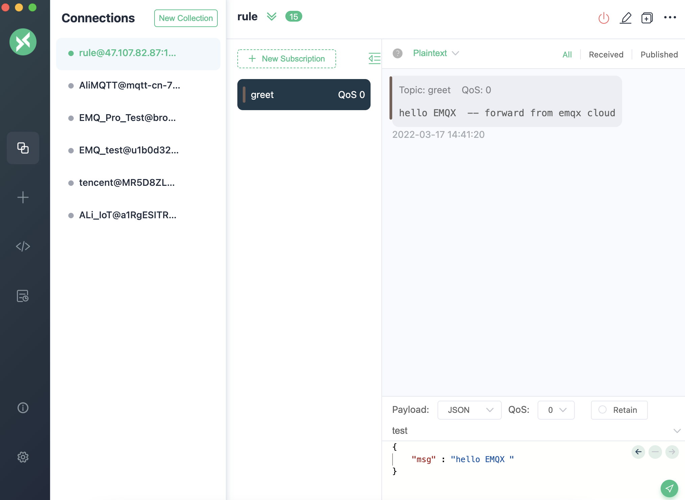

# 使用 EMQX Cloud 数据集成消息重新发布

当有消息满足某一特征时，你希望在不编写代码的情况下，将它发布到其它主题上。EMQX Cloud 为你准备了这样的服务：通过使用 EMQX Cloud 数据集成——消息重新发布，你可以轻松实现这一功能。

这篇指南会完成一个 `消息重新发布` 数据集成的创建，实现下面的目标：

**当任一消息的 msg 包含 'hello' 字符串时，将消息转发到 greet 主题**

为了实现这个功能，我们会依次完成以下 3 个任务：

1. 设置数据集成的筛选条件
2. 创建一个动作
3. 完成数据集成创建，并进行测试


## 1. 设置数据集成的筛选条件

在数据集成的概览页面中，选择`消息重新发布`，并点击创建。




我们的目标是：任何消息中，只要 msg 中包含 'hello' 字符串，就会触发引擎。这里需要对 SQL 进行一定的处理：

* 针对所有的主题，即 '#'
* 对 payload 中的 msg 进行正则匹配，含有 'hello' 字符串再执行数据集成

根据上面的原则，我们最后得到的 SQL 应该如下：

```sql
SELECT
  payload.msg as msg
FROM
  "#"
WHERE  
  regex_match(msg, 'hello')
```
可以点击 SQL 输入框下的 SQL 测试 ，填写数据：

* topic: t/a
* payload:
  ```json
  {
    "msg":"hello test"
  }
  ```
点击测试，查看得到的数据结果，如果设置无误，测试输出框应该得到完整的 JSON 数据，如下：

```json
{
  "msg":"hello test"
}
```

测试输出与预期相符，我们可以进行后续步骤。
>注意：如果无法通过测试，请检查 SQL 是否合规




## 2. 创建动作

点击`下一步`，添加动作.

在配置动作页面中，目的主题设为 greet，在消息内容模板里填写 "${msg} -- forward from emqx cloud"，目的 QoS 默认。点击确定完成配置。



可以查看到消息重新发布规则的具体详情。



## 3. 测试

>如果您是第一次使用 EMQX Cloud 可以前往[部署连接指南](../connect_to_deployments/overview.md)，查看 MQTT 客户端连接和测试指南 

我们尝试向 test 主题发送下面的数据

```json
{
  "msg": "hello"
}
```

因为消息重新发布无需添加任何资源，所以在资源概览页无法显示，点击“查看已创建规则”进入规则列表，我们可以看到配置的规则。






在状态监控页中，点击监控可以看到转发指标数的成功数变为 1。



同时收到了来自主题 greet 的消息转发。



