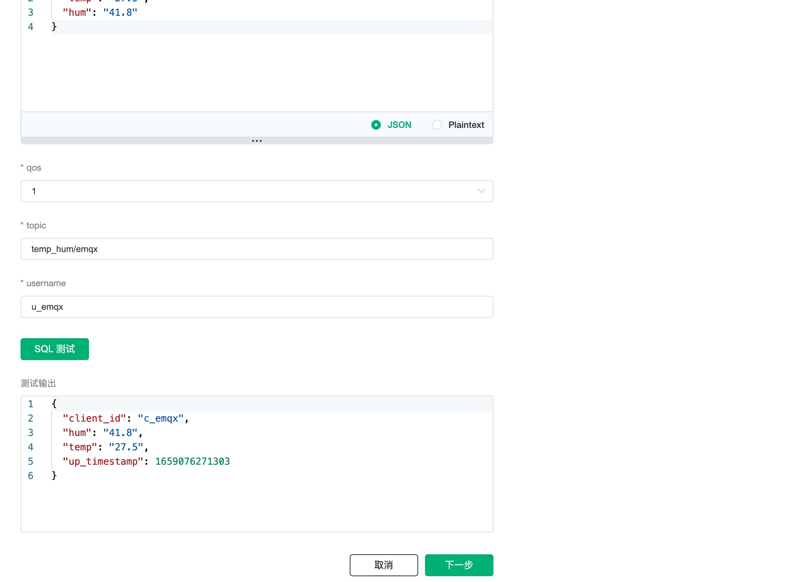

# 集成 AWS RDS MySQL

::: warning
该功能在基础版中不可用
:::

在本文中我们将模拟温湿度数据并通过 MQTT 协议上报到 EMQX Cloud，然后使用 EMQX Cloud 数据集成将数据转存到 [AWS RDS](https://docs.amazonaws.cn/AmazonRDS/latest/UserGuide/Welcome.html) MySQL。

在开始之前，您需要完成以下操作：

- 已经在 EMQX Cloud 上创建部署(EMQX 集群)。
- 对于专业版部署用户：请先完成 [对等连接的创建](../deployments/vpc_peering.md)，下文提到的 IP 均指资源的内网 IP。(专业版部署若开通 [NAT 网关](../vas/nat-gateway.md)也可使用公网 IP 进行连接）
<!-- - 对于 BYOC 部署用户：推荐您在 AWS 平台部署 EMQX 集群，并对 BYOC 部署所在 VPC 与资源所在 VPC 建立对等连接，下文提到的 IP 均指资源的内网 IP。如需通过公网访问资源，请在您的公有云控制台中为 BYOC 部署所在 VPC 配置 NAT 网关，使用资源的公网 IP 进行连接。 -->


## 创建 AWS RDS MySQL

如果您是初次接触 AWS RDS MySQL，建议您跟随 AWS RDS MySQL [快速入门](https://docs.amazonaws.cn/AmazonRDS/latest/UserGuide/CHAP_GettingStarted.CreatingConnecting.MySQL.html)进行创建。

为了方便测试，这里我们选择的配置如下：

- 创建方法：标准创建
- 引擎类型：MySQL 8.0.28
- 存储类型：通用型 SSD (gp2)
- 模板：开发/测试
- 实例类：可突增类（包括 t 类）
- 规格：db.t3.samll 2 核 2G
- 网络类型：IPv4

> 需要特别注意的是：网络类型一定要选 IPv4，并选择与 EMQX Cloud 建立了对等连接的 VPC，在创建好 VPC 之后需要将 EMQX Cloud 的网段加入到路由表中。


## RDS MySQL 配置

1. 连接到实例，创建数据库。

   ```bash
   ## 使用 mysql client 连接到 AWS RDS MySQL 
   mysql -h <endpoint> -P 3306 -u <myuser> -p
   
   ## 创建数据库
   CREATE DATABASE emqx;
   USE emqx;
   ```

2. 温湿度表创建

   使用以下 SQL 语句将创建 `temp_hum` 表，该表将用于存放设备上报的温度和湿度数据。

   ```sql
   CREATE TABLE `temp_hum` (
     `id` int(11) unsigned NOT NULL AUTO_INCREMENT,
     `up_timestamp` timestamp NULL DEFAULT NULL,
     `client_id` varchar(32) DEFAULT NULL,
     `temp` float unsigned DEFAULT NULL,
     `hum` float unsigned DEFAULT NULL,
     PRIMARY KEY (`id`),
     KEY `up_timestamp_client_id` (`up_timestamp`,`client_id`)
   ) ENGINE=InnoDB AUTO_INCREMENT=26 DEFAULT CHARSET=utf8mb4;
   ```

3. 插入测试数据，并查看数据

   ```sql
   INSERT INTO temp_hum(up_timestamp, client_id, temp, hum) VALUES (FROM_UNIXTIME(1603963414), 'temp_hum-001', 19.1, 55);
   
   SELECT * FROM temp_hum;
   ```

## 数据集成配置

1. 创建 MySQL 资源

   点击左侧菜单栏`数据集成`，在数据持久化下找到 MySQL。

   

   新建资源，填入刚才创建好的 MySQL 数据库信息，点击测试，如果出现错误应及时检查数据库配置是否正确。

   

   其中, `服务器地圵`可以在下图的位置找到：

   

2. 创建规则

   资源创建后点击新建规则，然后输入如下规则匹配 SQL 语句。在下面规则中我们从 `temp_hum/emqx` 主题读取消息上报时间 `up_timestamp`、客户端 ID、消息体(payload)，并从消息体中分别读取温度和湿度。

   ```sql
   SELECT
   timestamp as up_timestamp, clientid as client_id, payload.temp as temp, payload.hum as hum
   FROM
   "temp_hum/emqx"
   ```

   

   我们可以使用 `SQL 测试` 来测试查看结果

   

3. 添加响应动作

   点击下一步来到动作界面，选择第一步创建好的资源，动作类型选择`数据持久化 - 保存数据到 MySQL`，并输入以下数据插入 SQL 模板，点击确认。

   ```sql
   insert into temp_hum(up_timestamp, client_id, temp, hum) values (FROM_UNIXTIME(${up_timestamp}/1000), ${client_id}, ${temp}, ${hum})
   ```

   

4. 查看资源详情

   动作创建完以后，返回列表点击资源可以查看资源详情和监控详情

   

5. 查看规则详情

   规则详情界面点击规则可以查看规则和响应动作

   

## 测试

1. 使用 [MQTTX](https://mqttx.app/) 模拟温湿度数据上报

   需要将 broker.emqx.io 替换成已创建的部署连接地址，并添加客户端认证信息。

    - topic: `temp_hum/emqx`
    - payload:

      ```json
      {
        "temp": "27.5",
        "hum": "41.8"
      }
      ```

   

2. 查看数据转存结果

   ```sql
   select * from temp_hum order by up_timestamp desc limit 10;
   ```

   
