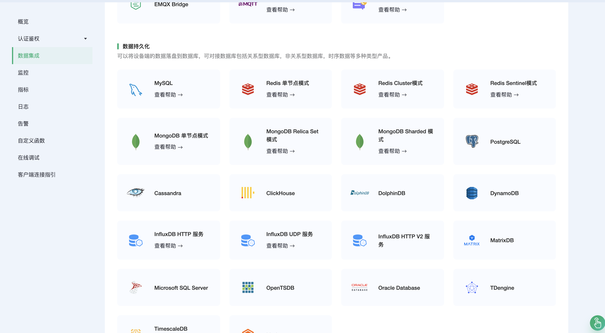
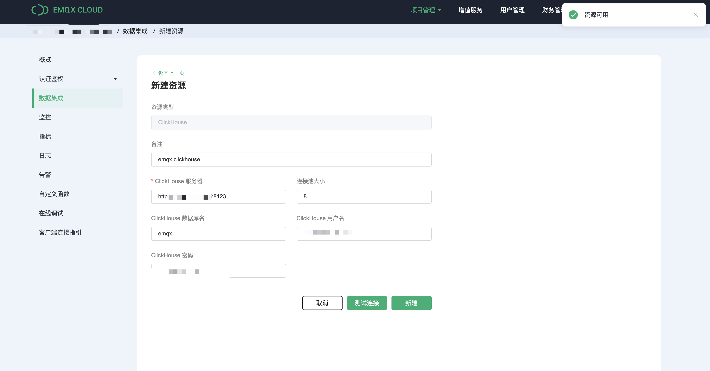
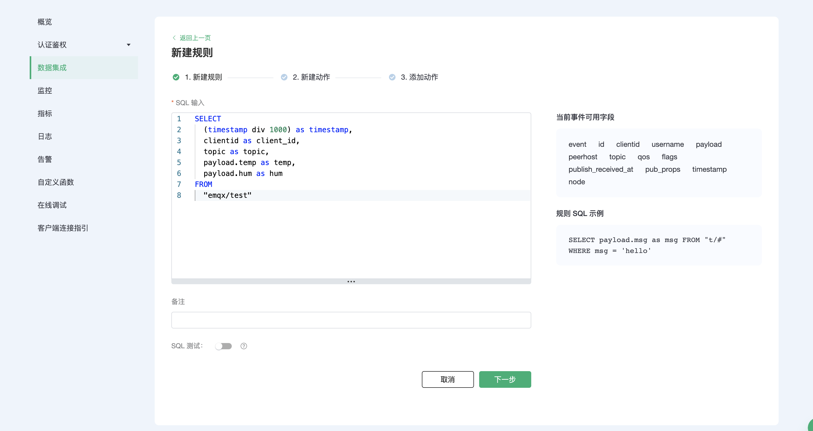
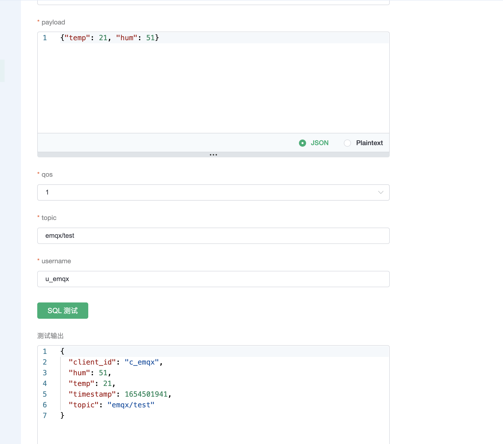
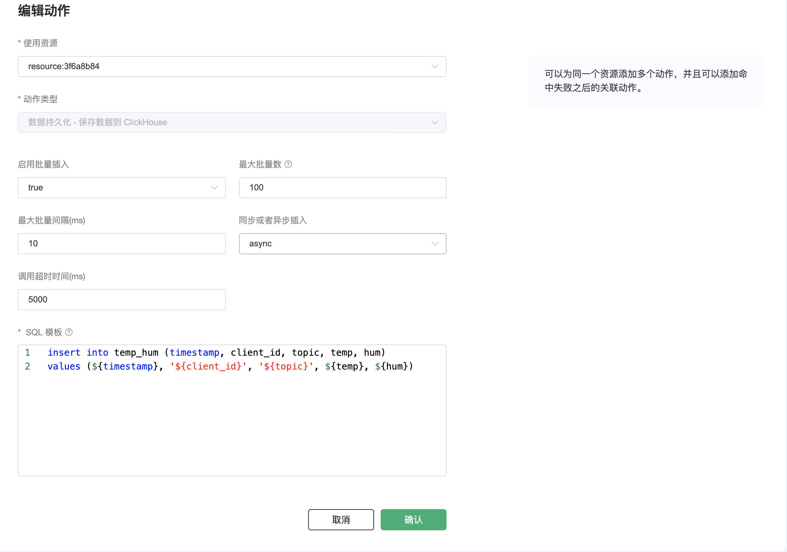
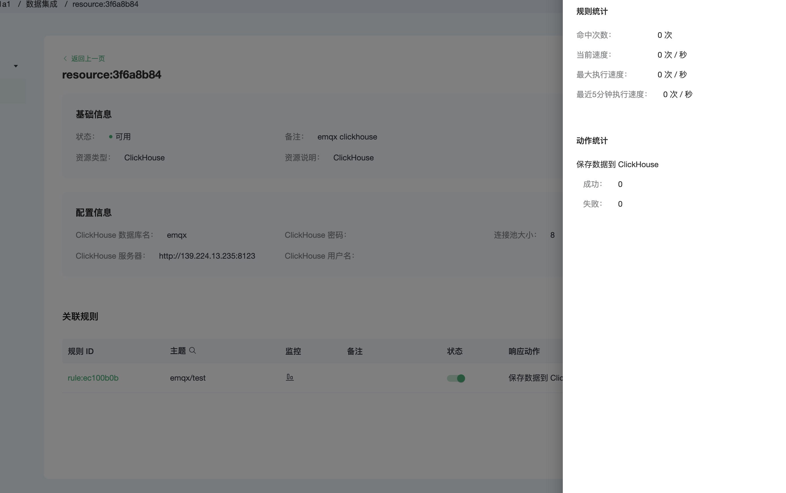
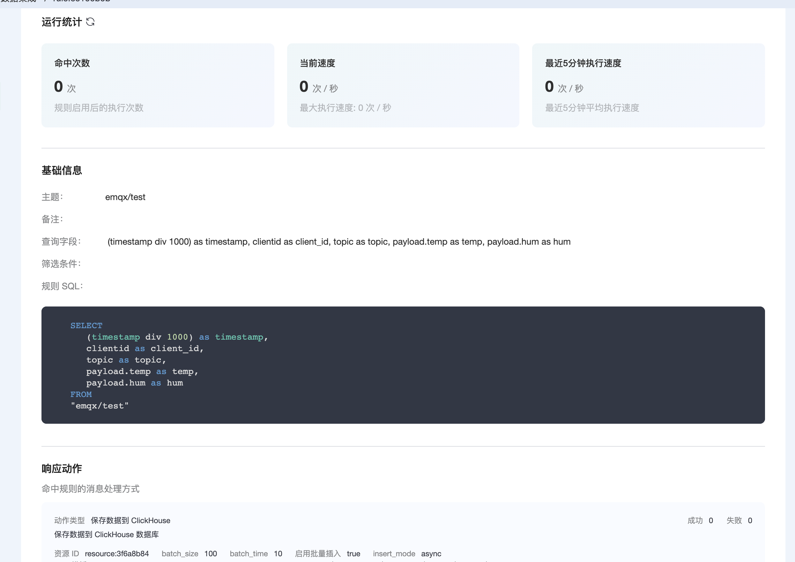
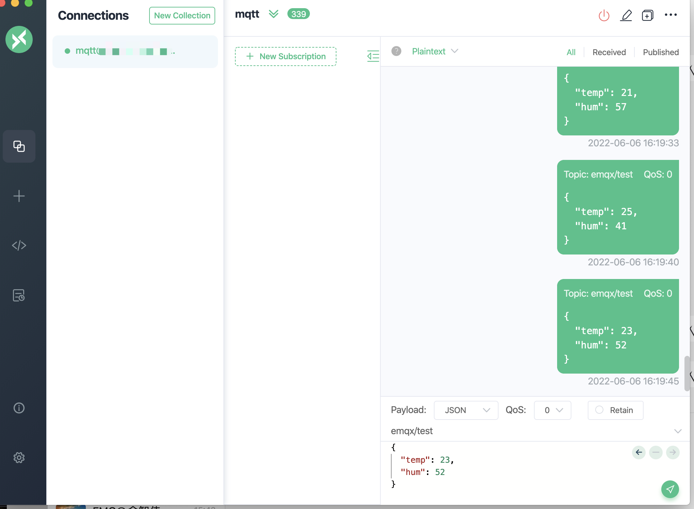
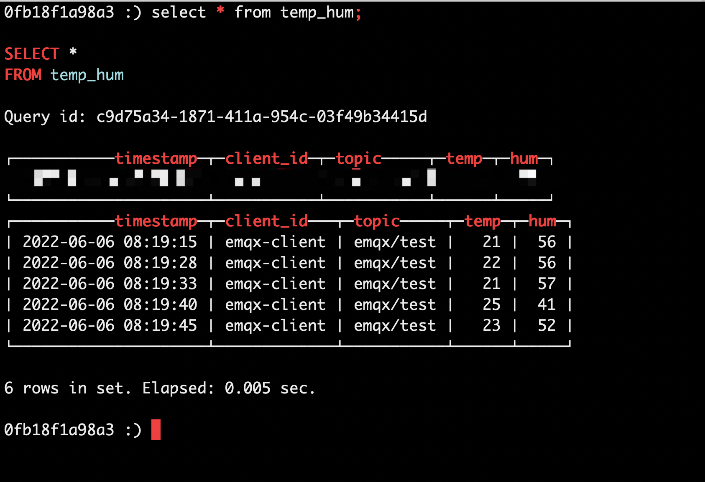

# EMQX Cloud 数据集成保存数据到 ClickHouse

::: danger
该功能在基础版中不可用
:::

[ClickHouse](https://clickhouse.com/docs/zh/) 是一个用于数据分析（OLAP）的列式数据库管理系统（column-oriented DBMS），由俄罗斯搜索巨头 Yandex 公司开源。目前国内不少大厂在使用，包括腾讯、今日头条、携程、快手、虎牙等，集群规模多达数千节点。

在本文中我们将使用 MQTTX 模拟温湿度数据并通过 MQTT 协议上报到 EMQX Cloud，然后使用 EMQX Cloud 数据集成将数据转存到 ClickHouse。

在开始之前，您需要完成以下操作：

* 已经在 EMQX Cloud 上创建部署(EMQX 集群)。
* 对于专业版部署用户：请先完成 [对等连接的创建](../deployments/vpc_peering.md)，下文提到的 IP 均指资源的内网 IP。(专业版部署若开通 [NAT 网关](../vas/nat-gateway.md)也可使用公网 IP 进行连接）

## ClickHouse 配置

1. ClickHouse 安装

   ```bash
   # server
   docker run -d --name clickhouse-server -p 9000:9000 -p 8123:8123 --ulimit nofile=262144:262144 -v=/opt/clickhouse:/var/lib/clickhouse yandex/clickhouse-server
   ```

2. 数据库创建

   ```bash
   # client 运行
   docker run -it --rm --link clickhouse-server:clickhouse-server yandex/clickhouse-client --host clickhouse-server
   
   create database emqx;
   use emqx;
   ```

3. 数据表创建

   使用以下 SQL 语句将创建 `temp_hum` 表，该表将用于存放设备上报的温湿度数据。

   ```sql
   CREATE TABLE temp_hum (timestamp DateTime, client_id String, topic String, temp Float32, hum Float32) ENGINE = MergeTree() PARTITION BY toYYYYMM(timestamp) ORDER BY (timestamp);
   ```

## EMQX Cloud 数据集成配置

1. 创建资源

   点击左侧菜单栏`数据集成`，在数据持久化下找到 ClickHouse，点击新建资源。

   

   填入刚才创建好的 ClickHouse 数据库信息，并点击测试，如果出现错误应及时检查数据库配置是否正确。

   

2. 创建规则

   资源创建后点击新建规则，然后输入如下规则匹配 SQL 语句。在下面规则中我们从 `t/#` 主题读取消息上报的数据。

   ```sql
   SELECT
      (timestamp div 1000) as timestamp,
      clientid as client_id,
      topic as topic,
      payload.temp as temp,
      payload.hum as hum
   FROM
   "emqx/test"
   ```

   我们可以使用 `SQL 测试` 来测试查看结果

   
   

3. 添加响应动作

   点击下一步来到动作界面，选择第一步创建好的资源，动作类型选择`数据持久化 - 保存数据到 ClickHouse`，并输入以下数据插入 SQL 模板，点击确认。

   ```sql
   insert into temp_hum (timestamp, client_id, topic, temp, hum) values (${timestamp}, '${client_id}', '${topic}', ${temp}, ${hum})
   ```

   

4. 查看资源详情

   动作创建完以后，返回列表点击资源可以查看详情

   

5. 查看规则详情

   资源详情界面点击规则可以查看规则监控信息和规则详情

   

## 测试

1. 使用 [MQTT X](https://mqttx.app/) 模拟数据上报

   需要将 broker.emqx.io 替换成已创建的部署[连接地址](../deployments/view_deployment.md)，并添加[客户端认证信息](../deployments/auth.md)。
    * topic: `emqx/test`
    * payload:

      ```json
      {
      "temp": 23,
      "hum": 52
      }
      ```

   

2. 查看数据转存结果

   ```sql
   # client 运行
   docker run -it --rm --link clickhouse-server:clickhouse-server yandex/clickhouse-client --host clickhouse-server
   
   select * from temp_hum;
   ```
   
