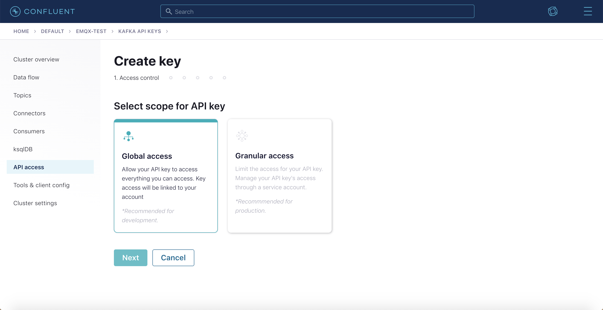
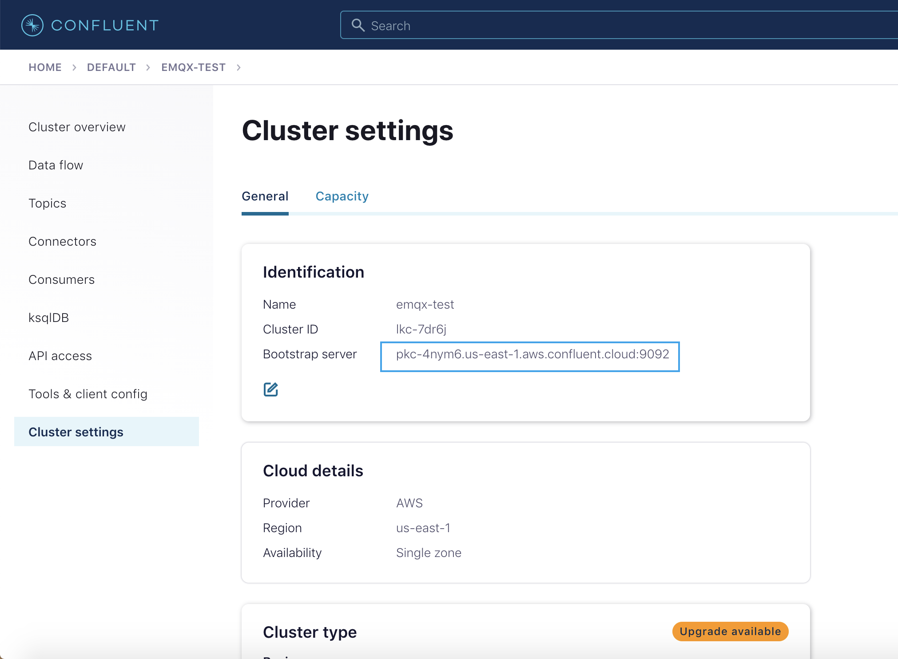

# 使用 EMQ X Cloud 规则引擎桥接数据到 Confluent Cloud

在本文中我们将模拟温湿度数据并通过 MQTT 协议上报到 EMQ X Cloud，然后使用 EMQ X Cloud 规则引擎将数据转存到 Confluent Cloud。

在开始之前，您需要完成以下操作：
* 已经在 EMQ X Cloud 上创建部署(EMQ X 集群)。
* 对于独享部署用户：需要打开 NAT 服务。
* 对于免费试用及共享部署用户：无需完成对等连接，下文提到的 IP 均指资源的公网 IP。

## Confluent Cloud 配置
1. 创建 Confulent Cloud 部署
   创建 Confulent Basic 或 Standard Cluster
   

2. 在 Confluent Cloud 创建主题
   登录 Confluent Cloud Cluster 控制台，点击的 `Topics -> Add a topic`，创建 `emqx` 主题
   

3. 创建 Confluent Cloud API Key
   在控制台，点击 `API Access -> Add key`, 创建 `Global access` 类型的 API Key, 记录下 API 密钥对。
   

4. 获取 Kafka 服务地址
   点击 `Cluster settings -> General`，在 `Identification -> Bootstrap server` 获取 kafka 服务地址。
   

## EMQ X Cloud 规则引擎配置

1. 资源创建

   点击左侧菜单栏`规则引擎`，找到资源面板，点击新建资源，下拉选择 Kafka 资源类型。
   依次填写：Kafka 服务器、Kafka 用户名（Confluent Cloud API Key）、Kafka 密码（Confluent Cloud API Secret），以及开启 SSL。
   最后，点击测试如果出现错误应及时检查数据库配置是否正确。
   

2. 规则测试
   点击左侧左侧菜单栏`规则引擎`，找到规则面板，点击创建，然后输入如下规则匹配 SQL 语句。在下面规则中我们从 `temp_hum/emqx` 主题读取消息上报时间 `up_timestamp`、客户端 ID、消息体(Payload)，并从消息体中分别读取温度和湿度。

   ```sql
   SELECT

   timestamp as up_timestamp, clientid as client_id, payload.temp as temp, payload.hum as hum

   FROM

   "temp_hum/emqx"
   ```
   

3. 添加响应动作
   点击左下角添加动作，下拉选择 → 数据转发 → 桥接数据到 Kafka，选择第一步创建好的资源，并填写以下数据：

   Kafka 主题：emqx
   消息内容模板:
   ```
   {"up_timestamp": ${up_timestamp}, "client_id": ${client_id}, "temp": ${temp}, "hum": ${hum}}
   ```
   

4. 点击创建规则，并返回规则列表
   

5. 查看规则监控
   

## 测试

1. 使用 [MQTT X](https://mqttx.app/) 模拟温湿度数据上报

   需要将 broker.emqx.io 替换成已创建的部署[连接地址](../deployments/view_deployment.md)
   

2. 使用 Confluent Cloud 提供的 CLI 工具查看转存消息
   
