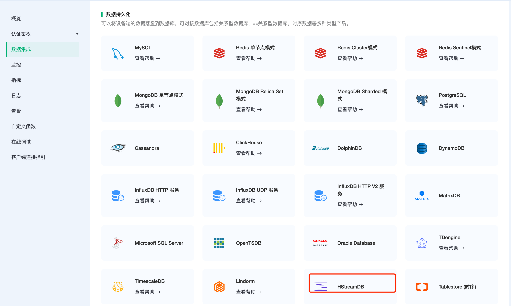
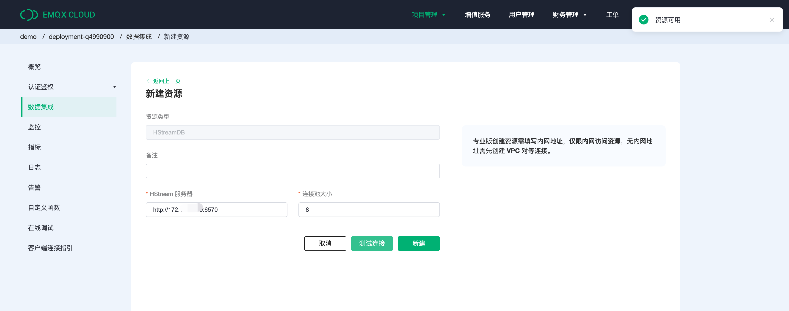
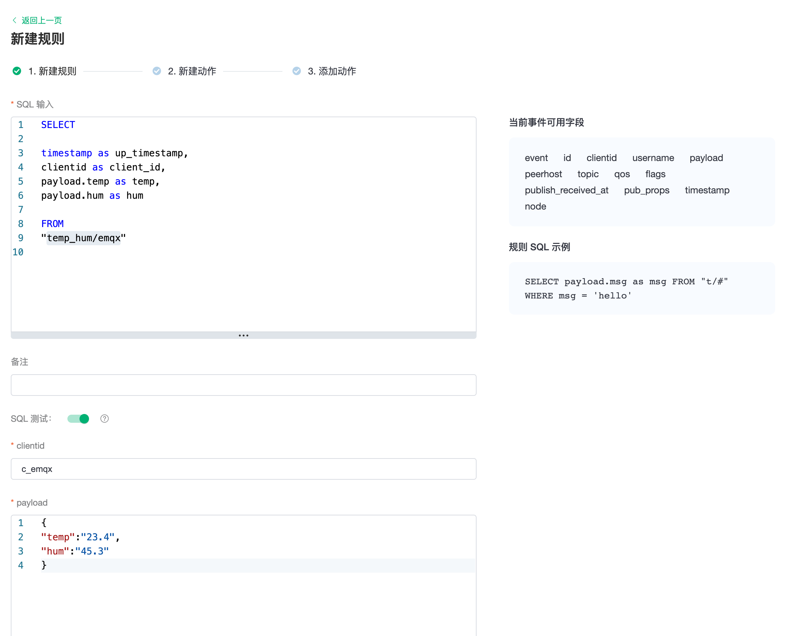
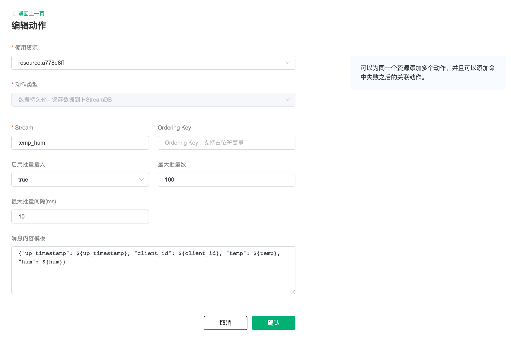
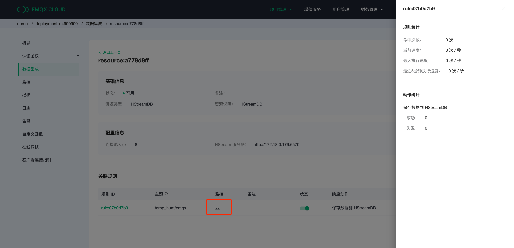
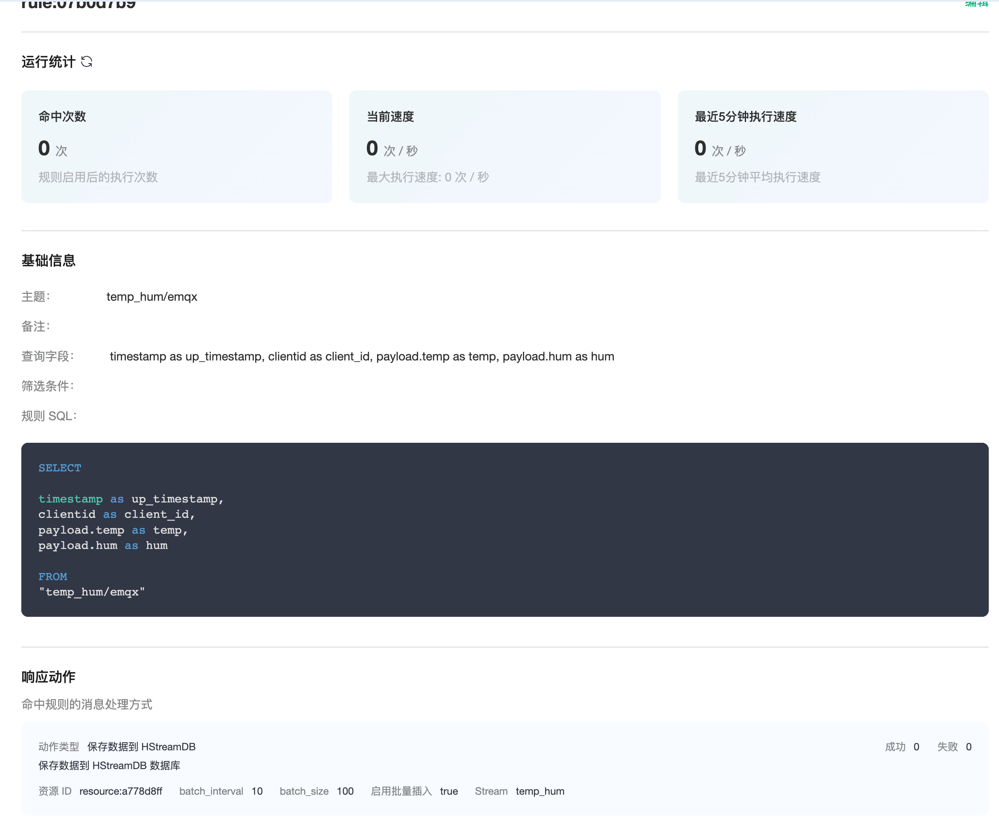

# EMQX Cloud 数据集成保存数据到 HStreamDB

::: warning
该功能在基础版中不可用
:::

[HStreamDB](https://www.emqx.com/zh/products/hstreamdb) 是一款专为流式数据设计的， 针对大规模实时数据流的接入、存储、处理、 分发等环节进行全生命周期管理的流数据库。它使用标准 SQL (及其流式拓展）作为主要接口语言，以实时性作为主要特征，旨在简化数据流的运维管理以及实时应用的开发。

在本文中我们将模拟温湿度数据并通过 MQTT 协议上报到 EMQX Cloud，然后使用 EMQX Cloud 数据集成将数据转存到 HStreamDB。

在开始之前，您需要完成以下操作：

* 已经在 EMQX Cloud 上创建部署(EMQX 集群)。
* 对于专业版部署用户：请先完成 [对等连接的创建](../deployments/vpc_peering.md)，下文提到的 IP 均指资源的内网 IP。(专业版部署若开通 [NAT 网关](../vas/nat-gateway.md)也可使用公网 IP 进行连接）

## HStreamDB 配置

1. HStreamDB 部署

   > 详细步骤可参考 [HStreamDB 帮助文档](https://hstream.io/docs/zh/latest/start/quickstart-with-docker.html)，

   创建一个 quick-start.yaml

   ```bash
   ## quick-start.yaml

   version: "3.5"

   services:
   hserver0:
      image: hstreamdb/hstream:v0.8.0
      depends_on:
         - zookeeper
         - hstore
      ports:
         - "6570:6570"
      expose:
         - 6570
      networks:
         - hstream-network
      volumes:
         - data_store:/data/store
      command:
         - bash
         - "-c"
         - |
         set -e
         /usr/local/script/wait-for-storage.sh hstore 6440 zookeeper 2181 600 \
         /usr/local/bin/hstream-server \
         --host 0.0.0.0 --port 6570 \
         --internal-port 6571 \
         --server-id 100 \
         --address < 服务器 ip >  \
         --zkuri zookeeper:2181 \
         --store-config /data/store/logdevice.conf \
         --store-admin-host hstore --store-admin-port 6440

   hserver1:
      image: hstreamdb/hstream:v0.8.0
      depends_on:
         - zookeeper
         - hstore
      ports:
         - "6572:6572"
      expose:
         - 6572
      networks:
         - hstream-network
      volumes:
            - data_store:/data/store
      command:
         - bash
         - "-c"
         - |
         set -e
         /usr/local/script/wait-for-storage.sh hstore 6440 zookeeper 2181 600 \
         /usr/local/bin/hstream-server \
         --host 0.0.0.0 --port 6572 \
         --internal-port 6573 \
         --server-id 101 \
         --address < 服务器 ip > \
         --zkuri zookeeper:2181 \
         --store-config /data/store/logdevice.conf \
         --store-admin-host hstore --store-admin-port 6440

   hstream-http-server:
      image: hstreamdb/hstream:v0.8.0
      depends_on:
         - hserver0
         - hserver1
      ports:
         - "6580:6580"
      expose:
         - 6580
      networks:
         - hstream-network
      command:
         - bash
         - "-c"
         - |
         set -e
         /usr/local/bin/hstream-http-server \
            -gRPCServerHost hserver \
            -httpServerPort 6580 \
            -gRPCServerPort 6570

   hstore:
      image: hstreamdb/hstream:v0.8.0
      networks:
         - hstream-network
      volumes:
         - data_store:/data/store
      command:
         - bash
         - "-c"
         - |
         set -ex
         /usr/local/bin/ld-dev-cluster --root /data/store \
         --use-tcp --tcp-host $$(hostname -I | awk '{print $$1}') \
         --user-admin-port 6440 \
         --no-interactive

   zookeeper:
      image: zookeeper
      expose:
         - 2181
      networks:
         - hstream-network
      volumes:
         - data_zk_data:/data
         - data_zk_datalog:/datalog

   networks:
   hstream-network:
      name: hstream-network

   volumes:
   data_store:
      name: quickstart_data_store
   data_zk_data:
      name: quickstart_data_zk_data
   data_zk_datalog:
      name: quickstart_data_zk_datalog
   ```

   启动 HStreamDB 服务

   ```bash
   # 在同一个文件夹中启动
   docker-compose -f quick-start.yaml up

   # 后台启动
   docker-compose -f quick-start.yaml up -d
   ```

2. 启动 HStreamDB 的 SQL 命令行界面

   使用如下命令创建出 hstream-client :

   ```bash
   docker run -it --rm --name some-hstream-cli --network host hstreamdb/hstream:v0.8.0 hstream-client --port 6570 --client-id 1
   ```

   进入控制台：

    ```bash
            __  _________________  _________    __  ___
      / / / / ___/_  __/ __ \/ ____/   |  /  |/  /
      / /_/ /\__ \ / / / /_/ / __/ / /| | / /|_/ /
      / __  /___/ // / / _, _/ /___/ ___ |/ /  / /
   /_/ /_//____//_/ /_/ |_/_____/_/  |_/_/  /_/


   Command
   :h                           To show these help info
   :q                           To exit command line interface
   :help [sql_operation]        To show full usage of sql statement
   ```

3. Stream 创建

   ```bash
   > CREATE STREAM temp_hum;
   temp_hum
   > SHOW STREAMS;
   temp_hum
   ```

## EMQX Cloud 数据集成配置

1. 创建资源

   点击左侧菜单栏`数据集成`，在数据持久化下找到 HStreamDB，点击新建资源。

   

   填入刚才创建好的 HStreamDB 数据库信息，并点击测试，如果出现错误应及时检查数据库配置是否正确。

   

2. 创建规则

   资源创建后点击新建规则，然后输入如下规则匹配 SQL 语句。在下面规则中我们从 `temp_hum/emqx` 主题读取消息上报时间 `up_timestamp`、客户端 ID、消息体(Payload)，并从消息体中分别读取温度和湿度。

   ```sql
   SELECT

   timestamp as up_timestamp, 
   clientid as client_id, 
   payload.temp as temp, 
   payload.hum as hum

   FROM
   "temp_hum/emqx"  
   ```

   我们可以使用 `SQL 测试` 来测试查看结果

   
   

3. 添加响应动作

   点击下一步来到动作界面，选择第一步创建好的资源，动作类型选择`数据持久化 - 保存数据到 HStreamDB`，输入参数，参数定义见下表：

   | 参数名           | 定义                         | 类型    |
   | ---------------- | ---------------------------- | ------- |
   | Stream           | Stream 名称，不可使用变量    | String  |
   | Ordering Key     | 分区键，可使用变量           | String  |
   | 启用批量插入     | 开启或关闭批量写入，默认开启 | Boolean |
   | 最大批量数       | 批量最大消息条目数量         | Integer |
   | 最大批量间隔(ms) | 批量最大间隔，单位毫秒       | Integer |
   | 消息内容模板     | 写入的消息报文内容           | Binary  |

   插入消息内容模板，点击确认。

   ```sql
   {"up_timestamp": ${up_timestamp}, "client_id": ${client_id}, "temp": ${temp}, "hum": ${hum}} 
   ```

   

4. 查看资源详情

   动作创建完以后，返回列表点击资源可以查看资源详情和规则监控信息。

   

5. 查看规则详情

   规则详情界面点击规则可以查看规则和动作详情。

   

## 测试

1. 使用 [MQTT X](https://mqttx.app/) 模拟温湿度数据上报

   需要将 broker.emqx.io 替换成已创建的部署[连接地址](../deployments/view_deployment.md)，并添加[客户端认证信息](../deployments/auth.md)。

    * topic: `temp_hum/emqx`
    * payload:

      ```json
      {
         "temp": "36.4",
         "hum": "23.5"
      }
      ```

   

2. 查看数据转存结果

   这时数据已经写入 HStreamDB，您可以使用任意消费方式，将消息消费出来。
   本示例中使用的是基于 HStream golang SDK 的消费工具 [fetcher](https://github.com/hstreamdb/fetcher)，消费结果如下：

   ```sql
   ./fetcher -s f1 -n temp_hum -p <服务器ip>:6570 -c cons1 -v
   ```

   
