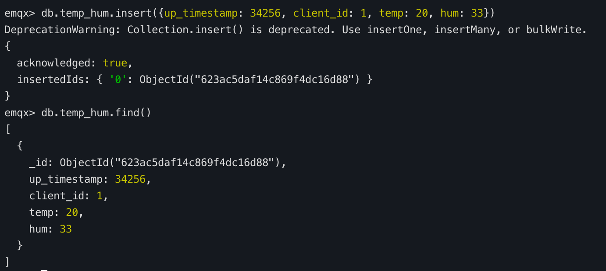
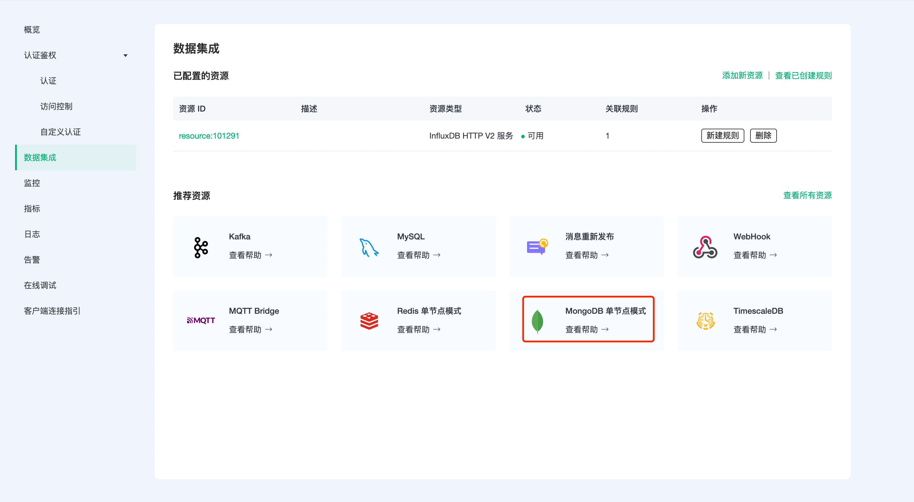
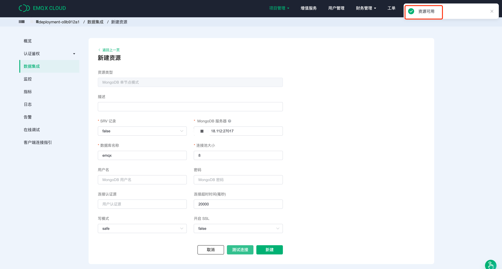
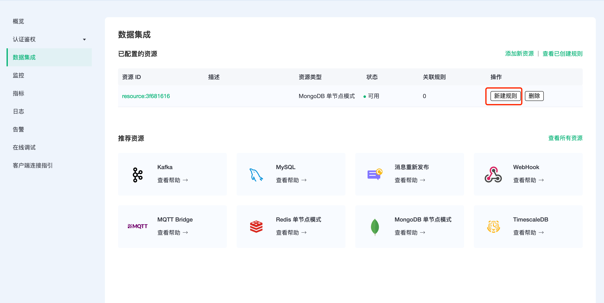
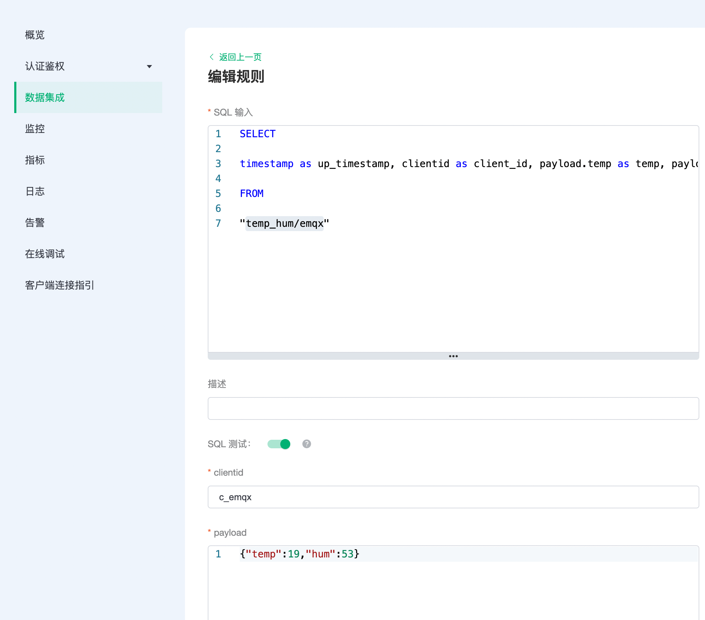
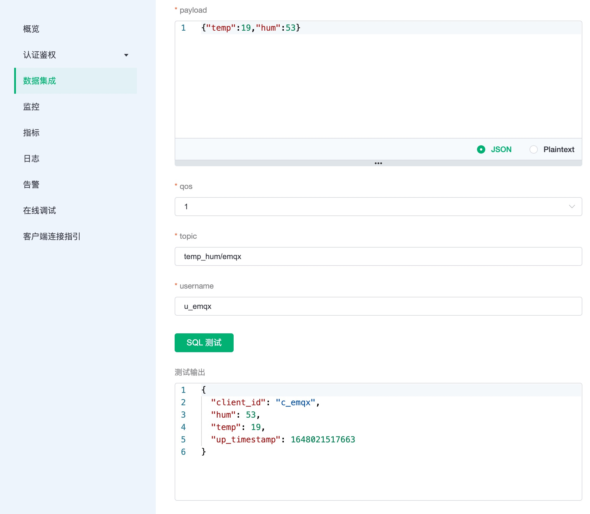
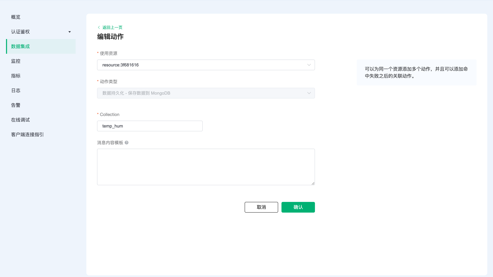

# 集成 MongoDB

::: warning
该功能在基础版中不可用
:::

在本文中我们将模拟温湿度数据并通过 MQTT 协议上报到 EMQX Cloud，然后使用 EMQX Cloud 数据集成将数据转存到 MongoDB。

在开始之前，您需要完成以下操作：

* 已经在 EMQX Cloud 上创建部署(EMQX 集群)
* 对于专业版部署用户：请先完成 [对等连接的创建](../deployments/vpc_peering.md)，下文提到的 IP 均指资源的内网 IP（专业版部署若开通 NAT 网关也可使用公网 IP 进行连接）
* 对于 BYOC 部署用户：请首先为 BYOC 部署所在的 VPC 与资源所在的 VPC 之间建立对等连接。注：下文提到的 IP 均指资源的内网 IP。如需通过公网地址访问资源，请首先在您的公有云控制台中为 BYOC 部署所在 VPC 配置 NAT 网关。

## 1. 创建 MongoDB 服务

在你的云服务器中，创建一个 MongoDB 服务。为了方便演示，这里使用 Docker 快速搭建。

1. 运行 MongoDB 容器

   ```bash
   # EMQX 目前支持到 MongoDB 5.x 的驱动，暂不支持 6.x
   docker run --name mongo -d -p 27017:27017 mongo:5.0 
   ```

2. 进入容器

   ```bash
   docker exec -it mongo mongosh emqx
   ```

3. 将数据插入 temp_hum 集合并查看结果

   ```bash
   db.temp_hum.insert({up_timestamp: 34256, client_id: 1, temp: 20, hum: 33})
   db.temp_hum.find()
   ```

   

## 2. 创建 MongoDB 单节点模式资源

进入 [EMQX Cloud 控制台](https://cloud.emqx.com/console/)，并点击进入要使用 MongoDB 的部署。

在部署页面，选择数据集成，点击数据持久化下的 MongoDB 单节点模式资源进行创建。



在创建资源页面里，按照如下设置：

* MongoDB 服务器：填写服务器的 IP 地址以及端口



完成配置后点击测试连接，提示资源可用后便可点击新建来创建资源。

## 3. 创建规则

成功创建资源后可直接点击对话框中的创建规则或者回到数据集成界面，找到刚创建的资源点击操作下的新建规则。



我们的目标是：客户端将温湿度消息发送到 temp_hum/emqx 主题时，就会触发引擎。这里需要对 SQL 进行一定的处理：
* 仅针对 'temp_hum/emqx'

根据上面的原则，我们最后得到的 SQL 应该如下：
```sql
SELECT
  
timestamp as up_timestamp, clientid as client_id, payload.temp as temp, payload.hum as hum 
  
FROM
  
"temp_hum/emqx"

```




## 4. 新建动作

完成规则配置后点击下一步，便可配置和新建动作。在动作中我们从 `temp_hum/emqx` 主题读取消息上报时间 `up_timestamp`、客户端 ID、温湿度消息储存到 MongoDB 中.



完成动作创建后可继续添加一个动作或者完成创建回到数据集成界面。

## 5. 测试

1. 使用 [MQTT X](https://mqttx.app/) 模拟温湿度数据上报

   需要将 broker.emqx.io 替换成已创建的部署连接地址，并添加客户端认证信息。

   

2. 查看数据转存结果

   ```bash
   db.temp_hum.find({})
   ```
   
