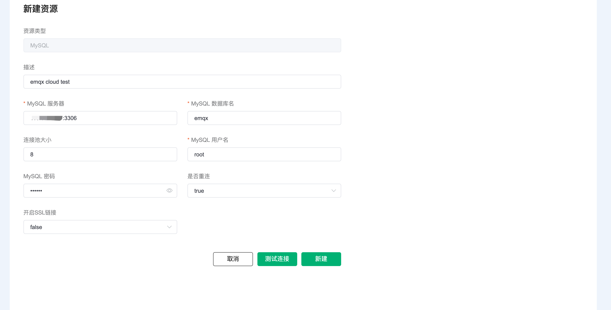

# 集成 MySQL

::: warning
该功能在基础版中不可用
:::

在本文中我们将模拟温湿度数据并通过 MQTT 协议上报到 EMQX Cloud，然后使用 EMQX Cloud 数据集成将数据转存到 MySQL。

在开始之前，您需要完成以下操作：

* 已经在 EMQX Cloud 上创建部署(EMQX 集群)。
* 对于专业版部署用户：请先完成 [对等连接的创建](../deployments/vpc_peering.md)，下文提到的 IP 均指资源的内网 IP。(专业版部署若开通 [NAT 网关](../vas/nat-gateway.md)也可使用公网 IP 进行连接）
* 对于 BYOC 部署用户：请首先为 BYOC 部署所在的 VPC 与资源所在的 VPC 之间建立对等连接。注：下文提到的 IP 均指资源的内网 IP。如需通过公网地址访问资源，请首先在您的公有云控制台中为 BYOC 部署所在 VPC 配置 NAT 网关。

您可以查看[视频教程](https://player.bilibili.com/player.html?aid=726385460&bvid=BV1BS4y1h732&cid=716531047&page=1)进一步了解。

## MySQL 配置

1. MySQL 安装

   ```bash
   docker run -d --restart=always \
     --name mysql \
     -p 3306:3306 \
     -e MYSQL_ROOT_PASSWORD=public \
     mysql/mysql-server:5.7
   ```

2. 数据库创建

   ```bash
   docker exec -it mysql mysql -uroot -ppublic
   CREATE DATABASE emqx;
   USE emqx;
   ```


3. 温湿度表创建

   使用以下 SQL 语句将创建 `temp_hum` 表，该表将用于存放设备上报的温度和湿度数据。

   ```sql
   CREATE TABLE `temp_hum` (
     `id` int(11) unsigned NOT NULL AUTO_INCREMENT,
     `up_timestamp` timestamp NULL DEFAULT NULL,
     `client_id` varchar(32) DEFAULT NULL,
     `temp` float unsigned DEFAULT NULL,
     `hum` float unsigned DEFAULT NULL,
     PRIMARY KEY (`id`),
     KEY `up_timestamp_client_id` (`up_timestamp`,`client_id`)
   ) ENGINE=InnoDB AUTO_INCREMENT=26 DEFAULT CHARSET=utf8mb4;
   ```

4. 设置允许 EMQX 集群 IP 段访问数据库(可选)

   - 专业版部署，可前往部署详情 → 查看对等连接信息，获取部署 VPC 网段。
   - BYOC 部署，可在公有云控制台中查看对等连接信息，获取部署 VPC 网段。

   ```sql
   # 专业版 / BYOC
   GRANT ALL PRIVILEGES ON *.* TO root@'10.11.30.%' IDENTIFIED BY 'public' WITH GRANT OPTION;
   
   # 基础版
   GRANT ALL PRIVILEGES ON *.* TO root@'%' IDENTIFIED BY 'public' WITH GRANT OPTION;
   ```

5. 插入测试数据，并查看数据

   ```sql
   INSERT INTO temp_hum(up_timestamp, client_id, temp, hum) VALUES (FROM_UNIXTIME(1603963414), 'temp_hum-001', 19.1, 55);
   
   SELECT * FROM temp_hum;
   ```

## EMQX Cloud 数据集成配置

1. 创建资源

   点击左侧菜单栏`数据集成`，在数据持久化下找到 MySQL，点击新建资源。

   

   填入刚才创建好的 MySQL 数据库信息，并点击测试，如果出现错误应及时检查数据库配置是否正确。

   

2. 创建规则

   资源创建后点击新建规则，然后输入如下规则匹配 SQL 语句。在下面规则中我们从 `temp_hum/emqx` 主题读取消息上报时间 `up_timestamp`、客户端 ID、消息体(Payload)，并从消息体中分别读取温度和湿度。

   ```sql
   SELECT
   timestamp as up_timestamp, clientid as client_id, payload.temp as temp, payload.hum as hum
   FROM
   "temp_hum/emqx"  
   ```
   我们可以使用 `SQL 测试` 来测试查看结果

   

3. 添加响应动作

   点击下一步来到动作界面，选择第一步创建好的资源，动作类型选择`数据持久化 - 保存数据到 MySQL`，并输入以下数据插入 SQL 模板，点击确认。

   ```sql
   insert into temp_hum(up_timestamp, client_id, temp, hum) values (FROM_UNIXTIME(${up_timestamp}/1000), ${client_id}, ${temp}, ${hum}) 
   ```
   

4. 查看资源详情

   动作创建完以后，返回列表点击资源可以查看详情

   


5. 查看规则详情

   资源详情界面点击规则可以查看规则监控信息和规则详情

   

## 测试

1. 使用 [MQTT X](https://mqttx.app/) 模拟温湿度数据上报

   需要将 broker.emqx.io 替换成已创建的部署连接地址，并添加客户端认证信息。
    - topic: `temp_hum/emqx`
    - payload:
      ```json
      {
         "temp": "20.1",
         "hum": "57"
      }
      ```

   

2. 查看数据转存结果

   ```sql
   select * from temp_hum order by up_timestamp desc limit 10;
   ```
   
