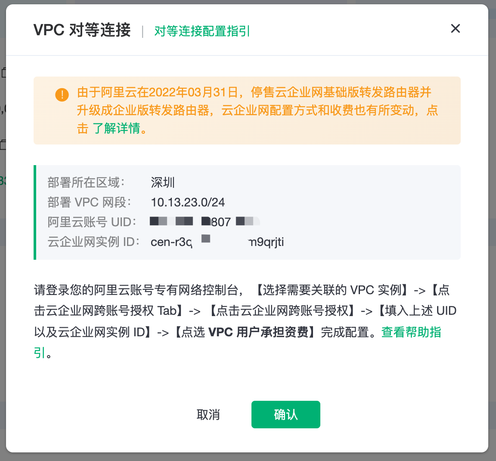
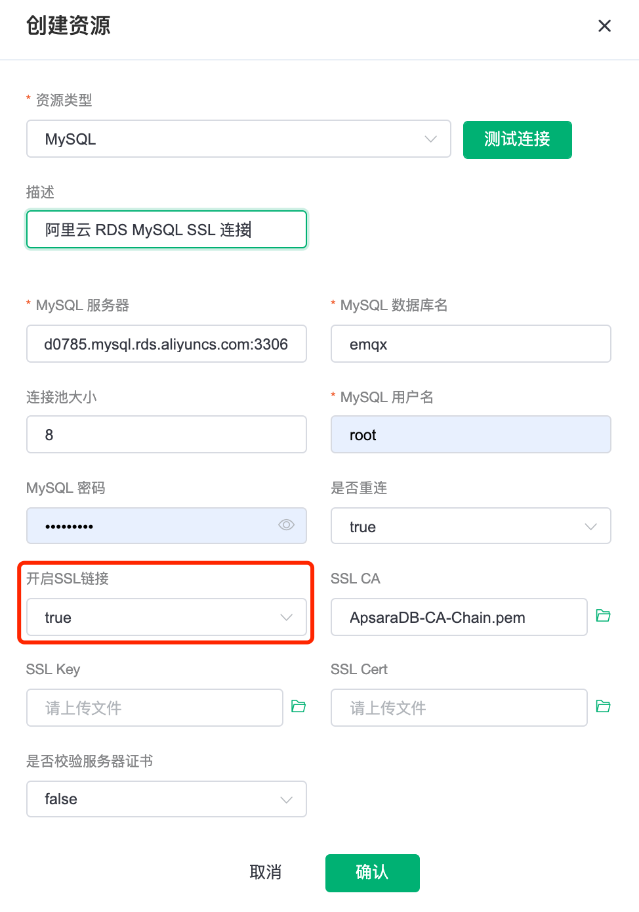
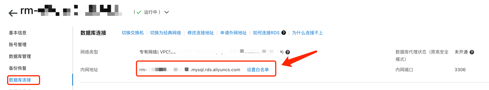
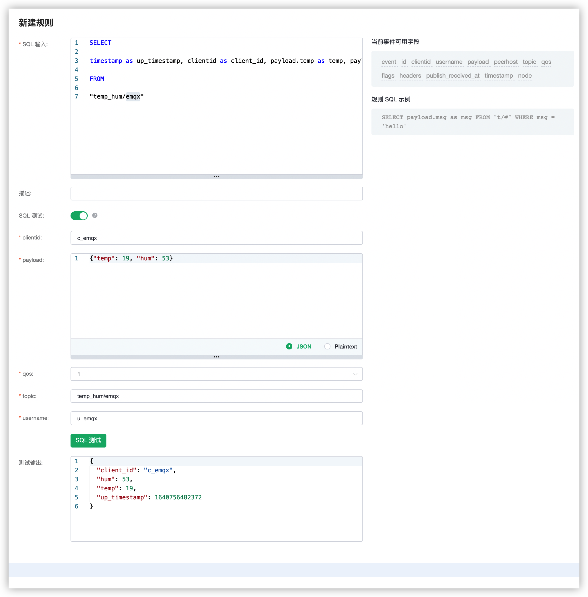
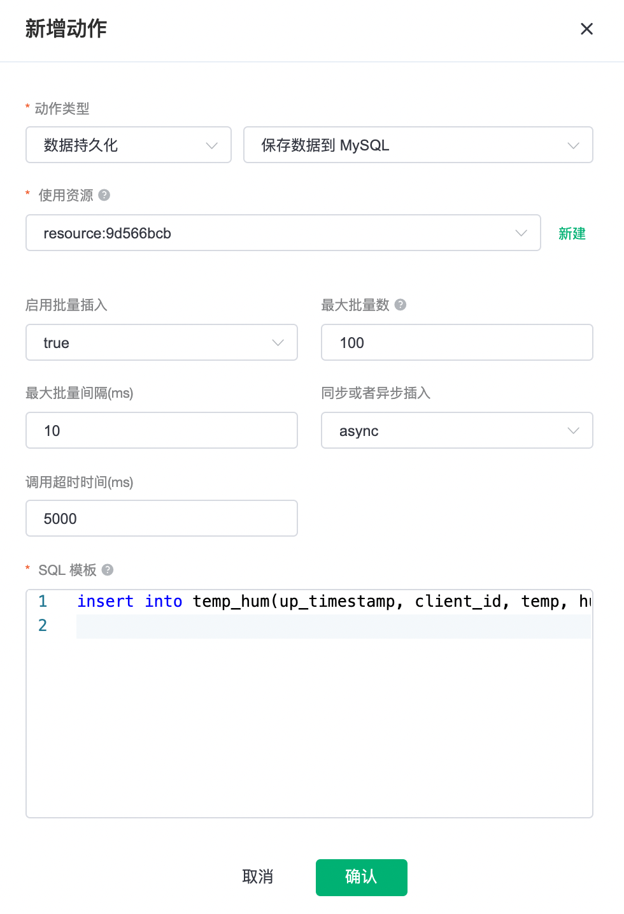
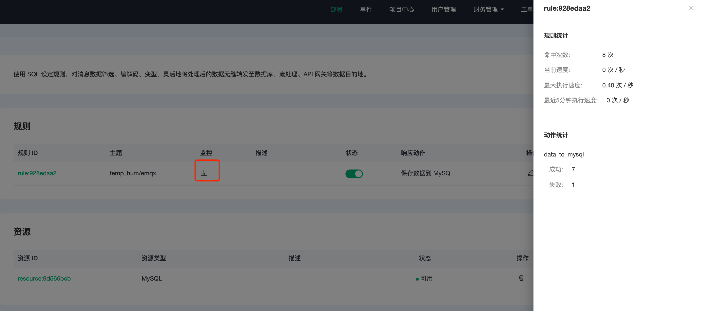
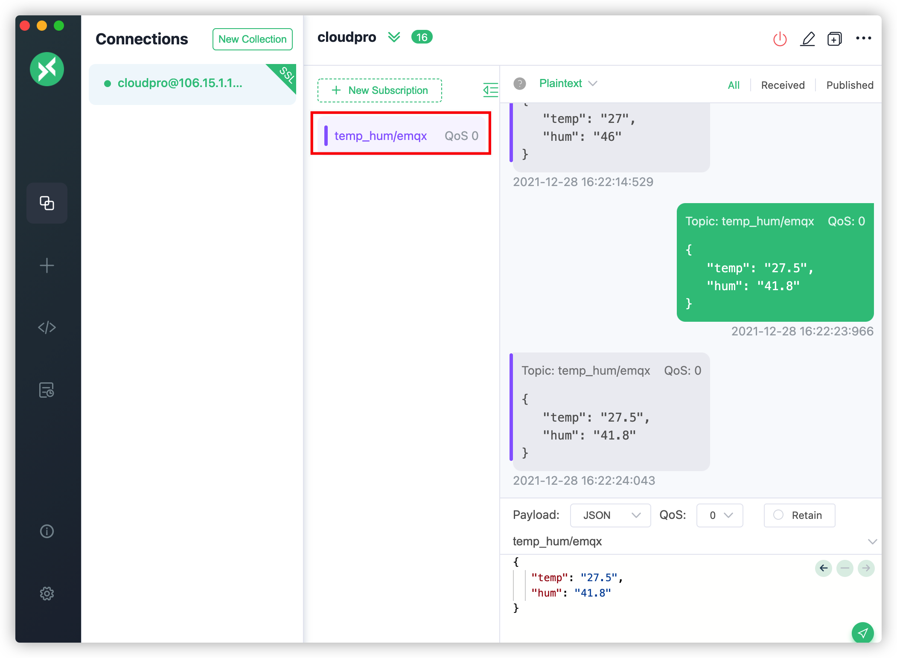
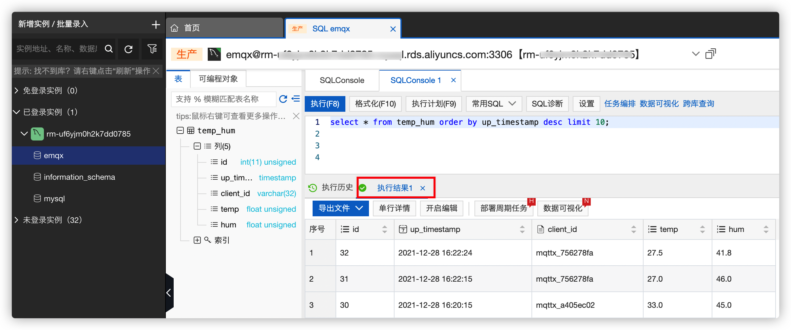

# EMQ X Cloud 规则引擎保存数据到阿里云 RDS MySQL

::: danger
该功能在基础版中不可用
:::

在本文中我们将模拟温湿度数据并通过 MQTT 协议上报到 EMQ X Cloud，然后使用 EMQ X Cloud 规则引擎将数据转存到阿里云 RDS MySQL。

在开始之前，您需要完成以下操作：

- 已经在 EMQ X Cloud 上创建部署(EMQ X 集群)。
- 对于专业版部署用户：请先完成 [对等连接的创建](../deployments/vpc_peering.md)，下文提到的 IP 均指资源的内网 IP。

## 购买阿里云 RDS MySQL

### 1. 创建阿里云 RDS MySQL

如果您是初次接触阿里云 RDS MySQL，建议您跟随阿里云 RDS MySQL [快速入门](https://help.aliyun.com/document_detail/96036.html)进行创建。

为了方便测试，这里我们选择的配置如下：

- 商品类型：按量付费
- 数据库版本：MySQL8.0
- 系列：高可用版（一主一备）
- 存储类型：本地 SSD 盘
- 实例规格：通用规格
- 网络类型：专有网络
- 规格：1 核 1G

> 需要特别注意的是：网络类型一定要选专有网络，并选择与 EMQ X Cloud 建立了对等连接的 VPC

### 2. 将 EMQ X Cloud VPC 所在网段加入白名单

在 RDS MySQL 实例页面中，找到 `数据安全性` -> `白名单设置`

将 EMQ X Cloud 的 VPC 网段加入 RDS MySQL 的白名单中


### 3. 开启阿里云 SSL

在 RDS MySQL 实例页面中，找到 `数据安全性` -> `SSL`

开通 SSL，下载 CA 证书

## RDS MySQL 配置

1. 温湿度表创建

   使用以下 SQL 语句将创建 `temp_hum` 表，该表将用于存放设备上报的温度和湿度数据。

   ```sql
   CREATE TABLE `temp_hum` (
     `id` int(11) unsigned NOT NULL AUTO_INCREMENT,
     `up_timestamp` timestamp NULL DEFAULT NULL,
     `client_id` varchar(32) DEFAULT NULL,
     `temp` float unsigned DEFAULT NULL,
     `hum` float unsigned DEFAULT NULL,
     PRIMARY KEY (`id`),
     KEY `up_timestamp_client_id` (`up_timestamp`,`client_id`)
   ) ENGINE=InnoDB AUTO_INCREMENT=26 DEFAULT CHARSET=utf8mb4;
   ```

2. 设置允许 EMQ X 集群 IP 段访问数据库(可选)

   对于专业版部署，获取部署网段可以前往部署详情 → 查看对等连接信息，复制部署 VPC 网段。

   ```sql
   # 专业版
   GRANT ALL PRIVILEGES ON *.* TO root@'10.13.89.%' IDENTIFIED BY '-abc12345' WITH GRANT OPTION;

   # 基础版
   GRANT ALL PRIVILEGES ON *.* TO root@'%' IDENTIFIED BY '-abc12345' WITH GRANT OPTION;
   ```

3. 插入测试数据，并查看数据

   ```sql
   INSERT INTO temp_hum(up_timestamp, client_id, temp, hum) values (FROM_UNIXTIME(1603963414), 'temp_hum-001', 19.1, 55);

   select * from temp_hum;
   ```

## 配置规则引擎

1. 创建 MySQL 资源

   点击左侧菜单栏规则引擎，找到资源面板，点击新建资源，下拉选择 MySQL 资源类型。填入刚才创建好的 MySQL 数据库信息，并开启 SSL 链接到阿里云,
   上传对应格式.pem 的 CA 文件，点击测试如果出现错误应及时检查数据库配置是否正确。

   

   其中, `服务器地圵`可以在下图的位置找到

   

2. 规则测试

   点击左侧左侧菜单栏`规则引擎`，找到规则面板，点击创建，然后输入如下规则匹配 SQL 语句。在下面规则中我们从 `temp_hum/emqx` 主题读取消息上报时间 `up_timestamp`、客户端 ID、消息体(Payload)，并从消息体中分别读取温度和湿度。

   ```sql
   SELECT

   timestamp as up_timestamp, clientid as client_id, payload.temp as temp, payload.hum as hum

   FROM

   "temp_hum/emqx"
   ```

   

3. 添加响应动作

   点击左下角添加动作，下拉选择 → 保存数据到 MySQL 选择第一步创建好的资源，并输入以下数据插入 SQL 模板。

   ```sql
   insert into temp_hum(up_timestamp, client_id, temp, hum) values (FROM_UNIXTIME(${up_timestamp}/1000), ${client_id}, ${temp}, ${hum})
   ```

   

4. 点击创建规则，并返回规则列表查看规则监控

   

## 测试

1. 使用 [MQTT X](https://mqttx.app/) 模拟温湿度数据上报

   需要将 broker.emqx.io 替换成已创建的部署[连接地址](../deployments/view_deployment.md)，并添加[客户端认证信息](../deployments/auth.md)。

   - topic: `temp_hum/emqx`
   - payload:

     ```json
     {
       "temp": "27.5",
       "hum": "41.8"
     }
     ```

   

2. 查看数据转存结果

   ```sql
   select * from temp_hum order by up_timestamp desc limit 10;
   ```

   
