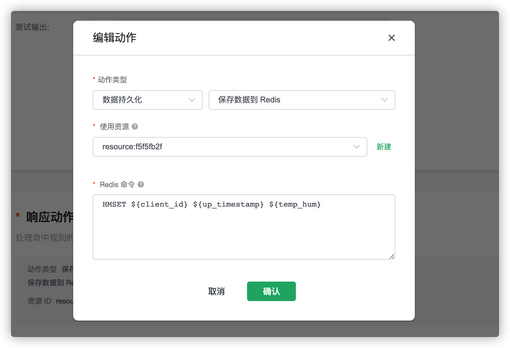
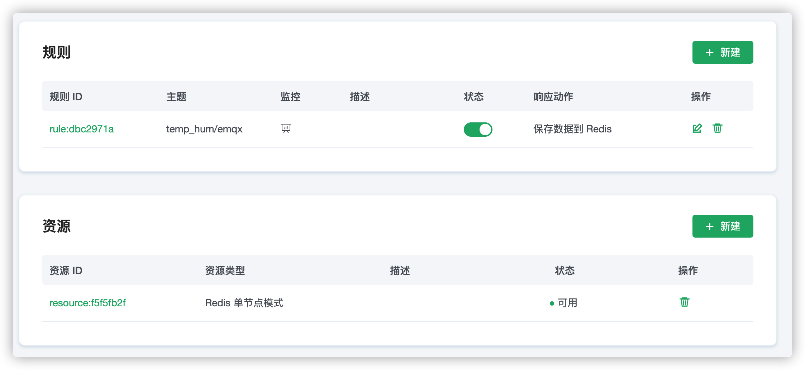

# EMQ X Cloud 规则引擎保存数据到 Redis

::: danger
该功能在基础版中不可用
:::

在本文中我们将模拟温湿度数据并通过 MQTT 协议上报到 EMQ X Cloud，然后使用 EMQ X Cloud 规则引擎将数据转存到 Redis。

在开始之前，您需要完成以下操作：
* 已经在 EMQ X Cloud 上创建部署(EMQ X 集群)。
* 对于专业版部署用户：请先完成 [对等连接的创建](../deployments/vpc_peering.md)，下文提到的 IP 均指资源的内网 IP。

## Redis 配置

1. 获取 Redis 镜像
   ```bash
   docker pull redis:latest
   ```
2. 运行 Redis 容器
   ```bash
   docker run -itd --name redis -p 6379:6379 redis
   ```

## EMQ X Cloud 规则引擎配置

1. 资源创建

   点击左侧菜单栏`规则引擎`，找到资源面板，点击新建资源，下拉选择 Redis单节点模式。填入刚才创建好的 Redis 信息，并点击测试如果出现错误应及时检查 Redis 配置是否正确。

   

2. 规则测试

   点击左侧左侧菜单栏`规则引擎`，找到规则面板，点击创建，然后输入如下规则匹配 SQL 语句。在下面规则中我们从 `temp_hum/emqx` 主题读取消息上报时间 `up_timestamp`、客户端 ID、消息体(Payload)。

   ```sql
   SELECT 
   
   timestamp div 1000 as up_timestamp, clientid as client_id, payload as temp_hum
   
   FROM
   
   "temp_hum/emqx"
   ```
   

3. 添加响应动作

   点击左下角添加动作，下拉选择 → 数据持久化 → 保存数据到 Redis 选择第一步创建好的资源，并输入以下 Redis 的命令。

   ```bash
   HMSET ${client_id} ${up_timestamp} ${temp_hum}
   ```
   

4. 点击创建规则，并返回规则列表

   


5. 查看规则监控

   


## 测试
1. 使用 [MQTT X](https://mqttx.app/) 模拟温湿度数据上报

   需要将 broker.emqx.io 替换成已创建的部署[连接地址](../deployments/view_deployment.md)，并添加[客户端认证信息](../deployments/auth_and_acl.md)。

   

2. 查看数据转存结果

   ```bash
   docker exec -it redis bash redis-cli
   HGETALL test_client
   ```
   
