# EMQX Cloud 数据集成保存数据到阿里云 Tablestore

::: warning
该功能在基础版中不可用
:::

[阿里云表格存储（Tablestore）](https://help.aliyun.com/document_detail/27280.html)面向海量结构化数据提供Serverless表存储服务，同时针对物联网场景深度优化提供一站式的 IoTstore 解决方案。适用于海量账单、IM 消息、物联网、车联网、风控、推荐等场景中的结构化数据存储，提供海量数据低成本存储、毫秒级的在线数据查询和检索以及灵活的数据分析能力。

在本文中我们将模拟温湿度数据并通过 MQTT 协议上报到 EMQX Cloud，然后使用 EMQX Cloud 数据集成将数据转存到阿里云 Tablestore。

在开始之前，您需要完成以下操作：

* 已经在 EMQX Cloud 上创建部署(EMQX 集群)。
* 已经在阿里云上创建 Tablestore 资源。
* 对于专业版部署用户：请先完成 [对等连接的创建](../deployments/vpc_peering.md)，下文提到的 IP 均指资源的内网 IP。（专业版部署若开通 [NAT 网关](../vas/nat-gateway.md) 也可使用公网 IP 连接资源）

## 阿里云 Tablestore 配置

1. 创建阿里云 Tablestore

   > 如果您是初次接触阿里云 Tablestore，建议您跟随阿里云 Tablestore [快速入门](https://help.aliyun.com/document_detail/342856.html) 进行创建。

   进入阿里云控制台，找到 Tablestore，在概览页面点击创建时序模型实例，点击实例名称进入到实例管理页面，点击时序表列表，创建时序表 `temp_hum`。

   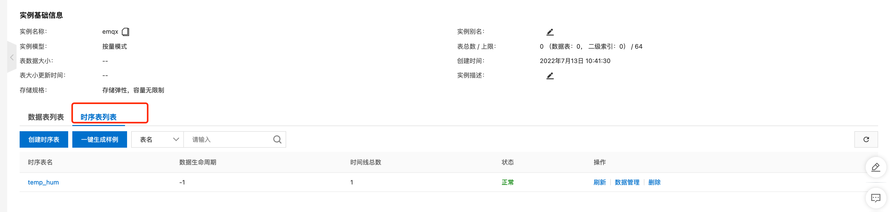

2. 创建时间线

   在实例管理页面，点击时序表名 `temp_hum`，进入时序表管理，点击数据管理并新增时间线，填写度量名称为 `cloud`。

   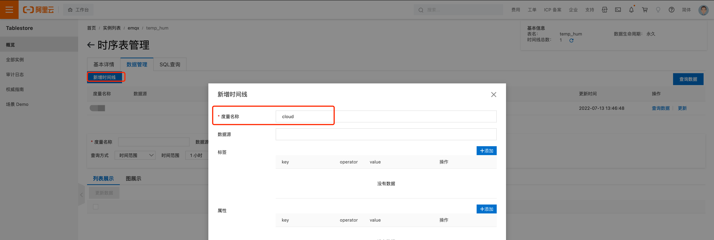

3. 绑定 VPC

   在实例管理页面点击网络管理并绑定 VPC，选择与 EMQX Cloud 建立了对等连接的 VPC。

   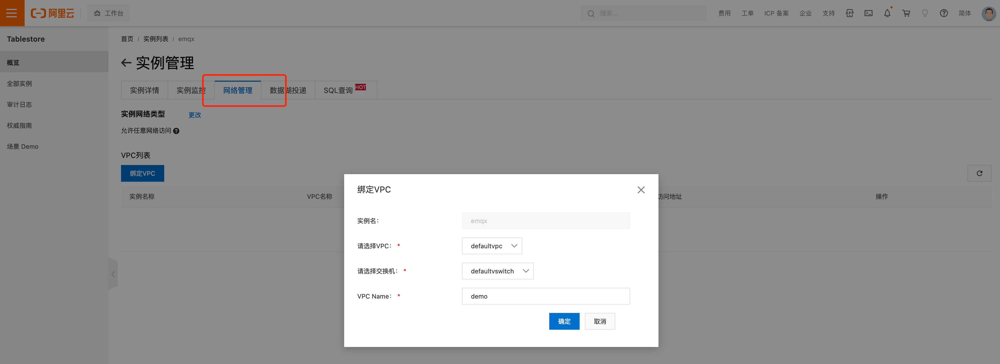

   绑定完成以后，在 Tablestore 实例详情页面中，找到 `实例访问地址` -> `VPC`，用以数据集成时内网访问资源的 URL。

   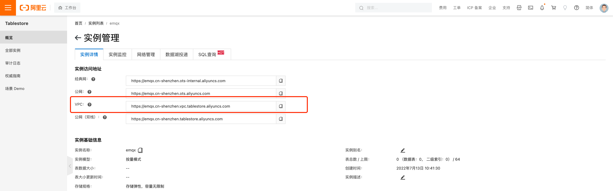

## EMQX Cloud 数据集成配置

1. 创建 Tablestore 资源

   点击左侧菜单栏`数据集成`，在数据持久化下找到 Tablestore (时序)。

   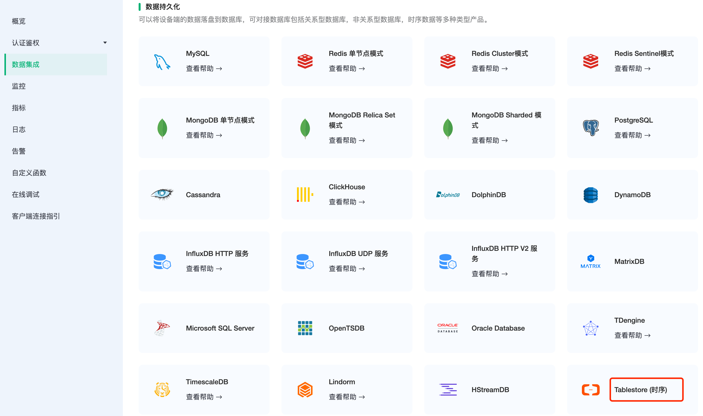

   新建资源，填入刚才创建好的 Tablestore 数据库信息，实例处填入实例名称，AccessKey ID 和 AccessKey Secret 可在您的阿里云账号的用户信息 - AccessKey 管理处找到。点击测试，如果出现错误应及时检查数据库配置是否正确。

   >注意：需要赋予使用到 AccessKey 的用户访问 Tablestore 的相应权限

   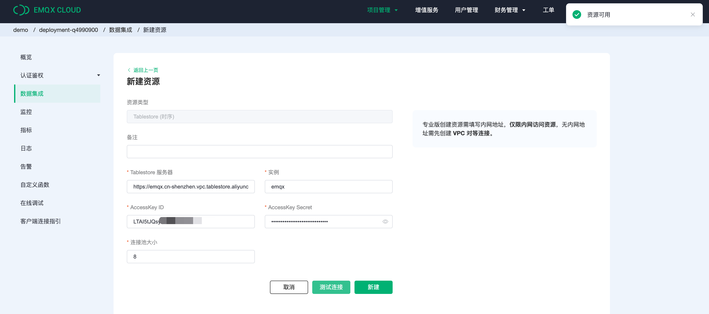

2. 创建规则

   资源创建后点击新建规则，然后输入如下规则匹配 SQL 语句。在下面规则中我们从 `temp_hum/emqx` 主题读取客户端 ID、消息体(Payload)，并从消息体中分别读取温度和湿度。

   ```sql
   SELECT

   payload.temp as temp, 
   payload.hum as hum,
   clientid

   FROM
   "temp_hum/emqx"
   ```

   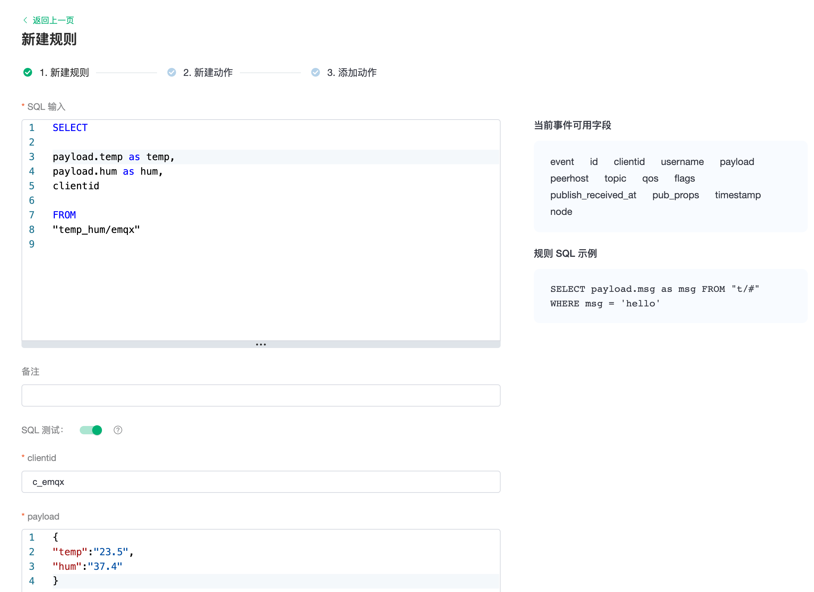

   我们可以使用 `SQL 测试` 来测试查看结果。

   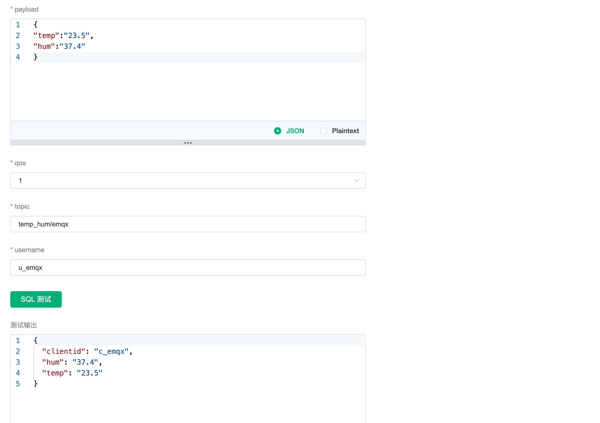

3. 添加响应动作

   点击下一步来到动作界面，选择第一步创建好的资源，动作类型选择`数据持久化 - 保存数据到 Tablestore`，填写相应的参数，点击确认。

   参数列表如下：

   | 参数                     | 定义                                                                                                    |
   | :----------------------- | :------------------------------------------------------------------------------------------------------ |
   | 度量名称                 | Tablestore 度量名称                                                                                     |
   | 数据源                   | Tablestore 数据源，可为空字符串                                                                         |
   | 时间戳（微秒）           | 单位微秒，EMQX 中 MQTT 消息中默认带有毫秒精度的时间戳，不可直接使用。缺省值为消息到达 EMQX 的微秒时间戳 |
   | 时间线缓存               | Tablestore 识别当前数据是否需要创建或更新时间线元数据，默认开启                                         |
   | 同步写入                 | 开启批量写入，或单条同步写入。批量写入时，备选动作不会触发                                              |
   | 异步模式批量大小         | 批量写入最大数据条数，仅在关闭同步写入时生效                                                            |
   | 异步模式批量间隔（毫秒） | 批量写入最长时间间隔，仅在关闭同步写入时生效                                                            |
   | Tags                     | 数据标签，所有数据都以字符串形式处理                                                                    |
   | 数据列名                 | 数据键值对，数据类型自动识别。字符串数据默认按照二进制数据处理以保证字符集最佳兼容性                    |
   | 字符型数据列名           | 字符串键值对，数据会按照字符串类型处理                                                                  |

   Tablestore 支持的数据格式：

   * int
   * float
   * boolean
   * string
   * binary

   这些格式可以被数据集成自动的识别并分类，但是字符串型数据默认处理方式为二进制数据，以保证最佳的兼容性。如果需要指定字段值为字符串类型，可以在创建动作时，将字段填写到`字符型数据列名`中，之后数据集成就会按照字符串的格式方式处理改字段值。

   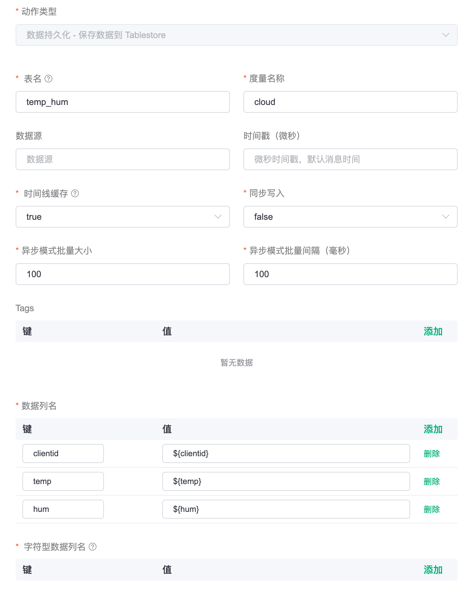

4. 查看资源详情

   动作创建完以后，返回列表点击资源可以查看详情。

   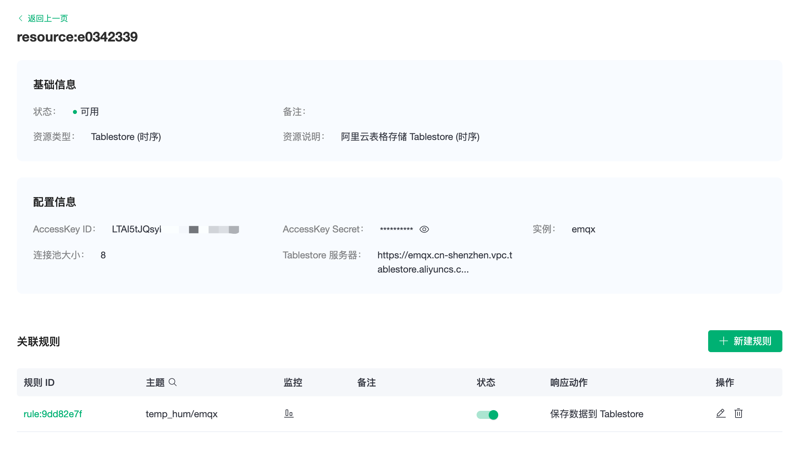

5. 查看规则详情

   资源详情界面点击规则可以查看规则监控信息和规则详情。

   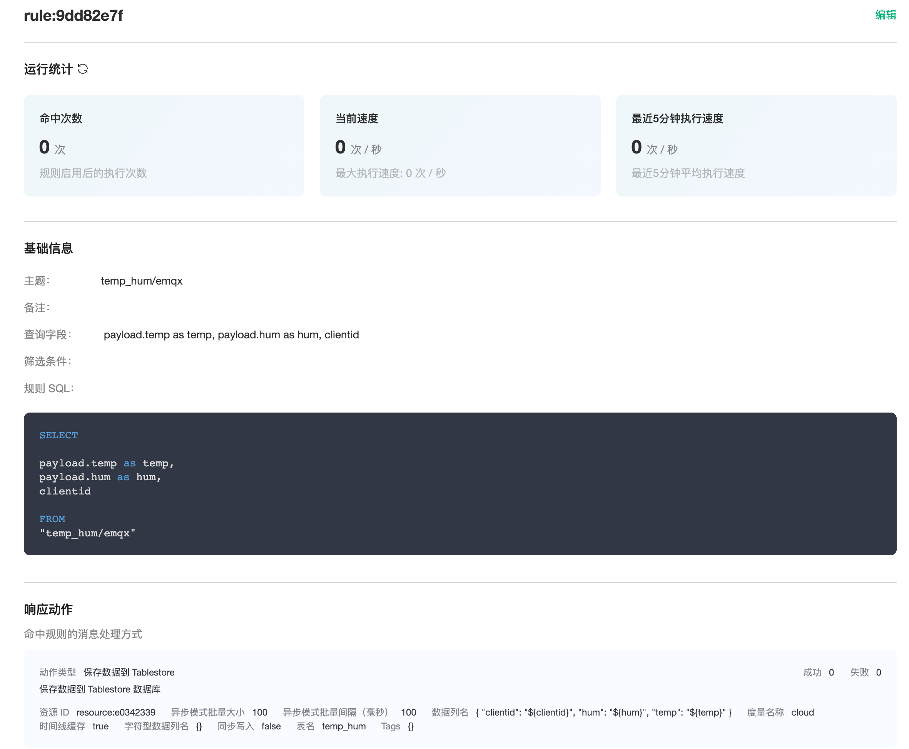

## 测试

1. 使用 [MQTT X](https://mqttx.app/) 模拟温湿度数据上报。

   需要将 broker.emqx.io 替换成已创建的部署[连接地址](../deployments/view_deployment.md)，并添加[客户端认证信息](../deployments/auth.md)。

    * topic: `temp_hum/emqx`
    * payload:

      ```json
      {
        "temp": "23.5",
        "hum": "37.4"
      }
      ```

   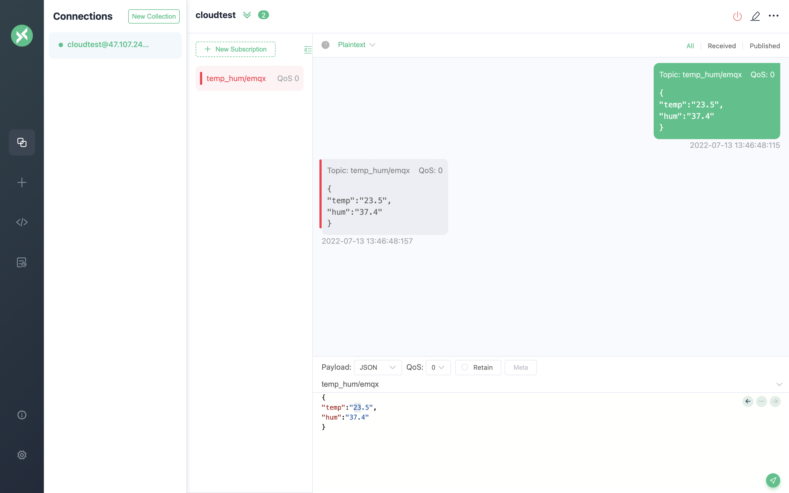

2. 查看数据转存结果

   输入度量名称 cloud ，时间范围 1 小时，作为查询条件，点击查询。

   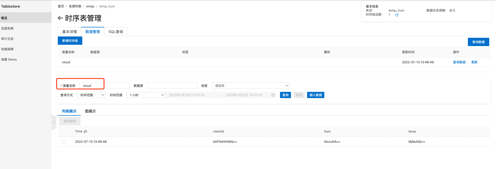
