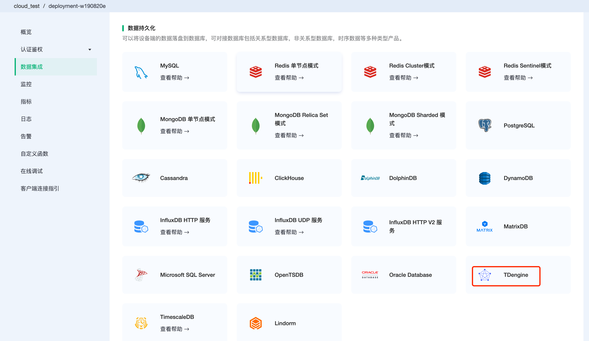
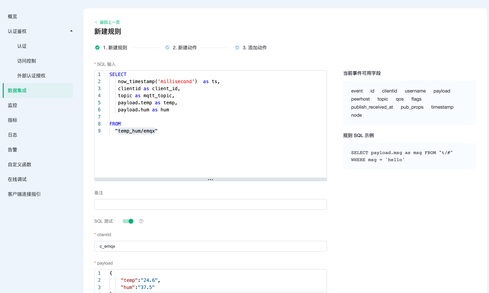
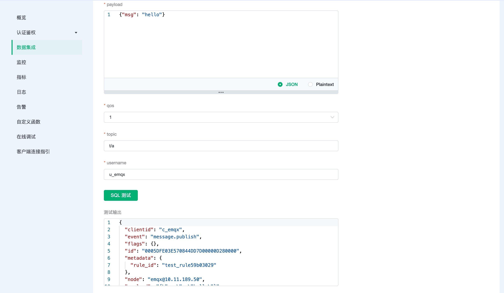
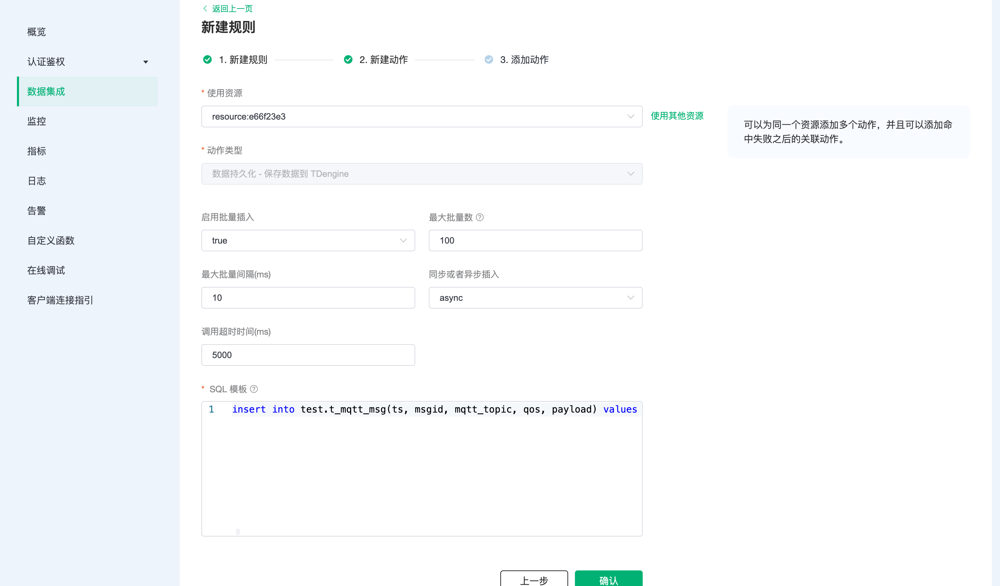
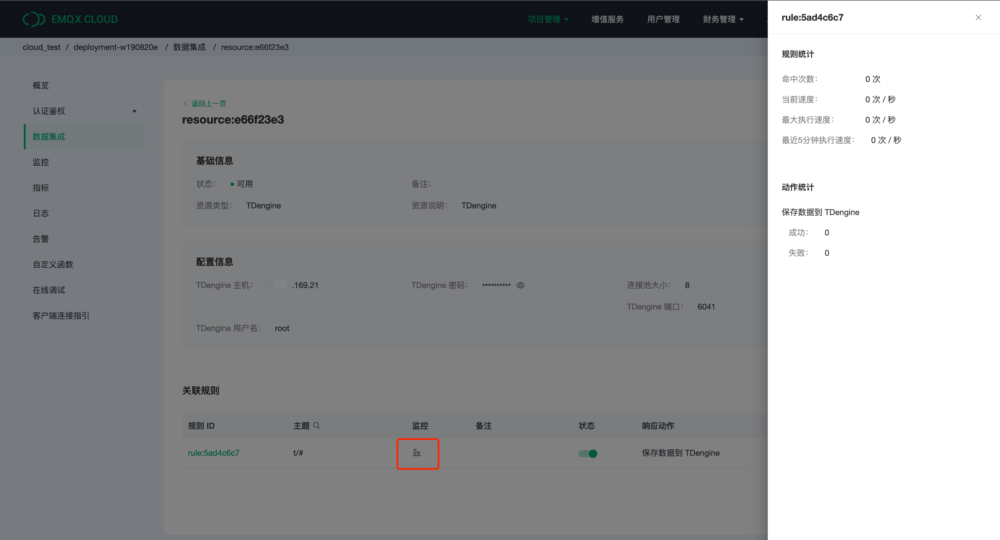
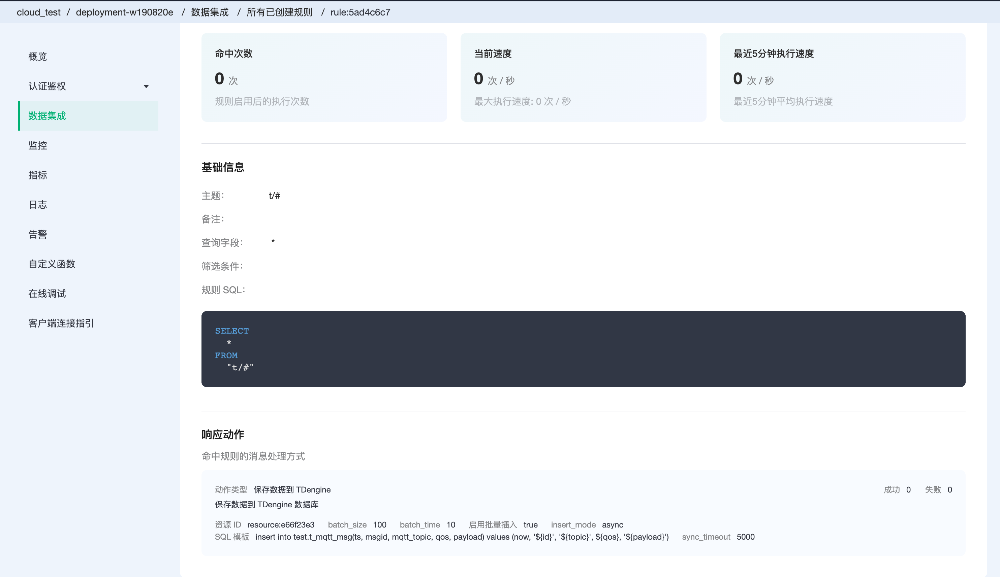
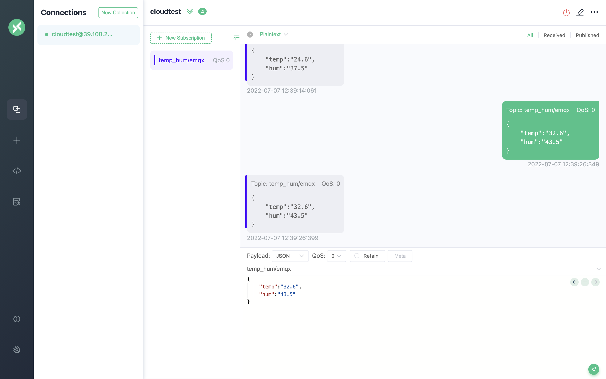
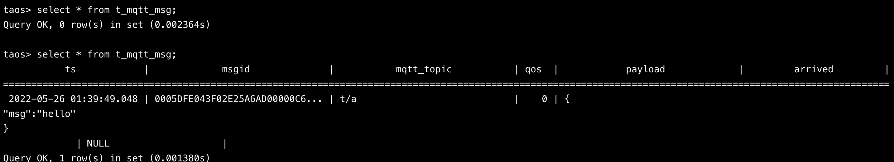

# EMQX Cloud 数据集成保存数据到 TDengine

::: danger
该功能在基础版中不可用
:::

[TDengine](https://github.com/taosdata/TDengine) 是[涛思数据](https://www.taosdata.com/)推出的一款开源的专为物联网、车联网、工业互联网、IT 运维等设计和优化的大数据平台。除核心的快 10 倍以上的时序数据库功能外，还提供缓存、数据订阅、流式计算等功能，最大程度减少研发和运维的复杂度。

在本文中我们将模拟数据并通过 MQTT 协议上报到 EMQX Cloud，然后使用 EMQX Cloud 数据集成将数据转存到 TDengine。

在开始之前，您需要完成以下操作：

* 已经在 EMQX Cloud 上创建部署(EMQX 集群)。
* 对于专业版部署用户：请先完成 [对等连接的创建](../deployments/vpc_peering.md)，下文提到的 IP 均指资源的内网 IP。(专业版部署若开通 [NAT 网关](../vas/nat-gateway.md)也可使用公网 IP 进行连接）

## TDengine 配置

1. TDengine 安装

   ```bash
   docker run --name tdengine -d -p 6030:6030 -p 6035:6035 -p 6041:6041 -p 6030-6040:6030-6040/udp tdengine/tdengine
   ```

2. 数据库创建

   ```bash
   docker exec -it tdengine bash
   taos
   create database test;
   use test;
   ```

3. 数据表创建

   使用以下 SQL 语句将创建 `t_mqtt_msg` 表，该表将用于存放设备上报的数据。

   ```sql
   CREATE TABLE t_mqtt_msg (
   ts timestamp,
   msgid NCHAR(64),
   mqtt_topic NCHAR(255),
   qos TINYINT,
   payload BINARY(1024),
   arrived timestamp
   );
   ```

## EMQX Cloud 数据集成配置

1. 创建资源

   点击左侧菜单栏`数据集成`，在数据持久化下找到 TDengine，点击新建资源。

   

   填入刚才创建好的 TDengine 数据库信息，并点击测试，如果出现错误应及时检查数据库配置是否正确。

   

2. 创建规则

   资源创建后点击新建规则，然后输入如下规则匹配 SQL 语句。在下面规则中我们从 `t/#` 主题读取消息上报的数据。

   ```sql
   SELECT * FROM "t/#"
   ```

   我们可以使用 `SQL 测试` 来测试查看结果

   
   

3. 添加响应动作

   点击下一步来到动作界面，选择第一步创建好的资源，动作类型选择`数据持久化 - 保存数据到 TDengine`，并输入以下数据插入 SQL 模板，点击确认。

   ```sql
   insert into test.t_mqtt_msg(ts, msgid, mqtt_topic, qos, payload) values (now, '${id}', '${topic}', ${qos}, '${payload}')
   ```

   

4. 查看资源详情

   动作创建完以后，返回列表点击资源可以查看详情

   

5. 查看规则详情

   资源详情界面点击规则可以查看规则监控信息和规则详情

   

## 测试

1. 使用 [MQTT X](https://mqttx.app/) 模拟数据上报

   需要将 broker.emqx.io 替换成已创建的部署[连接地址](../deployments/view_deployment.md)，并添加[客户端认证信息](../deployments/auth.md)。
    * topic: `t/a`
    * payload:

      ```json
      {
      "msg":"hello"
      }
      ```

   

2. 查看数据转存结果

   ```sql
   select * from t_mqtt_msg;
   ```
   
