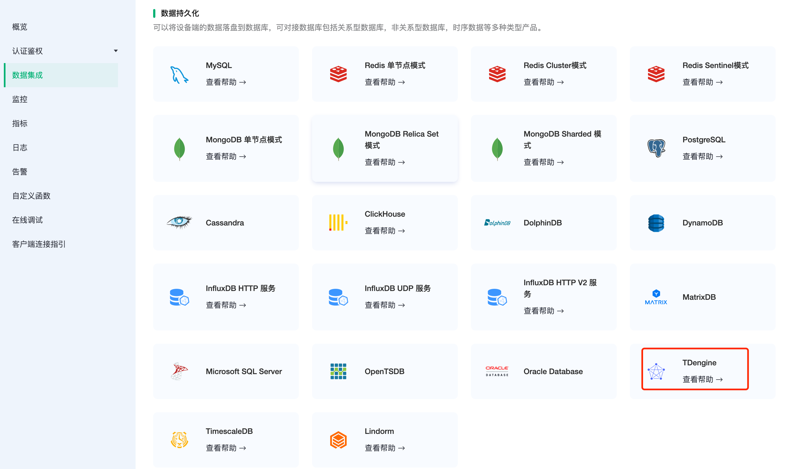
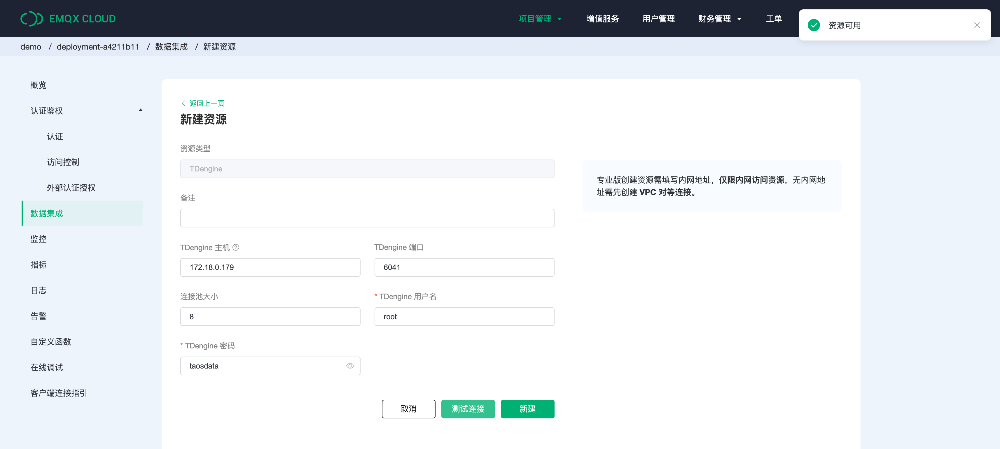
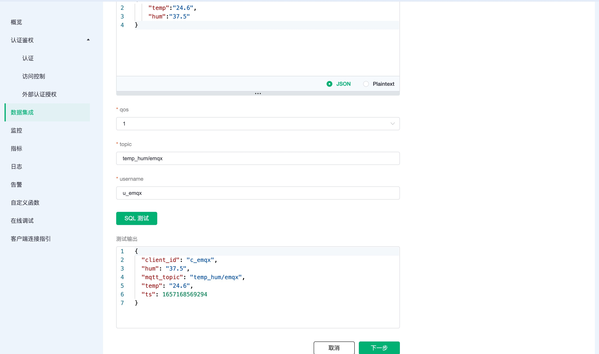
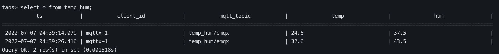

# 集成 TDengine

::: warning
该功能在基础版中不可用
:::

[TDengine](https://github.com/taosdata/TDengine) 是[涛思数据](https://www.taosdata.com/)推出的一款开源的专为物联网、车联网、工业互联网、IT 运维等设计和优化的大数据平台。除核心的快 10 倍以上的时序数据库功能外，还提供缓存、数据订阅、流式计算等功能，最大程度减少研发和运维的复杂度。

在本文中我们将模拟温湿度数据并通过 MQTT 协议上报到 EMQX Cloud，然后使用 EMQX Cloud 数据集成将数据转存到 TDengine。

在开始之前，您需要完成以下操作：

* 已经在 EMQX Cloud 上创建部署(EMQX 集群)。
* 对于专业版部署用户：请先完成 [对等连接的创建](../deployments/vpc_peering.md)，下文提到的 IP 均指资源的内网 IP。(专业版部署若开通 [NAT 网关](../vas/nat-gateway.md)也可使用公网 IP 进行连接）

您可以查看[视频教程](https://player.bilibili.com/player.html?aid=769840539&bvid=BV1Er4y1V7UC&cid=741804407&page=1)进一步了解。


## TDengine 配置

1. TDengine 安装

   ```bash
   # EMQX 目前支持到 TDengine 2.x ，暂不支持 3.x
   docker run --name tdengine -d -p 6030:6030 -p 6035:6035 -p 6041:6041 -p 6030-6040:6030-6040/udp tdengine/tdengine:2.0.16.0
   ```

2. 数据库创建

   ```bash
   docker exec -it tdengine bash
   taos
   create database emqx;
   use emqx;
   ```

3. 数据表创建

   使用以下 SQL 语句将创建 `temp_hum` 表，该表将用于存放设备上报的温湿度数据。

   > 注意： topic 是 TDengine 的保留关键字，用 topic 作为字段名会导致建表失败。

   ```sql
   CREATE TABLE temp_hum (
   ts timestamp,
   client_id NCHAR(64),
   mqtt_topic NCHAR(255),
   temp BINARY(1024),
   hum BINARY(1024)
   );
   ```

## EMQX Cloud 数据集成配置

1. 创建资源

   点击左侧菜单栏`数据集成`，在数据持久化下找到 TDengine，点击新建资源。

   

   填入刚才创建好的 TDengine 数据库信息，默认用户名为 **root**，缺省密码为 **taosdata**，TDengine 不在资源中配置数据库名，请在 SQL 中自行配置。点击测试，如果出现错误应及时检查数据库配置是否正确。

   

2. 创建规则

   资源创建后点击新建规则，然后输入如下规则匹配 SQL 语句。在下面规则中我们从 `temp_hum/emqx` 主题读取消息上报的数据。

   ```sql
   SELECT

   now_timestamp('millisecond')  as ts,
   clientid as client_id,
   topic as mqtt_topic,
   payload.temp as temp,
   payload.hum as hum

   FROM

   "temp_hum/emqx"
   ```

   我们可以使用 `SQL 测试` 来测试查看结果。

   
   

3. 添加响应动作

   点击下一步来到动作界面，选择第一步创建好的资源，动作类型选择`数据持久化 - 保存数据到 TDengine`，并输入以下数据插入 SQL 模板，在 SQL 中需要指定数据库名，字符类型也要用单引号括起来，点击确认。

   ```sql
   insert into emqx.temp_hum(ts, client_id, mqtt_topic, temp, hum) values (${ts}, '${client_id}', '${mqtt_topic}', '${temp}', '${hum}')
   ```

   

4. 查看资源详情

   动作创建完以后，返回列表点击资源可以查看详情。

   

5. 查看规则详情

   资源详情界面点击规则可以查看规则监控信息和规则详情。

   

## 测试

1. 使用 [MQTT X](https://mqttx.app/) 模拟数据上报

   需要将 broker.emqx.io 替换成已创建的部署连接地址，并添加客户端认证信息。
    * topic: `temp_hum/emqx`
    * payload:

      ```json
      {
      "temp":"24.6",
      "hum":"37.5"
      }
      ```

   

2. 查看数据转存结果

   ```sql
   select * from temp_hum;
   ```

   
