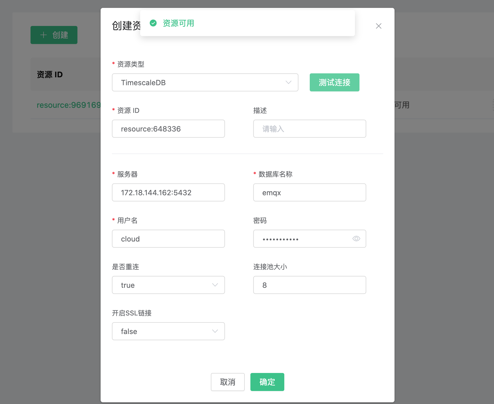
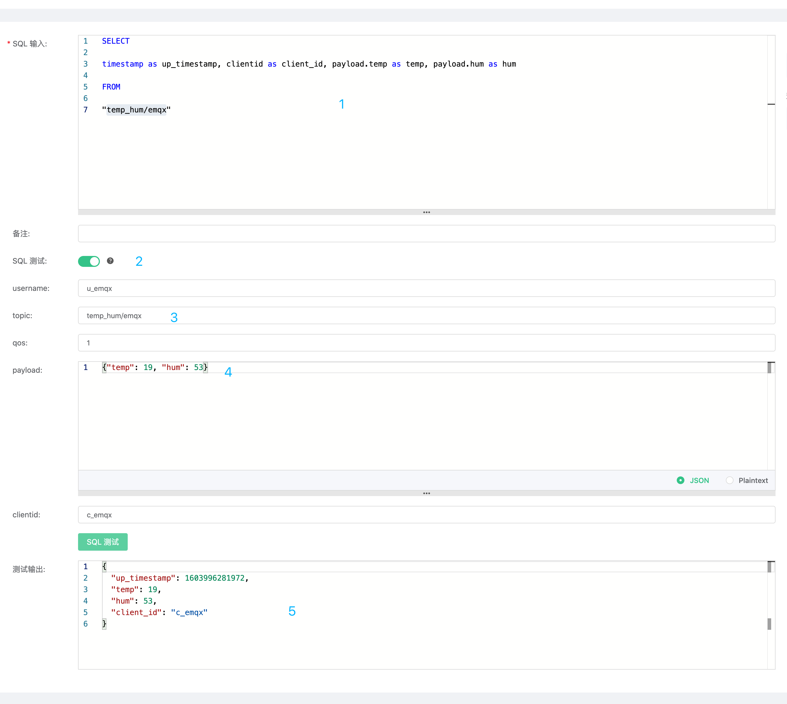
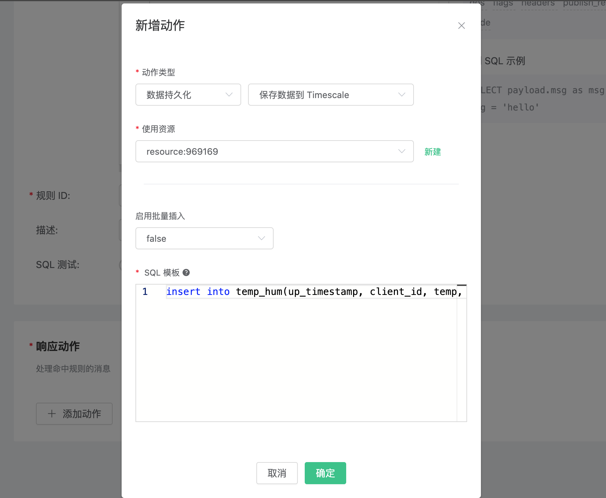
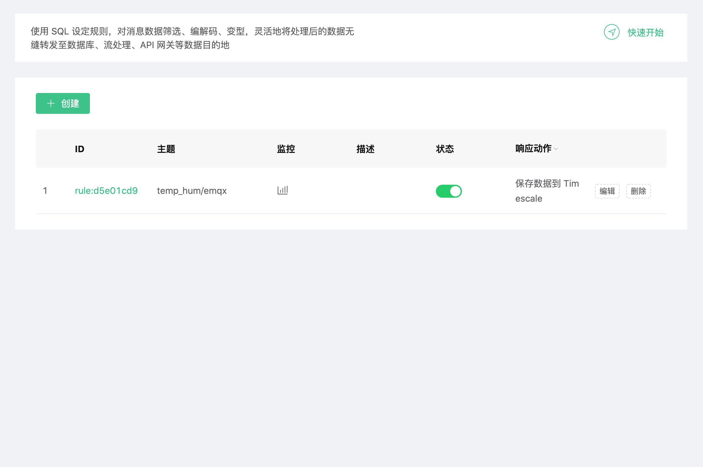
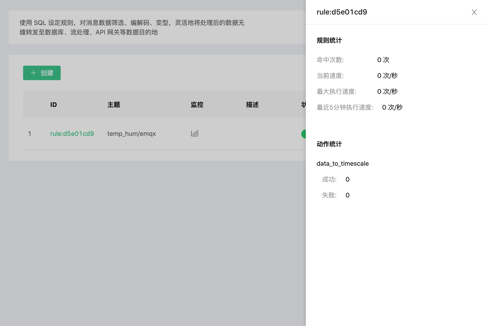
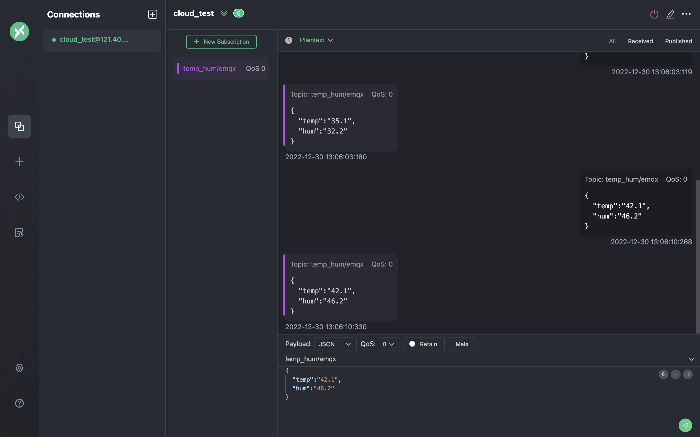
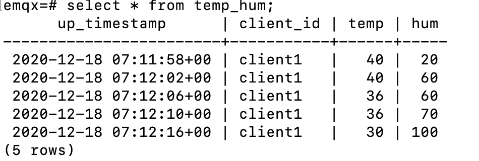

# 集成 TimescaleDB

::: warning
该功能在基础版中不可用
:::

在本文中我们将模拟温湿度数据并通过 MQTT 协议上报到 EMQX Cloud，然后使用 EMQX Cloud 数据集成将数据转存到 TimescaleDB。

在开始之前，您需要完成以下操作：
* 已经在 EMQX Cloud 上创建部署(EMQX 集群)。
* 对于专业版部署用户：请先完成 [对等连接的创建](../deployments/vpc_peering.md)，下文提到的 IP 均指资源的内网 IP。(专业版部署若开通 [NAT 网关](../vas/nat-gateway.md)也可使用公网 IP 进行连接）

## TimescaleDB 配置

1. TimescaleDB 安装
   ```bash
   docker run -d --name timescaledb -p 5432:5432 -e POSTGRES_PASSWORD=password timescale/timescaledb:1.7.4-pg12
   ```

2. 数据库创建
   ```bash
   docker exec -it timescaledb psql -U postgres
   CREATE database emqx;
   \c emqx
   ```

3. 温湿度表创建

   使用以下 SQL 语句将创建 `temp_hum` 表，该表将用于存放设备上报的温度和湿度数据。
   ```sql
   CREATE TABLE temp_hum (
       up_timestamp   TIMESTAMPTZ       NOT NULL,
       client_id      TEXT              NOT NULL,
       temp           DOUBLE PRECISION  NULL,
       hum            DOUBLE PRECISION  NULL
   );

   SELECT create_hypertable('temp_hum', 'up_timestamp');
   ```

4. 插入测试数据，并查看数据
   ```sql
   INSERT INTO temp_hum(up_timestamp, client_id, temp, hum) values (to_timestamp(1603963414), 'temp_hum-001', 19.1, 55);
   
   select * from temp_hum;
   ```
   
## EMQX Cloud 数据集成配置

1. 资源创建

   点击左侧菜单栏`数据集成`，找到资源面板，点击新建资源，下拉选择 TimescaleDB 资源类型。填入刚才创建好的 timescaledb 数据库信息，并点击测试如果出现错误应及时检查数据库配置是否正确。

   

2. 规则测试
   
   点击左侧左侧菜单栏`数据集成`，找到规则面板，点击创建，然后输入如下规则匹配 SQL 语句。在下面规则中我们从 `temp_hum/emqx` 主题读取消息上报时间 `up_timestamp`、客户端 ID、消息体(Payload)，并从消息体中分别读取温度和湿度。
   
   ```sql
   SELECT 
   
   timestamp div 1000 as up_timestamp, clientid as client_id, payload.temp as temp, payload.hum as hum
   
   FROM
   
   "temp_hum/emqx"
   ```
   

3. 添加响应动作

   点击左下角添加动作，下拉选择 → 数据持久化 → 保存数据到 Timescale 选择第一步创建好的资源，并输入以下数据插入 SQL 模板。

   ```sql
   insert into temp_hum(up_timestamp, client_id, temp, hum) values (to_timestamp(${up_timestamp}), ${client_id}, ${temp}, ${hum})
   ```
   

4. 点击创建规则，并返回规则列表

   


5. 查看规则监控

   
   

## 测试
1. 使用 [MQTT X](https://mqttx.app/) 模拟温湿度数据上报

   需要将 broker.emqx.io 替换成已创建的部署连接地址，并添加客户端认证信息。

   
   
2. 查看数据转存结果

   ```sql
   select * from temp_hum order by up_timestamp desc limit 10;
   ```
   
