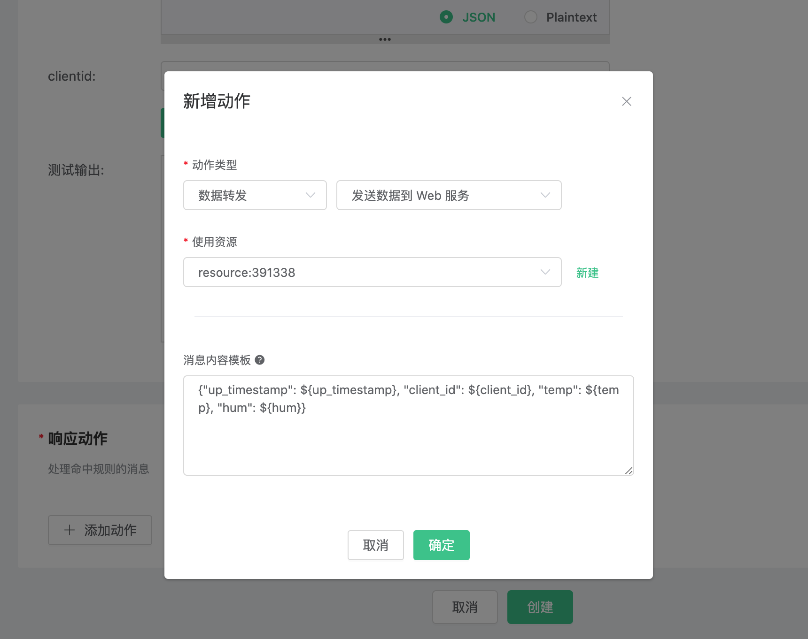
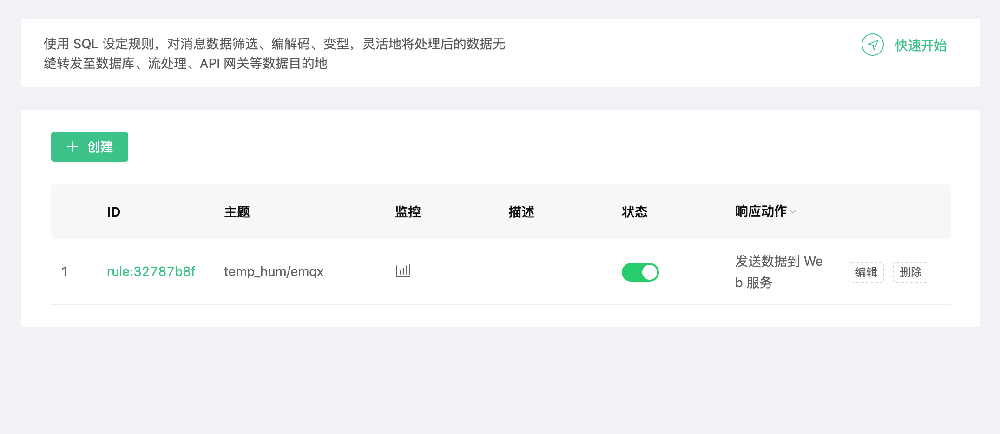
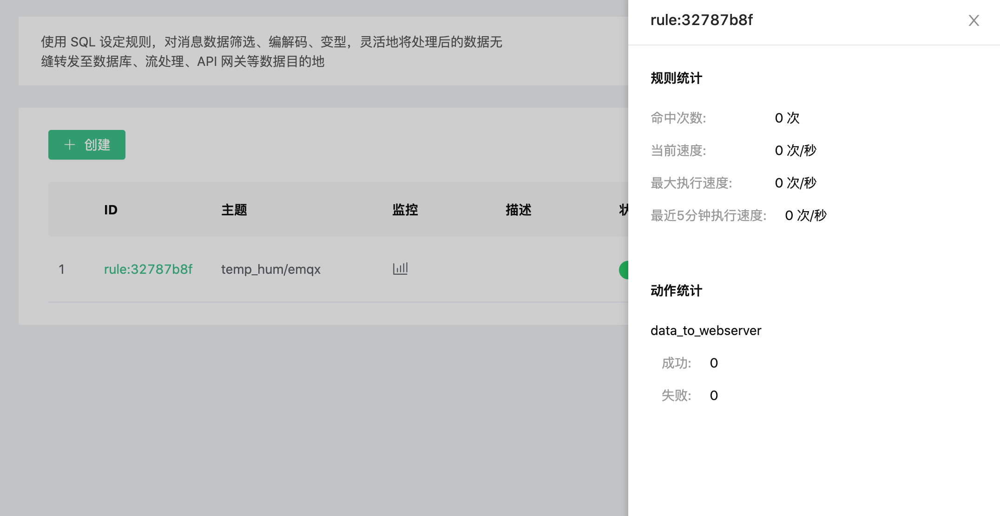

# 使用 EMQ X Cloud 规则引擎转发数据到 WebHook

在本文中我们将模拟温湿度数据并通过 MQTT 协议上报到 EMQ X Cloud，然后使用 EMQ X Cloud 规则引擎将数据转存到 Kafka。

在开始之前，您需要完成以下操作：
* 已经在 EMQ X Cloud 上创建部署(EMQ X 集群)。
* 对于独享部署用户：请先完成 [对等连接的创建](../deployments/vpc_peering.md)，下文提到的 IP 均指资源的内网 IP。
* 对于免费试用及共享部署用户：无需完成对等连接，下文提到的 IP 均指资源的公网 IP。

## 创建 Web 服务器

1. 使用 nc 命令创建一个简易的 Web 服务器。
   ```bash
   while true; do echo -e "HTTP/1.1 200 OK\n\n $(date)" | nc -l 0.0.0.0 9910; done;
   ```

## EMQ X Cloud 规则引擎配置

进入部署详情点击 EMQ X Dashbaord 将进入 Dashbaord

1. 资源创建

   点击左侧菜单栏`规则引擎`，找到资源面板，点击新建资源，下拉选择 WebHook 资源类型。填入 URL，并点击测试如果出现错误应及时检查数据库配置是否正确。

   

2. 规则测试

   点击左侧左侧菜单栏`规则引擎`，找到规则面板，点击创建，然后输入如下规则匹配 SQL 语句。在下面规则中我们从 `temp_hum/emqx` 主题读取消息上报时间 `up_timestamp`、客户端 ID、消息体(Payload)，并从消息体中分别读取温度和湿度。
   
   ```sql
   SELECT 
   
   timestamp as up_timestamp, clientid as client_id, payload.temp as temp, payload.hum as hum
   
   FROM
   
   "temp_hum/emqx"
   ```
   

3. 添加响应动作

   点击左下角添加动作，下拉选择 → 数据转发 → 发送数据到 Web 服务，选择第一步创建好的资源，并填写以下数据：
   
   消息内容模板: 
   ```
   {"up_timestamp": ${up_timestamp}, "client_id": ${client_id}, "temp": ${temp}, "hum": ${hum}}
   ```
   

4. 点击创建规则，并返回规则列表

   

5. 查看规则监控

   


## 测试

1. 使用 [MQTT X](https://mqttx.app/) 模拟温湿度数据上报

   需要将 broker.emqx.io 替换成已创建的部署[连接地址](../deployments/view_deployment.md)
   
2. 查看数据转存结果
    
   

