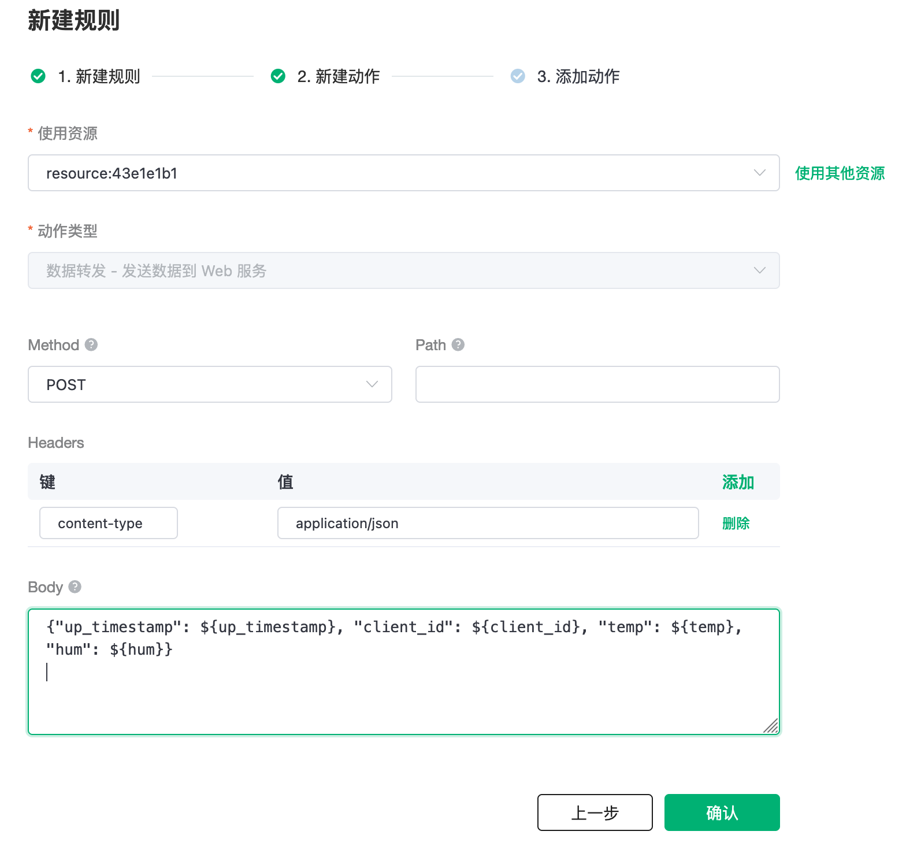

# 集成 WebHook

在本文中我们将模拟温湿度数据并通过 MQTT 协议上报到 EMQX Cloud，然后使用 EMQX Cloud 数据集成将数据转存到 WebHook。

在开始之前，您需要完成以下操作：
* 已经在 EMQX Cloud 上创建部署(EMQX 集群)。
* 对于专业版部署用户：请先完成 [对等连接的创建](../deployments/vpc_peering.md)，下文提到的 IP 均指资源的内网 IP。(专业版部署若开通 [NAT 网关](../vas/nat-gateway.md)也可使用公网 IP 进行连接）
* 对于基础版用户：无需完成对等连接，下文提到的 IP 均指资源的公网 IP。

您可以查看[视频教程](https:///player.bilibili.com/player.html?aid=297842723&bvid=BV1HF41137qq&cid=565385853&page=1)进一步了解。


## 创建 Web 服务器

1. 创建一个简易的 Web 服务器。

   ```python
   from http.server import HTTPServer, BaseHTTPRequestHandler
   
   class SimpleHTTPRequestHandler(BaseHTTPRequestHandler):
       def do_GET(self):
          self.send_response(200)
          self.end_headers()
          self.wfile.write(b'Hello, world!')
   
       def do_POST(self):
          content_length = int(self.headers['Content-Length'])
          body = self.rfile.read(content_length)
          print("Received POST request with body: " + str(body))
          self.send_response(201)
          self.end_headers()
   
   httpd = HTTPServer(('0.0.0.0', 8080), SimpleHTTPRequestHandler)
   httpd.serve_forever()
   ```

## EMQX Cloud 数据集成配置

1. 创建资源

   点击左侧菜单栏`数据集成`，在 Web 服务下找到 WebHook，点击新建资源。

   

   填入刚才创建好的 Web 服务信息，并点击测试，如果出现错误应及时检查数据库配置是否正确。

   

2. 创建规则

   资源创建后点击新建规则，然后输入如下规则匹配 SQL 语句。在下面规则中我们从 `temp_hum/emqx` 主题读取消息上报时间 `up_timestamp`、客户端 ID、消息体(Payload)，并从消息体中分别读取温度和湿度。
   
   ```sql
   SELECT 
   
   timestamp as up_timestamp, clientid as client_id, payload.temp as temp, payload.hum as hum
   
   FROM
   
   "temp_hum/emqx"
   ```

   我们可以使用 `SQL 测试` 来测试查看结果

   

3. 新建响应动作

   点击下一步来到动作界面，选择第一步创建好的资源，动作类型选择`数据转发 - 发送数据到 Web 服务`，`Body` 设为以下内容，点击确认。
   
   消息内容模板: 
   ```
   {"up_timestamp": ${up_timestamp}, "client_id": ${client_id}, "temp": ${temp}, "hum": ${hum}}
   ```

   

4. 查看资源详情

   动作创建完以后，返回列表点击资源可以查看详情

   

5. 查看规则监控

   


## 测试

1. 使用 [MQTT X](https://mqttx.app/) 模拟温湿度数据上报

   需要将 broker.emqx.io 替换成已创建的部署连接地址，并添加客户端认证信息。

    - topic: `temp_hum/emqx`
    - payload:

      ```json
      {
        "temp": "27.5",
        "hum": "41.8"
      }
      ```
   
2. 查看数据转发结果
   
   

