# 规则

规则描述了「数据从哪里来」、「如何筛选并处理数据」、「处理结果到哪里去」三个配置，即一条可用的规则包含三个要素：

- 触发事件：规则通过事件触发，触发时事件给规则注入事件的上下文信息（数据源），通过 SQL 的 FROM 子句指定事件类型；

- 处理规则（SQL）：使用 SELECT 子句和 WHERE 子句以及内置处理函数，从上下文信息中过滤和处理数据；

- 响应动作：如果有处理结果输出，规则将执行相应的动作，如持久化到数据库、重新发布处理后的消息、转发消息到消息队列等。一条规则可以配置多个响应动作。


## 创建规则
::: tip Tip
在专业版中创建一个规则之前, 你需要确定已经添加了 [VPC 对等连接](../deployments/vpc_peering.md), 以及 [完成创建资源](./resources.md)
:::

1. 我们使用 Kafka 资源创建规则举例，可以在“已配置的资源”列表中创建规则，或者是从资源详情中新建规则


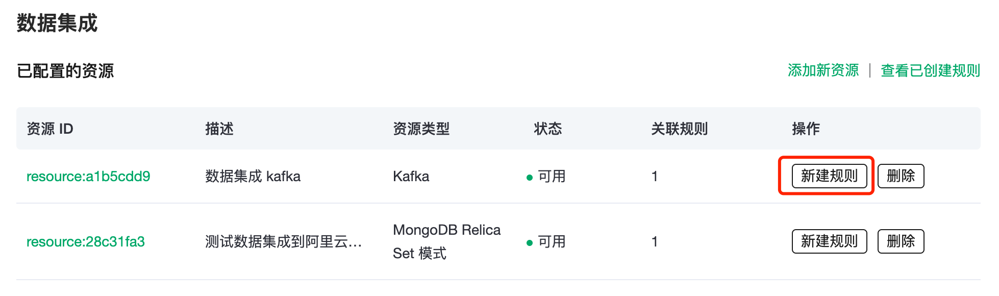

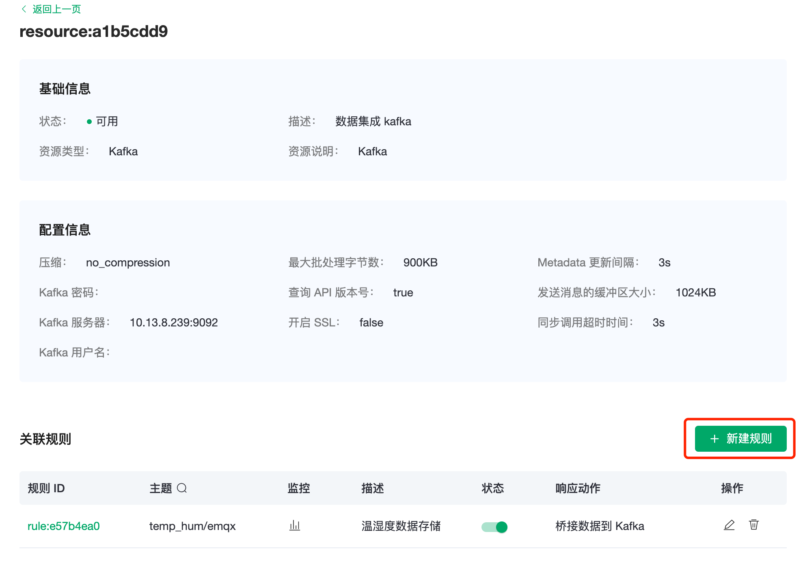


2. 在下面的规则语句中，我们从 temp_hum/emqx 主题中读取报告的时间`up_timestamp`，`clientid`，`payload`中的温度以及湿度。

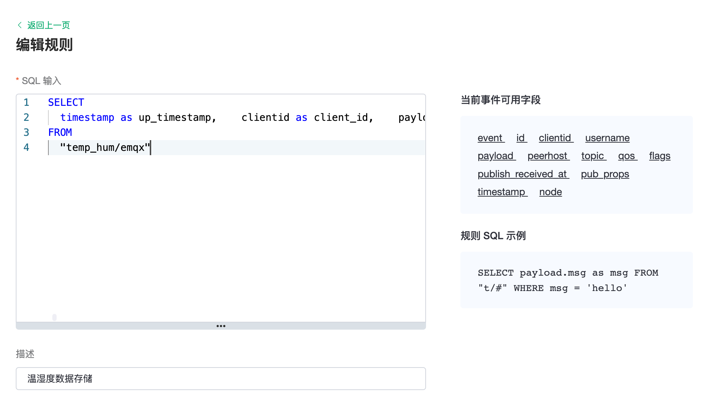

```sql
SELECT
  timestamp as up_timestamp,    clientid as client_id,    payload.temp as temp,    payload.hum as hum
FROM
  "temp_hum/emqx"
```


3. 创建一个新的测试SQL，点击` SQL 测试`后面的切换按钮，填写相应的测试参数，最后点击` SQL 测试`按钮。

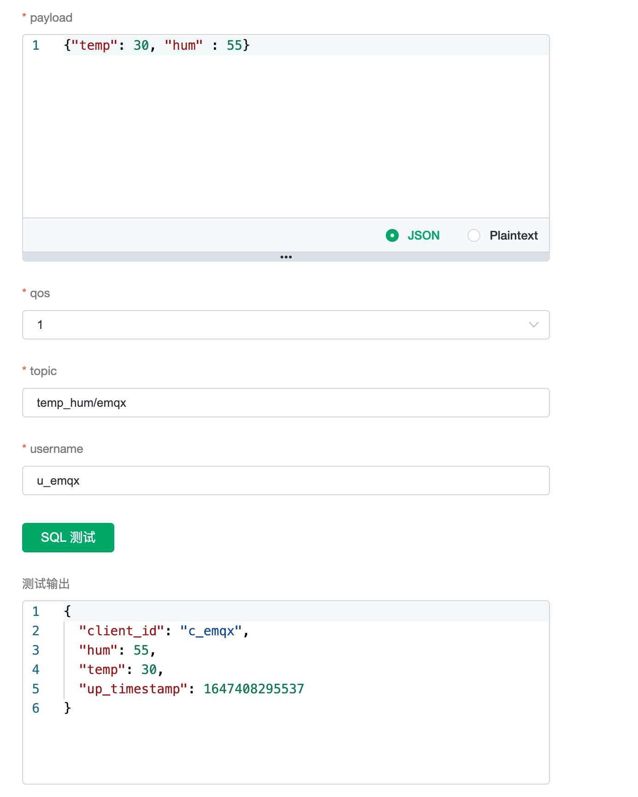

4. 在测试输出，我们可以看到预期的数据处理结果，规则完成之后，我们点击'下一步'并保存。


## 创建动作

动作解决了"将处理过的数据发送到哪里"的问题。它告诉 EMQX Cloud 如何处理规则所产生的数据。通常情况下，我们为目标资源设置配置和SQL模板。

1. EMQX Cloud 将设置配置的默认值。如果需要，你可以改变它们。

2. 对SQL模板进行编码，这里我们将取得的变量保存到 Kafka，并点击 "确认"来创建一个动作。

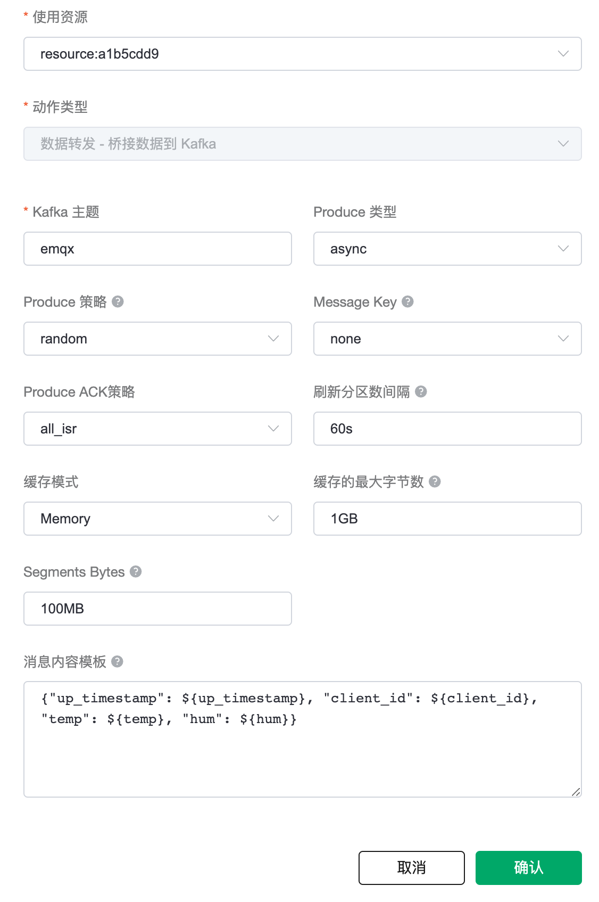

```
{"up_timestamp": ${up_timestamp}, "client_id": ${client_id}, "temp": ${temp}, "hum": ${hum}}
```

3. 一个规则可以与多个动作相关联。一个动作配置完成之后，还可以添加另一个动作，同时还可以改变目标资源。例如，我们可以一个动作把数据转发给 Kafka，同时另一个动作把数据保存到 RDS。

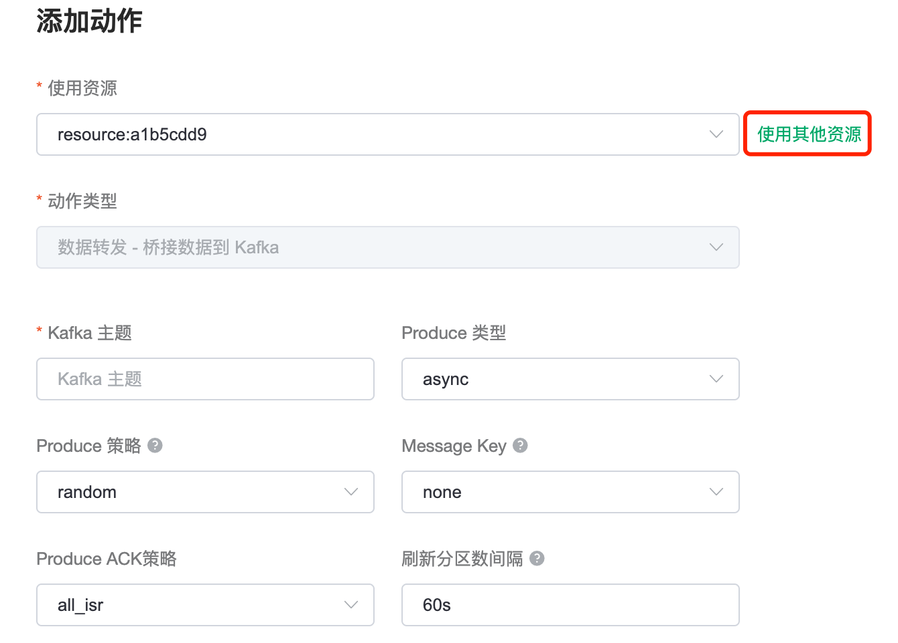

4. 当一个动作的数据传输失败时，我们还可以添加备选动作，确保能成功保存。

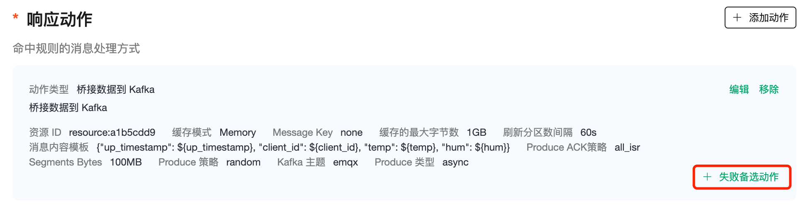

## 规则操作

### 编辑规则

点击编辑图标来编辑该规则。在编辑页面，你可以编辑规则的 SQL 模板，同时可以编辑、添加动作。

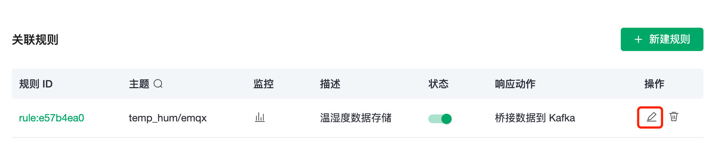

编辑页面

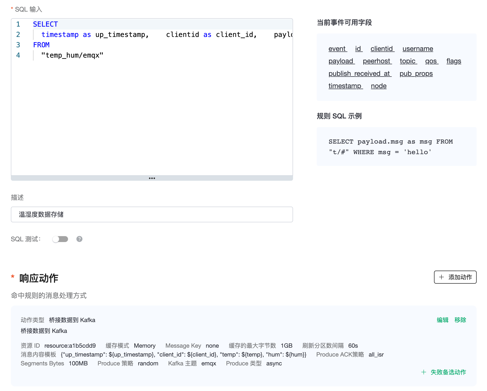


## 查看监控状态

1. 点击规则列表页上的规则监控图标。

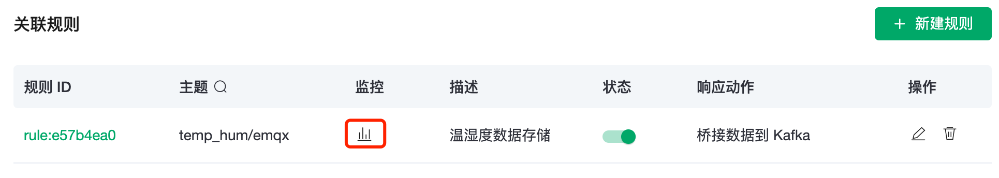

2. 状态面板上会显示规则命中的数据详情。

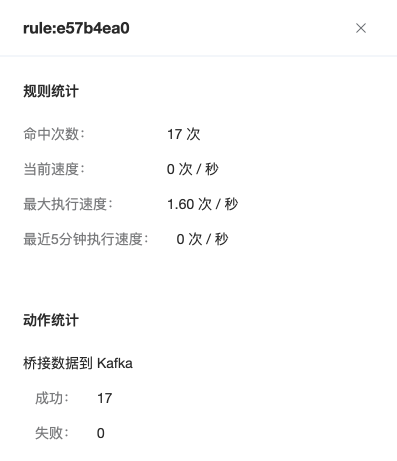

## 删除规则

在资源详情页，你可以删除该资源关联的规则。

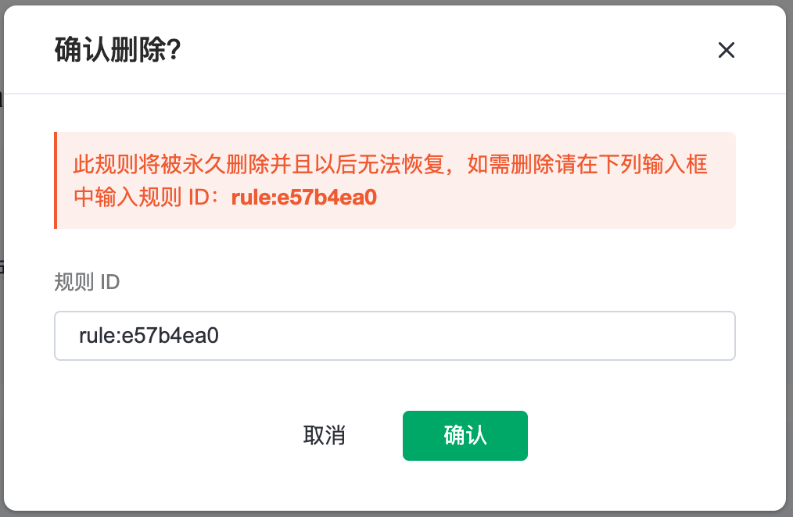