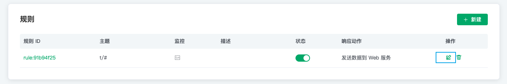

# 规则

规则描述了「数据从哪里来」、「如何筛选并处理数据」、「处理结果到哪里去」三个配置，即一条可用的规则包含三个要素：

- 触发事件：规则通过事件触发，触发时事件给规则注入事件的上下文信息（数据源），通过 SQL 的 FROM 子句指定事件类型；

- 处理规则（SQL）：使用 SELECT 子句 和 WHERE 子句以及内置处理函数， 从上下文信息中过滤和处理数据；

- 响应动作：如果有处理结果输出，规则将执行相应的动作，如持久化到数据库、重新发布处理后的消息、转发消息到消息队列等。一条规则可以配置多个响应动作。

## 简单示例

如下图所示规则，该条规则用于处理**消息发布**时的数据，将全部主题消息的 msg 字段，消息 topic 、qos 筛选出来，发送到 Web Server。您可以参阅 [EMQ X 规则](https://docs.emqx.cn/cn/broker/latest/rule/rule-engine.html)了解更多使用指南。

## 添加规则

在创建规则引擎之前您需要确保部署状态为**运行中**

1. 登录 [EMQ X Cloud 控制台](https://cloud.emqx.cn/console/)

2. 点击所需连接的部署，您将进入部署详情页面

3. 点击左侧菜单`规则引擎`，在规则面板点击创建按钮

   

5. 新建一条测试 SQL，点击 `SQL 测试` 后面的开关，并填写相应的测试参数，最后点击 `SQL 测试`按钮

   

6. 添加动作

   > 注意： 添加动作之前，您需要保证已添加 [VPC 对等连接](../deployments//vpc_peering.md), 并已经 [创建资源](./resources.md)

   

   在弹出的动作配置对话框中，选择相应的动作类型，并填写相应动作的配置信息

   

## 查看规则监控状态

1. 登录 [EMQ X Cloud 控制台](https://cloud.emqx.cn/console/)

2. 点击所需连接的部署，您将进入部署详情页面

3. 点击左侧菜单`规则引擎`，在规则面板点击规则监控图标

   

## 编辑规则

1. 登录 [EMQ X Cloud 控制台](https://cloud.emqx.cn/console/)

2. 点击所需连接的部署，您将进入部署详情页面

3. 点击左侧菜单`规则引擎 `，在规则面板点击规则`编辑`按钮

   

   编辑规则时，也可对规则中添加的动作进行编辑

   

5. 更改规则状态

   

## 删除规则

1. 登录 [EMQ X Cloud 控制台](https://cloud.emqx.cn/console/)

2. 点击所需连接的部署，您将进入部署详情页面

3. 点击左侧菜单`规则引擎`，在规则面板点击`删除`按钮

   
