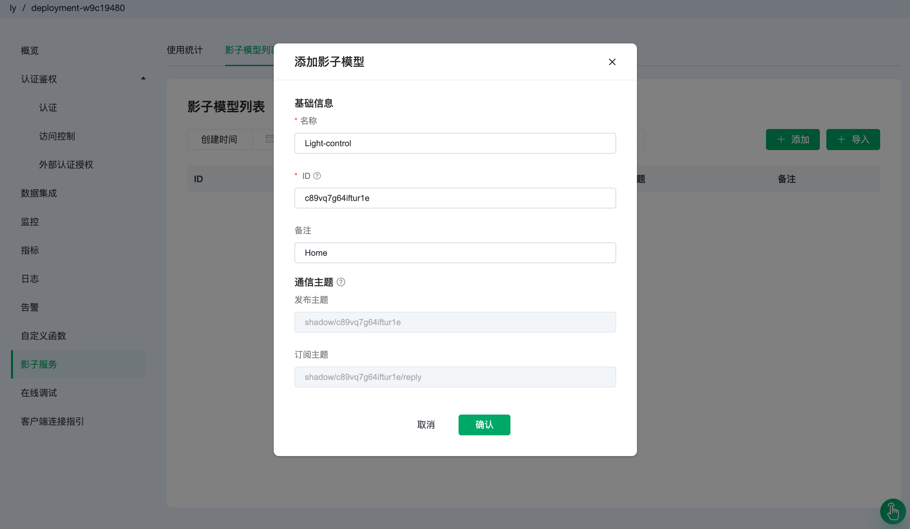
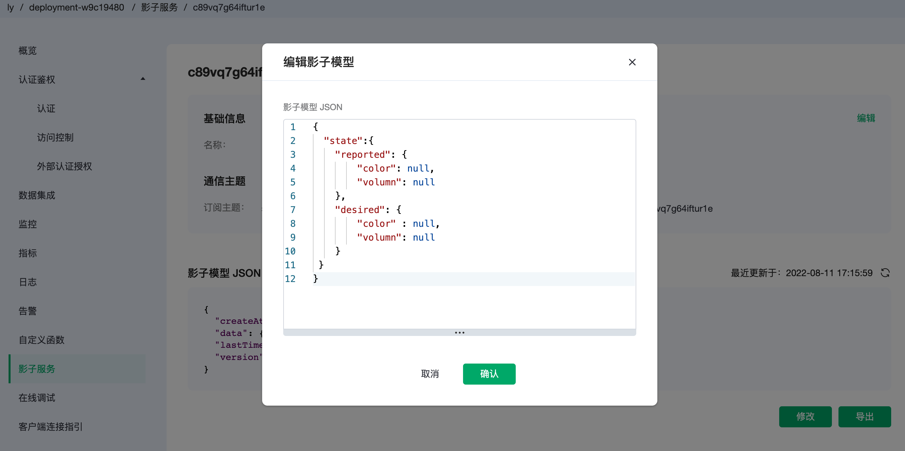
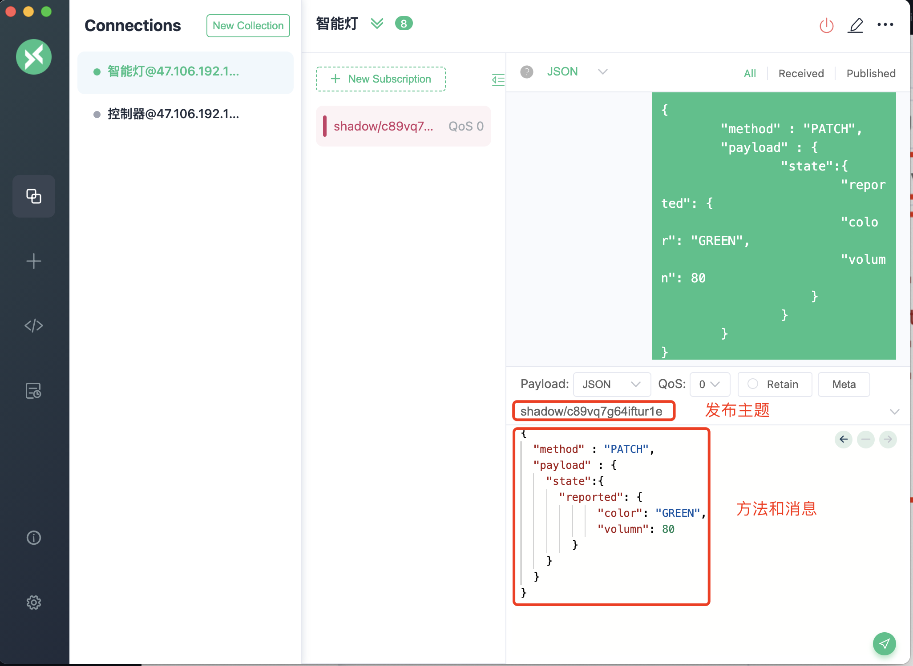
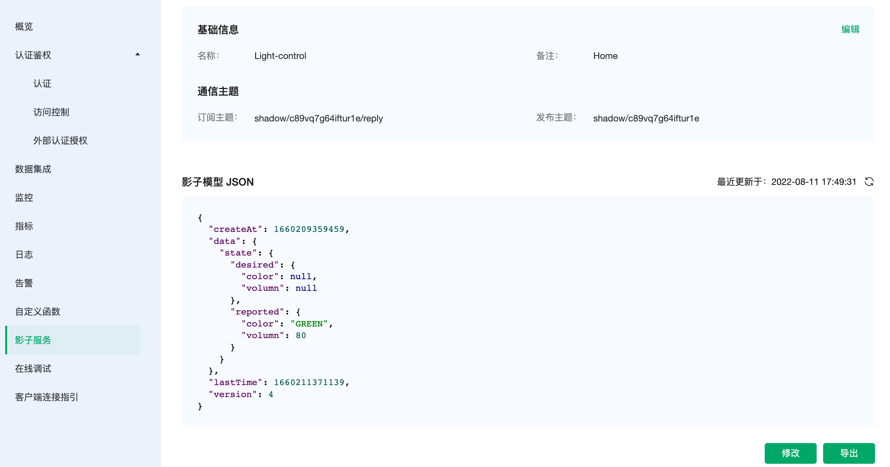
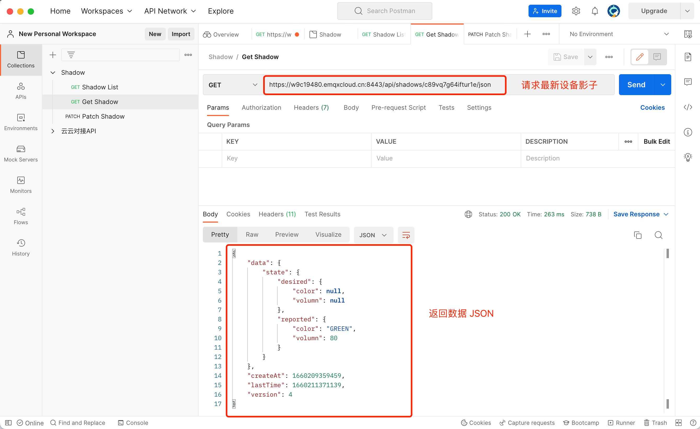
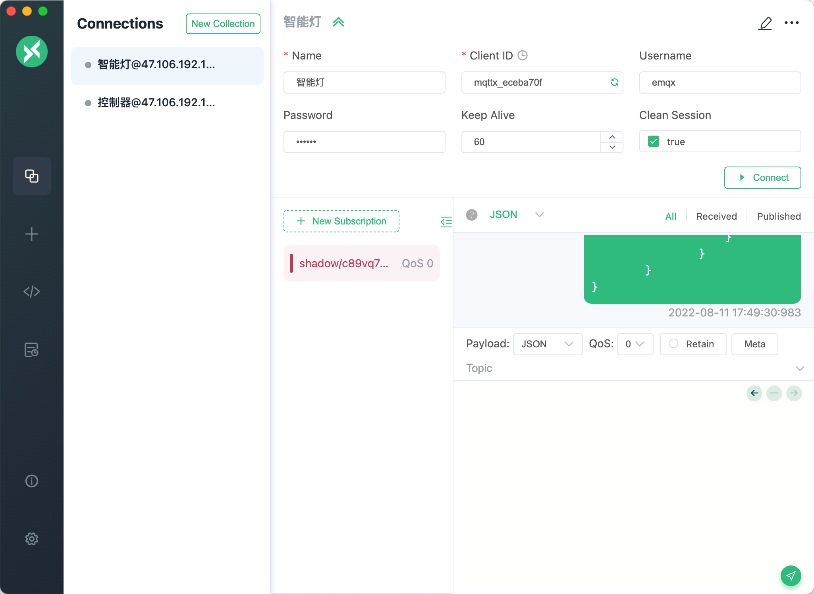
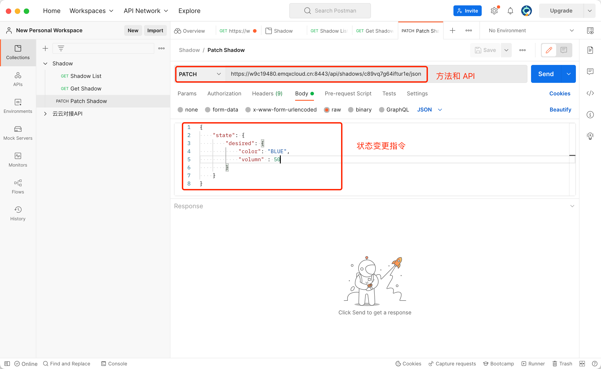
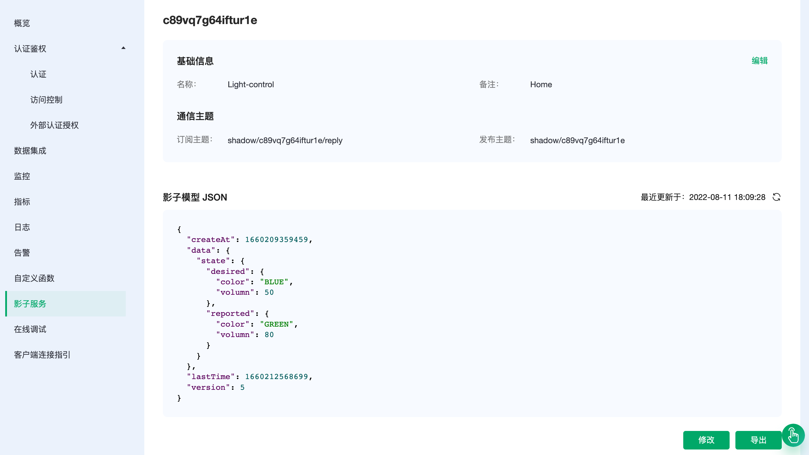
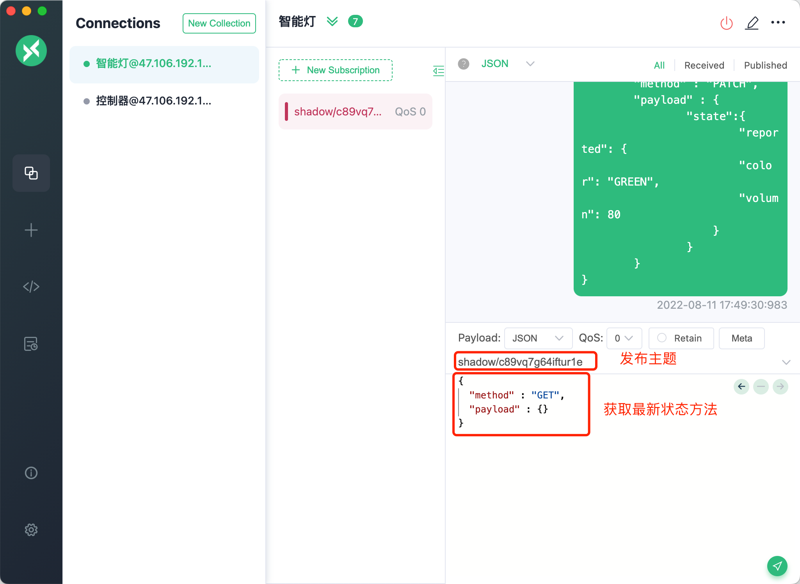
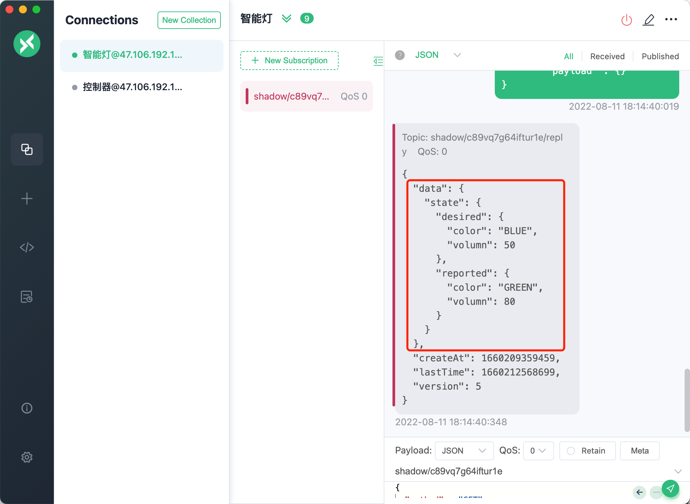

# 场景案例 - 设备影子物联网应用

设备影子是一项用途非常广泛的物联网应用。使用 EMQX Cloud 的影子服务可以快捷构建出设备影子服务。

## 什么是设备影子

物联网平台提供设备影子功能，用于缓存设备状态。设备在线时，可以直接获取物联网平台指令；设备离线后，再次上线可以主动拉取物联网平台指令。

设备影子是一个 JSON 文档，用于存储设备上报状态、应用程序期望状态信息。每个设备应该有一个设备影子，设备可以通过MQTT获取和设置设备影子来同步状态，该同步可以是影子同步给设备，也可以是设备同步给影子。


## 创建设备影子

### 前期准备

1. 创建用户名密码，并将设备连接到部署。设置用户名密码请查看[认证鉴权](../deployments/auth.md)。连接到部署请查看[连接指引](../connect_to_deployments/overview.md)。
2. 本文将使用 [MQTTX](../connect_to_deployments/mqttx.md) 作为客户端连接到部署并模拟设备。
3. 开通影子服务，开通条件及流程请参考[影子服务概览](./overview.md)。


### 创建影子模型

在影子服务，`影子模型列表`中点击`添加`按钮，填入名称，其他的系统默认生成即可。



点击影子模型 ID，进入详情页面，让模拟智能灯的客户端连接订阅“订阅主题”。


创建一个设备影子 JSON 模型，用来描述智能灯的颜色状态和亮度，指令下发的目标颜色和亮度。
``` json
{
    "state": {
        "reported": {
            "color": null,
            "volumn": null
        },
        "desired": {
            "color": null,
            "volumn": null
        }
    }
}
```
<table>
   <tr>
      <th>属性</th>
      <th>说明</th>
   </tr>
   <tr>
      <td>reported</td>
      <td>
      	设备的报告状态。设备可以在reported部分写入数据，报告其最新状态。应用程序可以通过读取该参数值，获取设备的状态。
      	包含两个字段：“color” - 字符串，“volumn” - 正整数</td>
   </tr>
   <tr>
      <td>desired</td>
      <td>
      	设备的预期状态。仅当设备影子文档具有预期状态时，才包含desired部分。
		应用程序向desired部分写入数据，更新事物的状态，如没有指令则为 “null”。
	  </td>
   </tr>
</table>

首先可以在影子模型中更新 JSON 的初始状态，点击修改按钮并更新。




### 应用场景一：应用程序请求获取设备状态
场景描述：

- 设备网络不稳定，设备频繁上下线，无法正常响应应用程序的请求。
- 设备网络稳定，同时响应多个应用程序的请求，即使响应的结果一样，设备本身处理能力有限，也会无法负载多次请求。

使用设备影子机制，设备状态变更，只需同步状态给设备影子一次，应用程序请求获取设备状态，不论应用程序请求数量，和设备是否联网在线，都可从设备影子中获取设备当前状态，实现应用程序与设备解耦。

1. 设备上线后上报最新的状态，只需要增量更新 “reported” 字段。
``` json
{
   "method": "PATCH",
    "payload": {
        "state": {
            "reported": {
                "color": "GREEN",
                "volumn": 80
            }
        }
    }
}
```




2. 可以看到影子模型数据已经更新



3. 应用端获取设备状态，可以相应多个应用程序的请求




### 应用场景二：应用程序下发指令给设备，变更设备状态
场景描述：

- 设备处于下线状态，或设备网络不稳定，设备频繁上下线，应用程序发送控制指令给设备，设备不在线，指令就会发送失败。

- 使用设备影子机制，可以将应用程序下发的指令，携带时间戳存储到设备影子中。设备再上线时，获取设备影子中指令，并根据时间戳确定是否执行。

1. 模拟设备的客户端连接处于下线状态



2. 应用端发送指令



3. 可以看到影子模型数据已经更新




4. 设备上线发送获取消息方法



5. 设备获取到最新的指令状态，并可以根据时间戳选择是否执行更新状态


