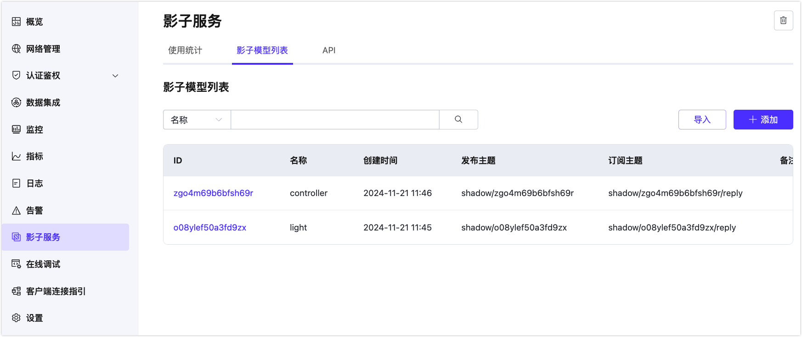
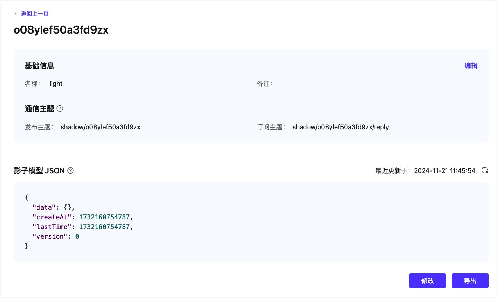

# 影子服务功能概览

## 统计概览页面
在统计概览页面，您可以了解到影子服务的使用情况的指标。

### 存储使用量
1. 查询购买的规格以及存储空间使用量
2. 服务系统默认将占用约 90MB 的存储空间
3. 存储使用量的显示的数值为上一个小时的平均使用量，每一小时更新一次

### 本月调用次数
1. 调用次数包含了设备和客户端对 Topic 消息的发布，以及使用 API 的调用，不会计算设备端订阅的消息接收次数。
2. 系统默认将对服务进行状态检测，调用会显示在数据指标的图表中，但**不会被记入调用次数**。

### 数据指标

指标可按照不同的时间维度进行数据统计展示。统计为坐标点时间的实时用量统计值。

## 影子模型列表页面
在影子模型列表页面您可以添加、编辑、修改影子模型，并且可以通过模板批量导入自定义的影子模型。

### 创建影子模型
点击添加按钮，打开新建弹框

<table>
   <tr>
      <th>字段信息</th>
      <th>是否必填</th>
      <th>填写说明</th>
   </tr>
   <tr>
      <td>名称</td>
      <td>是</td>
      <td>
      	只允许 3 到 50 个字符，并且只能包含中文字符、字母、数字、"-"、"_", "."
	  </td>
   </tr>
   <tr>
      <td>ID</td>
      <td>是</td>
      <td>ID是该影子模型的全局唯一标识，将用到 Topic 和 API中，最少8位，最多64位，并且只可以包含字母，数字，“_”，和 “-”。如不填写系统将自动生成。</td>
   </tr>
   <tr>
      <td>备注</td>
      <td>否</td>
      <td>无特别说明</td>
   </tr>
   <tr>
      <td>发布主题</td>
      <td>系统填写</td>
      <td>根据 ID 系统自动生成，用于设备端消息的发布</td>
   </tr>
   <tr>
      <td>订阅主题</td>
      <td>系统填写</td>
      <td>根据 ID 系统自动生成，用于设备端消息的接收</td>
   </tr>
</table>

### 影子模型详情
点击影子模型列表中的 ID，或者点击编辑按钮，进入影子模型详情页面。在此页面可以查看和修改当前模型的名称、备注。同时可以看到模型 JSON 最新的数据。并且可以对 JSON 进行修改。

::: tip Tip
影子模型一旦创建，就无法对 ID 进行修改
:::

对发布主题以及订阅主题的使用，请查看 [影子模型通信](./invoke.md)。

