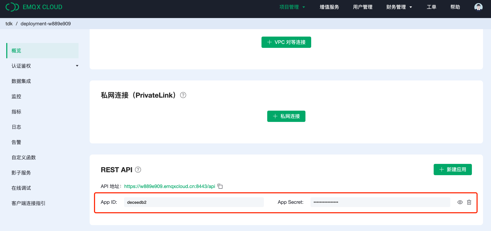

# 服务调用和通信

## MQTT 通信
设备通过 topic 和 broker 之间做 MQTT 的通信，这和其他常规的 topic 通信没有区别，影子服务额外 提供了存储（数据缓存）能力。设备端或者应用端可通过影子服务包含的两个 topic 进行通信，即用于设备端的数据上报的发布主题，以及用于设备端做数据接收的订阅主题。

### 主题和方法

<table>
   <tr>
      <th>Topic</th>
      <th>说明</th>
   </tr>
   <tr>
      <td>shadow/${shadow_id}</td>
      <td>发布主题全局唯一，用于设备端/客户端发布更新消息，或者获取最新的影子模型。</td>
   </tr>
   <tr>
      <td>shadow/${shadow_id}/reply</td>
      <td>订阅主题全局唯一，用于设备端/客户端接收最新的消息。</td>
   </tr>
</table>

主题中除了 `payload` 存放消息之外，还需定义 `method` 来告知服务应该如何更新消息。
<table>
   <tr>
      <th>method类型</th>
      <th>说明</th>
   </tr>
   <tr>
      <td>PUT</td>
      <td>请在<strong>发布主题</strong>中使用该方法，对应 HTTP 的 PUT 方法，用于<strong>全量更新</strong> 影子模型 data 的数据，用法请见调用示例。</td>
   </tr>
   <tr>
      <td>PATCH</td>
      <td>请在<strong>发布主题</strong>中使用该方法，对应 HTTP 的 PATCH 方法，用于<strong>增量更新</strong> 影子模型 data 的数据，用法请见调用示例。</td>
   </tr>
   <tr>
      <td>GET</td>
      <td>请在<strong>发布主题</strong>中使用该方法，对应 HTTP 的 GET 方法，用于在<strong>订阅主题</strong>中获得最新的 影子模型 JSON 数据。</td>
   </tr>
</table>

**在使用 PATCH 方法更新 paylaod 的情况下，不能新增多层级对象，请见调用示例。**

影子服务 JSON
``` json
{
    "lastTime": 1660204233317, //最新一次更新的时间
    "data": {}, // 主题或者 API 发布的消息主体
    "createAt": 1660201961567, //JSON 创建时间
    "version": 3 // 该影子模型更新的次数
}
```


### 调用示例

使用增量更新的方法更新影子模型数据，使用 `PATCH` 方法以及 `payload` 存放消息
``` json
// 影子模型 data
{
    "Key01": {
        "a": 100
    }
}

// 发布主题（shadow/${shadow_id}）增量更新
{
	"method": "PATCH",
    "payload": {
        "Key01": {
            "c": 300,
            "b": 200
        }
    }
}

// 影子模型 data 将更新为
{
    "Key01": {
        "a": 100,
        "c": 300,
        "b": 200
    }
}
```

增量更新的方法不能新增多层对象
``` json
// 影子模型 data
{
    "Key01": {
        "a": 100
    }
}

// 以下直接添加多层新对象的方式都会报错
{
	"method": "PATCH",
    "payload": {
        "Key01": {
            "a": 100
        },
        "Key02": {
            "b": 200
        }
    }
}

{
	"method": "PATCH",
    "payload": {
        "Key01": {
            "a": 100,
            "Key02": {
                "b": 200
            }
        }
    }
}

// 如果需要多层新对象，请逐层添加，或者使用全量更新方法来添加
{
	"method": "PATCH",
    "payload": {
        "Key01": {
            "a": 100
        },
        "Key02": {}
    }
}

{
	"method": "PATCH",
    "payload": {
        "Key01": {
            "a": 100
        },
        "Key02": {
            "b": 200
        }
    } 
}

```


使用全量更新的方法更新影子模型数据，使用 `PUT` 方法以及 `payload` 存放消息
``` json
// 影子模型 data
{
    "Key01": {
        "a": 100
    }
}

// 发布主题（shadow/${shadow_id}）全量更新
{
	"method": "PUT",
    "payload": {
        "Key01": {
            "c": 300,
            "b": 200
        },
        "Key02": {
            "d": 400
        }
    }
}

// 影子模型 data 将更新为
{
    "Key01": {
        "c": 300,
        "b": 200
    },
    "Key02": {
        "d": 400
    }
}
```

使用 GET 方法获取影子模型数据
``` json
// 影子模型 data
{
    "Key01": {
        "a": 100
    },
    "Key02": {
        "b": 200
    }
}

// 发布主题（shadow/${shadow_id}）全量更新
{
    "payload": {},
    "method": "GET"
}

// 订阅主题（shadow/${shadow_id}/reply）将接收到影子模型 JSON
{
    "lastTime": 1660204233317,
    "data": {
        "Key01": {
            "a": 100
        },
        "Key02": {
            "b": 200
        }
    },
    "createAt": 1660201961567,
    "version": 2
}
```


## API 通信
您自己的应用开发，可以使用 API 来获取影子服务的相关信息，请查看 API 列表


### 生成 APP ID
在使用 API 之前，需要在影子服务开通的部署中获取 APP ID 以及 APP Secret 用于 API 调用的认证鉴权。请在`部署概览`， 下拉至 `REST API` 部分，点击`新建应用`，使用生成的 APP ID 以及 APP Secret。更多关于 API 使用请查看 [REST API](../api/introduction.md)。




### API 列表

<table>
   <tr>
      <th>URL</th>
      <th>方法</th>
      <th>说明</th>
   </tr>
   <tr>
      <td>/shadows</td>
      <td>POST</td>
      <td>新建影子模型</td>
   </tr>
   <tr>
      <td>/shadows</td>
      <td>GET</td>
      <td>获取影子模型列表</td>
   </tr>
   <tr>
      <td>/shadows/${shadow_id}</td>
      <td>GET</td>
      <td>获取指定影子模型信息</td>
   </tr>
   <tr>
      <td>/shadows/${shadow_id}</td>
      <td>PUT</td>
      <td>更新指定影子模型信息</td>
   </tr>
   <tr>
      <td>/shadows/${shadow_id}</td>
      <td>DELETE</td>
      <td>删除指定影子模型</td>
   </tr>
   <tr>
      <td>/shadows/${shadow_id}/json</td>
      <td>GET</td>
      <td>获取指定影子模型 JSON</td>
   </tr>
   <tr>
      <td>/shadows/${shadow_id}/json</td>
      <td>PUT</td>
      <td>全量更新指定影子模型 JSON</td>
   </tr>
   <tr>
      <td>/shadows/${shadow_id}/json</td>
      <td>PATCH</td>
      <td>增量更新指定影子模型 JSON</td>
   </tr>
</table>

### 调用示例

#### 获取影子服务列表

##### Example request

> GET `/shadows/?_page=1&_limit=10`

##### Example response

```json
{
    "meta": {
        "limit": 10,
        "page": 1,
        "count": 1
    },
    "items": [
        {
            "description": "123",
            "updatedAt": "2022-06-10 03:20",
            "shadowID": "test_dm1",
            "createdAt": "2022-06-10 03:20",
            "shadowName": "test"
        }
    ]
}
```

#### 获取影子模型信息

##### Example request

> GET `/shadows/<str: shadow_id>`

##### Example response

```json
{
    "description": "123",
    "updatedAt": "2022-06-10 03:20",
    "shadowID": "test_dm",
    "createdAt": "2022-06-10 03:20",
    "shadowName": "test"
}
```

#### 获取指定影子模型 JSON

##### Example request

> GET `/shadows/<str: shadow_id>/json`

##### Example response

```json
{
    "color": "blue",
    "state": 1,
    "power": 0
}
```

#### 创建影子模型

##### Example request

> POST `/shadows`

```json
{
    "description": "123",
    "shadowID": "test_dm",
    "shadowName": "test"
}
```

##### Example response

```json
{
    "description": "123",
    "updatedAt": "2022-06-10 03:39",
    "shadowID": "test_dm",
    "createdAt": "2022-06-10 03:39",
    "shadowName": "test"
}
```

#### 更新影子模型信息

##### Example request

> PUT `/shadows/<str: shadow_id>`

```json
{
    "description": "",
    "shadowName": "test"
}
```

##### Example response

```json
{
    "description": "",
    "updatedAt": "2022-06-10 03:39",
    "shadowID": "test_dm",
    "createdAt": "2022-06-10 03:39",
    "shadowName": "test"
}
```

#### 更新影子模型 JSON

##### Example request

> PUT `/shadows/<str: shadow_id>/json`

```json
{
    "color": "blue",
    "state": 1,
    "power": 0
}
```

##### Example response

```json
{
    "color": "blue",
    "state": 1,
    "power": 0
}
```


#### 删除影子模型

##### Example request

> DELETE `/shadows/<str: shadow_id>`
