# 场景案例 - 构建物模型管理应用（Demo）

物模型可将物理世界中的设备功能进行数字化定义，便于应用更便利的管理设备。

## 什么是物模型应用

物模型应用一方面提供定义和管理物模型的能力，可以将定义好的模型下发给设备，用做设备物理能力的投射；另一方面，物模型应用可以获取设备上报的状态，展示在某个物模型下所有设备的状态。

本质说来物模型是一个 JSON 文档，用于开发定义一个产品的功能。对于影子服务来说，JSON 的定义完全是自由的，用户可以根据自己平台的要求来实现对物模型定义的具体要求，这也是影子服务非常灵活的一个地方。


在本篇文章中，将围绕和影子服务之间的交互做核心讲解，设备端的开发以及应用端的实现将以示意图或伪代码的方式做呈现。本文的讲解最终将实现一个通用的物模型应用的 Demo，帮助 EMQX Cloud 的用户快速开展自己的业务。

## 创建物模型应用

### 前期准备

1. 创建用户名密码，并将设备连接到部署。设置用户名密码请查看[认证鉴权](../deployments/auth.md)。连接到部署请查看[连接指引](../connect_to_deployments/overview.md)。
2. 本文将使用 [MQTTX](../connect_to_deployments/mqttx.md) 作为客户端连接到部署并模拟设备。
3. 开通影子服务，开通条件及流程请参考[影子服务概览](./overview.md)。

### 物模型应用架构

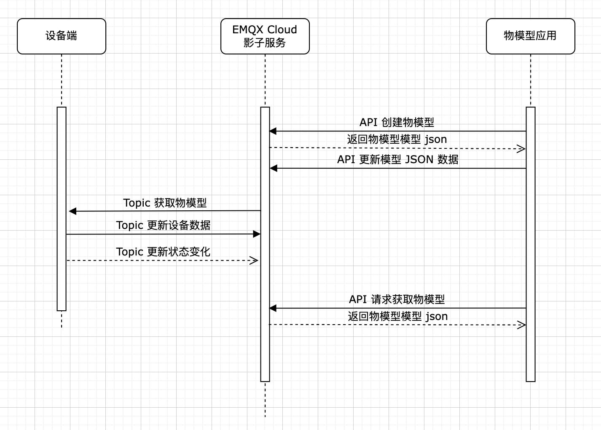

### 定义物模型数据类型

我们这里定义的物模型对应着多数 IoT 平台的"产品"的概念，可以理解为是一类设备的抽象能力的集合。这里定义了一个简单的物模型，包含了物模型的原信息和设备属性的信息。当然你也可以根据对物模型较为通用的定义去增加“事件”和“服务”相关的字段结构。

``` json
{
  "profile": {
    "version": "物模型版本",
    "Things_Model_ID": "物模型id",
    "Things_Model_Name": "物模型名称"
  },
  "properties": [
    {
      "id": "属性的标识符",
      "name": "属性名称",
      "data_transfer_type":"数据传输类型",
      "dataType": {
        "type": "数据类型",
        "specs": {}
      },
      "expands" : {
        "remark" : "备注"
      }
    }
  ],
}
```
#### 相关字段说明
<table>
   <tr>
      <th>字段</th>
      <th>说明</th>
   </tr>
   <tr>
      <td>profile</td>
      <td>存储物模型相关的信息的对象</td>
   </tr>
   <tr>
      <td>version</td>
      <td>物模型版本更新号</td>
   </tr>
   <tr>
      <td>Things_Model_ID</td>
      <td>物模型id</td>
   </tr>
   <tr>
      <td>Things_Model_Name</td>
      <td>物模型名称</td>
   </tr>
   <tr>
      <td>properties</td>
      <td>存放物模型属性，或者说产品功能点的对象</td>
   </tr>
   <tr>
      <td>id</td>
      <td>属性的标识符</td>
   </tr>
   <tr>
      <td>name</td>
      <td>属性的名称</td>
   </tr>
   <tr>
      <td>data_transfer_type</td>
      <td>数据传输类型，分为:
      	<ul>
      	 <li>“只上报” - “RO” ("Report Only")</li>
      	 <li>“只下发” - “SO” ("Send Only")</li>
      	 <li>“上报和下发” - “RS” ("Report and Send")</li>
      	</ul>
      </td>
   </tr>
   <tr>
      <td>dataType</td>
      <td>定义属性的数据类型的对象</td>
   </tr>
   <tr>
      <td>type</td>
      <td>
      	定义属性的数据类型，包括
      	<ul>
      		<li>int: 整型。如 10</li>
      		<li>float: 单精度浮点型。如 10.1</li>
      		<li>double: 双精度浮点型。如 1.11</li>
      		<li>text: 字符串。如 “红色”</li>
      		<li>date: 时间戳。格式为String类型的UTC时间戳，单位：毫秒。如 1661396085328</li>
      		<li>bool: 布尔型。采用0（false）或1（true）来定义布尔值。如 0表示关、1表示开</li>
      		<li>enum: 枚举型。定义整型和字符串型的枚举。如 整数0表示红色，整数1表示蓝色，整数2表示绿色</li>
      	</ul>
      </td>
   </tr>
   <tr>
      <td>expands</td>
      <td>其他扩展的定义，比如这里的备注信息</td>
   </tr>
</table>

以上就定义好了物模型。在定义好了物模型的基础上，我们可以通过设备端添加物模型的物理的实例。这样我们在应用端就可以获取到物模型（也就是设备）的数据状态。

``` json
{
  "profile": {
    "version": "物模型版本",
    "Things_Model_ID": "物模型id",
    "Things_Model_Name": "物模型名称"
  },
  "properties": [
    {
      "id": "属性的标识符",
      "name": "属性名称",
      "data_transfer_type":"数据传输类型",
      "dataType": {
        "type": "数据类型",
        "specs": {}
      },
      "expands" : {
        "remark" : "备注"
      }
    }
  ],
  "devices":[
  	{
  	  "client_id" : "客户端 ID",
  	  "updatedAt" : "设备更新时间",
  	  "properties_name" : "设备数据"
  	}
  ]
}
```

### 开发应用端

定义好了物模型我们就可以开发应用端，实现一套可以定义该数据模型的能力和界面。我们在应用端（这里是页面管理系统）定义和管理物模型，并且能查看到连接的设备以及设备上报的数据。

在 Demo 中采用原型功能页面来演示。Demo 系统的页面结构如下
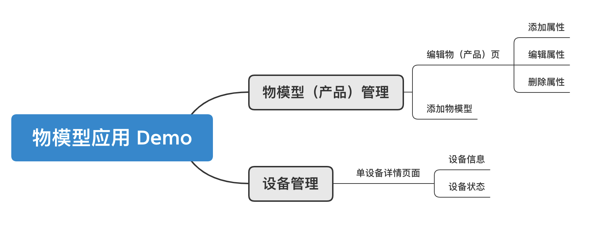


首先是物模型（产品）管理相关页面，功能是物模型的增删改查。

#### 物模型（产品）管理页
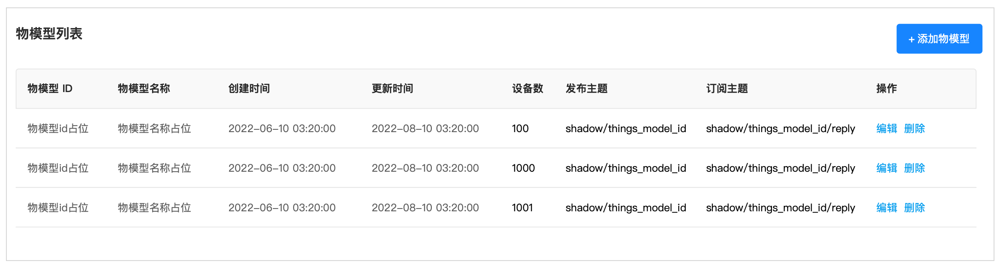

#### 物模型（产品）详情页


用来展示某个物模型的详细属性信息

#### 物模型（产品）新建/编辑页面
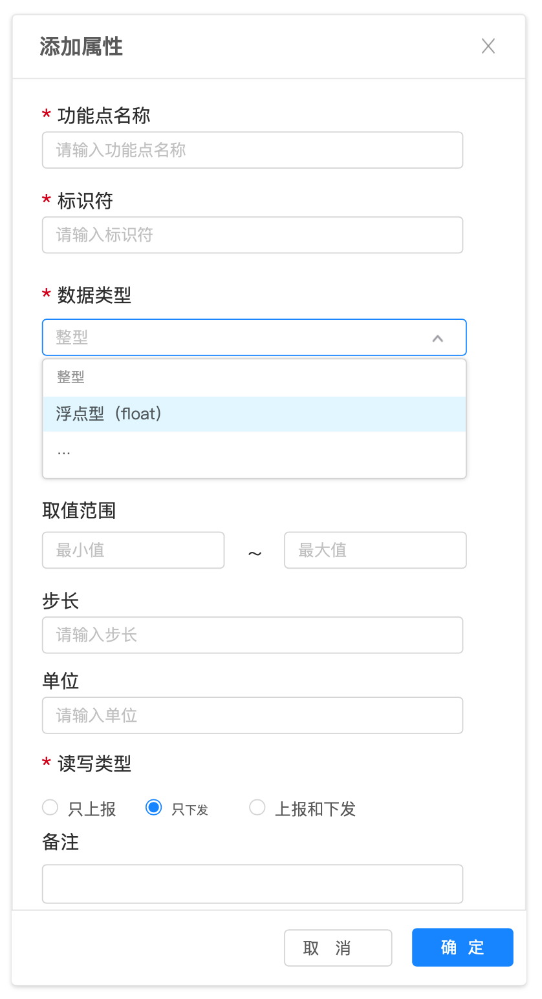

新建和编辑可以使用同一套页面，编辑页面的话默认会显示已有的信息。


然后我们需要构建设备管理相关页面，功能是产品下设备的状态管理或指令发送

#### 设备列表页面
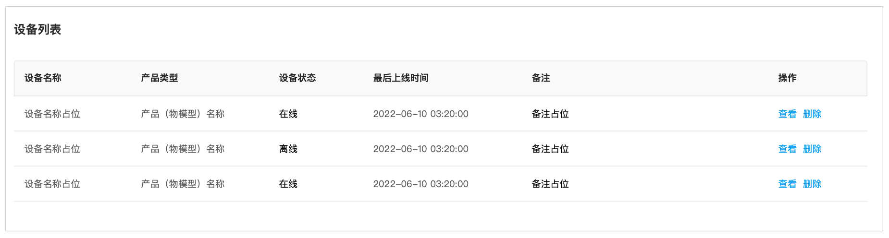

设备是物模型（产品）的物理实例，当然也可以是虚拟设备。

#### 设备详情页面
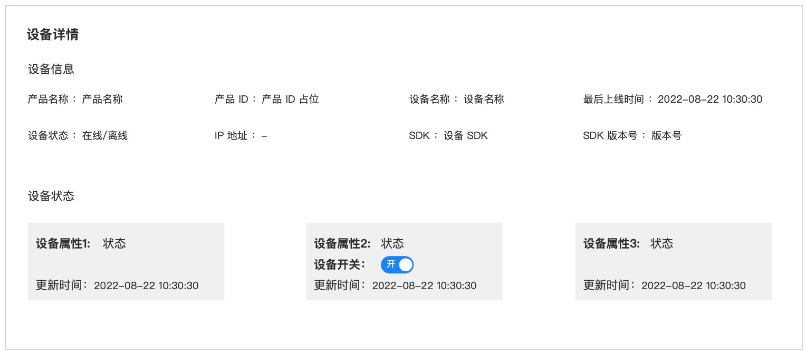

设备详情页面可以查看设备的状态，可以设置控件，向设备发送指令。可以根据产品和设备用户可以开发自己的嵌入式 SDK，将相关的通信主题和设备逻辑封装好。


### 应用端和影子服务的交互
应用端页面实现的一个重要环节就是和 EMQX Cloud 影子服务的交互，通过 API 来存储和获取信息，实现应用和服务的交互。


#### 创建物模型
我们可以通过影子服务 API 将页面上定义的物模型发送并存储，首先通过创建 API 来生成一个模型，其中可以使用物模型 ID 来定义 `shadowID`，使用 物模型名称来定义 `shadowName`。

**通信 URL**： POST /shadows

##### 请求消息

| 名称        | 类型   | 描述         |
| ----------- | ------ | ------------ |
| description | String | 影子模型描述 |
| shadowID    | String | 影子模型 ID  |
| shadowName  | String | 影子模型名称 |


##### 请求示例

```bash
curl --request POST \
  --url {api}/shadows \
  --user app_id:app_secret \
  --header 'Content-Type: application/json' \
  --data '{
  "shadowName":"Things_Model_Name",
  "shadowID" : "Things_Model_ID",
  "description": "note"
}'
```

#### 更新物模型 JSON
创建好了物模型之后，通过创建 JSON 的 API 来将在界面已定义的物模型 JSON 发送给影子服务。这样就初始化好了一个物模型

**通信 URL**：PUT /shadows/${shadow_id}/json

##### 请求示例

```bash
curl --request PUT \
  --url {api}/shadows/${Things_Model_ID}/json \
  --user app_id:app_secret \
  --header 'Content-Type: application/json' \
  --data '{
  "profile": {
    "Things_Model_ID": "model_id",
    "Things_Model_Name": "name",
    "version": "1"
  },
  "properties": [{
    "expands": {
      "remark": ""
    },
    "data_transfer_type": "RO",
    "dataType": {
      "type": "text"
    },
    "id": "prop_state",
    "name": "prop_name"
  }]
}'
```

#### 请求物模型最新状态展示
在设备详情页面，需要拿到当前物模型的状态的并且进行展示。我们可以使用获取物模型 JSON 的 API 查询数据并且展示。这里的 JSON 中应该是包含了所有上线注册了的设备。

**通信 URL**：GET /shadows/${shadow_id}/json

##### 请求示例

```bash
curl --request GET \
  --url {api}/shadows/${Things_Model_ID}/json \
  --user app_id:app_secret \
```

如果在设备的管理页面，我们除了功能展示还需要做指令的发送，我们可以使用局部更新的方法去更新模型。

**通信 URL**：PATCH /shadows/${shadow_id}/json

##### 请求示例

```bash
curl --request PATCH \
  --url {api}/shadows/${Things_Model_ID}/json \
  --user app_id:app_secret \
  --header 'Content-Type: application/json' \
  --data '{"devices[x]":{"properties_name":"data"}}'
```

关于更多的影子服务的 API 相关的内容请[查看这里](../api/shadow_service.md)。


### 设备端和影子服务的交互

#### 设备端获取物模型
设备端的首先获取到物模型，根据物模型对应的功能点更新数据。通过 GET 方法在 Topic “shadow/Things_Model_ID” 获取到物模型的 JSON。获取到物模型之后，根据设备端的具体逻辑，将设备的状态和物模型的字段进行匹配，以及其他的验证检测逻辑。

``` json
{
	"method": "GET",
  "payload": {}
}
```

#### 设备端初始化数据
设备端初始化更新设备数据，可以使用 PATCH 方法在 Topic “shadow/Things_Model_ID” 更新当前设备的数据，这里的 `devices[x]` 是使用下标的方式新建设备数据。
``` json
{
  "method": "PATCH",
  "payload": {
    "devices[x]": {
      "client_id": "客户端 ID",
      "updatedAt": "设备更新时间",
      "properties_name": "设备数据"
    }
  }
}
```

#### 设备端更新设备状态变化
如果设备只是上报最新的属性状态，同样可以使用 PATCH 方法在 Topic “shadow/Things_Model_ID” 更新，只需要更新变化的数据即可
``` json
{
  "method": "PATCH",
  "payload": {
    "devices[x]": {
      "updatedAt": "新的时间",
      "properties_name": "新的设备数据"
    }
  }
}
```

当设备需要接收应用端指令，可以订阅 Topic “shadow/Things_Model_ID/reply”，获取到 JSON 数据后做相应的更新。


## 物模型应用实践

接下来，就具体实现一个门磁产品的物模型应用管理，来验证整个应用的流程。

### 定义门磁物模型
首先我们定义一门磁的物模型，得到以下的 JSON
``` json
{
  "profile": {
    "version": 1,
    "Things_Model_ID": "tm_mc_001",
    "Things_Model_Name": "门磁001"
  },
  "properties": [{
      "id": "doorcontact_state",
      "name": "门磁状态",
      "data_transfer_type": "RO",
      "dataType": {
        "type": "bool"
      },
      "expands": {
        "remark": ""
      }
    },
    {
      "id": "battery_percentage",
      "name": "电池电量",
      "data_transfer_type": "RO",
      "dataType": {
        "type": "int",
        "specs": {
          "min": "0",
          "max": "100",
          "unit": "%",
          "unitName": "百分比",
          "step": "1"
        }
      },
      "expands": {
        "remark": "数值范围: 0-100, 步长: 1, 单位: %"
      }
    },
    {
      "id": "temper_alarm",
      "name": "防拆报警",
      "data_transfer_type": "RO",
      "dataType": {
        "type": "bool"
      },
      "expands": {
        "remark": ""
      }
    }
  ]
}
```

### 创建物模型
在使用 API 创建之前需要在部署生成相应的 App ID 和 APP Secret，请查看 [API 帮助](../api/introduction.md) 获得更多信息。

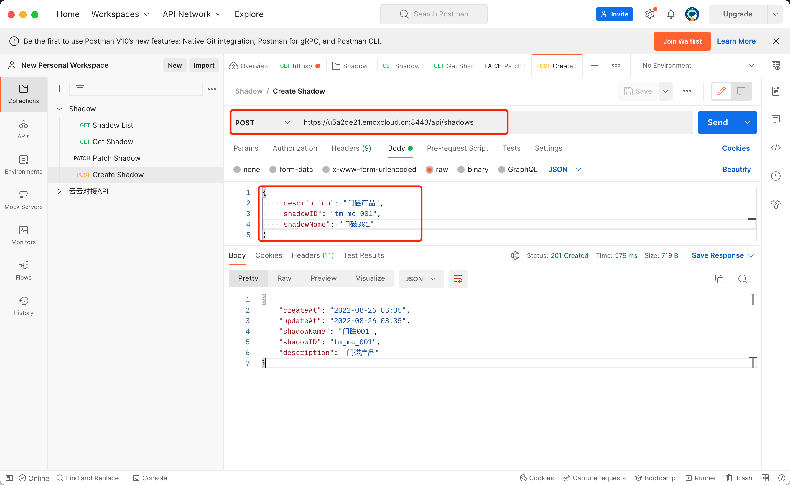
使用创建 api 创建一个模型，获得成功的返回。


在 EMQX Cloud 控制台的影子服务中可以看到创建的模型。

### 更新物模型的 JSON 数据结构

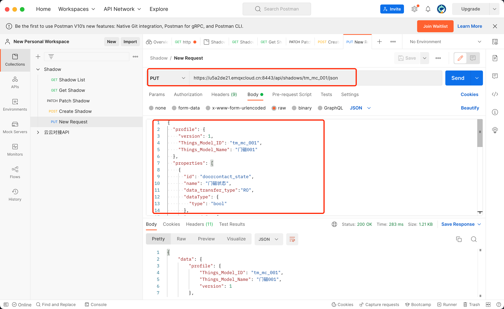
使用 PUT（全量更新的方法） 对于更新 JSON 数据的 API 更新我们定义好的物模型数据

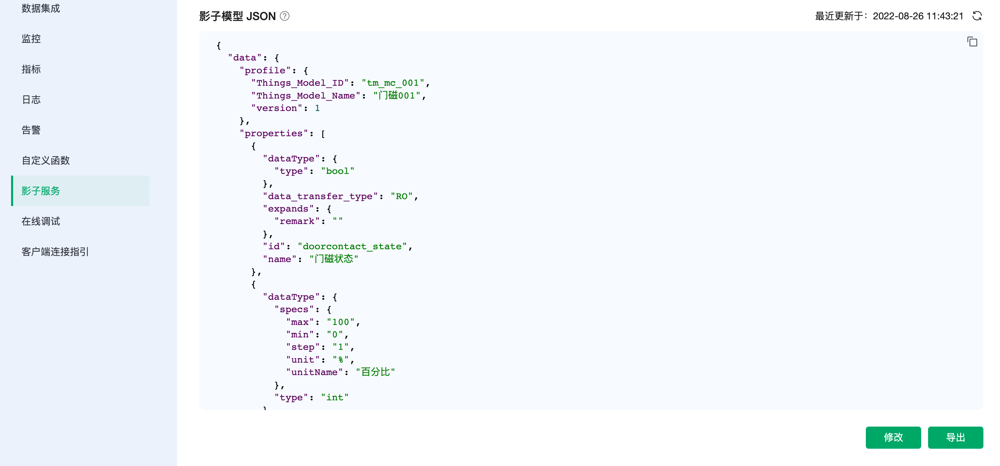
在 EMQX Cloud 控制台的影子服务中的影子模型详情中就可以看到完整的数据。


### 设备端获取物模型
设备端向通讯发布主题发送 GET 方法，在订阅主题中获取到当前产品的物模型。
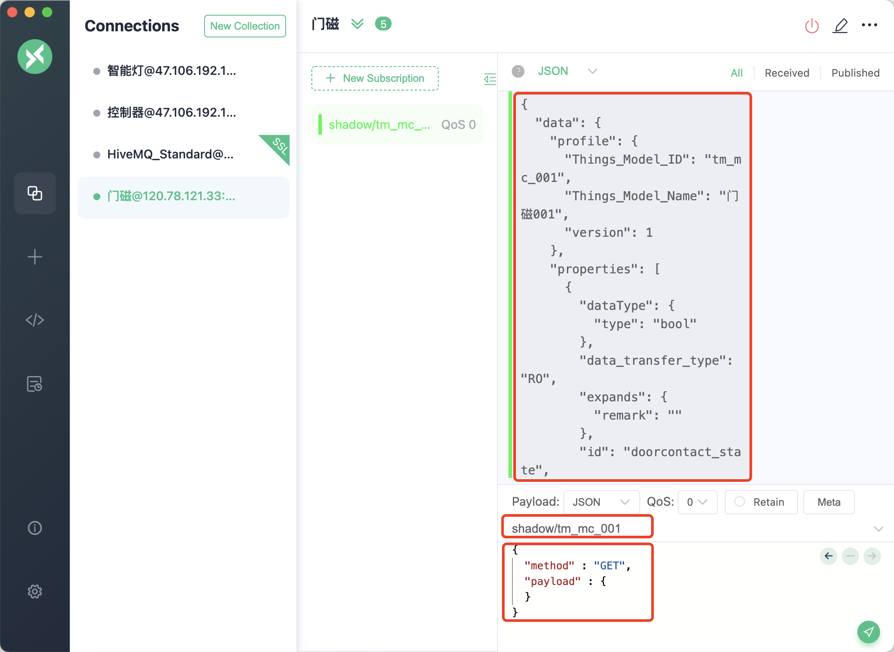


### 设备端发送设备数据
当我们完成设备的开发，设备上线之后获取到物模型，并使用 Topic "shadow/tm_mc_001" 对设备状态进行上报。
在使用 PATCH 方式的时候，payload 当中的数据的创建只能一层一层增加。所以我们需要逐层创建数据。详情请查看[调用方法](./invoke.md)。

#### 第一步
``` json
{
  "method": "PATCH",
  "payload": {
    "devices": []
  }
}
```
#### 第二步
``` json
{
  "method": "PATCH",
  "payload": {
    "devices": [{}]
  }
}
```
#### 第三步
``` json
{
  "method": "PATCH",
  "payload": {
    "devices[0]": {
      "client_id": "client_mc_eceba70f",
      "updatedAt": "2022-06-10 03:20:00",
      "doorcontact_state": 0,
      "battery_percentage": 90,
      "temper_alarm": 0
    }
  }
}
```

设备上报之后，就可以看到最新的含有设备状态的物模型的更新。
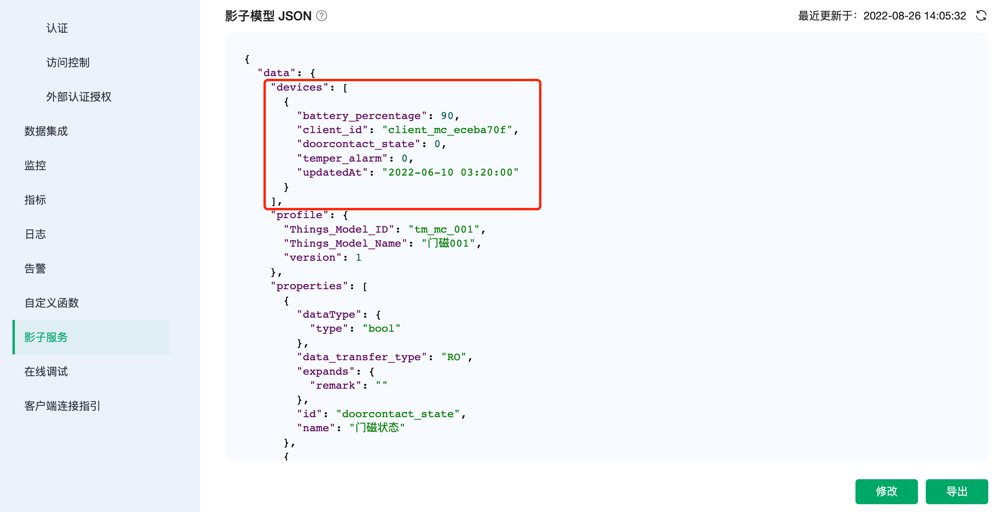


当门的开关状态被触发，门磁的状态发生变化时候，使用 Topic "shadow/tm_mc_001" 对门磁状态进行上报。
``` json
{
  "method": "PATCH",
  "payload": {
    "devices[0]": {
      "client_id": "client_mc_eceba70f",
      "updatedAt": "2022-06-10 04:20:00",
      "doorcontact_state": 1
    }
  }
}
```


同样其他的门磁设备上线时，可以上报多个设备的数据状态。
#### 第一步
``` json
{
  "method": "PATCH",
  "payload": {
    "devices[1]": {}
  }
}
```
#### 第二步
``` json
{
  "method": "PATCH",
  "payload": {
    "devices[1]": {
      "client_id": "client_mc_2dbbad82",
      "updatedAt": "2022-08-26 13:20:00",
      "doorcontact_state": 0,
      "battery_percentage": 100,
      "temper_alarm": 0
    }
  }
}
```

查看最新的物模型数据。

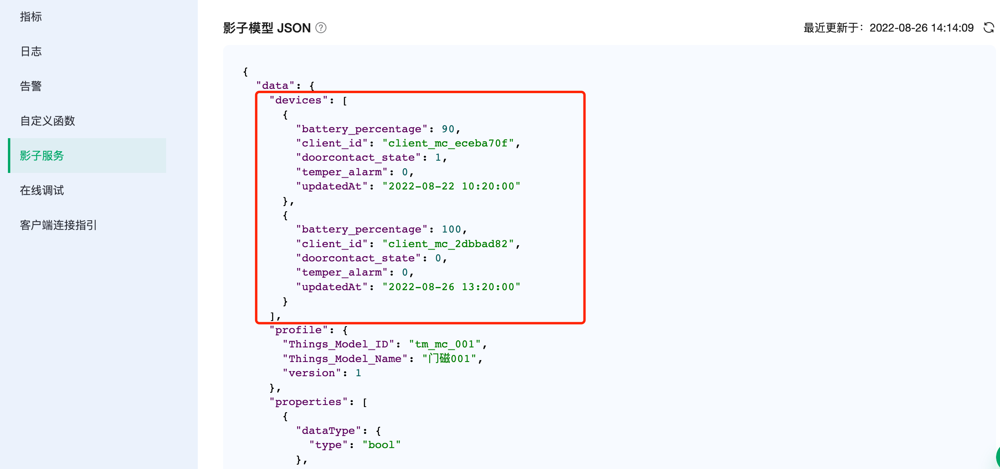


物模型应用端通过 API 可以获取物模型状态下所有设备的状态，从而可以实现应用界面。

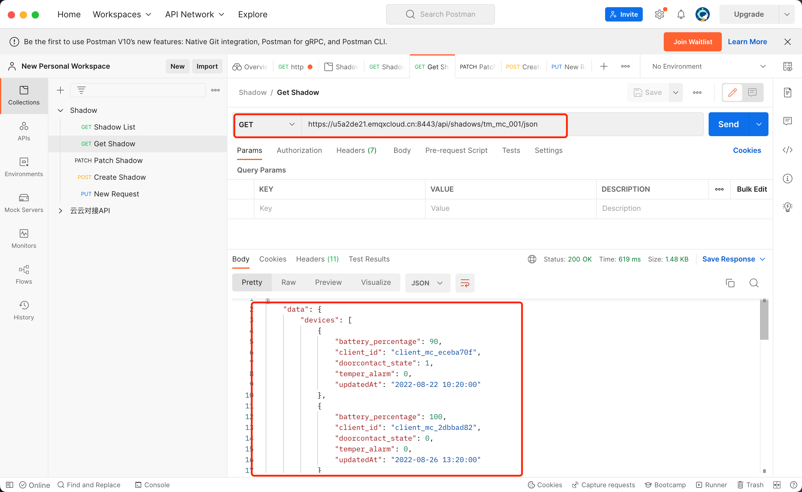


