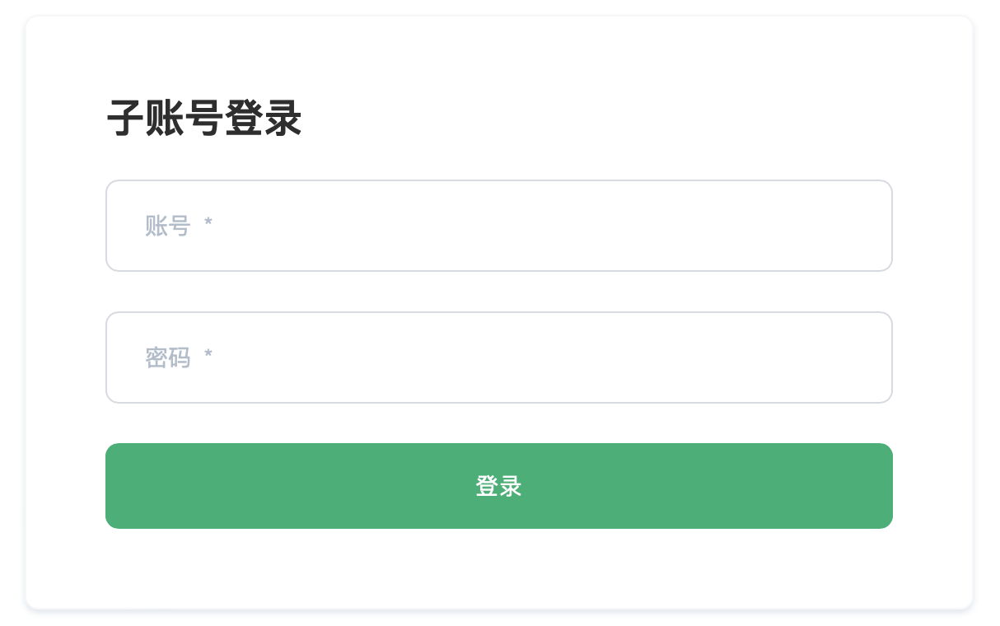

# 简介

用户管理提供了企业用户对于多角色的管理需求，对不同角色分配了不同操作权限和项目权限。企业内可以邀请不同的人员来对资源做精细化管理。

## 子账号角色体系
子账号是由EMQ X Cloud用户自己在平台上创建的账号，子账号也需要通过邮箱认证之后激活。同样一个邮箱即可以注册成一个EMQ X Cloud平台账号，也可以同时成为其他平台账号的子账号，通过不同的登录界面以登录不同的账号体系。

子用户的登录界面，仅用于子账号的登录

## 子账号分类
*管理员*： 和平台账号一样，拥有平台全部的权限，是子账号体系里的超级管理员。要注意的是，管理员虽然功能上和平台账号等同，但仍属于自账号的体系。

*项目管理员*:拥有查看修改项目的权限和修改删除部署的权限。项目管理员主要用于项目部署相关管理，比如一个组织或者部门需要单独拥有
一个项目管理集群，需要制定一个人专门负责某些项目，与此同时，并没有其他未授权的项目的权限。

*项目使用者*：拥有查看项目的权限和查看编辑部署的权限。项目使用者通常是业务人员，除了查看项目和查看部署权限，可以查看部署详情，使用规则引擎和监控，进一步处理的相关业务需求。

项目管理员和项目使用者的权限对比 TODO
<table>
   <tr>
      <th>版本</th>
      <th>规格</th>
      <th>基础费用</th>
      <th>赠送流量</th>
      <th>超出流量单价</th>
   </tr>
   <tr>
      <td rowspan="3">基础版</td>
      <td>1,000 连接 / 最高 1,000 TPS</td>
      <td>¥0.68/小时 起</td>
      <td rowspan="3">100G/月</td>
      <td rowspan="7">￥1.5/GB</td>
   </tr>
   <tr>
      <td>5,000 连接 / 最高 5,000 TPS</td>
      <td>￥1.28/小时 起</td>
   </tr>
   <tr>
      <td>1,0000 连接 / 最高 5,000 TPS</td>
      <td>￥1.68/小时 起</td>
   </tr>
   <tr>
      <td rowspan="5">专业版</td>
      <td>5,000 连接 / 最高 10,000 TPS</td>
      <td>￥2.18/小时 起</td>
      <td rowspan="2">100G/月</td>
   </tr>
   <tr>
      <td>10,000 连接 / 最高 20,000 TPS</td>
      <td>￥4.58/小时 起</td>
   </tr>
   <tr>
      <td>50,000 连接 / 最高 50,000 TPS</td>
      <td>￥10.99/小时 起</td>
      <td rowspan="2">1T/月</td>
   </tr>
   <tr>
      <td>100,000 连接 / 最高 100,000 TPS</td>
      <td>￥19.99/小时 起</td>
   </tr>
   <tr>
      <td>>100,000 连接</td>
      <td>￥19.99/小时 起</td>
      <td colspan="2" align="center">联系商务</td>
   </tr>
   <tr>
      <td>旗舰版</td>
      <td>无限制</td>
      <td colspan="3" align="center">联系商务</td>
   </tr>
</table>

财务：拥有财务管理权限，并可以查看项目和部署。财务人员可以掌握当前平台账号出账情况，并可以管理余额，发票等情况。
<table>
   <tr>
      <th>功能</th>
      <th>财务</th>
   </tr>
</table>
审计：可以查看项目和部署，并可以查看子用户和财务情况。审计角色针对了公司内部审计的需要，可以有平台各项功能的查看权限。
<table>
   <tr>
      <th>功能</th>
      <th>财务</th>
   </tr>
</table>