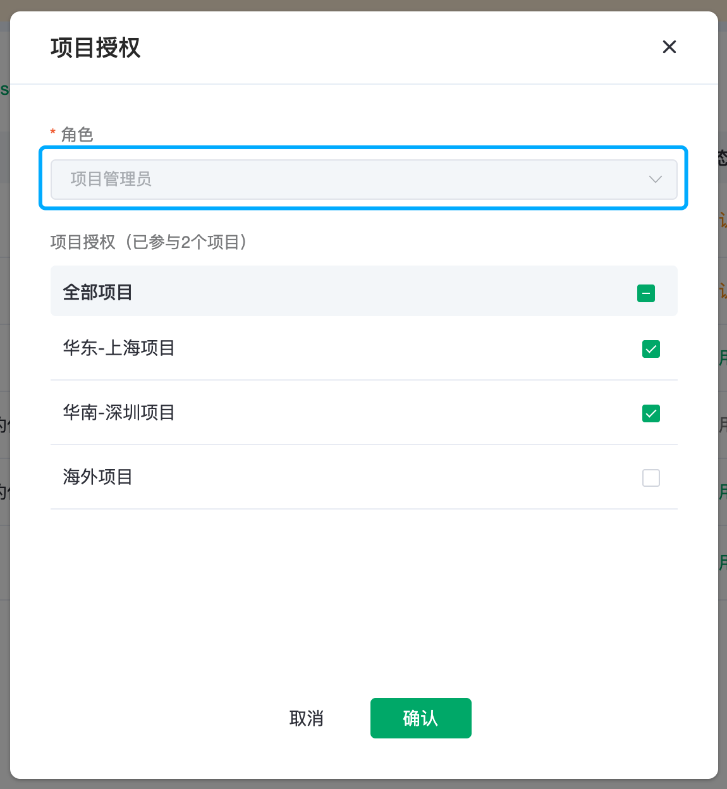

# 用户管理

## 创建子账号
1. 在`用户管理`中点击`新建用户`
	* 填写邀请人的邮箱
	* 填写密码，密码可以之后由管理员修改
	* 关联角色，可以选择一个或多个角色
	* 备注可选填

2. 登录邮箱，接收邀请邮件，并通过链接来验证并激活账号。需要注意的是，邀请邮件中有两个地址，一个是第一次激活并登录的，另一个为常用的登录地址，用于之后的登录。子账号的密码请由开通账号的管理员发放（或找管理员获得）。

 > 图中1链接是首次激活登录的链接，2链接是后续登录的链接，请不要弄混。

3. 子账号登录后，即可以根据系统设定的权限来管理平台，如需要开通某个项目的权限，请联系管理员。

## 用户管理

用户管理功能只对两种角色的子账号开放：管理员拥有全部操作权限，审计可以查看用户列表。

子账号登录地址区别于常规的登录页面，专门用于子账号的登录，可以在成员忘记登录地址时候进行发送。

项目列表显示了当前的子账号信息，只有子账号通过了邮件认证，状态才会变为启用。新建用户为项目管理员或项目使用者角色时候，会提示为该用户授权项目，否则子账号登录之后无任何项目和部署的权限。

项目授权操作可以从账号的维度来修改当前角色所关联的项目，需要注意的是，当改账号的角色只是财务，审计，或管理员的时候，项目授权功能都是置灰的，因为管理员默认拥有所有项目权限，财务和审计默认拥有所有项目只读权限。

 > 当一个账号同时具有项目管理员和项目使用者两种角色的时候，记得切换不同角色进行授权

更多操作提供了关于这个账号更多操作选项

**修改密码**：目前只有管理员可以为子账号修改密码

**修改角色**：可以为账号修改或再分配角色

**停用/启用**：对子账号停用之后，子账号就无法登录，直到重新启用账号
> * 当角色停用时
> * 角色无法关联项目
> * 角色无法显示在项目中心已关联列表中

**删除**：删除账号无法恢复

