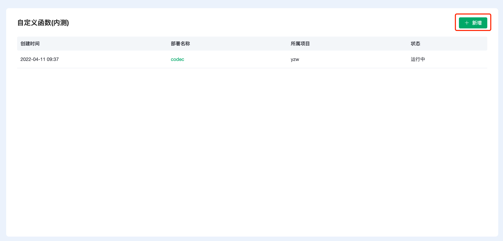
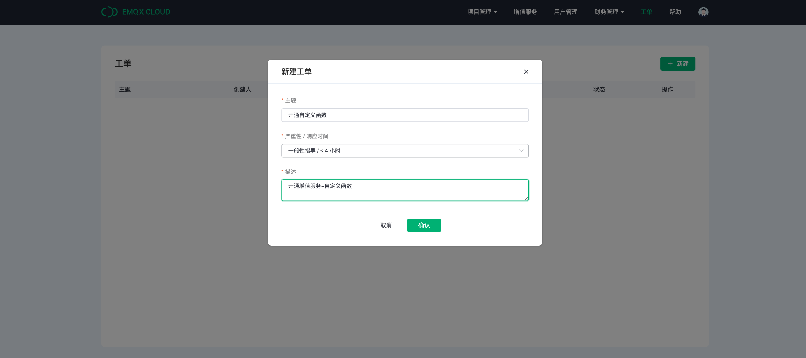
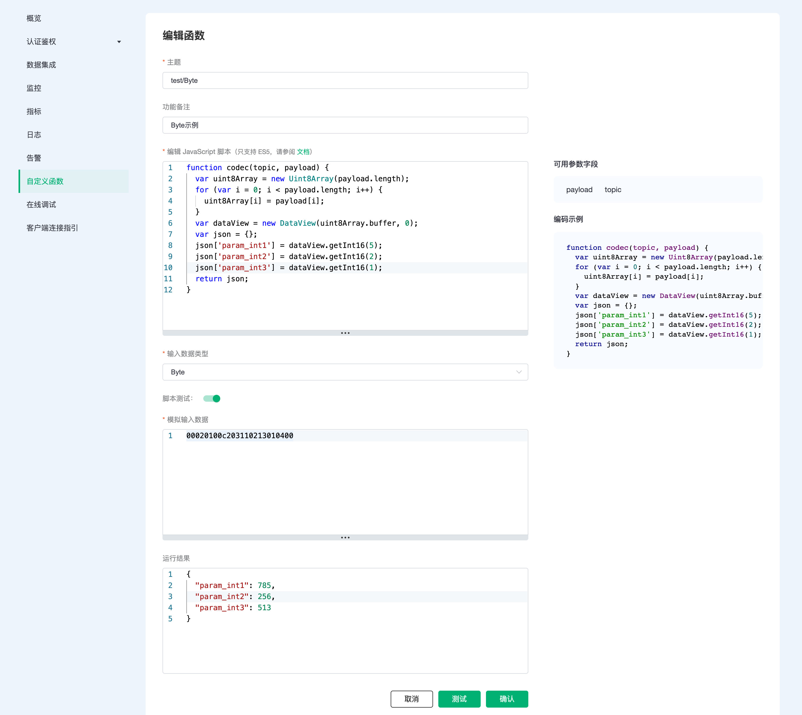
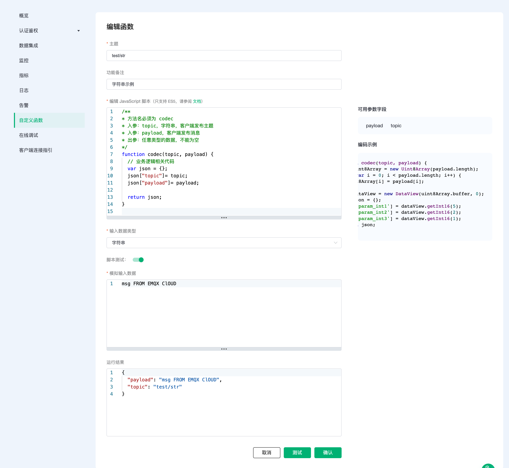
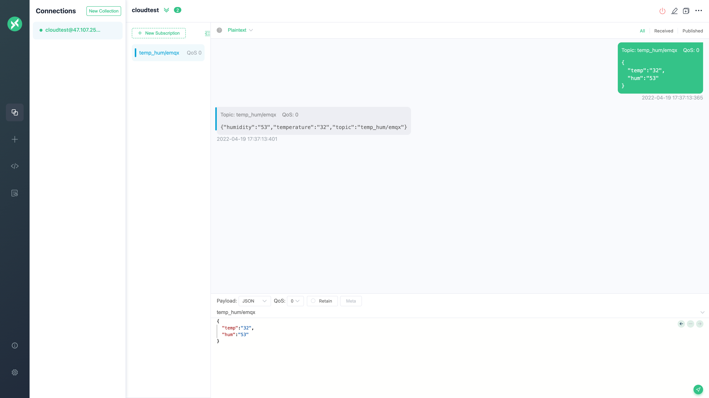

# 自定义函数

::: warning
该功能在基础版中不可用
:::

自定义函数作为平台提供的数据解析功能，可以根据您提交的脚本，对设备上报的任意格式的数据进行预处理，并将脚本返回的任意类型的数据流转至消息订阅方。该功能适合已开发完成的设备不需要任何修改即可无缝接入平台。

EMQX Cloud 的自定义函数提供了 topic 数据解析的功能，即设备通过 topic 上报数据，平台接收数据后，将调用用户在平台提交的数据解析脚本对设备上报的数据进行处理。


## 服务开通

1. 您可以通过以下两个入口开通自定义函数。

   方式一：登陆 EMQX Cloud 控制台，在顶部菜单栏点击`增值服务`，找到自定义函数，点击`开通服务`。

   

   方式二：在部署详情页面的左侧菜单栏 找到自定义函数并点击`开通服务`。

   

2. 进入增值服务 - 服务详情 - 自定义函数页面，点击新建。

   

3. 进入工单页面，点击新建，开通自定义函数。

   

4. 在完成服务开通流程后，您可以在自定义函数页面查看开通状态，等待开通完成。

   

## 服务使用

1. 在左侧菜单栏找到自定义函数，点击新建。

   

2. 在自定义函数 - 新建函数页面，依次填写 topic 、JavaScript 脚本，选择输入数据类型。

   ::: tip

   * 脚本执行耗时不能超过 1 秒，否则将无法通过验证，不建议在脚本中编写高耗时的操作

   * 在脚本中可以定义全局“常量”和其他自定义的函数，但不建议使用全局变量以保存脚本运行过程中产生的临时数据并在脚本中使用该变量，该行为是不可预知的

   * 目前自定义函数支持 ECMAScript5.1 版本的 Javascript，尚未支持 ECMAScript6 级以上版本

   :::

   使用自定义函数为 topic 绑定[脚本](https://www.w3school.com.cn/js/js_es5.asp)（ECMAScript5.1/JavaScript)，可实现对 payload 内容的编解码或预处理。针对三种不同的 payload 输入数据类型，作如下示例。

   **方式一：数据类型为Byte**

   以二进制数据十六进制格式输入，如 0100020000023206000000, 平台将从左到右，以两个数字为单位拆分成byte[]，不足两位补0，最终以 {0x01,0x00,0x02,0x00,0x00,0x02,0x32,0x06,0x00,0x00,0x00} 的形式传入脚本中。

   ```JavaScript
   /**
   * 方法名必须为 codec
   * 入参：topic，字符串，客户端发布主题
   * 入参：payload，客户端发布消息
   * 出参：任意类型的数据，不能为空
   */  
   function codec(topic, payload) {
     var uint8Array = new Uint8Array(payload.length);
     for (var i = 0; i < payload.length; i++) {
        uint8Array[i] = payload[i];
     }
     var dataView = new DataView(uint8Array.buffer, 0);
     var json = {};
     json['param_int1'] = dataView.getInt16(5);
     json['param_int2'] = dataView.getInt16(2);
     json['param_int3'] = dataView.getInt16(1);

     return json;
   }
   ```

   

    **方式二：数据类型为 JSON**

   以 JSON 类型的 payload 数据传入脚本中，会得到转换后的 JSON。

   ```JavaScript
   /**
   * 方法名必须为 codec
   * 入参：topic，字符串，客户端发布主题
   * 入参：payload，客户端发布消息
   * 出参：任意类型的数据，不能为空
   */
   function codec(topic, payload) {
     // 业务逻辑相关代码
     var json = {};
     json["topic"]=topic;
     json["temperature"]=payload["temp"];
     json["humidity"]=payload["hum"]

     return json;
   }
   ```

   

    **方式三：数据类型为字符串**

   字符串：以字符串类型的 payload 数据传入脚本中，会得到原始字符串。

   ```JavaScript
   /**
   * 方法名必须为 codec
   * 入参：topic，字符串，客户端发布主题
   * 入参：payload，客户端发布消息
   * 出参：任意类型的数据，不能为空
   */
   function codec(topic, payload) {
     // 业务逻辑相关代码
     var json = {};
     json["topic"]= topic;
     json["payload"]= payload;

     return json;
   }

   ```

   

3. 新建成功后，可按照主题、功能备注进行搜索，找到您设置好的自定义函数，可进行修改、删除操作。

   

## 服务测试

1. 使用 [MQTT X](https://mqttx.app/) 模拟温湿度数据上报

   这里需要将 broker.emqx.io 替换成已创建的部署[连接地址](../deployments/view_deployment.md)，并添加[客户端认证信息](../deployments/auth.md)。

   我们以数据类型 JSON 为例尝试向 temp_hum/emqx 主题发送下面的数据：

   ```json
   {
   "temp":"32",
   "hum":"53"
   }
   ```

2. 查看数据转发结果

   
