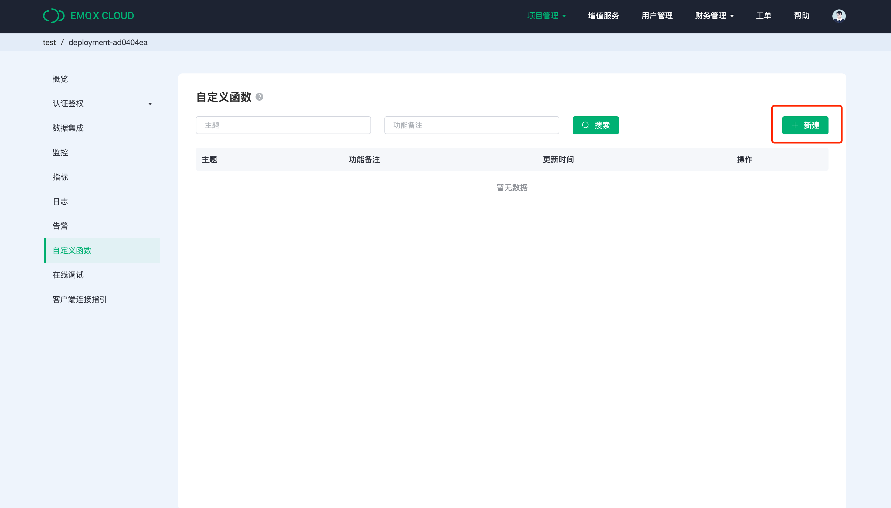

# 自定义函数

自定义函数作为平台提供的数据解析功能，可以根据您定义的脚本，对设备上报的数据进行预处理，并将脚本返回的任意类型的数据流转至消息订阅方。该功能适用于在数据进入业务系统之前需要的预处理的需求。

自定义函数的原理为通过云平台的函数计算能力，用户可定义编写脚本，并在数据集成的功能中，调用该函数。设备通过 topic 上报数据，平台接收数据后，数据解析脚本对设备上报的数据进行处理，进而再转入其他的工作流当中。

自定义函数的应用场景：例如将设备端上报的非十进制的数据转化为十进制数据，符合应用标准后存入到数据库中。或者是将设备中的原始数据转化、整合为的复合特殊行业协议的数据格式。


::: warning
该功能为专业版功能，需开通专业版部署才能使用，并且只有创建在<strong>阿里云</strong>（张家口之外的地区）的专业版部署可以开通服务。
:::

## 服务计费
服务会计算函数的调用次数，对调用次数收取一定费用，规则如下：
1. 创建函数不收取任何费用，一个部署下可以创建最多 20 个函数。
2. 成功创建的函数在数据集成的[规则](../rule_engine/rules.md)当中引用并被调用将计入调用次数。
3. 每一个创建了函数计算的部署，每月将获得<strong> 50000 次的免费调用次数</strong>，免费调用次数将在每月初更新。
4. 当月的免费调用次数用完之后，将会以 ¥0.03 / 万次的价格在帐户余额中扣取。
5. 付费调用次数将会在每月底进行结算，不足1万次以一万次计价。

::: tip
计费示例：一个用户当月调用次数 506,500 次，扣除免费的5万次，付费调用次数为 456,500 次，前面将以 45 * ¥ 0.03 = ¥ 1.35 收费，最后的 6500次将在月底以1万次的价格进行结算，所以当月的总费用为 ¥ 1.38。
:::

## 服务开通

1. 您可以通过以下两个入口开通自定义函数。

   **方式一**：登陆 EMQX Cloud 控制台，在顶部菜单栏点击`增值服务`，找到自定义函数，点击`开通服务`，并在提示弹框中点击确认。

   


   **方式二**：在部署详情页面的左侧菜单栏 找到自定义函数并点击`开通服务`，并在提示弹框中点击确认。

   


2. 在完成服务开通流程后，等待开通完成。

   

## 创建函数

1. 创建函数，点击界面中的新建按钮。

   

2. 输入函数名称，该函数名称将在之后创建的规则中被引用。

   

3. 在脚本输入框中输入 JS 脚本函数
   - 脚本函数的入口函数名称为 codec， <strong>入口函数名称不能改变</strong>；
   - 输入参数为 payload， 为 topic 中 playload 的数据；
   - codec 函数中需要返回函数运算之后的值, 无 return 值将无法通过测试；
   - 脚本执行时间<strong>不能超过 3 秒</strong>，否则将无法通过验证，不建议在脚本中编写高耗时的操作；
   - 自定义函数支持 ECMAScript 5.1 及部分 ECMAScript 6 的语法，请参考以下 ES6 方法
      - 箭头函数
      - Promise
      - 解构符
      - Class
      - 模版符号


4. 选择 payload 输入类型
   自定义函数支持 3 种数据类型的输入：Byte，JSON，字符串。

   **方式一：数据类型为Byte**

   Byte类型的数据需要以十六进制格式输入，如 0100020000023206000000, 系统以两个数字为单位拆分成byte[]，不足两位补0，最终以 {0x01,0x00,0x02,0x00,0x00,0x02,0x32,0x06,0x00,0x00,0x00} 的形式传入脚本中。

   ```JavaScript
   /**
   * 方法名必须为 codec
   * 入参：payload，客户端发布消息
   * 出参：任意类型的数据，不能为空
   */  
   function codec(payload) {
     var uint8Array = new Uint8Array(payload.length);
     for (var i = 0; i < payload.length; i++) {
        uint8Array[i] = payload[i];
     }
     var dataView = new DataView(uint8Array.buffer, 0);
     var json = {};
     json['param_int1'] = dataView.getInt16(5);
     json['param_int2'] = dataView.getInt16(2);
     json['param_int3'] = dataView.getInt16(1);

     return json;
   }
   ```

    **方式二：数据类型为 JSON**

   payload 数据以 JSON 类型作为参数传入脚本中。

   ```JavaScript
   /**
   * 方法名必须为 codec
   * 入参：payload，客户端发布消息
   * 出参：任意类型的数据，不能为空
   */
   function codec(payload) {
     // 业务逻辑相关代码
     var json = {};
     json["temperature"]=payload["temp"];
     json["humidity"]=payload["hum"]

     return json;
   }
   ```


    **方式三：数据类型为字符串**

   payload 数据以字符串类型作为参数传入脚本中。

   ```JavaScript
   /**
   * 方法名必须为 codec
   * 入参：payload，客户端发布消息
   * 出参：任意类型的数据，不能为空
   */
   function codec(payload) {
     // 业务逻辑相关代码
     var json = {};
     json["payload"]= payload;

     return json;
   }

   ```


5. 新建成功后，可按照函数名称、状态搜索，找到您设置好的自定义函数，可进行修改、删除操作。

   

::: tip
单个函数的调用次数和月调用统计目前有 1 小时的统计延迟。
:::

## 调用函数
函数定义完成之后，就可以在数据集成的[规则](../rule_engine/rules.md)中调用。请查看[数据集成](../rule_engine/introduction.md)了解更多内容。

如果需要快速验证脚本可以通过新建[空动作](../rule_engine/rule_engine_empty_action_debug.md)调用定义好的函数。

使用 `schema_encode` 来应用定义好的函数，这里我们调用给 JSON 添加时间戳的函数。

   ```sql
    SELECT
        schema_encode('customer_function', payload) as payload
    FROM
        "t/#"
   ```

   

在完成了 SQL 的定义以后，通过 SQL 测试来验证自定义函数是否被调用。可以看到返回结果添加了调用时刻的时间戳。

   


## 错误日志
自定义函数的错误日志在日志模块中可以查看，选择日志，在筛选错误类型中选择自定义函数。

   


以上就是自定义函数的基本使用方法，了解更多自定义函数的场景案例 Demo。

