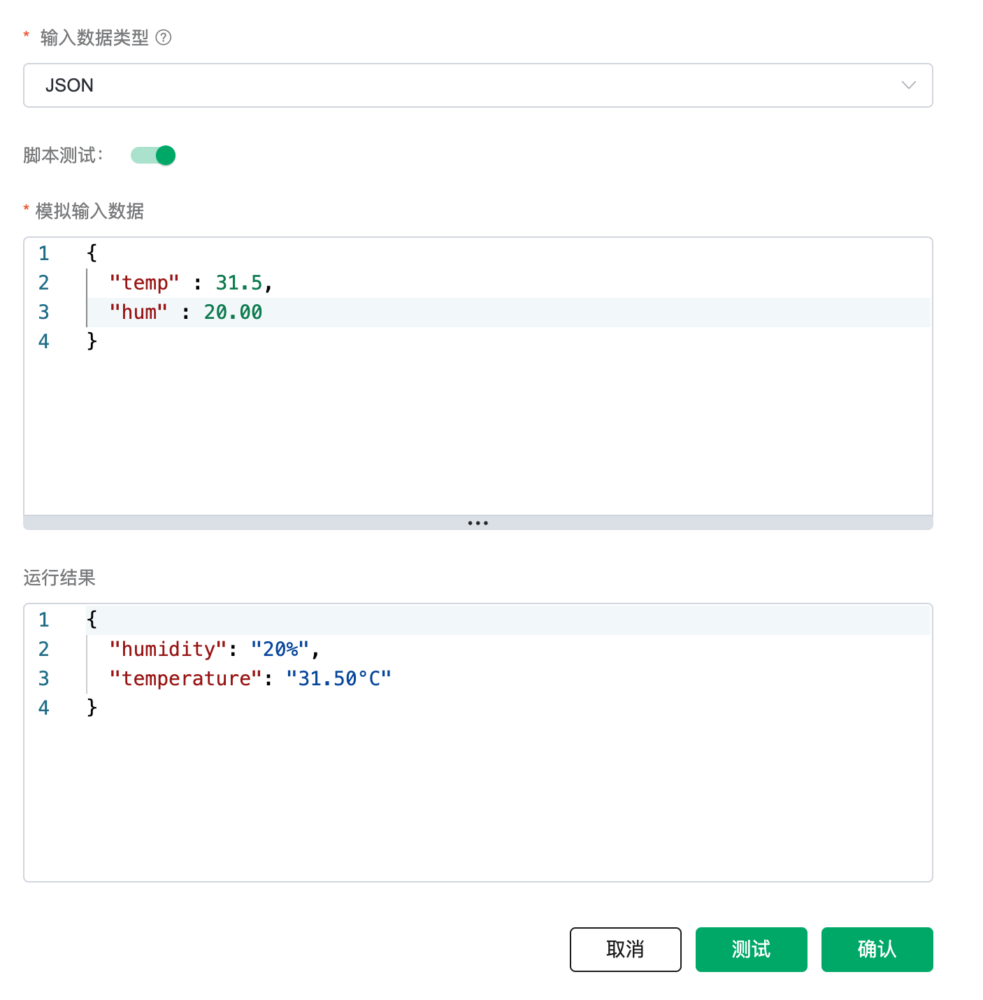
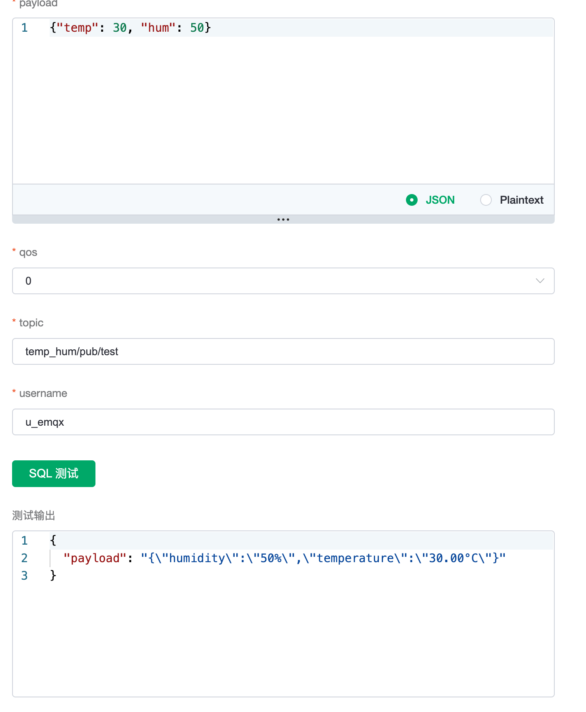
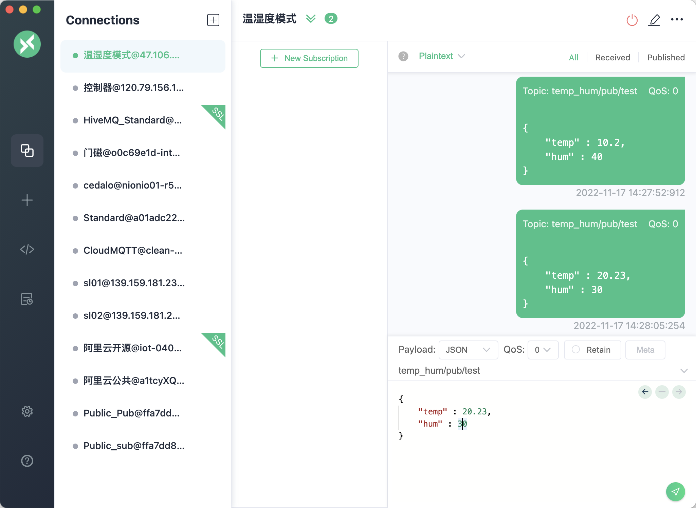
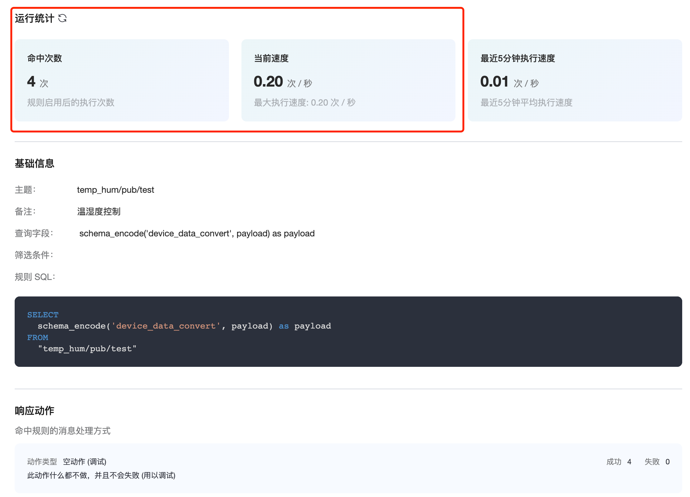
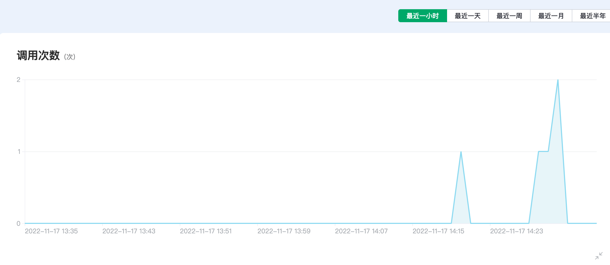
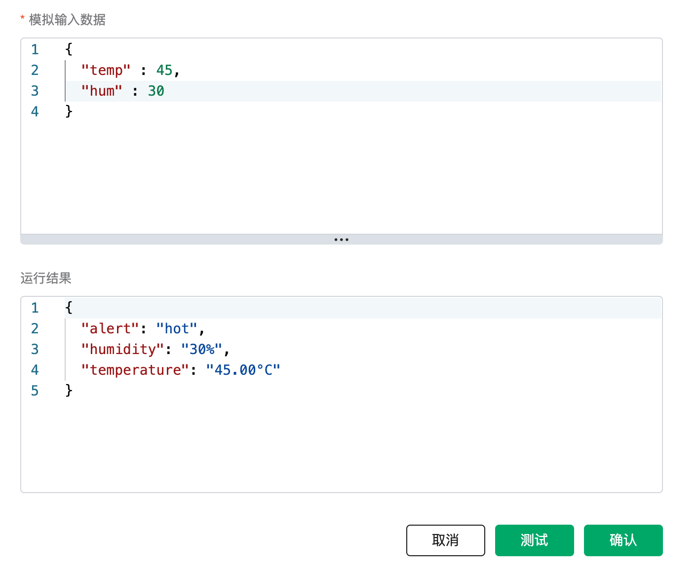

# 自定义函数场景案例 Demo

自定义函数场景案例我们将演示将设备上报的数据做分析处理，再存入阿里云的数据库中。同时演示当一些业务逻辑改变，通过升级设备的方式难处理，可以在函数中进行计算处理。

## 开通创建自定义函数
可以参考[自定义函数使用文档](./codec.md)来开通自定义函数服务。我们先创建一个函数处理温湿检测器的上报数据，对边界温湿度进行过滤，并且对浮点位数进行处理。

   ```JavaScript
   /**
   * 方法名必须为 codec
   * 入参：payload
   * 出参：任意类型的数据，不能为空
   */
   function codec(payload) {
     
     var json = {}, t = parseFloat(payload["temp"]), h = parseFloat(payload["hum"]);
     if( t >= -50 && t <= 50){
      json["temperature"] = t.toFixed(2) + '°C';
     }else{
      json["temperature"] = "error";
     }

     if( h >= 0 && h <= 100){
      json["humidity"] = parseInt(h) + '%';
     }else{
      json["temperature"] = "error";
     }

     return json;
   }
   ```

   这样我们对上报的温度和湿度的数据进行过滤，在数据持久化之前就可以做一层清理。测试通过之后创建该自定义函数。
   

## 调用自定义函数
接下来我们在数据集成服务中调用自定义函数，来验证数据上报的流程。关于如何使用数据集成，以及将数据转发至其他的云存储服务（如阿里云 RDS）中，可以参考：

[保存数据到 阿里云 MySQL](../rule_engine/rule_engine_save_rds_mysql.md)

我们可以先创建一个空动作进行调试，在数据集成选项中选择 空动作（调试）。在新建规则的SQL中输入

   ```sql
    SELECT
        schema_encode('device_data_convert', payload) as payload
    FROM
        "temp_hum/pub/test"
   ```
接下来可以在 SQL 验证中测试，可以得到处理之后的结果。

   


## 连接到客户端发送消息

这里使用 MQTTX 连接到部署，模拟客户端发送消息。

   

在规则的运行统计中可以看到规则的命中次数，指示着规则已经被成功调用。

   

在自定义函数的监控中，我们也能看到相关的统计。

   


使用自定义函数另外优势在于可以快速响应业务上的一些需求变动。比如现在需要在设备数据上报之后对温度值打上警示标记，我们可以很方便通过修改自定义函数来适配

   ```JavaScript
   /**
   * 方法名必须为 codec
   * 入参：payload
   * 出参：任意类型的数据，不能为空
   */
   function codec(payload) {
     
     var json = {}, t = parseFloat(payload["temp"]), h = parseFloat(payload["hum"]);
     if( t >= -50 && t <= 50){
      json["temperature"] = t.toFixed(2) + '°C';
      if(t >= 40) {
         json["alert"] = 'hot'
      }
     }else{
      json["temperature"] = "error";
     }

     if( h >= 0 && h <= 100){
      json["humidity"] = parseInt(h) + '%';
     }else{
      json["temperature"] = "error";
     }

     return json;
   }
   ```
   

自定义函数的输入除了接受 topic 的 payload 值，还可以接受其他自定义函数的输出返回。我们还可以定义多个自定义函数，在规则中灵活调用。

   ```sql
    SELECT
        schema_encode('device_data_convert', payload) as data,
        schema_encode('device_data_convert_02', payload) as payload
    FROM
        "temp_hum/pub/test"
   ```

自定义函数可以灵活适应数据上报之后的处理需求，支持您更便捷搭建 IoT 应用。
