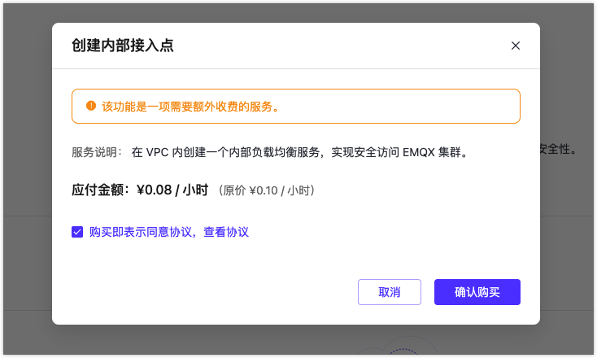
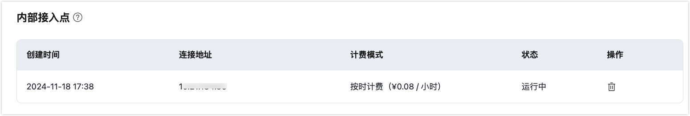

# 内部接入点

::: warning 注意

该功能为专业版功能，需要创建专业版部署开通服务。

:::

内网负载均衡是一种在内网中对流量进行按需分发的服务，通过将流量分发到不同的后端服务器来扩展应用系统的吞吐能力，并且可以消除系统中的单点故障，提升应用系统的可用性。

在开始之前，您需要完成以下操作：

- 已经在 EMQX Cloud 上创建专业版部署(EMQX 集群)。
- 请先完成 [VPC 对等连接的创建](../deployments/vpc_peering.md)，下文提到的 IP 均指资源的内网 IP。

## 启用内部接入点

1. 在 EMQX 平台控制台中，进入您的专有版部署。

2. 点击左侧菜单中的**网络管理**，导航到**内部接入点** 区域，然后点击 **+内部接入点**。

3. 在弹出的对话框中，勾选**购买即表示同意协议**，并点击**确认购买**。

   

4. 购买服务后，您可以在页面上查看创建状态。等待创建过程完成。

   当状态变为`运行中`时，您可以通过内部网络地址，将已完成 VPC 对等连接的 VPC 下的终端连接到该部署。连接端口与公网连接端口一致：MQTT 端口为 1883，WebSocket 端口为 8083。

   