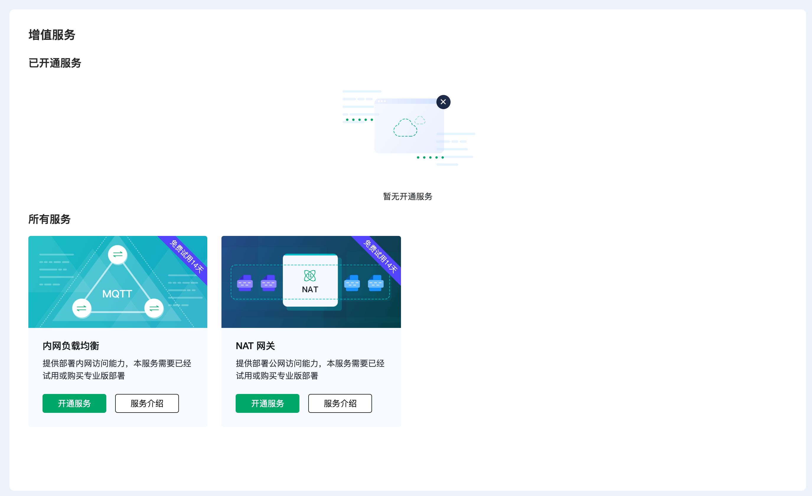
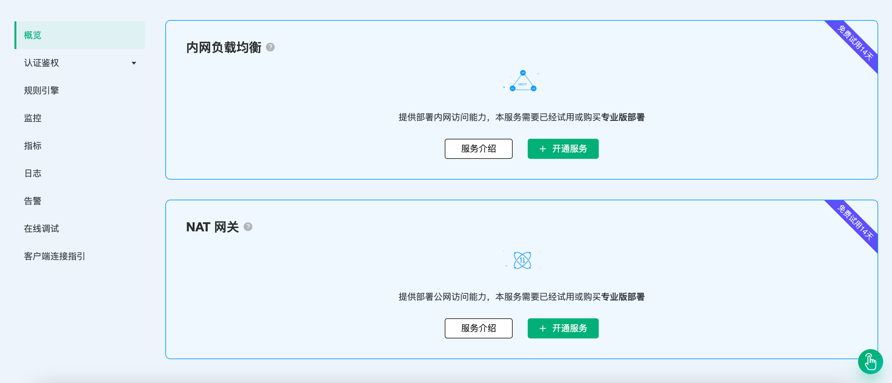

# 内网负载均衡

::: danger
该功能在基础版中不可用
:::

内网负载均衡是一种在内网中对流量进行按需分发的服务，通过将流量分发到不同的后端服务器来扩展应用系统的吞吐能力，并且可以消除系统中的单点故障，提升应用系统的可用性。

在开始之前，您需要完成以下操作：
* 已经在 EMQX Cloud 上创建专业版部署(EMQX 集群)。
* 请先完成 [对等连接的创建](../deployments/vpc_peering.md)，下文提到的 IP 均指资源的内网 IP。

## 服务开通

您可以在顶部菜单栏 - `增值服务` 或者部署概览底部选择开通内网负载均衡服务。

## 服务使用

完成内网负载均衡增值服务购买后，您可在相应部署概览处看到内网负载均衡创建状态，等待创建完成。

当内网负载均衡的状态为 running 后，您可以将完成对等连接的 VPC 下终端通过内网地址的内网 IP 连接到该部署，连接端口和公网连接端口一致：mqtt 端口为 1883，websocket 端口为 8083。